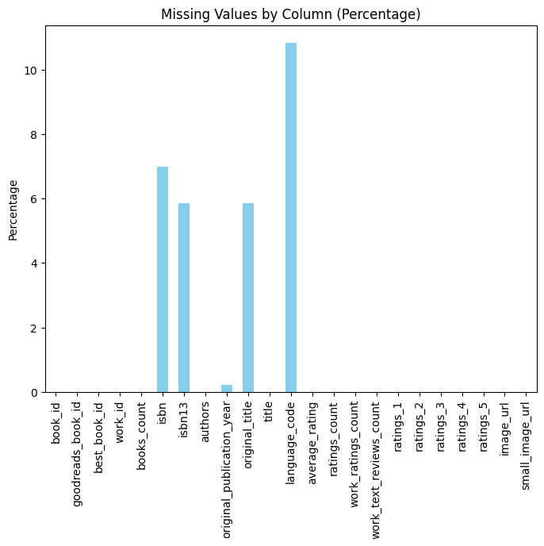
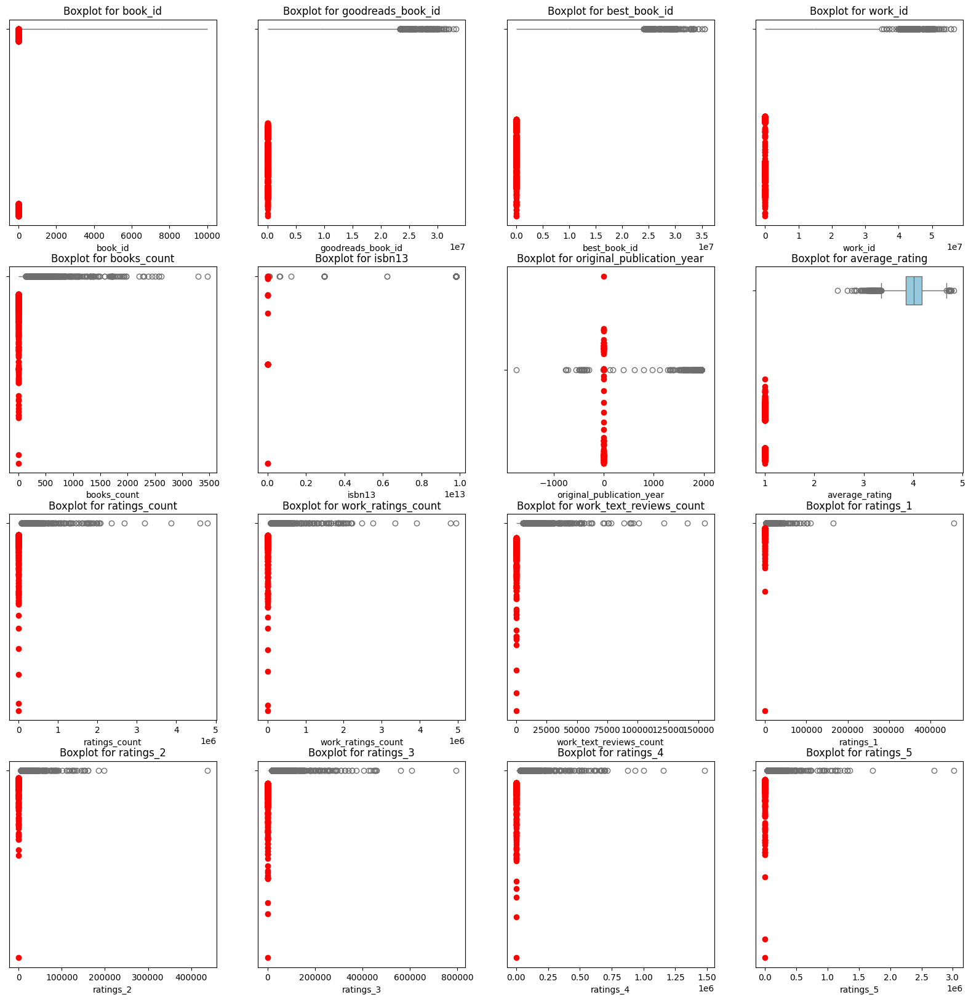
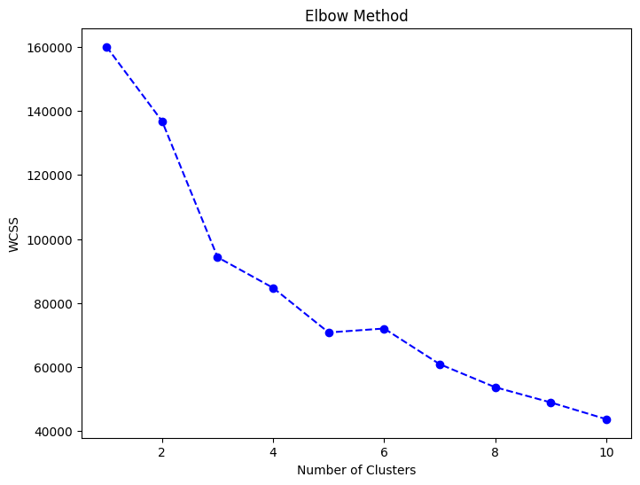

# Data Analysis Report

## Summary Statistics
                             count unique                                                                                       top  freq                  mean                 std          min              25%              50%              75%              max
book_id                    10000.0    NaN                                                                                       NaN   NaN                5000.5          2886.89568          1.0          2500.75           5000.5          7500.25          10000.0
goodreads_book_id          10000.0    NaN                                                                                       NaN   NaN          5264696.5132       7575461.86359          1.0         46275.75         394965.5       9382225.25       33288638.0
best_book_id               10000.0    NaN                                                                                       NaN   NaN          5471213.5801       7827329.89072          1.0         47911.75         425123.5        9636112.5       35534230.0
work_id                    10000.0    NaN                                                                                       NaN   NaN          8646183.4246      11751060.82408         87.0        1008841.0        2719524.5      14517748.25       56399597.0
books_count                10000.0    NaN                                                                                       NaN   NaN               75.7127          170.470728          1.0             23.0             40.0             67.0           3455.0
isbn                         10000   9300                                                                                000100039X   701                   NaN                 NaN          NaN              NaN              NaN              NaN              NaN
isbn13                     10000.0    NaN                                                                                       NaN   NaN  9756530621824.220703  429753045646.84436  195170342.0  9780330413197.5  9780451528640.0  9780807760637.5  9790007672390.0
authors                      10000   4664                                                                              Stephen King    60                   NaN                 NaN          NaN              NaN              NaN              NaN              NaN
original_publication_year  10000.0    NaN                                                                                       NaN   NaN             1982.0339          152.419691      -1750.0           1990.0           2004.0           2011.0           2017.0
original_title               10000   9274                                                                                             590                   NaN                 NaN          NaN              NaN              NaN              NaN              NaN
title                        10000   9964                                                                            Selected Poems     4                   NaN                 NaN          NaN              NaN              NaN              NaN              NaN
language_code                10000     25                                                                                       eng  7425                   NaN                 NaN          NaN              NaN              NaN              NaN              NaN
average_rating             10000.0    NaN                                                                                       NaN   NaN              4.002191            0.254427         2.47             3.85             4.02             4.18             4.82
ratings_count              10000.0    NaN                                                                                       NaN   NaN            54001.2351       157369.956436       2716.0         13568.75          21155.5          41053.5        4780653.0
work_ratings_count         10000.0    NaN                                                                                       NaN   NaN            59687.3216       167803.785237       5510.0         15438.75          23832.5          45915.0        4942365.0
work_text_reviews_count    10000.0    NaN                                                                                       NaN   NaN             2919.9553         6124.378132          3.0            694.0           1402.0          2744.25         155254.0
ratings_1                  10000.0    NaN                                                                                       NaN   NaN             1345.0406         6635.626263         11.0            196.0            391.0            885.0         456191.0
ratings_2                  10000.0    NaN                                                                                       NaN   NaN              3110.885         9717.123578         30.0            656.0           1163.0          2353.25         436802.0
ratings_3                  10000.0    NaN                                                                                       NaN   NaN            11475.8938        28546.449183        323.0           3112.0           4894.0           9287.0         793319.0
ratings_4                  10000.0    NaN                                                                                       NaN   NaN            19965.6966        51447.358384        750.0          5405.75           8269.5          16023.5        1481305.0
ratings_5                  10000.0    NaN                                                                                       NaN   NaN            23789.8056        79768.885611        754.0           5334.0           8836.0          17304.5        3011543.0
image_url                    10000   6669  https://s.gr-assets.com/assets/nophoto/book/111x148-bcc042a9c91a29c1d680899eff700a03.png  3332                   NaN                 NaN          NaN              NaN              NaN              NaN              NaN
small_image_url              10000   6669    https://s.gr-assets.com/assets/nophoto/book/50x75-a91bf249278a81aabab721ef782c4a74.png  3332                   NaN                 NaN          NaN              NaN              NaN              NaN              NaN

## Missing Values
book_id                         0
goodreads_book_id               0
best_book_id                    0
work_id                         0
books_count                     0
isbn                          700
isbn13                        585
authors                         0
original_publication_year      21
original_title                585
title                           0
language_code                1084
average_rating                  0
ratings_count                   0
work_ratings_count              0
work_text_reviews_count         0
ratings_1                       0
ratings_2                       0
ratings_3                       0
ratings_4                       0
ratings_5                       0
image_url                       0
small_image_url                 0

## Outliers
                         Column  Index         Value    Z-Score
0                       book_id      0  1.000000e+00  -1.731878
1                       book_id      1  2.000000e+00  -1.731531
2                       book_id      2  3.000000e+00  -1.731185
3                       book_id      3  4.000000e+00  -1.730838
4                       book_id      4  5.000000e+00  -1.730492
5                       book_id      5  6.000000e+00  -1.730146
6                       book_id      6  7.000000e+00  -1.729799
7                       book_id      7  8.000000e+00  -1.729453
8                       book_id      8  9.000000e+00  -1.729106
9                       book_id      9  1.000000e+01  -1.728760
10                      book_id     10  1.100000e+01  -1.728414
11                      book_id     11  1.200000e+01  -1.728067
12                      book_id     12  1.300000e+01  -1.727721
13                      book_id     13  1.400000e+01  -1.727374
14                      book_id     14  1.500000e+01  -1.727028
15                      book_id     15  1.600000e+01  -1.726681
16                      book_id     16  1.700000e+01  -1.726335
17                      book_id     17  1.800000e+01  -1.725989
18                      book_id     18  1.900000e+01  -1.725642
19                      book_id     19  2.000000e+01  -1.725296
20                      book_id     20  2.100000e+01  -1.724949
21                      book_id     21  2.200000e+01  -1.724603
22                      book_id     22  2.300000e+01  -1.724257
23                      book_id     23  2.400000e+01  -1.723910
24                      book_id     24  2.500000e+01  -1.723564
25                      book_id     25  2.600000e+01  -1.723217
26                      book_id     26  2.700000e+01  -1.722871
27                      book_id     27  2.800000e+01  -1.722525
28                      book_id     28  2.900000e+01  -1.722178
29                      book_id     29  3.000000e+01  -1.721832
30                      book_id     30  3.100000e+01  -1.721485
31                      book_id     31  3.200000e+01  -1.721139
32                      book_id     32  3.300000e+01  -1.720792
33                      book_id     33  3.400000e+01  -1.720446
34                      book_id     34  3.500000e+01  -1.720100
35                      book_id     35  3.600000e+01  -1.719753
36                      book_id     36  3.700000e+01  -1.719407
37                      book_id     37  3.800000e+01  -1.719060
38                      book_id     38  3.900000e+01  -1.718714
39                      book_id     39  4.000000e+01  -1.718368
40                      book_id     40  4.100000e+01  -1.718021
41                      book_id     41  4.200000e+01  -1.717675
42                      book_id     42  4.300000e+01  -1.717328
43                      book_id     43  4.400000e+01  -1.716982
44                      book_id     44  4.500000e+01  -1.716636
45                      book_id     45  4.600000e+01  -1.716289
46                      book_id     46  4.700000e+01  -1.715943
47                      book_id     47  4.800000e+01  -1.715596
48                      book_id     48  4.900000e+01  -1.715250
49                      book_id     49  5.000000e+01  -1.714904
50                      book_id     50  5.100000e+01  -1.714557
51                      book_id     51  5.200000e+01  -1.714211
52                      book_id     52  5.300000e+01  -1.713864
53                      book_id     53  5.400000e+01  -1.713518
54                      book_id     54  5.500000e+01  -1.713171
55                      book_id     55  5.600000e+01  -1.712825
56                      book_id     56  5.700000e+01  -1.712479
57                      book_id     57  5.800000e+01  -1.712132
58                      book_id     58  5.900000e+01  -1.711786
59                      book_id     59  6.000000e+01  -1.711439
60                      book_id     60  6.100000e+01  -1.711093
61                      book_id     61  6.200000e+01  -1.710747
62                      book_id     62  6.300000e+01  -1.710400
63                      book_id     63  6.400000e+01  -1.710054
64                      book_id     64  6.500000e+01  -1.709707
65                      book_id     65  6.600000e+01  -1.709361
66                      book_id     66  6.700000e+01  -1.709015
67                      book_id     67  6.800000e+01  -1.708668
68                      book_id     68  6.900000e+01  -1.708322
69                      book_id     69  7.000000e+01  -1.707975
70                      book_id     70  7.100000e+01  -1.707629
71                      book_id     71  7.200000e+01  -1.707282
72                      book_id     72  7.300000e+01  -1.706936
73                      book_id     73  7.400000e+01  -1.706590
74                      book_id     74  7.500000e+01  -1.706243
75                      book_id     75  7.600000e+01  -1.705897
76                      book_id     76  7.700000e+01  -1.705550
77                      book_id     77  7.800000e+01  -1.705204
78                      book_id     78  7.900000e+01  -1.704858
79                      book_id     79  8.000000e+01  -1.704511
80                      book_id     80  8.100000e+01  -1.704165
81                      book_id     81  8.200000e+01  -1.703818
82                      book_id     82  8.300000e+01  -1.703472
83                      book_id     83  8.400000e+01  -1.703126
84                      book_id     84  8.500000e+01  -1.702779
85                      book_id     85  8.600000e+01  -1.702433
86                      book_id     86  8.700000e+01  -1.702086
87                      book_id     87  8.800000e+01  -1.701740
88                      book_id     88  8.900000e+01  -1.701394
89                      book_id     89  9.000000e+01  -1.701047
90                      book_id     90  9.100000e+01  -1.700701
91                      book_id     91  9.200000e+01  -1.700354
92                      book_id     92  9.300000e+01  -1.700008
93                      book_id     93  9.400000e+01  -1.699661
94                      book_id     94  9.500000e+01  -1.699315
95                      book_id     95  9.600000e+01  -1.698969
96                      book_id     96  9.700000e+01  -1.698622
97                      book_id     97  9.800000e+01  -1.698276
98                      book_id     98  9.900000e+01  -1.697929
99                      book_id     99  1.000000e+02  -1.697583
100                     book_id    100  1.010000e+02  -1.697237
101                     book_id    101  1.020000e+02  -1.696890
102                     book_id    102  1.030000e+02  -1.696544
103                     book_id    103  1.040000e+02  -1.696197
104                     book_id    104  1.050000e+02  -1.695851
105                     book_id    105  1.060000e+02  -1.695505
106                     book_id    106  1.070000e+02  -1.695158
107                     book_id    107  1.080000e+02  -1.694812
108                     book_id    108  1.090000e+02  -1.694465
109                     book_id    109  1.100000e+02  -1.694119
110                     book_id    110  1.110000e+02  -1.693772
111                     book_id    111  1.120000e+02  -1.693426
112                     book_id    112  1.130000e+02  -1.693080
113                     book_id    113  1.140000e+02  -1.692733
114                     book_id    114  1.150000e+02  -1.692387
115                     book_id    115  1.160000e+02  -1.692040
116                     book_id    116  1.170000e+02  -1.691694
117                     book_id    117  1.180000e+02  -1.691348
118                     book_id    118  1.190000e+02  -1.691001
119                     book_id    119  1.200000e+02  -1.690655
120                     book_id    120  1.210000e+02  -1.690308
121                     book_id    121  1.220000e+02  -1.689962
122                     book_id    122  1.230000e+02  -1.689616
123                     book_id    123  1.240000e+02  -1.689269
124                     book_id    124  1.250000e+02  -1.688923
125                     book_id    125  1.260000e+02  -1.688576
126                     book_id    126  1.270000e+02  -1.688230
127                     book_id    127  1.280000e+02  -1.687884
128                     book_id    128  1.290000e+02  -1.687537
129                     book_id    129  1.300000e+02  -1.687191
130                     book_id    130  1.310000e+02  -1.686844
131                     book_id    131  1.320000e+02  -1.686498
132                     book_id    132  1.330000e+02  -1.686151
133                     book_id    133  1.340000e+02  -1.685805
134                     book_id    134  1.350000e+02  -1.685459
135                     book_id    135  1.360000e+02  -1.685112
136                     book_id    136  1.370000e+02  -1.684766
137                     book_id    137  1.380000e+02  -1.684419
138                     book_id    138  1.390000e+02  -1.684073
139                     book_id    139  1.400000e+02  -1.683727
140                     book_id    140  1.410000e+02  -1.683380
141                     book_id    141  1.420000e+02  -1.683034
142                     book_id    142  1.430000e+02  -1.682687
143                     book_id    143  1.440000e+02  -1.682341
144                     book_id    144  1.450000e+02  -1.681995
145                     book_id    145  1.460000e+02  -1.681648
146                     book_id    146  1.470000e+02  -1.681302
147                     book_id    147  1.480000e+02  -1.680955
148                     book_id    148  1.490000e+02  -1.680609
149                     book_id    149  1.500000e+02  -1.680262
150                     book_id    150  1.510000e+02  -1.679916
151                     book_id    151  1.520000e+02  -1.679570
152                     book_id    152  1.530000e+02  -1.679223
153                     book_id    153  1.540000e+02  -1.678877
154                     book_id    154  1.550000e+02  -1.678530
155                     book_id    155  1.560000e+02  -1.678184
156                     book_id    156  1.570000e+02  -1.677838
157                     book_id    157  1.580000e+02  -1.677491
158                     book_id    158  1.590000e+02  -1.677145
159                     book_id    159  1.600000e+02  -1.676798
160                     book_id    160  1.610000e+02  -1.676452
161                     book_id    161  1.620000e+02  -1.676106
162                     book_id    162  1.630000e+02  -1.675759
163                     book_id    163  1.640000e+02  -1.675413
164                     book_id    164  1.650000e+02  -1.675066
165                     book_id    165  1.660000e+02  -1.674720
166                     book_id    166  1.670000e+02  -1.674374
167                     book_id    167  1.680000e+02  -1.674027
168                     book_id    168  1.690000e+02  -1.673681
169                     book_id    169  1.700000e+02  -1.673334
170                     book_id    170  1.710000e+02  -1.672988
171                     book_id    171  1.720000e+02  -1.672641
172                     book_id    172  1.730000e+02  -1.672295
173                     book_id    173  1.740000e+02  -1.671949
174                     book_id    174  1.750000e+02  -1.671602
175                     book_id    175  1.760000e+02  -1.671256
176                     book_id    176  1.770000e+02  -1.670909
177                     book_id    177  1.780000e+02  -1.670563
178                     book_id    178  1.790000e+02  -1.670217
179                     book_id    179  1.800000e+02  -1.669870
180                     book_id    180  1.810000e+02  -1.669524
181                     book_id    181  1.820000e+02  -1.669177
182                     book_id    182  1.830000e+02  -1.668831
183                     book_id    183  1.840000e+02  -1.668485
184                     book_id    184  1.850000e+02  -1.668138
185                     book_id    185  1.860000e+02  -1.667792
186                     book_id    186  1.870000e+02  -1.667445
187                     book_id    187  1.880000e+02  -1.667099
188                     book_id    188  1.890000e+02  -1.666753
189                     book_id    189  1.900000e+02  -1.666406
190                     book_id    190  1.910000e+02  -1.666060
191                     book_id    191  1.920000e+02  -1.665713
192                     book_id    192  1.930000e+02  -1.665367
193                     book_id    193  1.940000e+02  -1.665020
194                     book_id    194  1.950000e+02  -1.664674
195                     book_id    195  1.960000e+02  -1.664328
196                     book_id    196  1.970000e+02  -1.663981
197                     book_id    197  1.980000e+02  -1.663635
198                     book_id    198  1.990000e+02  -1.663288
199                     book_id    199  2.000000e+02  -1.662942
200                     book_id    200  2.010000e+02  -1.662596
201                     book_id    201  2.020000e+02  -1.662249
202                     book_id    202  2.030000e+02  -1.661903
203                     book_id    203  2.040000e+02  -1.661556
204                     book_id    204  2.050000e+02  -1.661210
205                     book_id    205  2.060000e+02  -1.660864
206                     book_id    206  2.070000e+02  -1.660517
207                     book_id    207  2.080000e+02  -1.660171
208                     book_id    208  2.090000e+02  -1.659824
209                     book_id    209  2.100000e+02  -1.659478
210                     book_id    210  2.110000e+02  -1.659131
211                     book_id    211  2.120000e+02  -1.658785
212                     book_id    212  2.130000e+02  -1.658439
213                     book_id    213  2.140000e+02  -1.658092
214                     book_id    214  2.150000e+02  -1.657746
215                     book_id    215  2.160000e+02  -1.657399
216                     book_id    216  2.170000e+02  -1.657053
217                     book_id    217  2.180000e+02  -1.656707
218                     book_id    218  2.190000e+02  -1.656360
219                     book_id    219  2.200000e+02  -1.656014
220                     book_id    220  2.210000e+02  -1.655667
221                     book_id    221  2.220000e+02  -1.655321
222                     book_id    222  2.230000e+02  -1.654975
223                     book_id    223  2.240000e+02  -1.654628
224                     book_id    224  2.250000e+02  -1.654282
225                     book_id    225  2.260000e+02  -1.653935
226                     book_id    226  2.270000e+02  -1.653589
227                     book_id    227  2.280000e+02  -1.653243
228                     book_id    228  2.290000e+02  -1.652896
229                     book_id    229  2.300000e+02  -1.652550
230                     book_id    230  2.310000e+02  -1.652203
231                     book_id    231  2.320000e+02  -1.651857
232                     book_id    232  2.330000e+02  -1.651510
233                     book_id    233  2.340000e+02  -1.651164
234                     book_id    234  2.350000e+02  -1.650818
235                     book_id    235  2.360000e+02  -1.650471
236                     book_id    236  2.370000e+02  -1.650125
237                     book_id    237  2.380000e+02  -1.649778
238                     book_id    238  2.390000e+02  -1.649432
239                     book_id    239  2.400000e+02  -1.649086
240                     book_id    240  2.410000e+02  -1.648739
241                     book_id    241  2.420000e+02  -1.648393
242                     book_id    242  2.430000e+02  -1.648046
243                     book_id    243  2.440000e+02  -1.647700
244                     book_id    244  2.450000e+02  -1.647354
245                     book_id    245  2.460000e+02  -1.647007
246                     book_id    246  2.470000e+02  -1.646661
247                     book_id    247  2.480000e+02  -1.646314
248                     book_id    248  2.490000e+02  -1.645968
249                     book_id    249  2.500000e+02  -1.645621
250                     book_id    250  2.510000e+02  -1.645275
251                     book_id    251  2.520000e+02  -1.644929
252                     book_id    252  2.530000e+02  -1.644582
253                     book_id    253  2.540000e+02  -1.644236
254                     book_id    254  2.550000e+02  -1.643889
255                     book_id    255  2.560000e+02  -1.643543
256                     book_id    256  2.570000e+02  -1.643197
257                     book_id    257  2.580000e+02  -1.642850
258                     book_id    258  2.590000e+02  -1.642504
259                     book_id    259  2.600000e+02  -1.642157
260                     book_id    260  2.610000e+02  -1.641811
261                     book_id    261  2.620000e+02  -1.641465
262                     book_id    262  2.630000e+02  -1.641118
263                     book_id    263  2.640000e+02  -1.640772
264                     book_id    264  2.650000e+02  -1.640425
265                     book_id    265  2.660000e+02  -1.640079
266                     book_id    266  2.670000e+02  -1.639733
267                     book_id    267  2.680000e+02  -1.639386
268                     book_id    268  2.690000e+02  -1.639040
269                     book_id    269  2.700000e+02  -1.638693
270                     book_id    270  2.710000e+02  -1.638347
271                     book_id    271  2.720000e+02  -1.638000
272                     book_id    272  2.730000e+02  -1.637654
273                     book_id    273  2.740000e+02  -1.637308
274                     book_id    274  2.750000e+02  -1.636961
275                     book_id    275  2.760000e+02  -1.636615
276                     book_id    276  2.770000e+02  -1.636268
277                     book_id    277  2.780000e+02  -1.635922
278                     book_id    278  2.790000e+02  -1.635576
279                     book_id    279  2.800000e+02  -1.635229
280                     book_id    280  2.810000e+02  -1.634883
281                     book_id    281  2.820000e+02  -1.634536
282                     book_id    282  2.830000e+02  -1.634190
283                     book_id    283  2.840000e+02  -1.633844
284                     book_id    284  2.850000e+02  -1.633497
285                     book_id    285  2.860000e+02  -1.633151
286                     book_id    286  2.870000e+02  -1.632804
287                     book_id    287  2.880000e+02  -1.632458
288                     book_id    288  2.890000e+02  -1.632111
289                     book_id    289  2.900000e+02  -1.631765
290                     book_id    290  2.910000e+02  -1.631419
291                     book_id    291  2.920000e+02  -1.631072
292                     book_id    292  2.930000e+02  -1.630726
293                     book_id    293  2.940000e+02  -1.630379
294                     book_id    294  2.950000e+02  -1.630033
295                     book_id    295  2.960000e+02  -1.629687
296                     book_id    296  2.970000e+02  -1.629340
297                     book_id    297  2.980000e+02  -1.628994
298                     book_id    298  2.990000e+02  -1.628647
299                     book_id    299  3.000000e+02  -1.628301
300                     book_id    300  3.010000e+02  -1.627955
301                     book_id    301  3.020000e+02  -1.627608
302                     book_id    302  3.030000e+02  -1.627262
303                     book_id    303  3.040000e+02  -1.626915
304                     book_id    304  3.050000e+02  -1.626569
305                     book_id    305  3.060000e+02  -1.626223
306                     book_id    306  3.070000e+02  -1.625876
307                     book_id    307  3.080000e+02  -1.625530
308                     book_id    308  3.090000e+02  -1.625183
309                     book_id    309  3.100000e+02  -1.624837
310                     book_id    310  3.110000e+02  -1.624490
311                     book_id    311  3.120000e+02  -1.624144
312                     book_id    312  3.130000e+02  -1.623798
313                     book_id    313  3.140000e+02  -1.623451
314                     book_id    314  3.150000e+02  -1.623105
315                     book_id    315  3.160000e+02  -1.622758
316                     book_id    316  3.170000e+02  -1.622412
317                     book_id    317  3.180000e+02  -1.622066
318                     book_id    318  3.190000e+02  -1.621719
319                     book_id    319  3.200000e+02  -1.621373
320                     book_id    320  3.210000e+02  -1.621026
321                     book_id    321  3.220000e+02  -1.620680
322                     book_id    322  3.230000e+02  -1.620334
323                     book_id    323  3.240000e+02  -1.619987
324                     book_id    324  3.250000e+02  -1.619641
325                     book_id    325  3.260000e+02  -1.619294
326                     book_id    326  3.270000e+02  -1.618948
327                     book_id    327  3.280000e+02  -1.618601
328                     book_id    328  3.290000e+02  -1.618255
329                     book_id    329  3.300000e+02  -1.617909
330                     book_id    330  3.310000e+02  -1.617562
331                     book_id    331  3.320000e+02  -1.617216
332                     book_id    332  3.330000e+02  -1.616869
333                     book_id    333  3.340000e+02  -1.616523
334                     book_id    334  3.350000e+02  -1.616177
335                     book_id    335  3.360000e+02  -1.615830
336                     book_id    336  3.370000e+02  -1.615484
337                     book_id    337  3.380000e+02  -1.615137
338                     book_id    338  3.390000e+02  -1.614791
339                     book_id    339  3.400000e+02  -1.614445
340                     book_id    340  3.410000e+02  -1.614098
341                     book_id    341  3.420000e+02  -1.613752
342                     book_id    342  3.430000e+02  -1.613405
343                     book_id    343  3.440000e+02  -1.613059
344                     book_id    344  3.450000e+02  -1.612713
345                     book_id    345  3.460000e+02  -1.612366
346                     book_id    346  3.470000e+02  -1.612020
347                     book_id    347  3.480000e+02  -1.611673
348                     book_id    348  3.490000e+02  -1.611327
349                     book_id    349  3.500000e+02  -1.610980
350                     book_id    350  3.510000e+02  -1.610634
351                     book_id    351  3.520000e+02  -1.610288
352                     book_id    352  3.530000e+02  -1.609941
353                     book_id    353  3.540000e+02  -1.609595
354                     book_id    354  3.550000e+02  -1.609248
355                     book_id    355  3.560000e+02  -1.608902
356                     book_id    356  3.570000e+02  -1.608556
357                     book_id    357  3.580000e+02  -1.608209
358                     book_id    358  3.590000e+02  -1.607863
359                     book_id    359  3.600000e+02  -1.607516
360                     book_id    360  3.610000e+02  -1.607170
361                     book_id    361  3.620000e+02  -1.606824
362                     book_id    362  3.630000e+02  -1.606477
363                     book_id    363  3.640000e+02  -1.606131
364                     book_id    364  3.650000e+02  -1.605784
365                     book_id    365  3.660000e+02  -1.605438
366                     book_id    366  3.670000e+02  -1.605091
367                     book_id    367  3.680000e+02  -1.604745
368                     book_id    368  3.690000e+02  -1.604399
369                     book_id    369  3.700000e+02  -1.604052
370                     book_id    370  3.710000e+02  -1.603706
371                     book_id    371  3.720000e+02  -1.603359
372                     book_id    372  3.730000e+02  -1.603013
373                     book_id    373  3.740000e+02  -1.602667
374                     book_id    374  3.750000e+02  -1.602320
375                     book_id    375  3.760000e+02  -1.601974
376                     book_id    376  3.770000e+02  -1.601627
377                     book_id    377  3.780000e+02  -1.601281
378                     book_id    378  3.790000e+02  -1.600935
379                     book_id    379  3.800000e+02  -1.600588
380                     book_id    380  3.810000e+02  -1.600242
381                     book_id    381  3.820000e+02  -1.599895
382                     book_id    382  3.830000e+02  -1.599549
383                     book_id    383  3.840000e+02  -1.599203
384                     book_id    384  3.850000e+02  -1.598856
385                     book_id    385  3.860000e+02  -1.598510
386                     book_id    386  3.870000e+02  -1.598163
387                     book_id    387  3.880000e+02  -1.597817
388                     book_id    388  3.890000e+02  -1.597470
389                     book_id    389  3.900000e+02  -1.597124
390                     book_id    390  3.910000e+02  -1.596778
391                     book_id    391  3.920000e+02  -1.596431
392                     book_id    392  3.930000e+02  -1.596085
393                     book_id    393  3.940000e+02  -1.595738
394                     book_id    394  3.950000e+02  -1.595392
395                     book_id    395  3.960000e+02  -1.595046
396                     book_id    396  3.970000e+02  -1.594699
397                     book_id    397  3.980000e+02  -1.594353
398                     book_id    398  3.990000e+02  -1.594006
399                     book_id    399  4.000000e+02  -1.593660
400                     book_id    400  4.010000e+02  -1.593314
401                     book_id    401  4.020000e+02  -1.592967
402                     book_id    402  4.030000e+02  -1.592621
403                     book_id    403  4.040000e+02  -1.592274
404                     book_id    404  4.050000e+02  -1.591928
405                     book_id    405  4.060000e+02  -1.591581
406                     book_id    406  4.070000e+02  -1.591235
407                     book_id    407  4.080000e+02  -1.590889
408                     book_id    408  4.090000e+02  -1.590542
409                     book_id    409  4.100000e+02  -1.590196
410                     book_id    410  4.110000e+02  -1.589849
411                     book_id    411  4.120000e+02  -1.589503
412                     book_id    412  4.130000e+02  -1.589157
413                     book_id    413  4.140000e+02  -1.588810
414                     book_id    414  4.150000e+02  -1.588464
415                     book_id    415  4.160000e+02  -1.588117
416                     book_id    416  4.170000e+02  -1.587771
417                     book_id    417  4.180000e+02  -1.587425
418                     book_id    418  4.190000e+02  -1.587078
419                     book_id    419  4.200000e+02  -1.586732
420                     book_id    420  4.210000e+02  -1.586385
421                     book_id    421  4.220000e+02  -1.586039
422                     book_id    422  4.230000e+02  -1.585693
423                     book_id    423  4.240000e+02  -1.585346
424                     book_id    424  4.250000e+02  -1.585000
425                     book_id    425  4.260000e+02  -1.584653
426                     book_id    426  4.270000e+02  -1.584307
427                     book_id    427  4.280000e+02  -1.583960
428                     book_id    428  4.290000e+02  -1.583614
429                     book_id    429  4.300000e+02  -1.583268
430                     book_id    430  4.310000e+02  -1.582921
431                     book_id    431  4.320000e+02  -1.582575
432                     book_id    432  4.330000e+02  -1.582228
433                     book_id    433  4.340000e+02  -1.581882
434                     book_id    434  4.350000e+02  -1.581536
435                     book_id    435  4.360000e+02  -1.581189
436                     book_id    436  4.370000e+02  -1.580843
437                     book_id    437  4.380000e+02  -1.580496
438                     book_id    438  4.390000e+02  -1.580150
439                     book_id    439  4.400000e+02  -1.579804
440                     book_id    440  4.410000e+02  -1.579457
441                     book_id    441  4.420000e+02  -1.579111
442                     book_id    442  4.430000e+02  -1.578764
443                     book_id    443  4.440000e+02  -1.578418
444                     book_id    444  4.450000e+02  -1.578071
445                     book_id    445  4.460000e+02  -1.577725
446                     book_id    446  4.470000e+02  -1.577379
447                     book_id    447  4.480000e+02  -1.577032
448                     book_id    448  4.490000e+02  -1.576686
449                     book_id    449  4.500000e+02  -1.576339
450                     book_id    450  4.510000e+02  -1.575993
451                     book_id    451  4.520000e+02  -1.575647
452                     book_id    452  4.530000e+02  -1.575300
453                     book_id    453  4.540000e+02  -1.574954
454                     book_id    454  4.550000e+02  -1.574607
455                     book_id    455  4.560000e+02  -1.574261
456                     book_id    456  4.570000e+02  -1.573915
457                     book_id    457  4.580000e+02  -1.573568
458                     book_id    458  4.590000e+02  -1.573222
459                     book_id    459  4.600000e+02  -1.572875
460                     book_id    460  4.610000e+02  -1.572529
461                     book_id    461  4.620000e+02  -1.572183
462                     book_id    462  4.630000e+02  -1.571836
463                     book_id    463  4.640000e+02  -1.571490
464                     book_id    464  4.650000e+02  -1.571143
465                     book_id    465  4.660000e+02  -1.570797
466                     book_id    466  4.670000e+02  -1.570450
467                     book_id    467  4.680000e+02  -1.570104
468                     book_id    468  4.690000e+02  -1.569758
469                     book_id    469  4.700000e+02  -1.569411
470                     book_id    470  4.710000e+02  -1.569065
471                     book_id    471  4.720000e+02  -1.568718
472                     book_id    472  4.730000e+02  -1.568372
473                     book_id    473  4.740000e+02  -1.568026
474                     book_id    474  4.750000e+02  -1.567679
475                     book_id    475  4.760000e+02  -1.567333
476                     book_id    476  4.770000e+02  -1.566986
477                     book_id    477  4.780000e+02  -1.566640
478                     book_id    478  4.790000e+02  -1.566294
479                     book_id    479  4.800000e+02  -1.565947
480                     book_id    480  4.810000e+02  -1.565601
481                     book_id    481  4.820000e+02  -1.565254
482                     book_id    482  4.830000e+02  -1.564908
483                     book_id    483  4.840000e+02  -1.564562
484                     book_id    484  4.850000e+02  -1.564215
485                     book_id    485  4.860000e+02  -1.563869
486                     book_id    486  4.870000e+02  -1.563522
487                     book_id    487  4.880000e+02  -1.563176
488                     book_id    488  4.890000e+02  -1.562829
489                     book_id    489  4.900000e+02  -1.562483
490                     book_id    490  4.910000e+02  -1.562137
491                     book_id    491  4.920000e+02  -1.561790
492                     book_id    492  4.930000e+02  -1.561444
493                     book_id    493  4.940000e+02  -1.561097
494                     book_id    494  4.950000e+02  -1.560751
495                     book_id    495  4.960000e+02  -1.560405
496                     book_id    496  4.970000e+02  -1.560058
497                     book_id    497  4.980000e+02  -1.559712
498                     book_id    498  4.990000e+02  -1.559365
499                     book_id    499  5.000000e+02  -1.559019
500                     book_id    500  5.010000e+02  -1.558673
501                     book_id    501  5.020000e+02  -1.558326
502                     book_id    502  5.030000e+02  -1.557980
503                     book_id    503  5.040000e+02  -1.557633
504                     book_id    504  5.050000e+02  -1.557287
505                     book_id    505  5.060000e+02  -1.556940
506                     book_id    506  5.070000e+02  -1.556594
507                     book_id    507  5.080000e+02  -1.556248
508                     book_id    508  5.090000e+02  -1.555901
509                     book_id    509  5.100000e+02  -1.555555
510                     book_id    510  5.110000e+02  -1.555208
511                     book_id    511  5.120000e+02  -1.554862
512                     book_id    512  5.130000e+02  -1.554516
513                     book_id    513  5.140000e+02  -1.554169
514                     book_id    514  5.150000e+02  -1.553823
515                     book_id    515  5.160000e+02  -1.553476
516                     book_id    516  5.170000e+02  -1.553130
517                     book_id    517  5.180000e+02  -1.552784
518                     book_id    518  5.190000e+02  -1.552437
519                     book_id    519  5.200000e+02  -1.552091
520                     book_id    520  5.210000e+02  -1.551744
521                     book_id    521  5.220000e+02  -1.551398
522                     book_id    522  5.230000e+02  -1.551052
523                     book_id    523  5.240000e+02  -1.550705
524                     book_id    524  5.250000e+02  -1.550359
525                     book_id    525  5.260000e+02  -1.550012
526                     book_id    526  5.270000e+02  -1.549666
527                     book_id    527  5.280000e+02  -1.549319
528                     book_id    528  5.290000e+02  -1.548973
529                     book_id    529  5.300000e+02  -1.548627
530                     book_id    530  5.310000e+02  -1.548280
531                     book_id    531  5.320000e+02  -1.547934
532                     book_id    532  5.330000e+02  -1.547587
533                     book_id    533  5.340000e+02  -1.547241
534                     book_id    534  5.350000e+02  -1.546895
535                     book_id    535  5.360000e+02  -1.546548
536                     book_id    536  5.370000e+02  -1.546202
537                     book_id    537  5.380000e+02  -1.545855
538                     book_id    538  5.390000e+02  -1.545509
539                     book_id    539  5.400000e+02  -1.545163
540                     book_id    540  5.410000e+02  -1.544816
541                     book_id    541  5.420000e+02  -1.544470
542                     book_id    542  5.430000e+02  -1.544123
543                     book_id    543  5.440000e+02  -1.543777
544                     book_id    544  5.450000e+02  -1.543430
545                     book_id    545  5.460000e+02  -1.543084
546                     book_id    546  5.470000e+02  -1.542738
547                     book_id    547  5.480000e+02  -1.542391
548                     book_id    548  5.490000e+02  -1.542045
549                     book_id    549  5.500000e+02  -1.541698
550                     book_id    550  5.510000e+02  -1.541352
551                     book_id    551  5.520000e+02  -1.541006
552                     book_id    552  5.530000e+02  -1.540659
553                     book_id    553  5.540000e+02  -1.540313
554                     book_id    554  5.550000e+02  -1.539966
555                     book_id    555  5.560000e+02  -1.539620
556                     book_id    556  5.570000e+02  -1.539274
557                     book_id    557  5.580000e+02  -1.538927
558                     book_id    558  5.590000e+02  -1.538581
559                     book_id    559  5.600000e+02  -1.538234
560                     book_id    560  5.610000e+02  -1.537888
561                     book_id    561  5.620000e+02  -1.537542
562                     book_id    562  5.630000e+02  -1.537195
563                     book_id    563  5.640000e+02  -1.536849
564                     book_id    564  5.650000e+02  -1.536502
565                     book_id    565  5.660000e+02  -1.536156
566                     book_id    566  5.670000e+02  -1.535809
567                     book_id    567  5.680000e+02  -1.535463
568                     book_id    568  5.690000e+02  -1.535117
569                     book_id    569  5.700000e+02  -1.534770
570                     book_id    570  5.710000e+02  -1.534424
571                     book_id    571  5.720000e+02  -1.534077
572                     book_id    572  5.730000e+02  -1.533731
573                     book_id    573  5.740000e+02  -1.533385
574                     book_id    574  5.750000e+02  -1.533038
575                     book_id    575  5.760000e+02  -1.532692
576                     book_id    576  5.770000e+02  -1.532345
577                     book_id    577  5.780000e+02  -1.531999
578                     book_id    578  5.790000e+02  -1.531653
579                     book_id    579  5.800000e+02  -1.531306
580                     book_id    580  5.810000e+02  -1.530960
581                     book_id    581  5.820000e+02  -1.530613
582                     book_id    582  5.830000e+02  -1.530267
583                     book_id    583  5.840000e+02  -1.529920
584                     book_id    584  5.850000e+02  -1.529574
585                     book_id    585  5.860000e+02  -1.529228
586                     book_id    586  5.870000e+02  -1.528881
587                     book_id    587  5.880000e+02  -1.528535
588                     book_id    588  5.890000e+02  -1.528188
589                     book_id    589  5.900000e+02  -1.527842
590                     book_id    590  5.910000e+02  -1.527496
591                     book_id    591  5.920000e+02  -1.527149
592                     book_id    592  5.930000e+02  -1.526803
593                     book_id    593  5.940000e+02  -1.526456
594                     book_id    594  5.950000e+02  -1.526110
595                     book_id    595  5.960000e+02  -1.525764
596                     book_id    596  5.970000e+02  -1.525417
597                     book_id    597  5.980000e+02  -1.525071
598                     book_id    598  5.990000e+02  -1.524724
599                     book_id    599  6.000000e+02  -1.524378
600                     book_id    600  6.010000e+02  -1.524032
601                     book_id    601  6.020000e+02  -1.523685
602                     book_id    602  6.030000e+02  -1.523339
603                     book_id    603  6.040000e+02  -1.522992
604                     book_id    604  6.050000e+02  -1.522646
605                     book_id    605  6.060000e+02  -1.522299
606                     book_id    606  6.070000e+02  -1.521953
607                     book_id    607  6.080000e+02  -1.521607
608                     book_id    608  6.090000e+02  -1.521260
609                     book_id    609  6.100000e+02  -1.520914
610                     book_id    610  6.110000e+02  -1.520567
611                     book_id    611  6.120000e+02  -1.520221
612                     book_id    612  6.130000e+02  -1.519875
613                     book_id    613  6.140000e+02  -1.519528
614                     book_id    614  6.150000e+02  -1.519182
615                     book_id    615  6.160000e+02  -1.518835
616                     book_id    616  6.170000e+02  -1.518489
617                     book_id    617  6.180000e+02  -1.518143
618                     book_id    618  6.190000e+02  -1.517796
619                     book_id    619  6.200000e+02  -1.517450
620                     book_id    620  6.210000e+02  -1.517103
621                     book_id    621  6.220000e+02  -1.516757
622                     book_id    622  6.230000e+02  -1.516410
623                     book_id    623  6.240000e+02  -1.516064
624                     book_id    624  6.250000e+02  -1.515718
625                     book_id    625  6.260000e+02  -1.515371
626                     book_id    626  6.270000e+02  -1.515025
627                     book_id    627  6.280000e+02  -1.514678
628                     book_id    628  6.290000e+02  -1.514332
629                     book_id    629  6.300000e+02  -1.513986
630                     book_id    630  6.310000e+02  -1.513639
631                     book_id    631  6.320000e+02  -1.513293
632                     book_id    632  6.330000e+02  -1.512946
633                     book_id    633  6.340000e+02  -1.512600
634                     book_id    634  6.350000e+02  -1.512254
635                     book_id    635  6.360000e+02  -1.511907
636                     book_id    636  6.370000e+02  -1.511561
637                     book_id    637  6.380000e+02  -1.511214
638                     book_id    638  6.390000e+02  -1.510868
639                     book_id    639  6.400000e+02  -1.510522
640                     book_id    640  6.410000e+02  -1.510175
641                     book_id    641  6.420000e+02  -1.509829
642                     book_id    642  6.430000e+02  -1.509482
643                     book_id    643  6.440000e+02  -1.509136
644                     book_id    644  6.450000e+02  -1.508789
645                     book_id    645  6.460000e+02  -1.508443
646                     book_id    646  6.470000e+02  -1.508097
647                     book_id    647  6.480000e+02  -1.507750
648                     book_id    648  6.490000e+02  -1.507404
649                     book_id    649  6.500000e+02  -1.507057
650                     book_id    650  6.510000e+02  -1.506711
651                     book_id    651  6.520000e+02  -1.506365
652                     book_id    652  6.530000e+02  -1.506018
653                     book_id    653  6.540000e+02  -1.505672
654                     book_id    654  6.550000e+02  -1.505325
655                     book_id    655  6.560000e+02  -1.504979
656                     book_id    656  6.570000e+02  -1.504633
657                     book_id    657  6.580000e+02  -1.504286
658                     book_id    658  6.590000e+02  -1.503940
659                     book_id    659  6.600000e+02  -1.503593
660                     book_id    660  6.610000e+02  -1.503247
661                     book_id    661  6.620000e+02  -1.502900
662                     book_id    662  6.630000e+02  -1.502554
663                     book_id    663  6.640000e+02  -1.502208
664                     book_id    664  6.650000e+02  -1.501861
665                     book_id    665  6.660000e+02  -1.501515
666                     book_id    666  6.670000e+02  -1.501168
667                     book_id    667  6.680000e+02  -1.500822
668                     book_id    668  6.690000e+02  -1.500476
669                     book_id    669  6.700000e+02  -1.500129
670                     book_id   9330  9.331000e+03   1.500129
671                     book_id   9331  9.332000e+03   1.500476
672                     book_id   9332  9.333000e+03   1.500822
673                     book_id   9333  9.334000e+03   1.501168
674                     book_id   9334  9.335000e+03   1.501515
675                     book_id   9335  9.336000e+03   1.501861
676                     book_id   9336  9.337000e+03   1.502208
677                     book_id   9337  9.338000e+03   1.502554
678                     book_id   9338  9.339000e+03   1.502900
679                     book_id   9339  9.340000e+03   1.503247
680                     book_id   9340  9.341000e+03   1.503593
681                     book_id   9341  9.342000e+03   1.503940
682                     book_id   9342  9.343000e+03   1.504286
683                     book_id   9343  9.344000e+03   1.504633
684                     book_id   9344  9.345000e+03   1.504979
685                     book_id   9345  9.346000e+03   1.505325
686                     book_id   9346  9.347000e+03   1.505672
687                     book_id   9347  9.348000e+03   1.506018
688                     book_id   9348  9.349000e+03   1.506365
689                     book_id   9349  9.350000e+03   1.506711
690                     book_id   9350  9.351000e+03   1.507057
691                     book_id   9351  9.352000e+03   1.507404
692                     book_id   9352  9.353000e+03   1.507750
693                     book_id   9353  9.354000e+03   1.508097
694                     book_id   9354  9.355000e+03   1.508443
695                     book_id   9355  9.356000e+03   1.508789
696                     book_id   9356  9.357000e+03   1.509136
697                     book_id   9357  9.358000e+03   1.509482
698                     book_id   9358  9.359000e+03   1.509829
699                     book_id   9359  9.360000e+03   1.510175
700                     book_id   9360  9.361000e+03   1.510522
701                     book_id   9361  9.362000e+03   1.510868
702                     book_id   9362  9.363000e+03   1.511214
703                     book_id   9363  9.364000e+03   1.511561
704                     book_id   9364  9.365000e+03   1.511907
705                     book_id   9365  9.366000e+03   1.512254
706                     book_id   9366  9.367000e+03   1.512600
707                     book_id   9367  9.368000e+03   1.512946
708                     book_id   9368  9.369000e+03   1.513293
709                     book_id   9369  9.370000e+03   1.513639
710                     book_id   9370  9.371000e+03   1.513986
711                     book_id   9371  9.372000e+03   1.514332
712                     book_id   9372  9.373000e+03   1.514678
713                     book_id   9373  9.374000e+03   1.515025
714                     book_id   9374  9.375000e+03   1.515371
715                     book_id   9375  9.376000e+03   1.515718
716                     book_id   9376  9.377000e+03   1.516064
717                     book_id   9377  9.378000e+03   1.516410
718                     book_id   9378  9.379000e+03   1.516757
719                     book_id   9379  9.380000e+03   1.517103
720                     book_id   9380  9.381000e+03   1.517450
721                     book_id   9381  9.382000e+03   1.517796
722                     book_id   9382  9.383000e+03   1.518143
723                     book_id   9383  9.384000e+03   1.518489
724                     book_id   9384  9.385000e+03   1.518835
725                     book_id   9385  9.386000e+03   1.519182
726                     book_id   9386  9.387000e+03   1.519528
727                     book_id   9387  9.388000e+03   1.519875
728                     book_id   9388  9.389000e+03   1.520221
729                     book_id   9389  9.390000e+03   1.520567
730                     book_id   9390  9.391000e+03   1.520914
731                     book_id   9391  9.392000e+03   1.521260
732                     book_id   9392  9.393000e+03   1.521607
733                     book_id   9393  9.394000e+03   1.521953
734                     book_id   9394  9.395000e+03   1.522299
735                     book_id   9395  9.396000e+03   1.522646
736                     book_id   9396  9.397000e+03   1.522992
737                     book_id   9397  9.398000e+03   1.523339
738                     book_id   9398  9.399000e+03   1.523685
739                     book_id   9399  9.400000e+03   1.524032
740                     book_id   9400  9.401000e+03   1.524378
741                     book_id   9401  9.402000e+03   1.524724
742                     book_id   9402  9.403000e+03   1.525071
743                     book_id   9403  9.404000e+03   1.525417
744                     book_id   9404  9.405000e+03   1.525764
745                     book_id   9405  9.406000e+03   1.526110
746                     book_id   9406  9.407000e+03   1.526456
747                     book_id   9407  9.408000e+03   1.526803
748                     book_id   9408  9.409000e+03   1.527149
749                     book_id   9409  9.410000e+03   1.527496
750                     book_id   9410  9.411000e+03   1.527842
751                     book_id   9411  9.412000e+03   1.528188
752                     book_id   9412  9.413000e+03   1.528535
753                     book_id   9413  9.414000e+03   1.528881
754                     book_id   9414  9.415000e+03   1.529228
755                     book_id   9415  9.416000e+03   1.529574
756                     book_id   9416  9.417000e+03   1.529920
757                     book_id   9417  9.418000e+03   1.530267
758                     book_id   9418  9.419000e+03   1.530613
759                     book_id   9419  9.420000e+03   1.530960
760                     book_id   9420  9.421000e+03   1.531306
761                     book_id   9421  9.422000e+03   1.531653
762                     book_id   9422  9.423000e+03   1.531999
763                     book_id   9423  9.424000e+03   1.532345
764                     book_id   9424  9.425000e+03   1.532692
765                     book_id   9425  9.426000e+03   1.533038
766                     book_id   9426  9.427000e+03   1.533385
767                     book_id   9427  9.428000e+03   1.533731
768                     book_id   9428  9.429000e+03   1.534077
769                     book_id   9429  9.430000e+03   1.534424
770                     book_id   9430  9.431000e+03   1.534770
771                     book_id   9431  9.432000e+03   1.535117
772                     book_id   9432  9.433000e+03   1.535463
773                     book_id   9433  9.434000e+03   1.535809
774                     book_id   9434  9.435000e+03   1.536156
775                     book_id   9435  9.436000e+03   1.536502
776                     book_id   9436  9.437000e+03   1.536849
777                     book_id   9437  9.438000e+03   1.537195
778                     book_id   9438  9.439000e+03   1.537542
779                     book_id   9439  9.440000e+03   1.537888
780                     book_id   9440  9.441000e+03   1.538234
781                     book_id   9441  9.442000e+03   1.538581
782                     book_id   9442  9.443000e+03   1.538927
783                     book_id   9443  9.444000e+03   1.539274
784                     book_id   9444  9.445000e+03   1.539620
785                     book_id   9445  9.446000e+03   1.539966
786                     book_id   9446  9.447000e+03   1.540313
787                     book_id   9447  9.448000e+03   1.540659
788                     book_id   9448  9.449000e+03   1.541006
789                     book_id   9449  9.450000e+03   1.541352
790                     book_id   9450  9.451000e+03   1.541698
791                     book_id   9451  9.452000e+03   1.542045
792                     book_id   9452  9.453000e+03   1.542391
793                     book_id   9453  9.454000e+03   1.542738
794                     book_id   9454  9.455000e+03   1.543084
795                     book_id   9455  9.456000e+03   1.543430
796                     book_id   9456  9.457000e+03   1.543777
797                     book_id   9457  9.458000e+03   1.544123
798                     book_id   9458  9.459000e+03   1.544470
799                     book_id   9459  9.460000e+03   1.544816
800                     book_id   9460  9.461000e+03   1.545163
801                     book_id   9461  9.462000e+03   1.545509
802                     book_id   9462  9.463000e+03   1.545855
803                     book_id   9463  9.464000e+03   1.546202
804                     book_id   9464  9.465000e+03   1.546548
805                     book_id   9465  9.466000e+03   1.546895
806                     book_id   9466  9.467000e+03   1.547241
807                     book_id   9467  9.468000e+03   1.547587
808                     book_id   9468  9.469000e+03   1.547934
809                     book_id   9469  9.470000e+03   1.548280
810                     book_id   9470  9.471000e+03   1.548627
811                     book_id   9471  9.472000e+03   1.548973
812                     book_id   9472  9.473000e+03   1.549319
813                     book_id   9473  9.474000e+03   1.549666
814                     book_id   9474  9.475000e+03   1.550012
815                     book_id   9475  9.476000e+03   1.550359
816                     book_id   9476  9.477000e+03   1.550705
817                     book_id   9477  9.478000e+03   1.551052
818                     book_id   9478  9.479000e+03   1.551398
819                     book_id   9479  9.480000e+03   1.551744
820                     book_id   9480  9.481000e+03   1.552091
821                     book_id   9481  9.482000e+03   1.552437
822                     book_id   9482  9.483000e+03   1.552784
823                     book_id   9483  9.484000e+03   1.553130
824                     book_id   9484  9.485000e+03   1.553476
825                     book_id   9485  9.486000e+03   1.553823
826                     book_id   9486  9.487000e+03   1.554169
827                     book_id   9487  9.488000e+03   1.554516
828                     book_id   9488  9.489000e+03   1.554862
829                     book_id   9489  9.490000e+03   1.555208
830                     book_id   9490  9.491000e+03   1.555555
831                     book_id   9491  9.492000e+03   1.555901
832                     book_id   9492  9.493000e+03   1.556248
833                     book_id   9493  9.494000e+03   1.556594
834                     book_id   9494  9.495000e+03   1.556940
835                     book_id   9495  9.496000e+03   1.557287
836                     book_id   9496  9.497000e+03   1.557633
837                     book_id   9497  9.498000e+03   1.557980
838                     book_id   9498  9.499000e+03   1.558326
839                     book_id   9499  9.500000e+03   1.558673
840                     book_id   9500  9.501000e+03   1.559019
841                     book_id   9501  9.502000e+03   1.559365
842                     book_id   9502  9.503000e+03   1.559712
843                     book_id   9503  9.504000e+03   1.560058
844                     book_id   9504  9.505000e+03   1.560405
845                     book_id   9505  9.506000e+03   1.560751
846                     book_id   9506  9.507000e+03   1.561097
847                     book_id   9507  9.508000e+03   1.561444
848                     book_id   9508  9.509000e+03   1.561790
849                     book_id   9509  9.510000e+03   1.562137
850                     book_id   9510  9.511000e+03   1.562483
851                     book_id   9511  9.512000e+03   1.562829
852                     book_id   9512  9.513000e+03   1.563176
853                     book_id   9513  9.514000e+03   1.563522
854                     book_id   9514  9.515000e+03   1.563869
855                     book_id   9515  9.516000e+03   1.564215
856                     book_id   9516  9.517000e+03   1.564562
857                     book_id   9517  9.518000e+03   1.564908
858                     book_id   9518  9.519000e+03   1.565254
859                     book_id   9519  9.520000e+03   1.565601
860                     book_id   9520  9.521000e+03   1.565947
861                     book_id   9521  9.522000e+03   1.566294
862                     book_id   9522  9.523000e+03   1.566640
863                     book_id   9523  9.524000e+03   1.566986
864                     book_id   9524  9.525000e+03   1.567333
865                     book_id   9525  9.526000e+03   1.567679
866                     book_id   9526  9.527000e+03   1.568026
867                     book_id   9527  9.528000e+03   1.568372
868                     book_id   9528  9.529000e+03   1.568718
869                     book_id   9529  9.530000e+03   1.569065
870                     book_id   9530  9.531000e+03   1.569411
871                     book_id   9531  9.532000e+03   1.569758
872                     book_id   9532  9.533000e+03   1.570104
873                     book_id   9533  9.534000e+03   1.570450
874                     book_id   9534  9.535000e+03   1.570797
875                     book_id   9535  9.536000e+03   1.571143
876                     book_id   9536  9.537000e+03   1.571490
877                     book_id   9537  9.538000e+03   1.571836
878                     book_id   9538  9.539000e+03   1.572183
879                     book_id   9539  9.540000e+03   1.572529
880                     book_id   9540  9.541000e+03   1.572875
881                     book_id   9541  9.542000e+03   1.573222
882                     book_id   9542  9.543000e+03   1.573568
883                     book_id   9543  9.544000e+03   1.573915
884                     book_id   9544  9.545000e+03   1.574261
885                     book_id   9545  9.546000e+03   1.574607
886                     book_id   9546  9.547000e+03   1.574954
887                     book_id   9547  9.548000e+03   1.575300
888                     book_id   9548  9.549000e+03   1.575647
889                     book_id   9549  9.550000e+03   1.575993
890                     book_id   9550  9.551000e+03   1.576339
891                     book_id   9551  9.552000e+03   1.576686
892                     book_id   9552  9.553000e+03   1.577032
893                     book_id   9553  9.554000e+03   1.577379
894                     book_id   9554  9.555000e+03   1.577725
895                     book_id   9555  9.556000e+03   1.578071
896                     book_id   9556  9.557000e+03   1.578418
897                     book_id   9557  9.558000e+03   1.578764
898                     book_id   9558  9.559000e+03   1.579111
899                     book_id   9559  9.560000e+03   1.579457
900                     book_id   9560  9.561000e+03   1.579804
901                     book_id   9561  9.562000e+03   1.580150
902                     book_id   9562  9.563000e+03   1.580496
903                     book_id   9563  9.564000e+03   1.580843
904                     book_id   9564  9.565000e+03   1.581189
905                     book_id   9565  9.566000e+03   1.581536
906                     book_id   9566  9.567000e+03   1.581882
907                     book_id   9567  9.568000e+03   1.582228
908                     book_id   9568  9.569000e+03   1.582575
909                     book_id   9569  9.570000e+03   1.582921
910                     book_id   9570  9.571000e+03   1.583268
911                     book_id   9571  9.572000e+03   1.583614
912                     book_id   9572  9.573000e+03   1.583960
913                     book_id   9573  9.574000e+03   1.584307
914                     book_id   9574  9.575000e+03   1.584653
915                     book_id   9575  9.576000e+03   1.585000
916                     book_id   9576  9.577000e+03   1.585346
917                     book_id   9577  9.578000e+03   1.585693
918                     book_id   9578  9.579000e+03   1.586039
919                     book_id   9579  9.580000e+03   1.586385
920                     book_id   9580  9.581000e+03   1.586732
921                     book_id   9581  9.582000e+03   1.587078
922                     book_id   9582  9.583000e+03   1.587425
923                     book_id   9583  9.584000e+03   1.587771
924                     book_id   9584  9.585000e+03   1.588117
925                     book_id   9585  9.586000e+03   1.588464
926                     book_id   9586  9.587000e+03   1.588810
927                     book_id   9587  9.588000e+03   1.589157
928                     book_id   9588  9.589000e+03   1.589503
929                     book_id   9589  9.590000e+03   1.589849
930                     book_id   9590  9.591000e+03   1.590196
931                     book_id   9591  9.592000e+03   1.590542
932                     book_id   9592  9.593000e+03   1.590889
933                     book_id   9593  9.594000e+03   1.591235
934                     book_id   9594  9.595000e+03   1.591581
935                     book_id   9595  9.596000e+03   1.591928
936                     book_id   9596  9.597000e+03   1.592274
937                     book_id   9597  9.598000e+03   1.592621
938                     book_id   9598  9.599000e+03   1.592967
939                     book_id   9599  9.600000e+03   1.593314
940                     book_id   9600  9.601000e+03   1.593660
941                     book_id   9601  9.602000e+03   1.594006
942                     book_id   9602  9.603000e+03   1.594353
943                     book_id   9603  9.604000e+03   1.594699
944                     book_id   9604  9.605000e+03   1.595046
945                     book_id   9605  9.606000e+03   1.595392
946                     book_id   9606  9.607000e+03   1.595738
947                     book_id   9607  9.608000e+03   1.596085
948                     book_id   9608  9.609000e+03   1.596431
949                     book_id   9609  9.610000e+03   1.596778
950                     book_id   9610  9.611000e+03   1.597124
951                     book_id   9611  9.612000e+03   1.597470
952                     book_id   9612  9.613000e+03   1.597817
953                     book_id   9613  9.614000e+03   1.598163
954                     book_id   9614  9.615000e+03   1.598510
955                     book_id   9615  9.616000e+03   1.598856
956                     book_id   9616  9.617000e+03   1.599203
957                     book_id   9617  9.618000e+03   1.599549
958                     book_id   9618  9.619000e+03   1.599895
959                     book_id   9619  9.620000e+03   1.600242
960                     book_id   9620  9.621000e+03   1.600588
961                     book_id   9621  9.622000e+03   1.600935
962                     book_id   9622  9.623000e+03   1.601281
963                     book_id   9623  9.624000e+03   1.601627
964                     book_id   9624  9.625000e+03   1.601974
965                     book_id   9625  9.626000e+03   1.602320
966                     book_id   9626  9.627000e+03   1.602667
967                     book_id   9627  9.628000e+03   1.603013
968                     book_id   9628  9.629000e+03   1.603359
969                     book_id   9629  9.630000e+03   1.603706
970                     book_id   9630  9.631000e+03   1.604052
971                     book_id   9631  9.632000e+03   1.604399
972                     book_id   9632  9.633000e+03   1.604745
973                     book_id   9633  9.634000e+03   1.605091
974                     book_id   9634  9.635000e+03   1.605438
975                     book_id   9635  9.636000e+03   1.605784
976                     book_id   9636  9.637000e+03   1.606131
977                     book_id   9637  9.638000e+03   1.606477
978                     book_id   9638  9.639000e+03   1.606824
979                     book_id   9639  9.640000e+03   1.607170
980                     book_id   9640  9.641000e+03   1.607516
981                     book_id   9641  9.642000e+03   1.607863
982                     book_id   9642  9.643000e+03   1.608209
983                     book_id   9643  9.644000e+03   1.608556
984                     book_id   9644  9.645000e+03   1.608902
985                     book_id   9645  9.646000e+03   1.609248
986                     book_id   9646  9.647000e+03   1.609595
987                     book_id   9647  9.648000e+03   1.609941
988                     book_id   9648  9.649000e+03   1.610288
989                     book_id   9649  9.650000e+03   1.610634
990                     book_id   9650  9.651000e+03   1.610980
991                     book_id   9651  9.652000e+03   1.611327
992                     book_id   9652  9.653000e+03   1.611673
993                     book_id   9653  9.654000e+03   1.612020
994                     book_id   9654  9.655000e+03   1.612366
995                     book_id   9655  9.656000e+03   1.612713
996                     book_id   9656  9.657000e+03   1.613059
997                     book_id   9657  9.658000e+03   1.613405
998                     book_id   9658  9.659000e+03   1.613752
999                     book_id   9659  9.660000e+03   1.614098
1000                    book_id   9660  9.661000e+03   1.614445
1001                    book_id   9661  9.662000e+03   1.614791
1002                    book_id   9662  9.663000e+03   1.615137
1003                    book_id   9663  9.664000e+03   1.615484
1004                    book_id   9664  9.665000e+03   1.615830
1005                    book_id   9665  9.666000e+03   1.616177
1006                    book_id   9666  9.667000e+03   1.616523
1007                    book_id   9667  9.668000e+03   1.616869
1008                    book_id   9668  9.669000e+03   1.617216
1009                    book_id   9669  9.670000e+03   1.617562
1010                    book_id   9670  9.671000e+03   1.617909
1011                    book_id   9671  9.672000e+03   1.618255
1012                    book_id   9672  9.673000e+03   1.618601
1013                    book_id   9673  9.674000e+03   1.618948
1014                    book_id   9674  9.675000e+03   1.619294
1015                    book_id   9675  9.676000e+03   1.619641
1016                    book_id   9676  9.677000e+03   1.619987
1017                    book_id   9677  9.678000e+03   1.620334
1018                    book_id   9678  9.679000e+03   1.620680
1019                    book_id   9679  9.680000e+03   1.621026
1020                    book_id   9680  9.681000e+03   1.621373
1021                    book_id   9681  9.682000e+03   1.621719
1022                    book_id   9682  9.683000e+03   1.622066
1023                    book_id   9683  9.684000e+03   1.622412
1024                    book_id   9684  9.685000e+03   1.622758
1025                    book_id   9685  9.686000e+03   1.623105
1026                    book_id   9686  9.687000e+03   1.623451
1027                    book_id   9687  9.688000e+03   1.623798
1028                    book_id   9688  9.689000e+03   1.624144
1029                    book_id   9689  9.690000e+03   1.624490
1030                    book_id   9690  9.691000e+03   1.624837
1031                    book_id   9691  9.692000e+03   1.625183
1032                    book_id   9692  9.693000e+03   1.625530
1033                    book_id   9693  9.694000e+03   1.625876
1034                    book_id   9694  9.695000e+03   1.626223
1035                    book_id   9695  9.696000e+03   1.626569
1036                    book_id   9696  9.697000e+03   1.626915
1037                    book_id   9697  9.698000e+03   1.627262
1038                    book_id   9698  9.699000e+03   1.627608
1039                    book_id   9699  9.700000e+03   1.627955
1040                    book_id   9700  9.701000e+03   1.628301
1041                    book_id   9701  9.702000e+03   1.628647
1042                    book_id   9702  9.703000e+03   1.628994
1043                    book_id   9703  9.704000e+03   1.629340
1044                    book_id   9704  9.705000e+03   1.629687
1045                    book_id   9705  9.706000e+03   1.630033
1046                    book_id   9706  9.707000e+03   1.630379
1047                    book_id   9707  9.708000e+03   1.630726
1048                    book_id   9708  9.709000e+03   1.631072
1049                    book_id   9709  9.710000e+03   1.631419
1050                    book_id   9710  9.711000e+03   1.631765
1051                    book_id   9711  9.712000e+03   1.632111
1052                    book_id   9712  9.713000e+03   1.632458
1053                    book_id   9713  9.714000e+03   1.632804
1054                    book_id   9714  9.715000e+03   1.633151
1055                    book_id   9715  9.716000e+03   1.633497
1056                    book_id   9716  9.717000e+03   1.633844
1057                    book_id   9717  9.718000e+03   1.634190
1058                    book_id   9718  9.719000e+03   1.634536
1059                    book_id   9719  9.720000e+03   1.634883
1060                    book_id   9720  9.721000e+03   1.635229
1061                    book_id   9721  9.722000e+03   1.635576
1062                    book_id   9722  9.723000e+03   1.635922
1063                    book_id   9723  9.724000e+03   1.636268
1064                    book_id   9724  9.725000e+03   1.636615
1065                    book_id   9725  9.726000e+03   1.636961
1066                    book_id   9726  9.727000e+03   1.637308
1067                    book_id   9727  9.728000e+03   1.637654
1068                    book_id   9728  9.729000e+03   1.638000
1069                    book_id   9729  9.730000e+03   1.638347
1070                    book_id   9730  9.731000e+03   1.638693
1071                    book_id   9731  9.732000e+03   1.639040
1072                    book_id   9732  9.733000e+03   1.639386
1073                    book_id   9733  9.734000e+03   1.639733
1074                    book_id   9734  9.735000e+03   1.640079
1075                    book_id   9735  9.736000e+03   1.640425
1076                    book_id   9736  9.737000e+03   1.640772
1077                    book_id   9737  9.738000e+03   1.641118
1078                    book_id   9738  9.739000e+03   1.641465
1079                    book_id   9739  9.740000e+03   1.641811
1080                    book_id   9740  9.741000e+03   1.642157
1081                    book_id   9741  9.742000e+03   1.642504
1082                    book_id   9742  9.743000e+03   1.642850
1083                    book_id   9743  9.744000e+03   1.643197
1084                    book_id   9744  9.745000e+03   1.643543
1085                    book_id   9745  9.746000e+03   1.643889
1086                    book_id   9746  9.747000e+03   1.644236
1087                    book_id   9747  9.748000e+03   1.644582
1088                    book_id   9748  9.749000e+03   1.644929
1089                    book_id   9749  9.750000e+03   1.645275
1090                    book_id   9750  9.751000e+03   1.645621
1091                    book_id   9751  9.752000e+03   1.645968
1092                    book_id   9752  9.753000e+03   1.646314
1093                    book_id   9753  9.754000e+03   1.646661
1094                    book_id   9754  9.755000e+03   1.647007
1095                    book_id   9755  9.756000e+03   1.647354
1096                    book_id   9756  9.757000e+03   1.647700
1097                    book_id   9757  9.758000e+03   1.648046
1098                    book_id   9758  9.759000e+03   1.648393
1099                    book_id   9759  9.760000e+03   1.648739
1100                    book_id   9760  9.761000e+03   1.649086
1101                    book_id   9761  9.762000e+03   1.649432
1102                    book_id   9762  9.763000e+03   1.649778
1103                    book_id   9763  9.764000e+03   1.650125
1104                    book_id   9764  9.765000e+03   1.650471
1105                    book_id   9765  9.766000e+03   1.650818
1106                    book_id   9766  9.767000e+03   1.651164
1107                    book_id   9767  9.768000e+03   1.651510
1108                    book_id   9768  9.769000e+03   1.651857
1109                    book_id   9769  9.770000e+03   1.652203
1110                    book_id   9770  9.771000e+03   1.652550
1111                    book_id   9771  9.772000e+03   1.652896
1112                    book_id   9772  9.773000e+03   1.653243
1113                    book_id   9773  9.774000e+03   1.653589
1114                    book_id   9774  9.775000e+03   1.653935
1115                    book_id   9775  9.776000e+03   1.654282
1116                    book_id   9776  9.777000e+03   1.654628
1117                    book_id   9777  9.778000e+03   1.654975
1118                    book_id   9778  9.779000e+03   1.655321
1119                    book_id   9779  9.780000e+03   1.655667
1120                    book_id   9780  9.781000e+03   1.656014
1121                    book_id   9781  9.782000e+03   1.656360
1122                    book_id   9782  9.783000e+03   1.656707
1123                    book_id   9783  9.784000e+03   1.657053
1124                    book_id   9784  9.785000e+03   1.657399
1125                    book_id   9785  9.786000e+03   1.657746
1126                    book_id   9786  9.787000e+03   1.658092
1127                    book_id   9787  9.788000e+03   1.658439
1128                    book_id   9788  9.789000e+03   1.658785
1129                    book_id   9789  9.790000e+03   1.659131
1130                    book_id   9790  9.791000e+03   1.659478
1131                    book_id   9791  9.792000e+03   1.659824
1132                    book_id   9792  9.793000e+03   1.660171
1133                    book_id   9793  9.794000e+03   1.660517
1134                    book_id   9794  9.795000e+03   1.660864
1135                    book_id   9795  9.796000e+03   1.661210
1136                    book_id   9796  9.797000e+03   1.661556
1137                    book_id   9797  9.798000e+03   1.661903
1138                    book_id   9798  9.799000e+03   1.662249
1139                    book_id   9799  9.800000e+03   1.662596
1140                    book_id   9800  9.801000e+03   1.662942
1141                    book_id   9801  9.802000e+03   1.663288
1142                    book_id   9802  9.803000e+03   1.663635
1143                    book_id   9803  9.804000e+03   1.663981
1144                    book_id   9804  9.805000e+03   1.664328
1145                    book_id   9805  9.806000e+03   1.664674
1146                    book_id   9806  9.807000e+03   1.665020
1147                    book_id   9807  9.808000e+03   1.665367
1148                    book_id   9808  9.809000e+03   1.665713
1149                    book_id   9809  9.810000e+03   1.666060
1150                    book_id   9810  9.811000e+03   1.666406
1151                    book_id   9811  9.812000e+03   1.666753
1152                    book_id   9812  9.813000e+03   1.667099
1153                    book_id   9813  9.814000e+03   1.667445
1154                    book_id   9814  9.815000e+03   1.667792
1155                    book_id   9815  9.816000e+03   1.668138
1156                    book_id   9816  9.817000e+03   1.668485
1157                    book_id   9817  9.818000e+03   1.668831
1158                    book_id   9818  9.819000e+03   1.669177
1159                    book_id   9819  9.820000e+03   1.669524
1160                    book_id   9820  9.821000e+03   1.669870
1161                    book_id   9821  9.822000e+03   1.670217
1162                    book_id   9822  9.823000e+03   1.670563
1163                    book_id   9823  9.824000e+03   1.670909
1164                    book_id   9824  9.825000e+03   1.671256
1165                    book_id   9825  9.826000e+03   1.671602
1166                    book_id   9826  9.827000e+03   1.671949
1167                    book_id   9827  9.828000e+03   1.672295
1168                    book_id   9828  9.829000e+03   1.672641
1169                    book_id   9829  9.830000e+03   1.672988
1170                    book_id   9830  9.831000e+03   1.673334
1171                    book_id   9831  9.832000e+03   1.673681
1172                    book_id   9832  9.833000e+03   1.674027
1173                    book_id   9833  9.834000e+03   1.674374
1174                    book_id   9834  9.835000e+03   1.674720
1175                    book_id   9835  9.836000e+03   1.675066
1176                    book_id   9836  9.837000e+03   1.675413
1177                    book_id   9837  9.838000e+03   1.675759
1178                    book_id   9838  9.839000e+03   1.676106
1179                    book_id   9839  9.840000e+03   1.676452
1180                    book_id   9840  9.841000e+03   1.676798
1181                    book_id   9841  9.842000e+03   1.677145
1182                    book_id   9842  9.843000e+03   1.677491
1183                    book_id   9843  9.844000e+03   1.677838
1184                    book_id   9844  9.845000e+03   1.678184
1185                    book_id   9845  9.846000e+03   1.678530
1186                    book_id   9846  9.847000e+03   1.678877
1187                    book_id   9847  9.848000e+03   1.679223
1188                    book_id   9848  9.849000e+03   1.679570
1189                    book_id   9849  9.850000e+03   1.679916
1190                    book_id   9850  9.851000e+03   1.680262
1191                    book_id   9851  9.852000e+03   1.680609
1192                    book_id   9852  9.853000e+03   1.680955
1193                    book_id   9853  9.854000e+03   1.681302
1194                    book_id   9854  9.855000e+03   1.681648
1195                    book_id   9855  9.856000e+03   1.681995
1196                    book_id   9856  9.857000e+03   1.682341
1197                    book_id   9857  9.858000e+03   1.682687
1198                    book_id   9858  9.859000e+03   1.683034
1199                    book_id   9859  9.860000e+03   1.683380
1200                    book_id   9860  9.861000e+03   1.683727
1201                    book_id   9861  9.862000e+03   1.684073
1202                    book_id   9862  9.863000e+03   1.684419
1203                    book_id   9863  9.864000e+03   1.684766
1204                    book_id   9864  9.865000e+03   1.685112
1205                    book_id   9865  9.866000e+03   1.685459
1206                    book_id   9866  9.867000e+03   1.685805
1207                    book_id   9867  9.868000e+03   1.686151
1208                    book_id   9868  9.869000e+03   1.686498
1209                    book_id   9869  9.870000e+03   1.686844
1210                    book_id   9870  9.871000e+03   1.687191
1211                    book_id   9871  9.872000e+03   1.687537
1212                    book_id   9872  9.873000e+03   1.687884
1213                    book_id   9873  9.874000e+03   1.688230
1214                    book_id   9874  9.875000e+03   1.688576
1215                    book_id   9875  9.876000e+03   1.688923
1216                    book_id   9876  9.877000e+03   1.689269
1217                    book_id   9877  9.878000e+03   1.689616
1218                    book_id   9878  9.879000e+03   1.689962
1219                    book_id   9879  9.880000e+03   1.690308
1220                    book_id   9880  9.881000e+03   1.690655
1221                    book_id   9881  9.882000e+03   1.691001
1222                    book_id   9882  9.883000e+03   1.691348
1223                    book_id   9883  9.884000e+03   1.691694
1224                    book_id   9884  9.885000e+03   1.692040
1225                    book_id   9885  9.886000e+03   1.692387
1226                    book_id   9886  9.887000e+03   1.692733
1227                    book_id   9887  9.888000e+03   1.693080
1228                    book_id   9888  9.889000e+03   1.693426
1229                    book_id   9889  9.890000e+03   1.693772
1230                    book_id   9890  9.891000e+03   1.694119
1231                    book_id   9891  9.892000e+03   1.694465
1232                    book_id   9892  9.893000e+03   1.694812
1233                    book_id   9893  9.894000e+03   1.695158
1234                    book_id   9894  9.895000e+03   1.695505
1235                    book_id   9895  9.896000e+03   1.695851
1236                    book_id   9896  9.897000e+03   1.696197
1237                    book_id   9897  9.898000e+03   1.696544
1238                    book_id   9898  9.899000e+03   1.696890
1239                    book_id   9899  9.900000e+03   1.697237
1240                    book_id   9900  9.901000e+03   1.697583
1241                    book_id   9901  9.902000e+03   1.697929
1242                    book_id   9902  9.903000e+03   1.698276
1243                    book_id   9903  9.904000e+03   1.698622
1244                    book_id   9904  9.905000e+03   1.698969
1245                    book_id   9905  9.906000e+03   1.699315
1246                    book_id   9906  9.907000e+03   1.699661
1247                    book_id   9907  9.908000e+03   1.700008
1248                    book_id   9908  9.909000e+03   1.700354
1249                    book_id   9909  9.910000e+03   1.700701
1250                    book_id   9910  9.911000e+03   1.701047
1251                    book_id   9911  9.912000e+03   1.701394
1252                    book_id   9912  9.913000e+03   1.701740
1253                    book_id   9913  9.914000e+03   1.702086
1254                    book_id   9914  9.915000e+03   1.702433
1255                    book_id   9915  9.916000e+03   1.702779
1256                    book_id   9916  9.917000e+03   1.703126
1257                    book_id   9917  9.918000e+03   1.703472
1258                    book_id   9918  9.919000e+03   1.703818
1259                    book_id   9919  9.920000e+03   1.704165
1260                    book_id   9920  9.921000e+03   1.704511
1261                    book_id   9921  9.922000e+03   1.704858
1262                    book_id   9922  9.923000e+03   1.705204
1263                    book_id   9923  9.924000e+03   1.705550
1264                    book_id   9924  9.925000e+03   1.705897
1265                    book_id   9925  9.926000e+03   1.706243
1266                    book_id   9926  9.927000e+03   1.706590
1267                    book_id   9927  9.928000e+03   1.706936
1268                    book_id   9928  9.929000e+03   1.707282
1269                    book_id   9929  9.930000e+03   1.707629
1270                    book_id   9930  9.931000e+03   1.707975
1271                    book_id   9931  9.932000e+03   1.708322
1272                    book_id   9932  9.933000e+03   1.708668
1273                    book_id   9933  9.934000e+03   1.709015
1274                    book_id   9934  9.935000e+03   1.709361
1275                    book_id   9935  9.936000e+03   1.709707
1276                    book_id   9936  9.937000e+03   1.710054
1277                    book_id   9937  9.938000e+03   1.710400
1278                    book_id   9938  9.939000e+03   1.710747
1279                    book_id   9939  9.940000e+03   1.711093
1280                    book_id   9940  9.941000e+03   1.711439
1281                    book_id   9941  9.942000e+03   1.711786
1282                    book_id   9942  9.943000e+03   1.712132
1283                    book_id   9943  9.944000e+03   1.712479
1284                    book_id   9944  9.945000e+03   1.712825
1285                    book_id   9945  9.946000e+03   1.713171
1286                    book_id   9946  9.947000e+03   1.713518
1287                    book_id   9947  9.948000e+03   1.713864
1288                    book_id   9948  9.949000e+03   1.714211
1289                    book_id   9949  9.950000e+03   1.714557
1290                    book_id   9950  9.951000e+03   1.714904
1291                    book_id   9951  9.952000e+03   1.715250
1292                    book_id   9952  9.953000e+03   1.715596
1293                    book_id   9953  9.954000e+03   1.715943
1294                    book_id   9954  9.955000e+03   1.716289
1295                    book_id   9955  9.956000e+03   1.716636
1296                    book_id   9956  9.957000e+03   1.716982
1297                    book_id   9957  9.958000e+03   1.717328
1298                    book_id   9958  9.959000e+03   1.717675
1299                    book_id   9959  9.960000e+03   1.718021
1300                    book_id   9960  9.961000e+03   1.718368
1301                    book_id   9961  9.962000e+03   1.718714
1302                    book_id   9962  9.963000e+03   1.719060
1303                    book_id   9963  9.964000e+03   1.719407
1304                    book_id   9964  9.965000e+03   1.719753
1305                    book_id   9965  9.966000e+03   1.720100
1306                    book_id   9966  9.967000e+03   1.720446
1307                    book_id   9967  9.968000e+03   1.720792
1308                    book_id   9968  9.969000e+03   1.721139
1309                    book_id   9969  9.970000e+03   1.721485
1310                    book_id   9970  9.971000e+03   1.721832
1311                    book_id   9971  9.972000e+03   1.722178
1312                    book_id   9972  9.973000e+03   1.722525
1313                    book_id   9973  9.974000e+03   1.722871
1314                    book_id   9974  9.975000e+03   1.723217
1315                    book_id   9975  9.976000e+03   1.723564
1316                    book_id   9976  9.977000e+03   1.723910
1317                    book_id   9977  9.978000e+03   1.724257
1318                    book_id   9978  9.979000e+03   1.724603
1319                    book_id   9979  9.980000e+03   1.724949
1320                    book_id   9980  9.981000e+03   1.725296
1321                    book_id   9981  9.982000e+03   1.725642
1322                    book_id   9982  9.983000e+03   1.725989
1323                    book_id   9983  9.984000e+03   1.726335
1324                    book_id   9984  9.985000e+03   1.726681
1325                    book_id   9985  9.986000e+03   1.727028
1326                    book_id   9986  9.987000e+03   1.727374
1327                    book_id   9987  9.988000e+03   1.727721
1328                    book_id   9988  9.989000e+03   1.728067
1329                    book_id   9989  9.990000e+03   1.728414
1330                    book_id   9990  9.991000e+03   1.728760
1331                    book_id   9991  9.992000e+03   1.729106
1332                    book_id   9992  9.993000e+03   1.729453
1333                    book_id   9993  9.994000e+03   1.729799
1334                    book_id   9994  9.995000e+03   1.730146
1335                    book_id   9995  9.996000e+03   1.730492
1336                    book_id   9996  9.997000e+03   1.730838
1337                    book_id   9997  9.998000e+03   1.731185
1338                    book_id   9998  9.999000e+03   1.731531
1339                    book_id   9999  1.000000e+04   1.731878
1340          goodreads_book_id     60  2.255727e+07   2.282823
1341          goodreads_book_id    104  1.871019e+07   1.774963
1342          goodreads_book_id    140  1.800756e+07   1.682208
1343          goodreads_book_id    142  1.814398e+07   1.700216
1344          goodreads_book_id    145  1.733322e+07   1.593187
1345          goodreads_book_id    234  1.780272e+07   1.655167
1346          goodreads_book_id    239  1.721223e+07   1.577215
1347          goodreads_book_id    261  1.948641e+07   1.877434
1348          goodreads_book_id    266  2.185362e+07   2.189933
1349          goodreads_book_id    278  2.905608e+07   3.140743
1350          goodreads_book_id    351  2.091016e+07   2.065385
1351          goodreads_book_id    436  1.807978e+07   1.691741
1352          goodreads_book_id    457  2.017040e+07   1.967729
1353          goodreads_book_id    458  1.877496e+07   1.783514
1354          goodreads_book_id    459  1.833563e+07   1.725517
1355          goodreads_book_id    469  1.785188e+07   1.661657
1356          goodreads_book_id    505  1.863502e+07   1.765039
1357          goodreads_book_id    532  2.481763e+07   2.581217
1358          goodreads_book_id    535  1.787893e+07   1.665227
1359          goodreads_book_id    565  2.504150e+07   2.610771
1360          goodreads_book_id    622  1.877525e+07   1.783551
1361          goodreads_book_id    667  1.869376e+07   1.772795
1362          goodreads_book_id    677  1.829343e+07   1.719946
1363          goodreads_book_id    694  1.821441e+07   1.709515
1364          goodreads_book_id    720  1.757156e+07   1.624651
1365          goodreads_book_id    751  1.716717e+07   1.571266
1366          goodreads_book_id    806  1.830246e+07   1.721137
1367          goodreads_book_id    810  1.881240e+07   1.788457
1368          goodreads_book_id    812  1.808181e+07   1.692009
1369          goodreads_book_id    851  2.589934e+07   2.724015
1370          goodreads_book_id    861  1.733222e+07   1.593055
1371          goodreads_book_id    883  2.316498e+07   2.363048
1372          goodreads_book_id    885  1.723503e+07   1.580224
1373          goodreads_book_id    919  2.231858e+07   2.251313
1374          goodreads_book_id    920  1.846039e+07   1.741987
1375          goodreads_book_id    922  1.740260e+07   1.602347
1376          goodreads_book_id    925  2.260932e+07   2.289694
1377          goodreads_book_id    927  1.767546e+07   1.638367
1378          goodreads_book_id    930  2.058870e+07   2.022948
1379          goodreads_book_id    939  1.869372e+07   1.772788
1380          goodreads_book_id    949  2.082099e+07   2.053614
1381          goodreads_book_id    969  1.718213e+07   1.573241
1382          goodreads_book_id    978  1.881660e+07   1.789011
1383          goodreads_book_id    982  2.548962e+07   2.669928
1384          goodreads_book_id   1016  1.757290e+07   1.624828
1385          goodreads_book_id   1021  2.061347e+07   2.026219
1386          goodreads_book_id   1026  1.870521e+07   1.774306
1387          goodreads_book_id   1027  2.624701e+07   2.769912
1388          goodreads_book_id   1043  2.271645e+07   2.303836
1389          goodreads_book_id   1044  1.812620e+07   1.697869
1390          goodreads_book_id   1045  2.345311e+07   2.401085
1391          goodreads_book_id   1061  2.291805e+07   2.330450
1392          goodreads_book_id   1064  2.573501e+07   2.702322
1393          goodreads_book_id   1075  2.578116e+07   2.708414
1394          goodreads_book_id   1081  1.928824e+07   1.851272
1395          goodreads_book_id   1091  1.728866e+07   1.587305
1396          goodreads_book_id   1097  1.740775e+07   1.603026
1397          goodreads_book_id   1103  2.564460e+07   2.690387
1398          goodreads_book_id   1109  2.444552e+07   2.532094
1399          goodreads_book_id   1129  1.778840e+07   1.653276
1400          goodreads_book_id   1164  1.731443e+07   1.590706
1401          goodreads_book_id   1172  2.507485e+07   2.615173
1402          goodreads_book_id   1173  2.689382e+07   2.855298
1403          goodreads_book_id   1197  2.282286e+07   2.317884
1404          goodreads_book_id   1219  2.461212e+07   2.554087
1405          goodreads_book_id   1241  1.726210e+07   1.583798
1406          goodreads_book_id   1263  1.800650e+07   1.682067
1407          goodreads_book_id   1270  1.746545e+07   1.610643
1408          goodreads_book_id   1294  1.702953e+07   1.553096
1409          goodreads_book_id   1307  1.792740e+07   1.671625
1410          goodreads_book_id   1325  2.255173e+07   2.282092
1411          goodreads_book_id   1327  1.814412e+07   1.700236
1412          goodreads_book_id   1340  1.896682e+07   1.808841
1413          goodreads_book_id   1344  2.557478e+07   2.681170
1414          goodreads_book_id   1346  2.092628e+07   2.067513
1415          goodreads_book_id   1384  2.081968e+07   2.053441
1416          goodreads_book_id   1394  1.849857e+07   1.747027
1417          goodreads_book_id   1432  2.818723e+07   3.026044
1418          goodreads_book_id   1441  2.184402e+07   2.188665
1419          goodreads_book_id   1452  1.869243e+07   1.772619
1420          goodreads_book_id   1471  2.056014e+07   2.019178
1421          goodreads_book_id   1481  2.245086e+07   2.268775
1422          goodreads_book_id   1489  2.245304e+07   2.269063
1423          goodreads_book_id   1498  2.858796e+07   3.078945
1424          goodreads_book_id   1507  2.334638e+07   2.386994
1425          goodreads_book_id   1510  2.153527e+07   2.147907
1426          goodreads_book_id   1511  1.847822e+07   1.744341
1427          goodreads_book_id   1523  2.716116e+07   2.890590
1428          goodreads_book_id   1526  2.141366e+07   2.131853
1429          goodreads_book_id   1537  2.250103e+07   2.275398
1430          goodreads_book_id   1538  3.055549e+07   3.338682
1431          goodreads_book_id   1550  2.943795e+07   3.191153
1432          goodreads_book_id   1561  2.260931e+07   2.289693
1433          goodreads_book_id   1567  2.736250e+07   2.917170
1434          goodreads_book_id   1576  2.069601e+07   2.037114
1435          goodreads_book_id   1595  2.070796e+07   2.038692
1436          goodreads_book_id   1657  1.829771e+07   1.720511
1437          goodreads_book_id   1667  2.343716e+07   2.398978
1438          goodreads_book_id   1670  2.373463e+07   2.438248
1439          goodreads_book_id   1672  1.814993e+07   1.701002
1440          goodreads_book_id   1687  2.589371e+07   2.723272
1441          goodreads_book_id   1698  2.110483e+07   2.091084
1442          goodreads_book_id   1701  1.720069e+07   1.575691
1443          goodreads_book_id   1707  2.082109e+07   2.053626
1444          goodreads_book_id   1727  2.254476e+07   2.281172
1445          goodreads_book_id   1728  2.281609e+07   2.316990
1446          goodreads_book_id   1735  2.783367e+07   2.979370
1447          goodreads_book_id   1736  2.317427e+07   2.364275
1448          goodreads_book_id   1739  2.389917e+07   2.459970
1449          goodreads_book_id   1768  1.761728e+07   1.630686
1450          goodreads_book_id   1781  1.734739e+07   1.595057
1451          goodreads_book_id   1785  2.624585e+07   2.769759
1452          goodreads_book_id   1786  2.031711e+07   1.987095
1453          goodreads_book_id   1793  2.320993e+07   2.368981
1454          goodreads_book_id   1807  1.896681e+07   1.808839
1455          goodreads_book_id   1809  2.384856e+07   2.453288
1456          goodreads_book_id   1833  2.375185e+07   2.440522
1457          goodreads_book_id   1836  1.730629e+07   1.589632
1458          goodreads_book_id   1845  1.787689e+07   1.664958
1459          goodreads_book_id   1848  1.762398e+07   1.631570
1460          goodreads_book_id   1865  1.864198e+07   1.765959
1461          goodreads_book_id   1893  1.791061e+07   1.669409
1462          goodreads_book_id   1897  1.785576e+07   1.662168
1463          goodreads_book_id   1903  1.831094e+07   1.722258
1464          goodreads_book_id   1911  1.846780e+07   1.742965
1465          goodreads_book_id   1919  1.733323e+07   1.593188
1466          goodreads_book_id   1934  1.860780e+07   1.761447
1467          goodreads_book_id   1946  2.274470e+07   2.307566
1468          goodreads_book_id   1947  2.412052e+07   2.489190
1469          goodreads_book_id   1964  2.082111e+07   2.053630
1470          goodreads_book_id   1981  1.793453e+07   1.672567
1471          goodreads_book_id   1987  1.756880e+07   1.624286
1472          goodreads_book_id   1993  1.733756e+07   1.593760
1473          goodreads_book_id   2002  2.399523e+07   2.472651
1474          goodreads_book_id   2036  2.821436e+07   3.029626
1475          goodreads_book_id   2039  1.734005e+07   1.594089
1476          goodreads_book_id   2045  1.846566e+07   1.742682
1477          goodreads_book_id   2057  2.360456e+07   2.421077
1478          goodreads_book_id   2060  1.733332e+07   1.593200
1479          goodreads_book_id   2079  2.445308e+07   2.533092
1480          goodreads_book_id   2080  1.948642e+07   1.877435
1481          goodreads_book_id   2099  1.903084e+07   1.817293
1482          goodreads_book_id   2105  1.725526e+07   1.582896
1483          goodreads_book_id   2111  2.069853e+07   2.037447
1484          goodreads_book_id   2112  2.315315e+07   2.361487
1485          goodreads_book_id   2115  2.205526e+07   2.216552
1486          goodreads_book_id   2136  2.196511e+07   2.204650
1487          goodreads_book_id   2138  2.254350e+07   2.281005
1488          goodreads_book_id   2160  1.818961e+07   1.706240
1489          goodreads_book_id   2165  1.805014e+07   1.687829
1490          goodreads_book_id   2166  2.826059e+07   3.035728
1491          goodreads_book_id   2168  2.602558e+07   2.740681
1492          goodreads_book_id   2177  2.492090e+07   2.594850
1493          goodreads_book_id   2178  2.607418e+07   2.747097
1494          goodreads_book_id   2184  2.080395e+07   2.051364
1495          goodreads_book_id   2193  2.549434e+07   2.670551
1496          goodreads_book_id   2204  2.369227e+07   2.432656
1497          goodreads_book_id   2215  2.881547e+07   3.108979
1498          goodreads_book_id   2217  1.733332e+07   1.593201
1499          goodreads_book_id   2220  2.075818e+07   2.045321
1500          goodreads_book_id   2231  1.788895e+07   1.666550
1501          goodreads_book_id   2233  1.788404e+07   1.665902
1502          goodreads_book_id   2242  2.583734e+07   2.715831
1503          goodreads_book_id   2243  1.713187e+07   1.566606
1504          goodreads_book_id   2245  2.060483e+07   2.025077
1505          goodreads_book_id   2248  2.538735e+07   2.656427
1506          goodreads_book_id   2253  2.248911e+07   2.273825
1507          goodreads_book_id   2272  2.998126e+07   3.262877
1508          goodreads_book_id   2280  1.734902e+07   1.595273
1509          goodreads_book_id   2306  2.585287e+07   2.717881
1510          goodreads_book_id   2312  1.910310e+07   1.826832
1511          goodreads_book_id   2330  2.511100e+07   2.619946
1512          goodreads_book_id   2331  2.963974e+07   3.217792
1513          goodreads_book_id   2334  2.940509e+07   3.186816
1514          goodreads_book_id   2347  2.231928e+07   2.251405
1515          goodreads_book_id   2359  2.312527e+07   2.357805
1516          goodreads_book_id   2389  1.871289e+07   1.775319
1517          goodreads_book_id   2394  2.437802e+07   2.523183
1518          goodreads_book_id   2400  2.257154e+07   2.284707
1519          goodreads_book_id   2403  1.954984e+07   1.885807
1520          goodreads_book_id   2421  2.552696e+07   2.674858
1521          goodreads_book_id   2442  1.715860e+07   1.570135
1522          goodreads_book_id   2456  1.808092e+07   1.691892
1523          goodreads_book_id   2485  2.252280e+07   2.278273
1524          goodreads_book_id   2508  1.799989e+07   1.681195
1525          goodreads_book_id   2529  2.573425e+07   2.702221
1526          goodreads_book_id   2534  1.746552e+07   1.610651
1527          goodreads_book_id   2550  1.928667e+07   1.851065
1528          goodreads_book_id   2557  1.737851e+07   1.599165
1529          goodreads_book_id   2569  1.726220e+07   1.583812
1530          goodreads_book_id   2579  2.482016e+07   2.581552
1531          goodreads_book_id   2582  1.814412e+07   1.700235
1532          goodreads_book_id   2612  2.273856e+07   2.306756
1533          goodreads_book_id   2616  2.193681e+07   2.200915
1534          goodreads_book_id   2625  1.879898e+07   1.786685
1535          goodreads_book_id   2628  1.824370e+07   1.713381
1536          goodreads_book_id   2633  2.072765e+07   2.041292
1537          goodreads_book_id   2640  1.726216e+07   1.583806
1538          goodreads_book_id   2651  1.880364e+07   1.787300
1539          goodreads_book_id   2652  2.142352e+07   2.133155
1540          goodreads_book_id   2662  2.327854e+07   2.378039
1541          goodreads_book_id   2664  1.733388e+07   1.593274
1542          goodreads_book_id   2671  2.351335e+07   2.409037
1543          goodreads_book_id   2675  2.051887e+07   2.013730
1544          goodreads_book_id   2689  2.723926e+07   2.900901
1545          goodreads_book_id   2691  1.810461e+07   1.695019
1546          goodreads_book_id   2699  1.790571e+07   1.668762
1547          goodreads_book_id   2716  2.374513e+07   2.439635
1548          goodreads_book_id   2722  2.610939e+07   2.751745
1549          goodreads_book_id   2733  1.805306e+07   1.688214
1550          goodreads_book_id   2738  1.881364e+07   1.788620
1551          goodreads_book_id   2742  1.935104e+07   1.859563
1552          goodreads_book_id   2748  1.942719e+07   1.869616
1553          goodreads_book_id   2751  1.850580e+07   1.747981
1554          goodreads_book_id   2766  1.935898e+07   1.860610
1555          goodreads_book_id   2767  2.026304e+07   1.979958
1556          goodreads_book_id   2770  1.766745e+07   1.637309
1557          goodreads_book_id   2771  2.589369e+07   2.723270
1558          goodreads_book_id   2773  2.366471e+07   2.429018
1559          goodreads_book_id   2774  1.842807e+07   1.737720
1560          goodreads_book_id   2787  2.260939e+07   2.289704
1561          goodreads_book_id   2792  1.726216e+07   1.583806
1562          goodreads_book_id   2794  2.063927e+07   2.029625
1563          goodreads_book_id   2799  1.790846e+07   1.669126
1564          goodreads_book_id   2803  1.803996e+07   1.686485
1565          goodreads_book_id   2812  2.082161e+07   2.053696
1566          goodreads_book_id   2817  2.082128e+07   2.053652
1567          goodreads_book_id   2825  1.798369e+07   1.679057
1568          goodreads_book_id   2828  1.863511e+07   1.765052
1569          goodreads_book_id   2831  2.070632e+07   2.038475
1570          goodreads_book_id   2837  1.814005e+07   1.699698
1571          goodreads_book_id   2839  2.707149e+07   2.878753
1572          goodreads_book_id   2854  1.866794e+07   1.769386
1573          goodreads_book_id   2871  1.728675e+07   1.587052
1574          goodreads_book_id   2875  1.887976e+07   1.797349
1575          goodreads_book_id   2879  1.738399e+07   1.599890
1576          goodreads_book_id   2887  2.082104e+07   2.053621
1577          goodreads_book_id   2894  1.733135e+07   1.592940
1578          goodreads_book_id   2898  1.814405e+07   1.700226
1579          goodreads_book_id   2903  2.141801e+07   2.132428
1580          goodreads_book_id   2904  1.738004e+07   1.599368
1581          goodreads_book_id   2905  2.141220e+07   2.131661
1582          goodreads_book_id   2914  1.849856e+07   1.747025
1583          goodreads_book_id   2917  1.780275e+07   1.655170
1584          goodreads_book_id   2965  1.773390e+07   1.646081
1585          goodreads_book_id   2998  2.515205e+07   2.625365
1586          goodreads_book_id   3011  2.348167e+07   2.404854
1587          goodreads_book_id   3014  1.859318e+07   1.759516
1588          goodreads_book_id   3016  1.715602e+07   1.569794
1589          goodreads_book_id   3031  1.725544e+07   1.582918
1590          goodreads_book_id   3038  1.756584e+07   1.623896
1591          goodreads_book_id   3042  1.792018e+07   1.670672
1592          goodreads_book_id   3044  2.330561e+07   2.381613
1593          goodreads_book_id   3052  1.900466e+07   1.813837
1594          goodreads_book_id   3063  2.375448e+07   2.440869
1595          goodreads_book_id   3086  1.719950e+07   1.575535
1596          goodreads_book_id   3102  2.252281e+07   2.278274
1597          goodreads_book_id   3117  1.738393e+07   1.599882
1598          goodreads_book_id   3129  2.422835e+07   2.503426
1599          goodreads_book_id   3134  1.726237e+07   1.583833
1600          goodreads_book_id   3144  1.744896e+07   1.608466
1601          goodreads_book_id   3145  2.081968e+07   2.053441
1602          goodreads_book_id   3146  2.244326e+07   2.267772
1603          goodreads_book_id   3154  1.811406e+07   1.696267
1604          goodreads_book_id   3172  2.271619e+07   2.303803
1605          goodreads_book_id   3190  2.309337e+07   2.353594
1606          goodreads_book_id   3191  1.852845e+07   1.750972
1607          goodreads_book_id   3208  2.334161e+07   2.386365
1608          goodreads_book_id   3227  2.561449e+07   2.686412
1609          goodreads_book_id   3235  1.734526e+07   1.594776
1610          goodreads_book_id   3240  2.229976e+07   2.248829
1611          goodreads_book_id   3256  2.360256e+07   2.420814
1612          goodreads_book_id   3268  2.449926e+07   2.539188
1613          goodreads_book_id   3269  1.817014e+07   1.703671
1614          goodreads_book_id   3280  2.057894e+07   2.021660
1615          goodreads_book_id   3284  1.786020e+07   1.662754
1616          goodreads_book_id   3287  2.031631e+07   1.986990
1617          goodreads_book_id   3293  2.315604e+07   2.361868
1618          goodreads_book_id   3296  1.720245e+07   1.575924
1619          goodreads_book_id   3311  2.363896e+07   2.425618
1620          goodreads_book_id   3314  1.728703e+07   1.587089
1621          goodreads_book_id   3323  1.800753e+07   1.682204
1622          goodreads_book_id   3328  2.438833e+07   2.524544
1623          goodreads_book_id   3333  2.349274e+07   2.406316
1624          goodreads_book_id   3340  1.873943e+07   1.778823
1625          goodreads_book_id   3344  1.954786e+07   1.885545
1626          goodreads_book_id   3367  1.865962e+07   1.768288
1627          goodreads_book_id   3370  2.042368e+07   2.001164
1628          goodreads_book_id   3371  2.300940e+07   2.342510
1629          goodreads_book_id   3388  2.251098e+07   2.276713
1630          goodreads_book_id   3390  2.495084e+07   2.598803
1631          goodreads_book_id   3400  2.520542e+07   2.632410
1632          goodreads_book_id   3404  1.779829e+07   1.654581
1633          goodreads_book_id   3428  1.800754e+07   1.682204
1634          goodreads_book_id   3431  1.814390e+07   1.700207
1635          goodreads_book_id   3434  1.734920e+07   1.595297
1636          goodreads_book_id   3435  2.089802e+07   2.063782
1637          goodreads_book_id   3437  1.871199e+07   1.775201
1638          goodreads_book_id   3440  1.737853e+07   1.599168
1639          goodreads_book_id   3446  1.800330e+07   1.681645
1640          goodreads_book_id   3460  2.624585e+07   2.769759
1641          goodreads_book_id   3465  2.581753e+07   2.713216
1642          goodreads_book_id   3473  1.813819e+07   1.699452
1643          goodreads_book_id   3480  2.548902e+07   2.669849
1644          goodreads_book_id   3489  2.076792e+07   2.046607
1645          goodreads_book_id   3490  2.034262e+07   1.990463
1646          goodreads_book_id   3493  2.088107e+07   2.061545
1647          goodreads_book_id   3506  1.733323e+07   1.593188
1648          goodreads_book_id   3525  2.625286e+07   2.770684
1649          goodreads_book_id   3527  2.491101e+07   2.593544
1650          goodreads_book_id   3531  1.866605e+07   1.769136
1651          goodreads_book_id   3552  2.045467e+07   2.005255
1652          goodreads_book_id   3553  1.788071e+07   1.665462
1653          goodreads_book_id   3558  1.820945e+07   1.708860
1654          goodreads_book_id   3586  2.109499e+07   2.089785
1655          goodreads_book_id   3598  2.682768e+07   2.846567
1656          goodreads_book_id   3632  1.726712e+07   1.584461
1657          goodreads_book_id   3658  2.283696e+07   2.319745
1658          goodreads_book_id   3666  1.728696e+07   1.587080
1659          goodreads_book_id   3669  1.865603e+07   1.767813
1660          goodreads_book_id   3684  1.770490e+07   1.642253
1661          goodreads_book_id   3690  2.062100e+07   2.027212
1662          goodreads_book_id   3700  2.255752e+07   2.282856
1663          goodreads_book_id   3721  2.524222e+07   2.637268
1664          goodreads_book_id   3731  1.783161e+07   1.658981
1665          goodreads_book_id   3732  1.807790e+07   1.691494
1666          goodreads_book_id   3755  2.351300e+07   2.408990
1667          goodreads_book_id   3769  2.339568e+07   2.393503
1668          goodreads_book_id   3777  2.442249e+07   2.529054
1669          goodreads_book_id   3783  1.835371e+07   1.727904
1670          goodreads_book_id   3815  1.850066e+07   1.747303
1671          goodreads_book_id   3821  2.370551e+07   2.434404
1672          goodreads_book_id   3854  2.867812e+07   3.090847
1673          goodreads_book_id   3862  1.782842e+07   1.658559
1674          goodreads_book_id   3866  2.257155e+07   2.284708
1675          goodreads_book_id   3872  2.623696e+07   2.768585
1676          goodreads_book_id   3879  1.787690e+07   1.664959
1677          goodreads_book_id   3884  2.978025e+07   3.236342
1678          goodreads_book_id   3907  2.287545e+07   2.324827
1679          goodreads_book_id   3926  1.810828e+07   1.695504
1680          goodreads_book_id   3951  2.943001e+07   3.190106
1681          goodreads_book_id   3954  1.846585e+07   1.742708
1682          goodreads_book_id   3960  1.740229e+07   1.602305
1683          goodreads_book_id   3961  2.254402e+07   2.281074
1684          goodreads_book_id   3975  2.935492e+07   3.180192
1685          goodreads_book_id   3979  1.671808e+07   1.511982
1686          goodreads_book_id   3986  2.963298e+07   3.216900
1687          goodreads_book_id   3992  2.619247e+07   2.762712
1688          goodreads_book_id   4000  2.581669e+07   2.713104
1689          goodreads_book_id   4001  1.934645e+07   1.858957
1690          goodreads_book_id   4005  1.863562e+07   1.765119
1691          goodreads_book_id   4010  2.823308e+07   3.032097
1692          goodreads_book_id   4031  2.611414e+07   2.752371
1693          goodreads_book_id   4040  2.689143e+07   2.854983
1694          goodreads_book_id   4044  2.287456e+07   2.324709
1695          goodreads_book_id   4062  2.487626e+07   2.588957
1696          goodreads_book_id   4072  1.741170e+07   1.603548
1697          goodreads_book_id   4073  1.928832e+07   1.851283
1698          goodreads_book_id   4081  2.556466e+07   2.679834
1699          goodreads_book_id   4085  1.720457e+07   1.576203
1700          goodreads_book_id   4096  1.846557e+07   1.742670
1701          goodreads_book_id   4101  2.284334e+07   2.320588
1702          goodreads_book_id   4108  1.830112e+07   1.720962
1703          goodreads_book_id   4110  2.943001e+07   3.190106
1704          goodreads_book_id   4114  1.791005e+07   1.669336
1705          goodreads_book_id   4121  1.783483e+07   1.659406
1706          goodreads_book_id   4122  2.740188e+07   2.922369
1707          goodreads_book_id   4127  2.844926e+07   3.060634
1708          goodreads_book_id   4142  1.829822e+07   1.720579
1709          goodreads_book_id   4143  2.515313e+07   2.625508
1710          goodreads_book_id   4149  1.716708e+07   1.571255
1711          goodreads_book_id   4164  1.866045e+07   1.768397
1712          goodreads_book_id   4175  2.321267e+07   2.369343
1713          goodreads_book_id   4177  2.844927e+07   3.060636
1714          goodreads_book_id   4183  1.863054e+07   1.764449
1715          goodreads_book_id   4194  1.817004e+07   1.703657
1716          goodreads_book_id   4211  1.910128e+07   1.826592
1717          goodreads_book_id   4224  2.098099e+07   2.074735
1718          goodreads_book_id   4234  2.145694e+07   2.137566
1719          goodreads_book_id   4238  2.316828e+07   2.363483
1720          goodreads_book_id   4240  1.737596e+07   1.598829
1721          goodreads_book_id   4245  2.269857e+07   2.301476
1722          goodreads_book_id   4254  2.555861e+07   2.679035
1723          goodreads_book_id   4268  2.506699e+07   2.614136
1724          goodreads_book_id   4298  2.044321e+07   2.003742
1725          goodreads_book_id   4299  1.828280e+07   1.718543
1726          goodreads_book_id   4304  1.756290e+07   1.623507
1727          goodreads_book_id   4305  1.739916e+07   1.601892
1728          goodreads_book_id   4306  1.783012e+07   1.658784
1729          goodreads_book_id   4312  1.840443e+07   1.734599
1730          goodreads_book_id   4317  2.196979e+07   2.205268
1731          goodreads_book_id   4322  2.070198e+07   2.037903
1732          goodreads_book_id   4349  1.723466e+07   1.580176
1733          goodreads_book_id   4372  1.788071e+07   1.665463
1734          goodreads_book_id   4373  2.339862e+07   2.393892
1735          goodreads_book_id   4380  2.876348e+07   3.102116
1736          goodreads_book_id   4381  2.371768e+07   2.436010
1737          goodreads_book_id   4383  2.274999e+07   2.308265
1738          goodreads_book_id   4385  2.076488e+07   2.046206
1739          goodreads_book_id   4419  1.850583e+07   1.747986
1740          goodreads_book_id   4436  2.501028e+07   2.606649
1741          goodreads_book_id   4441  1.813425e+07   1.698932
1742          goodreads_book_id   4449  1.703233e+07   1.553466
1743          goodreads_book_id   4450  2.017030e+07   1.967714
1744          goodreads_book_id   4456  1.822581e+07   1.711019
1745          goodreads_book_id   4460  2.288661e+07   2.326300
1746          goodreads_book_id   4465  1.779261e+07   1.653831
1747          goodreads_book_id   4471  1.791012e+07   1.669345
1748          goodreads_book_id   4473  1.807980e+07   1.691745
1749          goodreads_book_id   4488  2.321547e+07   2.369713
1750          goodreads_book_id   4490  1.850578e+07   1.747979
1751          goodreads_book_id   4498  1.745633e+07   1.609439
1752          goodreads_book_id   4504  2.271702e+07   2.303911
1753          goodreads_book_id   4515  2.312830e+07   2.358206
1754          goodreads_book_id   4521  2.545156e+07   2.664903
1755          goodreads_book_id   4546  1.865601e+07   1.767810
1756          goodreads_book_id   4562  2.720949e+07   2.896970
1757          goodreads_book_id   4568  1.824480e+07   1.713526
1758          goodreads_book_id   4571  1.733297e+07   1.593154
1759          goodreads_book_id   4575  3.025386e+07   3.298864
1760          goodreads_book_id   4593  3.184552e+07   3.508981
1761          goodreads_book_id   4600  2.569096e+07   2.696507
1762          goodreads_book_id   4606  2.057541e+07   2.021194
1763          goodreads_book_id   4609  2.619265e+07   2.762735
1764          goodreads_book_id   4614  2.328191e+07   2.378483
1765          goodreads_book_id   4616  2.915454e+07   3.153741
1766          goodreads_book_id   4620  2.070628e+07   2.038471
1767          goodreads_book_id   4622  1.810888e+07   1.695583
1768          goodreads_book_id   4640  3.006503e+07   3.273935
1769          goodreads_book_id   4653  2.069744e+07   2.037303
1770          goodreads_book_id   4661  1.744942e+07   1.608526
1771          goodreads_book_id   4705  1.859441e+07   1.759679
1772          goodreads_book_id   4713  2.740670e+07   2.923005
1773          goodreads_book_id   4733  2.293445e+07   2.332615
1774          goodreads_book_id   4735  2.291445e+07   2.329975
1775          goodreads_book_id   4741  1.909502e+07   1.825766
1776          goodreads_book_id   4744  1.896632e+07   1.808776
1777          goodreads_book_id   4751  2.847779e+07   3.064401
1778          goodreads_book_id   4763  1.731441e+07   1.590704
1779          goodreads_book_id   4769  1.723721e+07   1.580513
1780          goodreads_book_id   4785  1.717191e+07   1.571892
1781          goodreads_book_id   4786  2.658337e+07   2.814315
1782          goodreads_book_id   4789  1.807777e+07   1.691476
1783          goodreads_book_id   4802  1.766046e+07   1.636387
1784          goodreads_book_id   4803  2.556445e+07   2.679806
1785          goodreads_book_id   4807  2.234128e+07   2.254309
1786          goodreads_book_id   4823  2.066370e+07   2.032850
1787          goodreads_book_id   4828  2.121908e+07   2.106167
1788          goodreads_book_id   4833  2.052563e+07   2.014622
1789          goodreads_book_id   4839  2.355342e+07   2.414326
1790          goodreads_book_id   4840  1.789970e+07   1.667968
1791          goodreads_book_id   4851  2.986861e+07   3.248006
1792          goodreads_book_id   4852  2.442993e+07   2.530037
1793          goodreads_book_id   4872  2.223716e+07   2.240565
1794          goodreads_book_id   4874  2.807746e+07   3.011553
1795          goodreads_book_id   4877  1.773386e+07   1.646076
1796          goodreads_book_id   4895  2.545488e+07   2.665342
1797          goodreads_book_id   4899  2.269318e+07   2.300765
1798          goodreads_book_id   4902  1.886768e+07   1.795754
1799          goodreads_book_id   4917  2.725272e+07   2.902677
1800          goodreads_book_id   4922  1.845310e+07   1.741024
1801          goodreads_book_id   4928  1.745558e+07   1.609341
1802          goodreads_book_id   4952  1.817675e+07   1.704542
1803          goodreads_book_id   4956  1.852795e+07   1.750905
1804          goodreads_book_id   4960  1.916185e+07   1.834588
1805          goodreads_book_id   4983  2.153502e+07   2.147874
1806          goodreads_book_id   4986  2.330154e+07   2.381076
1807          goodreads_book_id   4987  1.811414e+07   1.696278
1808          goodreads_book_id   4997  1.731220e+07   1.590412
1809          goodreads_book_id   5010  1.816701e+07   1.703256
1810          goodreads_book_id   5030  1.811407e+07   1.696268
1811          goodreads_book_id   5038  2.185363e+07   2.189934
1812          goodreads_book_id   5042  1.837321e+07   1.730478
1813          goodreads_book_id   5073  1.866731e+07   1.769302
1814          goodreads_book_id   5084  2.291090e+07   2.329506
1815          goodreads_book_id   5104  1.829585e+07   1.720266
1816          goodreads_book_id   5110  3.114085e+07   3.415956
1817          goodreads_book_id   5117  2.568907e+07   2.696258
1818          goodreads_book_id   5123  2.185363e+07   2.189935
1819          goodreads_book_id   5130  2.951951e+07   3.201921
1820          goodreads_book_id   5160  2.445225e+07   2.532982
1821          goodreads_book_id   5163  2.334692e+07   2.387066
1822          goodreads_book_id   5169  1.720110e+07   1.575745
1823          goodreads_book_id   5171  1.731608e+07   1.590924
1824          goodreads_book_id   5173  1.866807e+07   1.769402
1825          goodreads_book_id   5177  2.261192e+07   2.290037
1826          goodreads_book_id   5183  2.030918e+07   1.986048
1827          goodreads_book_id   5184  2.050936e+07   2.012474
1828          goodreads_book_id   5185  1.861698e+07   1.762658
1829          goodreads_book_id   5195  2.564444e+07   2.690365
1830          goodreads_book_id   5218  3.000300e+07   3.265747
1831          goodreads_book_id   5221  1.840428e+07   1.734580
1832          goodreads_book_id   5229  1.865200e+07   1.767282
1833          goodreads_book_id   5232  2.267410e+07   2.298247
1834          goodreads_book_id   5245  1.846856e+07   1.743065
1835          goodreads_book_id   5258  1.858486e+07   1.758417
1836          goodreads_book_id   5265  1.783162e+07   1.658981
1837          goodreads_book_id   5271  1.834105e+07   1.726232
1838          goodreads_book_id   5275  2.025712e+07   1.979176
1839          goodreads_book_id   5278  1.833696e+07   1.725693
1840          goodreads_book_id   5279  2.269321e+07   2.300769
1841          goodreads_book_id   5288  1.814233e+07   1.699999
1842          goodreads_book_id   5295  3.117689e+07   3.420714
1843          goodreads_book_id   5299  1.723198e+07   1.579822
1844          goodreads_book_id   5307  1.716593e+07   1.571103
1845          goodreads_book_id   5308  2.494100e+07   2.597503
1846          goodreads_book_id   5318  1.956192e+07   1.887402
1847          goodreads_book_id   5332  2.255420e+07   2.282418
1848          goodreads_book_id   5343  1.833726e+07   1.725732
1849          goodreads_book_id   5349  2.246560e+07   2.270721
1850          goodreads_book_id   5359  2.384601e+07   2.452952
1851          goodreads_book_id   5362  1.877536e+07   1.783567
1852          goodreads_book_id   5367  2.577612e+07   2.707749
1853          goodreads_book_id   5378  2.089486e+07   2.063365
1854          goodreads_book_id   5392  1.866848e+07   1.769458
1855          goodreads_book_id   5404  2.082999e+07   2.054802
1856          goodreads_book_id   5408  2.301467e+07   2.343205
1857          goodreads_book_id   5415  1.807968e+07   1.691729
1858          goodreads_book_id   5421  2.822098e+07   3.030500
1859          goodreads_book_id   5440  1.974776e+07   1.911934
1860          goodreads_book_id   5449  2.080396e+07   2.051366
1861          goodreads_book_id   5456  1.755882e+07   1.622968
1862          goodreads_book_id   5458  2.943001e+07   3.190105
1863          goodreads_book_id   5465  1.805378e+07   1.688310
1864          goodreads_book_id   5475  1.826372e+07   1.716025
1865          goodreads_book_id   5483  2.309336e+07   2.353593
1866          goodreads_book_id   5484  1.779738e+07   1.654462
1867          goodreads_book_id   5493  2.205528e+07   2.216555
1868          goodreads_book_id   5502  2.358798e+07   2.418889
1869          goodreads_book_id   5518  2.543058e+07   2.662134
1870          goodreads_book_id   5531  2.452912e+07   2.543131
1871          goodreads_book_id   5545  1.793077e+07   1.672071
1872          goodreads_book_id   5552  2.141240e+07   2.131687
1873          goodreads_book_id   5554  1.720486e+07   1.576242
1874          goodreads_book_id   5556  1.865606e+07   1.767817
1875          goodreads_book_id   5577  2.825100e+07   3.034462
1876          goodreads_book_id   5601  2.254012e+07   2.280560
1877          goodreads_book_id   5613  2.349261e+07   2.406299
1878          goodreads_book_id   5617  2.868683e+07   3.091997
1879          goodreads_book_id   5622  1.770490e+07   1.642253
1880          goodreads_book_id   5634  2.708386e+07   2.880387
1881          goodreads_book_id   5639  2.331754e+07   2.383187
1882          goodreads_book_id   5644  2.095863e+07   2.071784
1883          goodreads_book_id   5648  2.588385e+07   2.721970
1884          goodreads_book_id   5649  2.374600e+07   2.439750
1885          goodreads_book_id   5650  1.767331e+07   1.638082
1886          goodreads_book_id   5655  1.770760e+07   1.642610
1887          goodreads_book_id   5662  2.506563e+07   2.613956
1888          goodreads_book_id   5668  1.733343e+07   1.593215
1889          goodreads_book_id   5686  2.557398e+07   2.681064
1890          goodreads_book_id   5693  1.875496e+07   1.780873
1891          goodreads_book_id   5701  2.185637e+07   2.190296
1892          goodreads_book_id   5705  1.836307e+07   1.729139
1893          goodreads_book_id   5711  1.817247e+07   1.703978
1894          goodreads_book_id   5719  1.928662e+07   1.851059
1895          goodreads_book_id   5725  2.782149e+07   2.977761
1896          goodreads_book_id   5735  2.252220e+07   2.278194
1897          goodreads_book_id   5737  2.581451e+07   2.712817
1898          goodreads_book_id   5745  1.833181e+07   1.725012
1899          goodreads_book_id   5752  2.273373e+07   2.306118
1900          goodreads_book_id   5775  1.829586e+07   1.720266
1901          goodreads_book_id   5792  2.156953e+07   2.152429
1902          goodreads_book_id   5816  2.106460e+07   2.085773
1903          goodreads_book_id   5818  1.755791e+07   1.622849
1904          goodreads_book_id   5819  1.852819e+07   1.750937
1905          goodreads_book_id   5820  1.720110e+07   1.575746
1906          goodreads_book_id   5823  2.245720e+07   2.269613
1907          goodreads_book_id   5829  1.935149e+07   1.859622
1908          goodreads_book_id   5841  2.330808e+07   2.381939
1909          goodreads_book_id   5842  2.316493e+07   2.363041
1910          goodreads_book_id   5843  2.458659e+07   2.550717
1911          goodreads_book_id   5851  2.881537e+07   3.108966
1912          goodreads_book_id   5865  1.811506e+07   1.696399
1913          goodreads_book_id   5867  2.349266e+07   2.406306
1914          goodreads_book_id   5883  3.083191e+07   3.375173
1915          goodreads_book_id   5890  2.080015e+07   2.050862
1916          goodreads_book_id   5896  2.312941e+07   2.358352
1917          goodreads_book_id   5899  1.830432e+07   1.721384
1918          goodreads_book_id   5900  2.353304e+07   2.411636
1919          goodreads_book_id   5915  2.716184e+07   2.890681
1920          goodreads_book_id   5920  2.573399e+07   2.702187
1921          goodreads_book_id   5926  2.185364e+07   2.189936
1922          goodreads_book_id   5937  2.069747e+07   2.037308
1923          goodreads_book_id   5938  1.807953e+07   1.691708
1924          goodreads_book_id   5953  2.301929e+07   2.343816
1925          goodreads_book_id   5954  2.288977e+07   2.326716
1926          goodreads_book_id   5955  1.821071e+07   1.709025
1927          goodreads_book_id   5973  2.205434e+07   2.216430
1928          goodreads_book_id   5976  2.058778e+07   2.022827
1929          goodreads_book_id   5978  1.726254e+07   1.583856
1930          goodreads_book_id   5986  1.881930e+07   1.789366
1931          goodreads_book_id   6014  2.202746e+07   2.212882
1932          goodreads_book_id   6025  1.786022e+07   1.662757
1933          goodreads_book_id   6032  2.089331e+07   2.063161
1934          goodreads_book_id   6036  1.873692e+07   1.778493
1935          goodreads_book_id   6040  1.859463e+07   1.759708
1936          goodreads_book_id   6043  1.730250e+07   1.589131
1937          goodreads_book_id   6053  2.057542e+07   2.021196
1938          goodreads_book_id   6061  1.877498e+07   1.783516
1939          goodreads_book_id   6067  1.793442e+07   1.672552
1940          goodreads_book_id   6076  2.029968e+07   1.984795
1941          goodreads_book_id   6080  2.142047e+07   2.132752
1942          goodreads_book_id   6081  1.877402e+07   1.783389
1943          goodreads_book_id   6084  2.513160e+07   2.622665
1944          goodreads_book_id   6090  2.184936e+07   2.189371
1945          goodreads_book_id   6094  1.807788e+07   1.691490
1946          goodreads_book_id   6102  1.728616e+07   1.586975
1947          goodreads_book_id   6106  2.527916e+07   2.642145
1948          goodreads_book_id   6115  2.895915e+07   3.127946
1949          goodreads_book_id   6126  1.782550e+07   1.658174
1950          goodreads_book_id   6136  2.070632e+07   2.038475
1951          goodreads_book_id   6144  2.936796e+07   3.181914
1952          goodreads_book_id   6158  2.506659e+07   2.614083
1953          goodreads_book_id   6160  1.820947e+07   1.708862
1954          goodreads_book_id   6169  1.767499e+07   1.638305
1955          goodreads_book_id   6205  2.615834e+07   2.758207
1956          goodreads_book_id   6206  1.807775e+07   1.691474
1957          goodreads_book_id   6212  2.334672e+07   2.387039
1958          goodreads_book_id   6220  1.792540e+07   1.671361
1959          goodreads_book_id   6226  2.514292e+07   2.624160
1960          goodreads_book_id   6227  2.315778e+07   2.362097
1961          goodreads_book_id   6230  2.238189e+07   2.259671
1962          goodreads_book_id   6240  2.472847e+07   2.569447
1963          goodreads_book_id   6244  2.602599e+07   2.740735
1964          goodreads_book_id   6249  2.392948e+07   2.463971
1965          goodreads_book_id   6252  2.470933e+07   2.566920
1966          goodreads_book_id   6259  2.577621e+07   2.707761
1967          goodreads_book_id   6267  1.772971e+07   1.645529
1968          goodreads_book_id   6277  1.886997e+07   1.796056
1969          goodreads_book_id   6280  2.447346e+07   2.535783
1970          goodreads_book_id   6285  1.756067e+07   1.623214
1971          goodreads_book_id   6288  2.961060e+07   3.213945
1972          goodreads_book_id   6302  1.810501e+07   1.695072
1973          goodreads_book_id   6308  1.760811e+07   1.629476
1974          goodreads_book_id   6354  1.876483e+07   1.782176
1975          goodreads_book_id   6357  1.798931e+07   1.679799
1976          goodreads_book_id   6364  1.783310e+07   1.659177
1977          goodreads_book_id   6369  2.371453e+07   2.435595
1978          goodreads_book_id   6380  2.613164e+07   2.754682
1979          goodreads_book_id   6393  1.865604e+07   1.767814
1980          goodreads_book_id   6411  2.076137e+07   2.045744
1981          goodreads_book_id   6413  2.364713e+07   2.426697
1982          goodreads_book_id   6415  1.877530e+07   1.783558
1983          goodreads_book_id   6418  1.953600e+07   1.883980
1984          goodreads_book_id   6422  2.044324e+07   2.003745
1985          goodreads_book_id   6423  1.737703e+07   1.598971
1986          goodreads_book_id   6427  3.153864e+07   3.468469
1987          goodreads_book_id   6431  2.374360e+07   2.439433
1988          goodreads_book_id   6442  3.000870e+07   3.266500
1989          goodreads_book_id   6449  2.548901e+07   2.669847
1990          goodreads_book_id   6459  2.360247e+07   2.420802
1991          goodreads_book_id   6467  2.301795e+07   2.343638
1992          goodreads_book_id   6472  2.291546e+07   2.330108
1993          goodreads_book_id   6477  1.733152e+07   1.592962
1994          goodreads_book_id   6478  2.525176e+07   2.638527
1995          goodreads_book_id   6490  2.934018e+07   3.178247
1996          goodreads_book_id   6492  2.151865e+07   2.145713
1997          goodreads_book_id   6503  2.141267e+07   2.131723
1998          goodreads_book_id   6516  2.320992e+07   2.368981
1999          goodreads_book_id   6521  2.194325e+07   2.201765
2000          goodreads_book_id   6526  2.886253e+07   3.115191
2001          goodreads_book_id   6536  1.772297e+07   1.644639
2002          goodreads_book_id   6537  2.348537e+07   2.405343
2003          goodreads_book_id   6559  2.245496e+07   2.269317
2004          goodreads_book_id   6582  2.722074e+07   2.898455
2005          goodreads_book_id   6595  1.756308e+07   1.623531
2006          goodreads_book_id   6596  1.733408e+07   1.593300
2007          goodreads_book_id   6598  1.733330e+07   1.593198
2008          goodreads_book_id   6613  1.869374e+07   1.772792
2009          goodreads_book_id   6620  2.031246e+07   1.986482
2010          goodreads_book_id   6637  1.733328e+07   1.593194
2011          goodreads_book_id   6645  2.463199e+07   2.556710
2012          goodreads_book_id   6656  1.828515e+07   1.718853
2013          goodreads_book_id   6658  2.620056e+07   2.763780
2014          goodreads_book_id   6693  2.561362e+07   2.686297
2015          goodreads_book_id   6697  1.866782e+07   1.769369
2016          goodreads_book_id   6698  2.615441e+07   2.757687
2017          goodreads_book_id   6699  1.821154e+07   1.709135
2018          goodreads_book_id   6704  1.829603e+07   1.720289
2019          goodreads_book_id   6705  2.371938e+07   2.436235
2020          goodreads_book_id   6706  1.820929e+07   1.708838
2021          goodreads_book_id   6710  1.731768e+07   1.591135
2022          goodreads_book_id   6712  1.800753e+07   1.682204
2023          goodreads_book_id   6713  2.089752e+07   2.063716
2024          goodreads_book_id   6729  2.057545e+07   2.021199
2025          goodreads_book_id   6736  2.707013e+07   2.878573
2026          goodreads_book_id   6747  1.812710e+07   1.697989
2027          goodreads_book_id   6752  2.537280e+07   2.654506
2028          goodreads_book_id   6766  1.783490e+07   1.659415
2029          goodreads_book_id   6768  1.786074e+07   1.662826
2030          goodreads_book_id   6792  2.581394e+07   2.712741
2031          goodreads_book_id   6798  2.320997e+07   2.368987
2032          goodreads_book_id   6804  1.822270e+07   1.710609
2033          goodreads_book_id   6809  2.581716e+07   2.713167
2034          goodreads_book_id   6810  1.728588e+07   1.586938
2035          goodreads_book_id   6814  2.448848e+07   2.537765
2036          goodreads_book_id   6830  1.873016e+07   1.777599
2037          goodreads_book_id   6836  1.733221e+07   1.593053
2038          goodreads_book_id   6842  2.511455e+07   2.620414
2039          goodreads_book_id   6848  2.266983e+07   2.297682
2040          goodreads_book_id   6853  1.715901e+07   1.570189
2041          goodreads_book_id   6861  1.734670e+07   1.594966
2042          goodreads_book_id   6867  2.825771e+07   3.035348
2043          goodreads_book_id   6880  1.722828e+07   1.579334
2044          goodreads_book_id   6896  2.622467e+07   2.766962
2045          goodreads_book_id   6898  1.898201e+07   1.810847
2046          goodreads_book_id   6899  2.951952e+07   3.201921
2047          goodreads_book_id   6903  2.450427e+07   2.539850
2048          goodreads_book_id   6904  2.542223e+07   2.661032
2049          goodreads_book_id   6911  1.828292e+07   1.718558
2050          goodreads_book_id   6915  1.886997e+07   1.796056
2051          goodreads_book_id   6925  2.049924e+07   2.011139
2052          goodreads_book_id   6928  1.880066e+07   1.786906
2053          goodreads_book_id   6929  1.807688e+07   1.691358
2054          goodreads_book_id   6939  2.493750e+07   2.597041
2055          goodreads_book_id   6946  1.816694e+07   1.703247
2056          goodreads_book_id   6947  1.734916e+07   1.595292
2057          goodreads_book_id   6952  1.868708e+07   1.771912
2058          goodreads_book_id   6956  1.822820e+07   1.711335
2059          goodreads_book_id   6961  2.721312e+07   2.897450
2060          goodreads_book_id   6964  2.531631e+07   2.647049
2061          goodreads_book_id   6973  1.846199e+07   1.742197
2062          goodreads_book_id   6988  2.080117e+07   2.050997
2063          goodreads_book_id   6989  1.734922e+07   1.595299
2064          goodreads_book_id   6992  2.215170e+07   2.229282
2065          goodreads_book_id   7003  2.367586e+07   2.430490
2066          goodreads_book_id   7032  2.567186e+07   2.693986
2067          goodreads_book_id   7035  1.881353e+07   1.788605
2068          goodreads_book_id   7042  1.752417e+07   1.618394
2069          goodreads_book_id   7048  2.573398e+07   2.702186
2070          goodreads_book_id   7050  1.813876e+07   1.699527
2071          goodreads_book_id   7060  1.783162e+07   1.658981
2072          goodreads_book_id   7070  2.781059e+07   2.976323
2073          goodreads_book_id   7072  2.034878e+07   1.991276
2074          goodreads_book_id   7083  2.580288e+07   2.711282
2075          goodreads_book_id   7086  1.805418e+07   1.688361
2076          goodreads_book_id   7093  3.031446e+07   3.306864
2077          goodreads_book_id   7095  1.732904e+07   1.592635
2078          goodreads_book_id   7096  2.242883e+07   2.265867
2079          goodreads_book_id   7100  1.733317e+07   1.593180
2080          goodreads_book_id   7106  2.510693e+07   2.619408
2081          goodreads_book_id   7107  1.881570e+07   1.788891
2082          goodreads_book_id   7119  2.316882e+07   2.363554
2083          goodreads_book_id   7124  1.813489e+07   1.699017
2084          goodreads_book_id   7132  1.779725e+07   1.654445
2085          goodreads_book_id   7135  1.822193e+07   1.710507
2086          goodreads_book_id   7139  1.833963e+07   1.726045
2087          goodreads_book_id   7140  1.833974e+07   1.726060
2088          goodreads_book_id   7147  2.493406e+07   2.596588
2089          goodreads_book_id   7153  2.727626e+07   2.905785
2090          goodreads_book_id   7160  1.745218e+07   1.608891
2091          goodreads_book_id   7162  1.797771e+07   1.678267
2092          goodreads_book_id   7165  1.809006e+07   1.693099
2093          goodreads_book_id   7176  2.328164e+07   2.378448
2094          goodreads_book_id   7177  1.723226e+07   1.579859
2095          goodreads_book_id   7184  2.335507e+07   2.388142
2096          goodreads_book_id   7192  1.866798e+07   1.769390
2097          goodreads_book_id   7195  2.740644e+07   2.922970
2098          goodreads_book_id   7196  2.205528e+07   2.216554
2099          goodreads_book_id   7201  1.783056e+07   1.658842
2100          goodreads_book_id   7205  2.461145e+07   2.553999
2101          goodreads_book_id   7214  2.552791e+07   2.674982
2102          goodreads_book_id   7220  2.339881e+07   2.393916
2103          goodreads_book_id   7224  1.840522e+07   1.734704
2104          goodreads_book_id   7234  1.760785e+07   1.629441
2105          goodreads_book_id   7236  1.811406e+07   1.696267
2106          goodreads_book_id   7239  2.782483e+07   2.978202
2107          goodreads_book_id   7254  1.719023e+07   1.574310
2108          goodreads_book_id   7255  1.798526e+07   1.679264
2109          goodreads_book_id   7260  1.845307e+07   1.741021
2110          goodreads_book_id   7271  2.790431e+07   2.988695
2111          goodreads_book_id   7285  1.810795e+07   1.695461
2112          goodreads_book_id   7299  1.734524e+07   1.594774
2113          goodreads_book_id   7302  1.733685e+07   1.593666
2114          goodreads_book_id   7304  2.091242e+07   2.065684
2115          goodreads_book_id   7309  2.187481e+07   2.192731
2116          goodreads_book_id   7311  2.529370e+07   2.644063
2117          goodreads_book_id   7319  2.238133e+07   2.259596
2118          goodreads_book_id   7358  2.839037e+07   3.052861
2119          goodreads_book_id   7361  1.866778e+07   1.769364
2120          goodreads_book_id   7364  2.082116e+07   2.053636
2121          goodreads_book_id   7367  1.715851e+07   1.570124
2122          goodreads_book_id   7372  2.376663e+07   2.442473
2123          goodreads_book_id   7380  1.783162e+07   1.658981
2124          goodreads_book_id   7388  2.260908e+07   2.289662
2125          goodreads_book_id   7411  2.550792e+07   2.672344
2126          goodreads_book_id   7412  2.247129e+07   2.271473
2127          goodreads_book_id   7414  1.779823e+07   1.654574
2128          goodreads_book_id   7423  2.360256e+07   2.420814
2129          goodreads_book_id   7424  2.593767e+07   2.729076
2130          goodreads_book_id   7430  1.871885e+07   1.776106
2131          goodreads_book_id   7431  2.522858e+07   2.635467
2132          goodreads_book_id   7433  1.725799e+07   1.583256
2133          goodreads_book_id   7437  1.757147e+07   1.624638
2134          goodreads_book_id   7440  1.831609e+07   1.722937
2135          goodreads_book_id   7442  3.153861e+07   3.468466
2136          goodreads_book_id   7444  1.725799e+07   1.583256
2137          goodreads_book_id   7447  3.022672e+07   3.295281
2138          goodreads_book_id   7454  2.581749e+07   2.713211
2139          goodreads_book_id   7460  1.808955e+07   1.693032
2140          goodreads_book_id   7466  2.801651e+07   3.003507
2141          goodreads_book_id   7481  2.236753e+07   2.257775
2142          goodreads_book_id   7486  2.837406e+07   3.050708
2143          goodreads_book_id   7493  1.772698e+07   1.645168
2144          goodreads_book_id   7509  1.783577e+07   1.659529
2145          goodreads_book_id   7510  2.319727e+07   2.367310
2146          goodreads_book_id   7522  3.153865e+07   3.468470
2147          goodreads_book_id   7526  2.360250e+07   2.420806
2148          goodreads_book_id   7531  1.877520e+07   1.783546
2149          goodreads_book_id   7534  1.860234e+07   1.760726
2150          goodreads_book_id   7536  2.061376e+07   2.026257
2151          goodreads_book_id   7541  2.200974e+07   2.210543
2152          goodreads_book_id   7544  1.877528e+07   1.783556
2153          goodreads_book_id   7549  2.585551e+07   2.718229
2154          goodreads_book_id   7554  1.880624e+07   1.787643
2155          goodreads_book_id   7559  2.788321e+07   2.985910
2156          goodreads_book_id   7583  2.336393e+07   2.389311
2157          goodreads_book_id   7590  2.070627e+07   2.038469
2158          goodreads_book_id   7611  1.733450e+07   1.593355
2159          goodreads_book_id   7631  2.098336e+07   2.075049
2160          goodreads_book_id   7633  1.866601e+07   1.769130
2161          goodreads_book_id   7639  2.264247e+07   2.294071
2162          goodreads_book_id   7642  1.817013e+07   1.703669
2163          goodreads_book_id   7658  2.611452e+07   2.752421
2164          goodreads_book_id   7671  1.808092e+07   1.691893
2165          goodreads_book_id   7672  2.141236e+07   2.131681
2166          goodreads_book_id   7675  1.807966e+07   1.691726
2167          goodreads_book_id   7681  1.794848e+07   1.674409
2168          goodreads_book_id   7692  2.315821e+07   2.362154
2169          goodreads_book_id   7693  2.055968e+07   2.019117
2170          goodreads_book_id   7701  2.325252e+07   2.374604
2171          goodreads_book_id   7702  2.997546e+07   3.262111
2172          goodreads_book_id   7704  1.719101e+07   1.574414
2173          goodreads_book_id   7725  2.786868e+07   2.983991
2174          goodreads_book_id   7728  1.732515e+07   1.592121
2175          goodreads_book_id   7730  1.865198e+07   1.767279
2176          goodreads_book_id   7742  1.950167e+07   1.879448
2177          goodreads_book_id   7753  2.255181e+07   2.282102
2178          goodreads_book_id   7756  1.859975e+07   1.760384
2179          goodreads_book_id   7757  2.148968e+07   2.141889
2180          goodreads_book_id   7759  1.780079e+07   1.654911
2181          goodreads_book_id   7763  2.289212e+07   2.327027
2182          goodreads_book_id   7771  2.625266e+07   2.770658
2183          goodreads_book_id   7772  2.320703e+07   2.368599
2184          goodreads_book_id   7781  2.061392e+07   2.026278
2185          goodreads_book_id   7800  2.229654e+07   2.248404
2186          goodreads_book_id   7801  2.202161e+07   2.212110
2187          goodreads_book_id   7802  2.293101e+07   2.332161
2188          goodreads_book_id   7810  2.088385e+07   2.061911
2189          goodreads_book_id   7814  2.312218e+07   2.357397
2190          goodreads_book_id   7815  1.716351e+07   1.570784
2191          goodreads_book_id   7818  2.490303e+07   2.592491
2192          goodreads_book_id   7833  2.042692e+07   2.001591
2193          goodreads_book_id   7834  1.873948e+07   1.778830
2194          goodreads_book_id   7842  1.718242e+07   1.573280
2195          goodreads_book_id   7844  1.866806e+07   1.769401
2196          goodreads_book_id   7846  1.887016e+07   1.796081
2197          goodreads_book_id   7856  2.257170e+07   2.284728
2198          goodreads_book_id   7866  2.324559e+07   2.373689
2199          goodreads_book_id   7869  1.716704e+07   1.571249
2200          goodreads_book_id   7870  1.741219e+07   1.603612
2201          goodreads_book_id   7874  1.850584e+07   1.747986
2202          goodreads_book_id   7876  2.098037e+07   2.074654
2203          goodreads_book_id   7884  2.880260e+07   3.107280
2204          goodreads_book_id   7891  1.716757e+07   1.571319
2205          goodreads_book_id   7895  2.672282e+07   2.832725
2206          goodreads_book_id   7899  1.791005e+07   1.669335
2207          goodreads_book_id   7900  2.143720e+07   2.134961
2208          goodreads_book_id   7902  2.202005e+07   2.211904
2209          goodreads_book_id   7907  2.606159e+07   2.745435
2210          goodreads_book_id   7911  2.506552e+07   2.613942
2211          goodreads_book_id   7913  2.404144e+07   2.478751
2212          goodreads_book_id   7914  2.334189e+07   2.386403
2213          goodreads_book_id   7928  2.373188e+07   2.437885
2214          goodreads_book_id   7929  1.740120e+07   1.602161
2215          goodreads_book_id   7932  2.079754e+07   2.050517
2216          goodreads_book_id   7935  2.184312e+07   2.188546
2217          goodreads_book_id   7938  1.909038e+07   1.825153
2218          goodreads_book_id   7953  1.745554e+07   1.609335
2219          goodreads_book_id   7961  1.740723e+07   1.602958
2220          goodreads_book_id   7978  2.907259e+07   3.142922
2221          goodreads_book_id   7979  2.349267e+07   2.406307
2222          goodreads_book_id   7983  2.595337e+07   2.731148
2223          goodreads_book_id   7987  1.766183e+07   1.636567
2224          goodreads_book_id   7988  2.087881e+07   2.061246
2225          goodreads_book_id   7992  2.869804e+07   3.093476
2226          goodreads_book_id   7998  1.720111e+07   1.575747
2227          goodreads_book_id   8000  2.195606e+07   2.203456
2228          goodreads_book_id   8004  2.145724e+07   2.137606
2229          goodreads_book_id   8005  2.267449e+07   2.298298
2230          goodreads_book_id   8012  2.082130e+07   2.053654
2231          goodreads_book_id   8019  2.820453e+07   3.028328
2232          goodreads_book_id   8023  1.863504e+07   1.765042
2233          goodreads_book_id   8028  2.017442e+07   1.968259
2234          goodreads_book_id   8040  1.889213e+07   1.798982
2235          goodreads_book_id   8042  2.672157e+07   2.832559
2236          goodreads_book_id   8043  2.868684e+07   3.091998
2237          goodreads_book_id   8058  2.240297e+07   2.262454
2238          goodreads_book_id   8062  2.485924e+07   2.586711
2239          goodreads_book_id   8064  2.721316e+07   2.897456
2240          goodreads_book_id   8069  1.733328e+07   1.593195
2241          goodreads_book_id   8088  1.834048e+07   1.726157
2242          goodreads_book_id   8101  2.533708e+07   2.649791
2243          goodreads_book_id   8104  2.334186e+07   2.386398
2244          goodreads_book_id   8107  2.741965e+07   2.924715
2245          goodreads_book_id   8115  2.500521e+07   2.605980
2246          goodreads_book_id   8117  2.510449e+07   2.619086
2247          goodreads_book_id   8118  1.816365e+07   1.702813
2248          goodreads_book_id   8128  2.043882e+07   2.003163
2249          goodreads_book_id   8136  2.582820e+07   2.714625
2250          goodreads_book_id   8137  2.786439e+07   2.983425
2251          goodreads_book_id   8138  1.767503e+07   1.638310
2252          goodreads_book_id   8143  1.879958e+07   1.786764
2253          goodreads_book_id   8144  2.910468e+07   3.147158
2254          goodreads_book_id   8146  1.783535e+07   1.659474
2255          goodreads_book_id   8165  2.350336e+07   2.407718
2256          goodreads_book_id   8179  1.789939e+07   1.667928
2257          goodreads_book_id   8183  2.089048e+07   2.062787
2258          goodreads_book_id   8192  1.793452e+07   1.672566
2259          goodreads_book_id   8197  2.269323e+07   2.300771
2260          goodreads_book_id   8204  2.999172e+07   3.264258
2261          goodreads_book_id   8218  1.723380e+07   1.580062
2262          goodreads_book_id   8223  2.043933e+07   2.003230
2263          goodreads_book_id   8226  1.793438e+07   1.672548
2264          goodreads_book_id   8236  2.098096e+07   2.074731
2265          goodreads_book_id   8254  2.345310e+07   2.401083
2266          goodreads_book_id   8257  1.859459e+07   1.759703
2267          goodreads_book_id   8262  1.838760e+07   1.732377
2268          goodreads_book_id   8264  2.329951e+07   2.380808
2269          goodreads_book_id   8267  1.783853e+07   1.659894
2270          goodreads_book_id   8273  2.900874e+07   3.134493
2271          goodreads_book_id   8281  2.943079e+07   3.190208
2272          goodreads_book_id   8292  2.505653e+07   2.612754
2273          goodreads_book_id   8298  1.810880e+07   1.695572
2274          goodreads_book_id   8299  2.328718e+07   2.379180
2275          goodreads_book_id   8303  1.840409e+07   1.734555
2276          goodreads_book_id   8306  2.202706e+07   2.212828
2277          goodreads_book_id   8310  2.566372e+07   2.692910
2278          goodreads_book_id   8313  1.869375e+07   1.772793
2279          goodreads_book_id   8314  2.374519e+07   2.439642
2280          goodreads_book_id   8324  2.288611e+07   2.326234
2281          goodreads_book_id   8325  1.809015e+07   1.693110
2282          goodreads_book_id   8327  1.733256e+07   1.593100
2283          goodreads_book_id   8334  1.809015e+07   1.693111
2284          goodreads_book_id   8343  2.147330e+07   2.139727
2285          goodreads_book_id   8345  1.791054e+07   1.669401
2286          goodreads_book_id   8352  1.811128e+07   1.695900
2287          goodreads_book_id   8361  2.585278e+07   2.717870
2288          goodreads_book_id   8363  1.783577e+07   1.659530
2289          goodreads_book_id   8364  2.141669e+07   2.132253
2290          goodreads_book_id   8378  2.272544e+07   2.305024
2291          goodreads_book_id   8380  2.141444e+07   2.131956
2292          goodreads_book_id   8391  2.354580e+07   2.413321
2293          goodreads_book_id   8393  2.151868e+07   2.145717
2294          goodreads_book_id   8394  1.824673e+07   1.713781
2295          goodreads_book_id   8406  1.757010e+07   1.624459
2296          goodreads_book_id   8408  1.846782e+07   1.742967
2297          goodreads_book_id   8413  1.726224e+07   1.583816
2298          goodreads_book_id   8425  1.819181e+07   1.706531
2299          goodreads_book_id   8433  2.339896e+07   2.393936
2300          goodreads_book_id   8446  1.832315e+07   1.723870
2301          goodreads_book_id   8452  2.213101e+07   2.226551
2302          goodreads_book_id   8460  2.577350e+07   2.707404
2303          goodreads_book_id   8482  1.756986e+07   1.624426
2304          goodreads_book_id   8485  2.461142e+07   2.553996
2305          goodreads_book_id   8486  1.875296e+07   1.780609
2306          goodreads_book_id   8487  1.744367e+07   1.607768
2307          goodreads_book_id   8493  1.797026e+07   1.677283
2308          goodreads_book_id   8498  2.269322e+07   2.300770
2309          goodreads_book_id   8499  1.745582e+07   1.609371
2310          goodreads_book_id   8519  1.804547e+07   1.687213
2311          goodreads_book_id   8520  2.274954e+07   2.308205
2312          goodreads_book_id   8533  2.350774e+07   2.408297
2313          goodreads_book_id   8549  2.319735e+07   2.367321
2314          goodreads_book_id   8550  2.910303e+07   3.146940
2315          goodreads_book_id   8562  2.288687e+07   2.326334
2316          goodreads_book_id   8575  2.562409e+07   2.687679
2317          goodreads_book_id   8579  2.292974e+07   2.331993
2318          goodreads_book_id   8581  2.566446e+07   2.693008
2319          goodreads_book_id   8582  2.992572e+07   3.255544
2320          goodreads_book_id   8586  1.766756e+07   1.637324
2321          goodreads_book_id   8594  2.070570e+07   2.038394
2322          goodreads_book_id   8613  2.545185e+07   2.664942
2323          goodreads_book_id   8615  2.139485e+07   2.129370
2324          goodreads_book_id   8620  1.865594e+07   1.767801
2325          goodreads_book_id   8627  2.566389e+07   2.692933
2326          goodreads_book_id   8633  1.803976e+07   1.686458
2327          goodreads_book_id   8640  1.715853e+07   1.570126
2328          goodreads_book_id   8641  1.812985e+07   1.698352
2329          goodreads_book_id   8648  2.257161e+07   2.284716
2330          goodreads_book_id   8656  1.793692e+07   1.672883
2331          goodreads_book_id   8670  2.607261e+07   2.746889
2332          goodreads_book_id   8671  2.320840e+07   2.368779
2333          goodreads_book_id   8678  2.255174e+07   2.282093
2334          goodreads_book_id   8683  1.755714e+07   1.622747
2335          goodreads_book_id   8684  2.896513e+07   3.128736
2336          goodreads_book_id   8697  2.533212e+07   2.649135
2337          goodreads_book_id   8710  2.153023e+07   2.147241
2338          goodreads_book_id   8711  2.522206e+07   2.634607
2339          goodreads_book_id   8712  3.119427e+07   3.423008
2340          goodreads_book_id   8717  1.805298e+07   1.688204
2341          goodreads_book_id   8721  2.611643e+07   2.752674
2342          goodreads_book_id   8722  1.797814e+07   1.678324
2343          goodreads_book_id   8743  2.384439e+07   2.452738
2344          goodreads_book_id   8757  2.243104e+07   2.266159
2345          goodreads_book_id   8758  1.770765e+07   1.642617
2346          goodreads_book_id   8761  2.141189e+07   2.131619
2347          goodreads_book_id   8768  1.869362e+07   1.772776
2348          goodreads_book_id   8771  2.076887e+07   2.046733
2349          goodreads_book_id   8774  2.577200e+07   2.707205
2350          goodreads_book_id   8795  2.082100e+07   2.053614
2351          goodreads_book_id   8806  2.153150e+07   2.147410
2352          goodreads_book_id   8809  1.740685e+07   1.602907
2353          goodreads_book_id   8821  1.807976e+07   1.691739
2354          goodreads_book_id   8824  2.496153e+07   2.600214
2355          goodreads_book_id   8826  1.792678e+07   1.671543
2356          goodreads_book_id   8833  1.716670e+07   1.571205
2357          goodreads_book_id   8834  2.742328e+07   2.925194
2358          goodreads_book_id   8838  2.349229e+07   2.406256
2359          goodreads_book_id   8861  2.335590e+07   2.388251
2360          goodreads_book_id   8868  2.446572e+07   2.534761
2361          goodreads_book_id   8884  2.263586e+07   2.293197
2362          goodreads_book_id   8888  2.371454e+07   2.435597
2363          goodreads_book_id   8891  3.328864e+07   3.699490
2364          goodreads_book_id   8894  2.253553e+07   2.279953
2365          goodreads_book_id   8899  1.808998e+07   1.693088
2366          goodreads_book_id   8910  1.757054e+07   1.624516
2367          goodreads_book_id   8918  1.722531e+07   1.578942
2368          goodreads_book_id   8924  1.725519e+07   1.582886
2369          goodreads_book_id   8925  1.728701e+07   1.587087
2370          goodreads_book_id   8932  2.260952e+07   2.289721
2371          goodreads_book_id   8937  1.840425e+07   1.734575
2372          goodreads_book_id   8942  1.821340e+07   1.709381
2373          goodreads_book_id   8953  2.824086e+07   3.033123
2374          goodreads_book_id   8954  1.807130e+07   1.690622
2375          goodreads_book_id   8957  1.733183e+07   1.593003
2376          goodreads_book_id   8958  2.447376e+07   2.535823
2377          goodreads_book_id   8966  2.179543e+07   2.182251
2378          goodreads_book_id   8970  2.187333e+07   2.192535
2379          goodreads_book_id   8980  1.814397e+07   1.700215
2380          goodreads_book_id   8990  1.811081e+07   1.695838
2381          goodreads_book_id   9004  2.490392e+07   2.592608
2382          goodreads_book_id   9011  1.890648e+07   1.800876
2383          goodreads_book_id   9026  2.060382e+07   2.024945
2384          goodreads_book_id   9027  2.070632e+07   2.038476
2385          goodreads_book_id   9028  2.148376e+07   2.141107
2386          goodreads_book_id   9033  2.587766e+07   2.721154
2387          goodreads_book_id   9039  2.439688e+07   2.525674
2388          goodreads_book_id   9041  1.831020e+07   1.722160
2389          goodreads_book_id   9052  1.746547e+07   1.610646
2390          goodreads_book_id   9063  2.371948e+07   2.436248
2391          goodreads_book_id   9071  2.418922e+07   2.498260
2392          goodreads_book_id   9088  1.718190e+07   1.573212
2393          goodreads_book_id   9090  1.734898e+07   1.595268
2394          goodreads_book_id   9096  2.191381e+07   2.197879
2395          goodreads_book_id   9098  1.878154e+07   1.784382
2396          goodreads_book_id   9107  1.750432e+07   1.615774
2397          goodreads_book_id   9108  2.285740e+07   2.322443
2398          goodreads_book_id   9117  1.770760e+07   1.642610
2399          goodreads_book_id   9129  1.744920e+07   1.608497
2400          goodreads_book_id   9130  1.816126e+07   1.702499
2401          goodreads_book_id   9144  1.733324e+07   1.593189
2402          goodreads_book_id   9149  1.719237e+07   1.574593
2403          goodreads_book_id   9163  2.088635e+07   2.062242
2404          goodreads_book_id   9164  2.289526e+07   2.327442
2405          goodreads_book_id   9166  2.260090e+07   2.288583
2406          goodreads_book_id   9180  2.583734e+07   2.715830
2407          goodreads_book_id   9182  2.260858e+07   2.289597
2408          goodreads_book_id   9201  1.772728e+07   1.645207
2409          goodreads_book_id   9207  2.204060e+07   2.214616
2410          goodreads_book_id   9208  2.250470e+07   2.275883
2411          goodreads_book_id   9223  2.586672e+07   2.719710
2412          goodreads_book_id   9225  2.087414e+07   2.060630
2413          goodreads_book_id   9228  1.915690e+07   1.833934
2414          goodreads_book_id   9255  1.676221e+07   1.517807
2415          goodreads_book_id   9260  2.404460e+07   2.479167
2416          goodreads_book_id   9268  1.808089e+07   1.691888
2417          goodreads_book_id   9273  1.785302e+07   1.661807
2418          goodreads_book_id   9275  2.566605e+07   2.693218
2419          goodreads_book_id   9277  2.621487e+07   2.765669
2420          goodreads_book_id   9285  2.108682e+07   2.088706
2421          goodreads_book_id   9292  2.321441e+07   2.369573
2422          goodreads_book_id   9293  1.823250e+07   1.711902
2423          goodreads_book_id   9305  2.087170e+07   2.060308
2424          goodreads_book_id   9311  2.561460e+07   2.686426
2425          goodreads_book_id   9313  2.031820e+07   1.987240
2426          goodreads_book_id   9325  2.826202e+07   3.035918
2427          goodreads_book_id   9339  2.589358e+07   2.723255
2428          goodreads_book_id   9344  1.790338e+07   1.668455
2429          goodreads_book_id   9350  1.797365e+07   1.677732
2430          goodreads_book_id   9352  1.767327e+07   1.638078
2431          goodreads_book_id   9368  2.324559e+07   2.373690
2432          goodreads_book_id   9380  2.057543e+07   2.021197
2433          goodreads_book_id   9386  1.725404e+07   1.582734
2434          goodreads_book_id   9391  2.990698e+07   3.253071
2435          goodreads_book_id   9409  2.016882e+07   1.967519
2436          goodreads_book_id   9410  2.496150e+07   2.600209
2437          goodreads_book_id   9411  2.335719e+07   2.388422
2438          goodreads_book_id   9412  3.025370e+07   3.298842
2439          goodreads_book_id   9419  1.670476e+07   1.510223
2440          goodreads_book_id   9421  2.404055e+07   2.478633
2441          goodreads_book_id   9426  2.524148e+07   2.637170
2442          goodreads_book_id   9436  1.757368e+07   1.624931
2443          goodreads_book_id   9449  2.066273e+07   2.032721
2444          goodreads_book_id   9457  1.727780e+07   1.585871
2445          goodreads_book_id   9466  2.064660e+07   2.030593
2446          goodreads_book_id   9469  2.923630e+07   3.164533
2447          goodreads_book_id   9478  2.143325e+07   2.134439
2448          goodreads_book_id   9487  2.082125e+07   2.053648
2449          goodreads_book_id   9500  1.728533e+07   1.586865
2450          goodreads_book_id   9503  2.622803e+07   2.767407
2451          goodreads_book_id   9504  2.336387e+07   2.389304
2452          goodreads_book_id   9522  1.952345e+07   1.882324
2453          goodreads_book_id   9527  2.257170e+07   2.284727
2454          goodreads_book_id   9534  1.878154e+07   1.784383
2455          goodreads_book_id   9545  2.346083e+07   2.402103
2456          goodreads_book_id   9546  2.153578e+07   2.147975
2457          goodreads_book_id   9547  3.083918e+07   3.376133
2458          goodreads_book_id   9550  2.356691e+07   2.416107
2459          goodreads_book_id   9552  1.913888e+07   1.831555
2460          goodreads_book_id   9557  2.185729e+07   2.190418
2461          goodreads_book_id   9564  2.481948e+07   2.581461
2462          goodreads_book_id   9568  3.207567e+07   3.539364
2463          goodreads_book_id   9579  3.284847e+07   3.641382
2464          goodreads_book_id   9581  2.490249e+07   2.592420
2465          goodreads_book_id   9590  1.734270e+07   1.594438
2466          goodreads_book_id   9594  2.538720e+07   2.656407
2467          goodreads_book_id   9603  1.726221e+07   1.583812
2468          goodreads_book_id   9609  1.733959e+07   1.594028
2469          goodreads_book_id   9610  2.257128e+07   2.284672
2470          goodreads_book_id   9612  1.872289e+07   1.776639
2471          goodreads_book_id   9618  2.141106e+07   2.131509
2472          goodreads_book_id   9632  2.051024e+07   2.012591
2473          goodreads_book_id   9637  2.045408e+07   2.005177
2474          goodreads_book_id   9640  2.328947e+07   2.379482
2475          goodreads_book_id   9643  2.284042e+07   2.320202
2476          goodreads_book_id   9645  2.720765e+07   2.896728
2477          goodreads_book_id   9650  2.717014e+07   2.891776
2478          goodreads_book_id   9651  1.735287e+07   1.595782
2479          goodreads_book_id   9658  2.050513e+07   2.011916
2480          goodreads_book_id   9665  2.148073e+07   2.140708
2481          goodreads_book_id   9668  1.845311e+07   1.741026
2482          goodreads_book_id   9673  2.580130e+07   2.711073
2483          goodreads_book_id   9679  1.859463e+07   1.759708
2484          goodreads_book_id   9692  1.740445e+07   1.602590
2485          goodreads_book_id   9700  2.506705e+07   2.614143
2486          goodreads_book_id   9702  2.247463e+07   2.271913
2487          goodreads_book_id   9704  1.779466e+07   1.654102
2488          goodreads_book_id   9705  1.824383e+07   1.713398
2489          goodreads_book_id   9711  1.733317e+07   1.593181
2490          goodreads_book_id   9724  1.795061e+07   1.674690
2491          goodreads_book_id   9725  1.793466e+07   1.672583
2492          goodreads_book_id   9727  2.720941e+07   2.896960
2493          goodreads_book_id   9734  2.032963e+07   1.988749
2494          goodreads_book_id   9735  2.581753e+07   2.713215
2495          goodreads_book_id   9737  2.567183e+07   2.693981
2496          goodreads_book_id   9749  2.057544e+07   2.021198
2497          goodreads_book_id   9751  2.082138e+07   2.053665
2498          goodreads_book_id   9754  2.140036e+07   2.130097
2499          goodreads_book_id   9770  2.301460e+07   2.343196
2500          goodreads_book_id   9775  1.928667e+07   1.851066
2501          goodreads_book_id   9782  1.767191e+07   1.637898
2502          goodreads_book_id   9786  1.827124e+07   1.717016
2503          goodreads_book_id   9787  2.339902e+07   2.393944
2504          goodreads_book_id   9790  2.356978e+07   2.416487
2505          goodreads_book_id   9791  2.301248e+07   2.342915
2506          goodreads_book_id   9796  1.834228e+07   1.726395
2507          goodreads_book_id   9798  2.141802e+07   2.132428
2508          goodreads_book_id   9806  2.198184e+07   2.206860
2509          goodreads_book_id   9808  2.561498e+07   2.686477
2510          goodreads_book_id   9815  3.036493e+07   3.313526
2511          goodreads_book_id   9822  2.274975e+07   2.308233
2512          goodreads_book_id   9824  1.725748e+07   1.583189
2513          goodreads_book_id   9835  2.571164e+07   2.699237
2514          goodreads_book_id   9836  1.807972e+07   1.691734
2515          goodreads_book_id   9839  2.569308e+07   2.696787
2516          goodreads_book_id   9841  2.401919e+07   2.475813
2517          goodreads_book_id   9843  1.723535e+07   1.580267
2518          goodreads_book_id   9846  2.068537e+07   2.035711
2519          goodreads_book_id   9849  1.756354e+07   1.623592
2520          goodreads_book_id   9858  2.677152e+07   2.839154
2521          goodreads_book_id   9871  2.448028e+07   2.536682
2522          goodreads_book_id   9881  1.836758e+07   1.729735
2523          goodreads_book_id   9888  2.292400e+07   2.331235
2524          goodreads_book_id   9894  2.715212e+07   2.889398
2525          goodreads_book_id   9898  2.581392e+07   2.712739
2526          goodreads_book_id   9903  1.868011e+07   1.770992
2527          goodreads_book_id   9908  2.461262e+07   2.554154
2528          goodreads_book_id   9912  2.591236e+07   2.725734
2529          goodreads_book_id   9915  2.580976e+07   2.712189
2530          goodreads_book_id   9937  1.808990e+07   1.693078
2531          goodreads_book_id   9944  1.894301e+07   1.805698
2532          goodreads_book_id   9946  2.139353e+07   2.129195
2533          goodreads_book_id   9949  2.334186e+07   2.386397
2534          goodreads_book_id   9952  2.206220e+07   2.217468
2535          goodreads_book_id   9963  1.790112e+07   1.668157
2536          goodreads_book_id   9968  2.301395e+07   2.343110
2537               best_book_id     29  1.928804e+07   1.765292
2538               best_book_id     37  1.861968e+07   1.679900
2539               best_book_id     60  2.255727e+07   2.182981
2540               best_book_id    104  1.871019e+07   1.691463
2541               best_book_id    130  1.811432e+07   1.615333
2542               best_book_id    140  1.800756e+07   1.601693
2543               best_book_id    142  1.814398e+07   1.619121
2544               best_book_id    145  1.733322e+07   1.515536
2545               best_book_id    146  2.984423e+07   3.113991
2546               best_book_id    166  3.016520e+07   3.155000
2547               best_book_id    217  2.044852e+07   1.913558
2548               best_book_id    234  1.780272e+07   1.575522
2549               best_book_id    239  1.721223e+07   1.500078
2550               best_book_id    243  1.804589e+07   1.606590
2551               best_book_id    261  1.948641e+07   1.790636
2552               best_book_id    266  2.185362e+07   2.093080
2553               best_book_id    269  1.789995e+07   1.587943
2554               best_book_id    278  2.905608e+07   3.013294
2555               best_book_id    304  3.312414e+07   3.533045
2556               best_book_id    351  2.091016e+07   1.972539
2557               best_book_id    361  1.738392e+07   1.522013
2558               best_book_id    411  2.387869e+07   2.351810
2559               best_book_id    436  1.807978e+07   1.610919
2560               best_book_id    457  2.017040e+07   1.878026
2561               best_book_id    458  1.877496e+07   1.699739
2562               best_book_id    459  1.833563e+07   1.643608
2563               best_book_id    469  1.785188e+07   1.581803
2564               best_book_id    505  1.863502e+07   1.681858
2565               best_book_id    532  2.481763e+07   2.471773
2566               best_book_id    535  2.232855e+07   2.153758
2567               best_book_id    565  2.504150e+07   2.500376
2568               best_book_id    622  1.877525e+07   1.699775
2569               best_book_id    643  3.033394e+07   3.176558
2570               best_book_id    667  1.869376e+07   1.689364
2571               best_book_id    677  1.829343e+07   1.638216
2572               best_book_id    679  3.018695e+07   3.157778
2573               best_book_id    694  1.821441e+07   1.628121
2574               best_book_id    715  2.540219e+07   2.546459
2575               best_book_id    720  1.757156e+07   1.545988
2576               best_book_id    806  1.830246e+07   1.639369
2577               best_book_id    810  1.881240e+07   1.704522
2578               best_book_id    812  1.808181e+07   1.611179
2579               best_book_id    851  2.589934e+07   2.609976
2580               best_book_id    861  1.733222e+07   1.515408
2581               best_book_id    883  2.316498e+07   2.260625
2582               best_book_id    885  1.723503e+07   1.502990
2583               best_book_id    919  2.231858e+07   2.152485
2584               best_book_id    920  1.846039e+07   1.659548
2585               best_book_id    922  1.740260e+07   1.524401
2586               best_book_id    925  2.260932e+07   2.189631
2587               best_book_id    927  1.767546e+07   1.559262
2588               best_book_id    930  2.058870e+07   1.931468
2589               best_book_id    939  1.869372e+07   1.689358
2590               best_book_id    949  2.082099e+07   1.961147
2591               best_book_id    961  1.939093e+07   1.778436
2592               best_book_id    978  1.881660e+07   1.705059
2593               best_book_id    982  2.548962e+07   2.557630
2594               best_book_id    984  2.688958e+07   2.736493
2595               best_book_id    993  1.892985e+07   1.719528
2596               best_book_id   1016  1.757290e+07   1.546159
2597               best_book_id   1017  2.530096e+07   2.533525
2598               best_book_id   1021  2.061347e+07   1.934633
2599               best_book_id   1026  1.870521e+07   1.690827
2600               best_book_id   1027  2.624701e+07   2.654396
2601               best_book_id   1043  3.026852e+07   3.168200
2602               best_book_id   1044  1.812620e+07   1.616850
2603               best_book_id   1045  2.345311e+07   2.297437
2604               best_book_id   1061  2.291805e+07   2.229075
2605               best_book_id   1064  2.573501e+07   2.588981
2606               best_book_id   1075  2.578116e+07   2.594877
2607               best_book_id   1081  1.928824e+07   1.765317
2608               best_book_id   1091  1.728866e+07   1.509843
2609               best_book_id   1097  1.740775e+07   1.525058
2610               best_book_id   1103  2.564460e+07   2.577430
2611               best_book_id   1109  2.444552e+07   2.424231
2612               best_book_id   1129  1.778840e+07   1.573692
2613               best_book_id   1164  1.731443e+07   1.513135
2614               best_book_id   1172  2.507485e+07   2.504637
2615               best_book_id   1173  2.689382e+07   2.737035
2616               best_book_id   1186  3.503641e+07   3.777364
2617               best_book_id   1197  2.282286e+07   2.216913
2618               best_book_id   1219  2.461212e+07   2.445516
2619               best_book_id   1241  1.726210e+07   1.506449
2620               best_book_id   1245  3.339691e+07   3.567896
2621               best_book_id   1263  1.800650e+07   1.601556
2622               best_book_id   1270  1.746545e+07   1.532431
2623               best_book_id   1307  1.792740e+07   1.591450
2624               best_book_id   1311  2.825125e+07   2.910466
2625               best_book_id   1325  2.255173e+07   2.182273
2626               best_book_id   1327  1.814412e+07   1.619140
2627               best_book_id   1340  1.896682e+07   1.724251
2628               best_book_id   1344  2.557478e+07   2.568510
2629               best_book_id   1346  2.092628e+07   1.974599
2630               best_book_id   1369  2.613582e+07   2.640191
2631               best_book_id   1384  2.081968e+07   1.960980
2632               best_book_id   1394  1.849857e+07   1.664425
2633               best_book_id   1432  2.818723e+07   2.902286
2634               best_book_id   1441  2.349267e+07   2.302491
2635               best_book_id   1452  1.869243e+07   1.689194
2636               best_book_id   1471  2.777476e+07   2.849587
2637               best_book_id   1481  2.245086e+07   2.169385
2638               best_book_id   1489  2.349259e+07   2.302481
2639               best_book_id   1498  2.858796e+07   2.953485
2640               best_book_id   1507  2.334638e+07   2.283800
2641               best_book_id   1510  2.153527e+07   2.052406
2642               best_book_id   1511  1.847822e+07   1.661826
2643               best_book_id   1523  2.716116e+07   2.771191
2644               best_book_id   1526  2.141366e+07   2.036869
2645               best_book_id   1537  2.250103e+07   2.175795
2646               best_book_id   1538  3.055549e+07   3.204864
2647               best_book_id   1550  2.943795e+07   3.062083
2648               best_book_id   1561  3.432460e+07   3.686421
2649               best_book_id   1567  2.736250e+07   2.796916
2650               best_book_id   1574  3.329038e+07   3.554285
2651               best_book_id   1576  2.069601e+07   1.945178
2652               best_book_id   1595  2.070796e+07   1.946706
2653               best_book_id   1657  1.829771e+07   1.638763
2654               best_book_id   1667  2.343716e+07   2.295398
2655               best_book_id   1670  3.276852e+07   3.487610
2656               best_book_id   1672  1.814993e+07   1.619882
2657               best_book_id   1687  2.589371e+07   2.609257
2658               best_book_id   1698  2.110483e+07   1.997411
2659               best_book_id   1707  2.082109e+07   1.961159
2660               best_book_id   1727  2.254476e+07   2.181383
2661               best_book_id   1728  2.281609e+07   2.216048
2662               best_book_id   1735  2.783367e+07   2.857114
2663               best_book_id   1736  2.317427e+07   2.261812
2664               best_book_id   1739  2.389917e+07   2.354428
2665               best_book_id   1768  1.761728e+07   1.551828
2666               best_book_id   1781  1.734739e+07   1.517346
2667               best_book_id   1785  2.624585e+07   2.654248
2668               best_book_id   1786  2.031711e+07   1.896769
2669               best_book_id   1793  2.320993e+07   2.266367
2670               best_book_id   1797  2.319099e+07   2.263947
2671               best_book_id   1807  1.896681e+07   1.724249
2672               best_book_id   1809  2.384856e+07   2.347961
2673               best_book_id   1833  2.375185e+07   2.335605
2674               best_book_id   1836  1.730629e+07   1.512096
2675               best_book_id   1845  1.787689e+07   1.584998
2676               best_book_id   1848  1.762398e+07   1.552684
2677               best_book_id   1865  1.864198e+07   1.682748
2678               best_book_id   1893  1.791061e+07   1.589306
2679               best_book_id   1897  1.785576e+07   1.582297
2680               best_book_id   1903  1.831094e+07   1.640454
2681               best_book_id   1908  2.331655e+07   2.279989
2682               best_book_id   1911  1.846780e+07   1.660495
2683               best_book_id   1919  1.733323e+07   1.515537
2684               best_book_id   1934  1.860780e+07   1.678382
2685               best_book_id   1940  1.877040e+07   1.699155
2686               best_book_id   1946  2.234126e+07   2.155383
2687               best_book_id   1947  2.412052e+07   2.382708
2688               best_book_id   1956  3.360215e+07   3.594117
2689               best_book_id   1964  2.082111e+07   1.961162
2690               best_book_id   1981  1.793453e+07   1.592362
2691               best_book_id   1987  1.756880e+07   1.545635
2692               best_book_id   1993  1.733756e+07   1.516091
2693               best_book_id   1997  1.805470e+07   1.607715
2694               best_book_id   2002  2.399523e+07   2.366700
2695               best_book_id   2007  1.784911e+07   1.581448
2696               best_book_id   2036  2.821436e+07   2.905753
2697               best_book_id   2039  1.734005e+07   1.516409
2698               best_book_id   2045  1.846566e+07   1.660220
2699               best_book_id   2057  2.360456e+07   2.316786
2700               best_book_id   2060  1.733332e+07   1.515549
2701               best_book_id   2079  2.445308e+07   2.425197
2702               best_book_id   2080  1.948642e+07   1.790637
2703               best_book_id   2097  3.329041e+07   3.554288
2704               best_book_id   2099  1.903084e+07   1.732431
2705               best_book_id   2105  1.725526e+07   1.505576
2706               best_book_id   2111  2.069853e+07   1.945501
2707               best_book_id   2112  2.315315e+07   2.259113
2708               best_book_id   2115  2.205526e+07   2.118842
2709               best_book_id   2136  2.196511e+07   2.107324
2710               best_book_id   2138  2.254350e+07   2.181221
2711               best_book_id   2144  2.510446e+07   2.508420
2712               best_book_id   2160  1.818961e+07   1.624951
2713               best_book_id   2165  1.805014e+07   1.607133
2714               best_book_id   2166  2.826059e+07   2.911659
2715               best_book_id   2168  2.602558e+07   2.626106
2716               best_book_id   2177  2.492090e+07   2.484967
2717               best_book_id   2178  2.607418e+07   2.632315
2718               best_book_id   2184  2.080395e+07   1.958970
2719               best_book_id   2193  2.549434e+07   2.558233
2720               best_book_id   2204  2.369227e+07   2.327993
2721               best_book_id   2215  2.881547e+07   2.982553
2722               best_book_id   2217  1.733332e+07   1.515549
2723               best_book_id   2220  2.075818e+07   1.953121
2724               best_book_id   2231  1.788895e+07   1.586538
2725               best_book_id   2233  1.788404e+07   1.585911
2726               best_book_id   2242  2.583734e+07   2.602055
2727               best_book_id   2245  2.472460e+07   2.459888
2728               best_book_id   2248  2.538735e+07   2.544563
2729               best_book_id   2253  2.248911e+07   2.174272
2730               best_book_id   2272  2.998126e+07   3.131499
2731               best_book_id   2280  1.734902e+07   1.517555
2732               best_book_id   2306  2.585287e+07   2.604039
2733               best_book_id   2312  1.910310e+07   1.741662
2734               best_book_id   2330  2.511100e+07   2.509256
2735               best_book_id   2331  2.963974e+07   3.087864
2736               best_book_id   2334  2.940509e+07   3.057885
2737               best_book_id   2359  2.312527e+07   2.255550
2738               best_book_id   2389  1.871289e+07   1.691807
2739               best_book_id   2394  2.437802e+07   2.415606
2740               best_book_id   2400  2.257154e+07   2.184804
2741               best_book_id   2403  1.954984e+07   1.798740
2742               best_book_id   2421  2.552696e+07   2.562401
2743               best_book_id   2456  1.808092e+07   1.611065
2744               best_book_id   2477  2.045411e+07   1.914273
2745               best_book_id   2485  2.252280e+07   2.178577
2746               best_book_id   2508  2.584342e+07   2.602832
2747               best_book_id   2529  2.573425e+07   2.588884
2748               best_book_id   2534  1.746552e+07   1.532438
2749               best_book_id   2550  1.928667e+07   1.765116
2750               best_book_id   2557  1.737851e+07   1.521322
2751               best_book_id   2569  1.726220e+07   1.506463
2752               best_book_id   2579  2.482016e+07   2.472097
2753               best_book_id   2582  1.814412e+07   1.619139
2754               best_book_id   2612  2.273856e+07   2.206143
2755               best_book_id   2616  2.193681e+07   2.103708
2756               best_book_id   2625  1.879898e+07   1.702807
2757               best_book_id   2628  1.824370e+07   1.631862
2758               best_book_id   2633  2.072765e+07   1.949222
2759               best_book_id   2640  1.726216e+07   1.506457
2760               best_book_id   2651  1.880364e+07   1.703402
2761               best_book_id   2652  2.142352e+07   2.038129
2762               best_book_id   2662  2.327854e+07   2.275133
2763               best_book_id   2664  1.733388e+07   1.515620
2764               best_book_id   2671  2.351335e+07   2.305133
2765               best_book_id   2675  2.051887e+07   1.922547
2766               best_book_id   2689  2.723926e+07   2.781171
2767               best_book_id   2691  1.810461e+07   1.614091
2768               best_book_id   2699  1.790571e+07   1.588679
2769               best_book_id   2716  2.374513e+07   2.334747
2770               best_book_id   2722  2.610939e+07   2.636814
2771               best_book_id   2733  1.805306e+07   1.607505
2772               best_book_id   2738  1.881364e+07   1.704680
2773               best_book_id   2742  1.935104e+07   1.773341
2774               best_book_id   2751  1.850580e+07   1.665349
2775               best_book_id   2766  1.935898e+07   1.774354
2776               best_book_id   2767  2.026304e+07   1.889861
2777               best_book_id   2771  2.589369e+07   2.609255
2778               best_book_id   2773  2.366471e+07   2.324472
2779               best_book_id   2774  1.842807e+07   1.655418
2780               best_book_id   2787  2.260939e+07   2.189640
2781               best_book_id   2792  1.726216e+07   1.506456
2782               best_book_id   2794  3.282214e+07   3.494460
2783               best_book_id   2799  1.790846e+07   1.589031
2784               best_book_id   2803  1.803996e+07   1.605832
2785               best_book_id   2808  2.562278e+07   2.574642
2786               best_book_id   2812  2.082161e+07   1.961227
2787               best_book_id   2817  2.082128e+07   1.961184
2788               best_book_id   2825  1.798369e+07   1.598642
2789               best_book_id   2828  1.863511e+07   1.681871
2790               best_book_id   2831  2.070632e+07   1.946496
2791               best_book_id   2837  1.814005e+07   1.618619
2792               best_book_id   2839  2.707149e+07   2.759735
2793               best_book_id   2854  1.866794e+07   1.686066
2794               best_book_id   2871  1.728675e+07   1.509598
2795               best_book_id   2875  1.887976e+07   1.713128
2796               best_book_id   2879  1.738399e+07   1.522023
2797               best_book_id   2887  2.082104e+07   1.961154
2798               best_book_id   2894  1.733135e+07   1.515297
2799               best_book_id   2898  1.814405e+07   1.619131
2800               best_book_id   2903  2.141801e+07   2.037425
2801               best_book_id   2904  1.738004e+07   1.521518
2802               best_book_id   2905  2.141220e+07   2.036682
2803               best_book_id   2914  1.849856e+07   1.664424
2804               best_book_id   2917  1.780275e+07   1.575525
2805               best_book_id   2965  1.773390e+07   1.566728
2806               best_book_id   2971  1.734831e+07   1.517464
2807               best_book_id   2998  2.515205e+07   2.514500
2808               best_book_id   3011  2.348167e+07   2.301086
2809               best_book_id   3014  1.863129e+07   1.681382
2810               best_book_id   3031  1.725544e+07   1.505598
2811               best_book_id   3038  1.756584e+07   1.545257
2812               best_book_id   3042  1.792018e+07   1.590528
2813               best_book_id   3044  2.330561e+07   2.278592
2814               best_book_id   3052  1.900466e+07   1.729086
2815               best_book_id   3063  2.375448e+07   2.335941
2816               best_book_id   3102  2.252281e+07   2.178578
2817               best_book_id   3117  1.738393e+07   1.522015
2818               best_book_id   3129  2.422835e+07   2.396485
2819               best_book_id   3132  3.358672e+07   3.592145
2820               best_book_id   3134  1.726237e+07   1.506483
2821               best_book_id   3144  1.744896e+07   1.530323
2822               best_book_id   3145  2.081968e+07   1.960980
2823               best_book_id   3146  2.244326e+07   2.168415
2824               best_book_id   3154  1.811406e+07   1.615299
2825               best_book_id   3172  2.271619e+07   2.203286
2826               best_book_id   3190  2.309337e+07   2.251475
2827               best_book_id   3191  1.852845e+07   1.668244
2828               best_book_id   3208  2.334161e+07   2.283191
2829               best_book_id   3227  2.561449e+07   2.573583
2830               best_book_id   3235  1.734526e+07   1.517074
2831               best_book_id   3240  2.229976e+07   2.150081
2832               best_book_id   3256  2.360256e+07   2.316531
2833               best_book_id   3267  3.272251e+07   3.481731
2834               best_book_id   3268  2.449926e+07   2.431097
2835               best_book_id   3269  1.817014e+07   1.622464
2836               best_book_id   3280  2.057894e+07   1.930222
2837               best_book_id   3284  1.786020e+07   1.582865
2838               best_book_id   3287  2.031631e+07   1.896667
2839               best_book_id   3293  2.315604e+07   2.259482
2840               best_book_id   3311  2.363896e+07   2.321181
2841               best_book_id   3314  1.728703e+07   1.509634
2842               best_book_id   3323  1.800753e+07   1.601689
2843               best_book_id   3328  2.438833e+07   2.416924
2844               best_book_id   3333  2.349274e+07   2.302500
2845               best_book_id   3340  1.873943e+07   1.695198
2846               best_book_id   3344  1.954786e+07   1.798486
2847               best_book_id   3362  1.779734e+07   1.574834
2848               best_book_id   3367  1.865962e+07   1.685002
2849               best_book_id   3370  2.042368e+07   1.910385
2850               best_book_id   3371  2.300940e+07   2.240747
2851               best_book_id   3382  2.345428e+07   2.297586
2852               best_book_id   3388  2.251098e+07   2.177067
2853               best_book_id   3390  2.495084e+07   2.488793
2854               best_book_id   3400  2.520542e+07   2.521319
2855               best_book_id   3404  3.016495e+07   3.154967
2856               best_book_id   3428  1.800754e+07   1.601689
2857               best_book_id   3431  1.814390e+07   1.619112
2858               best_book_id   3434  1.734920e+07   1.517578
2859               best_book_id   3435  2.089802e+07   1.970988
2860               best_book_id   3437  1.871199e+07   1.691693
2861               best_book_id   3440  1.737853e+07   1.521325
2862               best_book_id   3446  1.800330e+07   1.601148
2863               best_book_id   3460  2.624585e+07   2.654248
2864               best_book_id   3465  2.581753e+07   2.599524
2865               best_book_id   3473  1.813819e+07   1.618382
2866               best_book_id   3480  2.548902e+07   2.557553
2867               best_book_id   3489  2.076792e+07   1.954366
2868               best_book_id   3490  2.034262e+07   1.900028
2869               best_book_id   3493  2.088107e+07   1.968823
2870               best_book_id   3506  1.733323e+07   1.515537
2871               best_book_id   3525  2.625286e+07   2.655144
2872               best_book_id   3527  2.491101e+07   2.483703
2873               best_book_id   3531  1.866605e+07   1.685823
2874               best_book_id   3552  2.045467e+07   1.914345
2875               best_book_id   3553  3.016612e+07   3.155117
2876               best_book_id   3558  1.820945e+07   1.627487
2877               best_book_id   3586  2.109499e+07   1.996155
2878               best_book_id   3598  2.682768e+07   2.728584
2879               best_book_id   3632  1.877526e+07   1.699776
2880               best_book_id   3646  2.335522e+07   2.284930
2881               best_book_id   3658  2.283696e+07   2.218715
2882               best_book_id   3666  1.728696e+07   1.509625
2883               best_book_id   3669  1.865603e+07   1.684543
2884               best_book_id   3684  1.770490e+07   1.563024
2885               best_book_id   3690  1.935536e+07   1.773892
2886               best_book_id   3700  2.255752e+07   2.183013
2887               best_book_id   3721  2.524222e+07   2.526021
2888               best_book_id   3731  1.783161e+07   1.579213
2889               best_book_id   3732  1.807790e+07   1.610680
2890               best_book_id   3747  2.301632e+07   2.241630
2891               best_book_id   3755  2.351300e+07   2.305088
2892               best_book_id   3769  2.339568e+07   2.290099
2893               best_book_id   3777  2.442249e+07   2.421289
2894               best_book_id   3783  1.835371e+07   1.645918
2895               best_book_id   3815  1.850066e+07   1.664693
2896               best_book_id   3821  2.370551e+07   2.329685
2897               best_book_id   3854  2.867812e+07   2.965004
2898               best_book_id   3862  1.782842e+07   1.578804
2899               best_book_id   3866  2.257155e+07   2.184806
2900               best_book_id   3872  2.623696e+07   2.653112
2901               best_book_id   3879  1.787690e+07   1.584998
2902               best_book_id   3884  2.978025e+07   3.105817
2903               best_book_id   3889  1.805471e+07   1.607716
2904               best_book_id   3907  2.287545e+07   2.223633
2905               best_book_id   3926  1.810828e+07   1.614561
2906               best_book_id   3951  2.943001e+07   3.061069
2907               best_book_id   3954  1.846585e+07   1.660245
2908               best_book_id   3960  1.740229e+07   1.524360
2909               best_book_id   3961  2.254402e+07   2.181288
2910               best_book_id   3975  2.935492e+07   3.051474
2911               best_book_id   3986  2.905789e+07   3.013525
2912               best_book_id   3992  2.619247e+07   2.647428
2913               best_book_id   4000  2.987536e+07   3.117969
2914               best_book_id   4001  1.934645e+07   1.772754
2915               best_book_id   4005  1.863562e+07   1.681936
2916               best_book_id   4010  2.823308e+07   2.908145
2917               best_book_id   4031  2.611414e+07   2.637420
2918               best_book_id   4040  2.689143e+07   2.736730
2919               best_book_id   4044  2.287456e+07   2.223519
2920               best_book_id   4062  2.487626e+07   2.479264
2921               best_book_id   4072  1.741170e+07   1.525563
2922               best_book_id   4073  1.928832e+07   1.765327
2923               best_book_id   4081  2.556466e+07   2.567217
2924               best_book_id   4096  1.846557e+07   1.660209
2925               best_book_id   4101  2.284334e+07   2.219530
2926               best_book_id   4108  2.723736e+07   2.780927
2927               best_book_id   4110  2.943001e+07   3.061069
2928               best_book_id   4114  1.791005e+07   1.589234
2929               best_book_id   4121  1.783483e+07   1.579624
2930               best_book_id   4122  2.740188e+07   2.801947
2931               best_book_id   4127  2.844926e+07   2.935764
2932               best_book_id   4142  1.829822e+07   1.638829
2933               best_book_id   4143  2.483380e+07   2.473839
2934               best_book_id   4164  1.866045e+07   1.685108
2935               best_book_id   4175  2.321267e+07   2.266717
2936               best_book_id   4177  2.844927e+07   2.935766
2937               best_book_id   4183  1.863054e+07   1.681287
2938               best_book_id   4194  1.817004e+07   1.622451
2939               best_book_id   4211  1.910128e+07   1.741430
2940               best_book_id   4224  2.098099e+07   1.981589
2941               best_book_id   4234  2.145694e+07   2.042398
2942               best_book_id   4238  2.316828e+07   2.261045
2943               best_book_id   4240  1.737596e+07   1.520996
2944               best_book_id   4245  2.269857e+07   2.201034
2945               best_book_id   4254  2.555861e+07   2.566443
2946               best_book_id   4266  3.553423e+07   3.840967
2947               best_book_id   4268  2.506699e+07   2.503632
2948               best_book_id   4298  2.044321e+07   1.912880
2949               best_book_id   4299  1.828280e+07   1.636858
2950               best_book_id   4304  1.756290e+07   1.544881
2951               best_book_id   4305  1.739916e+07   1.523961
2952               best_book_id   4306  1.783012e+07   1.579022
2953               best_book_id   4312  1.840443e+07   1.652397
2954               best_book_id   4317  2.196979e+07   2.107922
2955               best_book_id   4322  2.070198e+07   1.945942
2956               best_book_id   4337  2.562285e+07   2.574651
2957               best_book_id   4349  1.723466e+07   1.502943
2958               best_book_id   4368  2.482034e+07   2.472119
2959               best_book_id   4372  3.016612e+07   3.155117
2960               best_book_id   4373  2.339862e+07   2.290476
2961               best_book_id   4380  2.876348e+07   2.975911
2962               best_book_id   4381  2.371768e+07   2.331239
2963               best_book_id   4383  2.274999e+07   2.207604
2964               best_book_id   4385  2.076488e+07   1.953978
2965               best_book_id   4419  1.850583e+07   1.665353
2966               best_book_id   4436  2.501028e+07   2.496387
2967               best_book_id   4441  1.813425e+07   1.617878
2968               best_book_id   4450  2.017030e+07   1.878012
2969               best_book_id   4456  1.822581e+07   1.629577
2970               best_book_id   4460  2.288661e+07   2.225059
2971               best_book_id   4465  1.779261e+07   1.574229
2972               best_book_id   4469  2.075939e+07   1.953277
2973               best_book_id   4471  1.791012e+07   1.589243
2974               best_book_id   4473  1.807980e+07   1.610922
2975               best_book_id   4488  2.321547e+07   2.267075
2976               best_book_id   4490  1.850578e+07   1.665347
2977               best_book_id   4498  1.745633e+07   1.531265
2978               best_book_id   4504  2.271702e+07   2.203390
2979               best_book_id   4515  2.312830e+07   2.255938
2980               best_book_id   4521  2.545156e+07   2.552766
2981               best_book_id   4546  1.865601e+07   1.684540
2982               best_book_id   4555  1.733231e+07   1.515420
2983               best_book_id   4562  2.720949e+07   2.777366
2984               best_book_id   4568  2.520854e+07   2.521717
2985               best_book_id   4571  1.733297e+07   1.515504
2986               best_book_id   4575  3.025386e+07   3.166327
2987               best_book_id   4593  3.184552e+07   3.369683
2988               best_book_id   4600  2.569096e+07   2.583353
2989               best_book_id   4606  2.057541e+07   1.929771
2990               best_book_id   4609  2.619265e+07   2.647451
2991               best_book_id   4614  2.328191e+07   2.275563
2992               best_book_id   4616  2.915454e+07   3.025874
2993               best_book_id   4620  2.070628e+07   1.946492
2994               best_book_id   4622  1.810888e+07   1.614637
2995               best_book_id   4624  2.284727e+07   2.220032
2996               best_book_id   4640  2.936350e+07   3.052571
2997               best_book_id   4653  2.069744e+07   1.945361
2998               best_book_id   4661  1.744942e+07   1.530382
2999               best_book_id   4705  1.859441e+07   1.676670
3000               best_book_id   4713  2.740670e+07   2.802563
3001               best_book_id   4733  2.293445e+07   2.231170
3002               best_book_id   4735  2.291445e+07   2.228615
3003               best_book_id   4741  1.909502e+07   1.740631
3004               best_book_id   4744  1.896632e+07   1.724187
3005               best_book_id   4751  2.847779e+07   2.939409
3006               best_book_id   4763  1.731441e+07   1.513133
3007               best_book_id   4769  1.723721e+07   1.503270
3008               best_book_id   4782  1.727467e+07   1.508055
3009               best_book_id   4786  2.658337e+07   2.697371
3010               best_book_id   4789  1.807777e+07   1.610662
3011               best_book_id   4802  1.766046e+07   1.557346
3012               best_book_id   4803  2.556445e+07   2.567189
3013               best_book_id   4807  2.234128e+07   2.155385
3014               best_book_id   4823  2.518932e+07   2.519261
3015               best_book_id   4828  2.121908e+07   2.012009
3016               best_book_id   4833  2.052563e+07   1.923410
3017               best_book_id   4839  2.355342e+07   2.310253
3018               best_book_id   4840  1.789970e+07   1.587911
3019               best_book_id   4851  2.986861e+07   3.117106
3020               best_book_id   4852  2.442993e+07   2.422240
3021               best_book_id   4872  2.223716e+07   2.142082
3022               best_book_id   4874  2.807746e+07   2.888262
3023               best_book_id   4877  1.773386e+07   1.566723
3024               best_book_id   4895  2.545488e+07   2.553191
3025               best_book_id   4899  2.269318e+07   2.200345
3026               best_book_id   4902  2.584344e+07   2.602834
3027               best_book_id   4917  2.725272e+07   2.782889
3028               best_book_id   4922  1.845310e+07   1.658615
3029               best_book_id   4928  1.745558e+07   1.531170
3030               best_book_id   4952  1.817675e+07   1.623308
3031               best_book_id   4956  1.852795e+07   1.668179
3032               best_book_id   4960  1.916185e+07   1.749169
3033               best_book_id   4961  2.990875e+07   3.122235
3034               best_book_id   4983  2.153502e+07   2.052374
3035               best_book_id   4986  2.330154e+07   2.278072
3036               best_book_id   4987  1.811414e+07   1.615310
3037               best_book_id   4997  1.731220e+07   1.512850
3038               best_book_id   5010  1.816701e+07   1.622064
3039               best_book_id   5030  1.811407e+07   1.615300
3040               best_book_id   5038  2.185363e+07   2.093081
3041               best_book_id   5042  1.837321e+07   1.648410
3042               best_book_id   5073  1.866731e+07   1.685984
3043               best_book_id   5084  2.291090e+07   2.228162
3044               best_book_id   5104  1.829585e+07   1.638526
3045               best_book_id   5110  3.114085e+07   3.279652
3046               best_book_id   5117  2.568907e+07   2.583112
3047               best_book_id   5123  2.185363e+07   2.093081
3048               best_book_id   5130  2.951951e+07   3.072504
3049               best_book_id   5160  2.445225e+07   2.425091
3050               best_book_id   5163  2.334692e+07   2.283869
3051               best_book_id   5171  1.731608e+07   1.513345
3052               best_book_id   5173  1.866807e+07   1.686081
3053               best_book_id   5177  2.261192e+07   2.189963
3054               best_book_id   5183  2.030918e+07   1.895755
3055               best_book_id   5184  2.066243e+07   1.940889
3056               best_book_id   5185  1.861698e+07   1.679553
3057               best_book_id   5195  2.564444e+07   2.577409
3058               best_book_id   5218  3.000300e+07   3.134276
3059               best_book_id   5221  1.840428e+07   1.652379
3060               best_book_id   5229  1.865200e+07   1.684029
3061               best_book_id   5232  2.267410e+07   2.197908
3062               best_book_id   5245  2.042137e+07   1.910090
3063               best_book_id   5255  2.066377e+07   1.941060
3064               best_book_id   5258  1.858486e+07   1.675450
3065               best_book_id   5265  1.783162e+07   1.579213
3066               best_book_id   5270  3.012337e+07   3.149655
3067               best_book_id   5271  1.834105e+07   1.644300
3068               best_book_id   5275  2.025712e+07   1.889105
3069               best_book_id   5278  1.833696e+07   1.643778
3070               best_book_id   5279  2.269321e+07   2.200349
3071               best_book_id   5288  1.814233e+07   1.618911
3072               best_book_id   5295  3.294087e+07   3.509629
3073               best_book_id   5299  1.723198e+07   1.502601
3074               best_book_id   5308  2.494100e+07   2.487535
3075               best_book_id   5318  1.956192e+07   1.800284
3076               best_book_id   5332  2.255420e+07   2.182589
3077               best_book_id   5343  1.833726e+07   1.643816
3078               best_book_id   5349  2.246560e+07   2.171268
3079               best_book_id   5359  2.384601e+07   2.347636
3080               best_book_id   5362  1.877536e+07   1.699790
3081               best_book_id   5367  2.577612e+07   2.594234
3082               best_book_id   5378  2.080852e+07   1.959554
3083               best_book_id   5392  1.866848e+07   1.686135
3084               best_book_id   5404  2.082999e+07   1.962297
3085               best_book_id   5408  2.301467e+07   2.241420
3086               best_book_id   5415  1.807968e+07   1.610907
3087               best_book_id   5421  2.822098e+07   2.906599
3088               best_book_id   5440  1.974776e+07   1.824026
3089               best_book_id   5449  2.080396e+07   1.958971
3090               best_book_id   5456  1.755882e+07   1.544359
3091               best_book_id   5458  2.943001e+07   3.061068
3092               best_book_id   5465  1.805378e+07   1.607598
3093               best_book_id   5475  1.826372e+07   1.634421
3094               best_book_id   5483  2.309336e+07   2.251474
3095               best_book_id   5484  1.779738e+07   1.574839
3096               best_book_id   5493  2.205528e+07   2.118845
3097               best_book_id   5502  2.358798e+07   2.314669
3098               best_book_id   5518  2.543058e+07   2.550087
3099               best_book_id   5531  2.452912e+07   2.434912
3100               best_book_id   5545  1.793077e+07   1.591882
3101               best_book_id   5552  2.141240e+07   2.036708
3102               best_book_id   5556  1.865606e+07   1.684546
3103               best_book_id   5573  2.814998e+07   2.897527
3104               best_book_id   5577  2.825100e+07   2.910434
3105               best_book_id   5601  2.254012e+07   2.180790
3106               best_book_id   5613  2.349261e+07   2.302484
3107               best_book_id   5617  2.868683e+07   2.966117
3108               best_book_id   5622  1.770490e+07   1.563023
3109               best_book_id   5634  2.708386e+07   2.761316
3110               best_book_id   5639  2.331754e+07   2.280116
3111               best_book_id   5644  2.095863e+07   1.978733
3112               best_book_id   5648  2.588385e+07   2.607997
3113               best_book_id   5649  2.374600e+07   2.334858
3114               best_book_id   5650  1.767331e+07   1.558987
3115               best_book_id   5655  1.770760e+07   1.563369
3116               best_book_id   5662  2.506563e+07   2.503458
3117               best_book_id   5668  1.733343e+07   1.515563
3118               best_book_id   5686  2.557398e+07   2.568407
3119               best_book_id   5693  1.875496e+07   1.697183
3120               best_book_id   5701  2.185637e+07   2.093431
3121               best_book_id   5705  1.836307e+07   1.647113
3122               best_book_id   5711  1.817247e+07   1.622762
3123               best_book_id   5719  1.928662e+07   1.765110
3124               best_book_id   5725  2.782149e+07   2.855557
3125               best_book_id   5735  2.252220e+07   2.178500
3126               best_book_id   5737  2.581451e+07   2.599139
3127               best_book_id   5745  2.542003e+07   2.548738
3128               best_book_id   5752  2.273373e+07   2.205526
3129               best_book_id   5775  1.829586e+07   1.638526
3130               best_book_id   5792  2.156953e+07   2.056783
3131               best_book_id   5816  2.106460e+07   1.992271
3132               best_book_id   5818  1.755791e+07   1.544244
3133               best_book_id   5819  1.852819e+07   1.668210
3134               best_book_id   5823  2.531240e+07   2.534988
3135               best_book_id   5829  1.935149e+07   1.773398
3136               best_book_id   5841  2.330808e+07   2.278908
3137               best_book_id   5842  2.316493e+07   2.260617
3138               best_book_id   5843  2.458659e+07   2.442255
3139               best_book_id   5849  2.549561e+07   2.558394
3140               best_book_id   5851  2.881537e+07   2.982540
3141               best_book_id   5855  3.553422e+07   3.840966
3142               best_book_id   5865  1.811506e+07   1.615427
3143               best_book_id   5867  2.349266e+07   2.302490
3144               best_book_id   5883  3.083191e+07   3.240181
3145               best_book_id   5890  2.080015e+07   1.958484
3146               best_book_id   5896  2.312941e+07   2.256080
3147               best_book_id   5899  1.830432e+07   1.639608
3148               best_book_id   5900  2.353304e+07   2.307649
3149               best_book_id   5915  2.716184e+07   2.771279
3150               best_book_id   5920  2.573399e+07   2.588851
3151               best_book_id   5925  2.558485e+07   2.569796
3152               best_book_id   5926  2.185364e+07   2.093083
3153               best_book_id   5937  2.069747e+07   1.945366
3154               best_book_id   5938  1.807953e+07   1.610887
3155               best_book_id   5953  2.301929e+07   2.242011
3156               best_book_id   5954  2.288977e+07   2.225462
3157               best_book_id   5973  2.205434e+07   2.118725
3158               best_book_id   5976  2.058778e+07   1.931351
3159               best_book_id   5978  1.726254e+07   1.506506
3160               best_book_id   5986  1.881930e+07   1.705403
3161               best_book_id   6014  2.584345e+07   2.602836
3162               best_book_id   6025  1.786022e+07   1.582867
3163               best_book_id   6032  2.089331e+07   1.970387
3164               best_book_id   6036  1.873692e+07   1.694879
3165               best_book_id   6040  1.859463e+07   1.676699
3166               best_book_id   6043  1.730250e+07   1.511610
3167               best_book_id   6053  2.057542e+07   1.929773
3168               best_book_id   6061  1.877498e+07   1.699741
3169               best_book_id   6067  1.793442e+07   1.592347
3170               best_book_id   6076  2.029968e+07   1.894543
3171               best_book_id   6080  2.142047e+07   2.037739
3172               best_book_id   6081  1.877402e+07   1.699618
3173               best_book_id   6084  2.513160e+07   2.511887
3174               best_book_id   6090  2.184936e+07   2.092536
3175               best_book_id   6094  1.807788e+07   1.610676
3176               best_book_id   6098  1.861594e+07   1.679421
3177               best_book_id   6102  1.728616e+07   1.509524
3178               best_book_id   6106  2.527916e+07   2.530741
3179               best_book_id   6115  2.895915e+07   3.000910
3180               best_book_id   6126  1.782550e+07   1.578432
3181               best_book_id   6136  2.070632e+07   1.946496
3182               best_book_id   6144  2.936796e+07   3.053141
3183               best_book_id   6158  2.506659e+07   2.503581
3184               best_book_id   6160  1.820947e+07   1.627489
3185               best_book_id   6169  1.767499e+07   1.559202
3186               best_book_id   6205  2.615834e+07   2.643068
3187               best_book_id   6206  1.807775e+07   1.610660
3188               best_book_id   6212  2.334672e+07   2.283844
3189               best_book_id   6220  1.792540e+07   1.591195
3190               best_book_id   6226  2.514292e+07   2.513334
3191               best_book_id   6227  2.315778e+07   2.259704
3192               best_book_id   6230  2.238189e+07   2.160574
3193               best_book_id   6240  2.472847e+07   2.460382
3194               best_book_id   6244  2.602599e+07   2.626158
3195               best_book_id   6249  2.392948e+07   2.358300
3196               best_book_id   6252  2.470933e+07   2.457936
3197               best_book_id   6259  2.577621e+07   2.594245
3198               best_book_id   6267  2.495415e+07   2.489215
3199               best_book_id   6277  1.886997e+07   1.711877
3200               best_book_id   6280  2.346095e+07   2.298438
3201               best_book_id   6285  1.756067e+07   1.544596
3202               best_book_id   6288  2.961060e+07   3.084141
3203               best_book_id   6302  1.810501e+07   1.614143
3204               best_book_id   6308  1.760811e+07   1.550657
3205               best_book_id   6338  1.794853e+07   1.594150
3206               best_book_id   6354  1.876483e+07   1.698443
3207               best_book_id   6364  1.783310e+07   1.579402
3208               best_book_id   6369  2.371453e+07   2.330837
3209               best_book_id   6380  2.613164e+07   2.639656
3210               best_book_id   6393  1.865604e+07   1.684544
3211               best_book_id   6411  2.076137e+07   1.953530
3212               best_book_id   6413  2.364713e+07   2.322225
3213               best_book_id   6415  1.877530e+07   1.699781
3214               best_book_id   6418  1.953600e+07   1.796972
3215               best_book_id   6422  2.044324e+07   1.912883
3216               best_book_id   6423  1.737703e+07   1.521134
3217               best_book_id   6427  3.153864e+07   3.330475
3218               best_book_id   6431  2.374360e+07   2.334551
3219               best_book_id   6442  3.000870e+07   3.135005
3220               best_book_id   6449  2.548901e+07   2.557552
3221               best_book_id   6459  2.360247e+07   2.316520
3222               best_book_id   6467  2.301795e+07   2.241839
3223               best_book_id   6472  2.291546e+07   2.228745
3224               best_book_id   6477  1.733152e+07   1.515318
3225               best_book_id   6478  2.525176e+07   2.527239
3226               best_book_id   6486  1.819727e+07   1.625930
3227               best_book_id   6490  2.934018e+07   3.049592
3228               best_book_id   6492  2.516812e+07   2.516553
3229               best_book_id   6503  2.141267e+07   2.036743
3230               best_book_id   6516  2.320992e+07   2.266366
3231               best_book_id   6521  2.194325e+07   2.104531
3232               best_book_id   6526  2.886253e+07   2.988565
3233               best_book_id   6536  1.772297e+07   1.565332
3234               best_book_id   6537  2.348537e+07   2.301559
3235               best_book_id   6559  2.531380e+07   2.535166
3236               best_book_id   6582  2.722074e+07   2.778803
3237               best_book_id   6586  2.533794e+07   2.538250
3238               best_book_id   6595  1.756308e+07   1.544904
3239               best_book_id   6596  1.733408e+07   1.515646
3240               best_book_id   6598  1.733330e+07   1.515546
3241               best_book_id   6613  1.869374e+07   1.689362
3242               best_book_id   6620  2.031246e+07   1.896175
3243               best_book_id   6637  1.733328e+07   1.515543
3244               best_book_id   6645  2.448326e+07   2.429053
3245               best_book_id   6656  1.828515e+07   1.637158
3246               best_book_id   6658  2.620056e+07   2.648462
3247               best_book_id   6693  2.561362e+07   2.573472
3248               best_book_id   6697  1.866782e+07   1.686049
3249               best_book_id   6698  2.615441e+07   2.642565
3250               best_book_id   6699  1.821154e+07   1.627753
3251               best_book_id   6704  1.829603e+07   1.638548
3252               best_book_id   6705  2.371938e+07   2.331456
3253               best_book_id   6706  1.873667e+07   1.694846
3254               best_book_id   6710  1.731768e+07   1.513550
3255               best_book_id   6712  1.800753e+07   1.601689
3256               best_book_id   6713  2.089752e+07   1.970924
3257               best_book_id   6729  2.057545e+07   1.929775
3258               best_book_id   6736  2.707013e+07   2.759561
3259               best_book_id   6747  1.812710e+07   1.616965
3260               best_book_id   6752  2.537280e+07   2.542704
3261               best_book_id   6766  1.783490e+07   1.579633
3262               best_book_id   6768  1.786074e+07   1.582934
3263               best_book_id   6782  3.012339e+07   3.149657
3264               best_book_id   6792  2.581394e+07   2.599065
3265               best_book_id   6798  2.320997e+07   2.266372
3266               best_book_id   6804  1.822270e+07   1.629179
3267               best_book_id   6809  2.581716e+07   2.599477
3268               best_book_id   6810  1.728588e+07   1.509488
3269               best_book_id   6814  2.448848e+07   2.429719
3270               best_book_id   6830  1.873016e+07   1.694014
3271               best_book_id   6836  1.733221e+07   1.515406
3272               best_book_id   6842  2.511455e+07   2.509709
3273               best_book_id   6848  2.266983e+07   2.197362
3274               best_book_id   6861  1.734670e+07   1.517258
3275               best_book_id   6867  2.825771e+07   2.911291
3276               best_book_id   6880  1.722828e+07   1.502128
3277               best_book_id   6896  2.622467e+07   2.651542
3278               best_book_id   6898  1.801036e+07   1.602049
3279               best_book_id   6899  2.951952e+07   3.072504
3280               best_book_id   6903  2.450427e+07   2.431738
3281               best_book_id   6904  2.542223e+07   2.549020
3282               best_book_id   6911  1.828292e+07   1.636873
3283               best_book_id   6915  1.886997e+07   1.711877
3284               best_book_id   6925  2.049924e+07   1.920039
3285               best_book_id   6928  1.880066e+07   1.703021
3286               best_book_id   6929  1.807688e+07   1.610548
3287               best_book_id   6939  2.493750e+07   2.487088
3288               best_book_id   6946  1.816694e+07   1.622055
3289               best_book_id   6947  1.734916e+07   1.517573
3290               best_book_id   6952  1.868708e+07   1.688510
3291               best_book_id   6956  1.822820e+07   1.629882
3292               best_book_id   6957  2.016698e+07   1.877588
3293               best_book_id   6961  2.721312e+07   2.777830
3294               best_book_id   6964  2.531631e+07   2.535487
3295               best_book_id   6973  1.846199e+07   1.659751
3296               best_book_id   6988  2.080117e+07   1.958614
3297               best_book_id   6989  1.734922e+07   1.517580
3298               best_book_id   6992  2.215170e+07   2.131163
3299               best_book_id   6997  1.757368e+07   1.546259
3300               best_book_id   7003  2.367586e+07   2.325896
3301               best_book_id   7032  2.567186e+07   2.580913
3302               best_book_id   7035  1.881353e+07   1.704666
3303               best_book_id   7042  1.752417e+07   1.539932
3304               best_book_id   7048  2.573398e+07   2.588850
3305               best_book_id   7050  1.813876e+07   1.618454
3306               best_book_id   7060  1.783162e+07   1.579213
3307               best_book_id   7066  2.507002e+07   2.504020
3308               best_book_id   7070  2.781059e+07   2.854165
3309               best_book_id   7072  2.034878e+07   1.900816
3310               best_book_id   7083  2.580288e+07   2.597653
3311               best_book_id   7084  2.301636e+07   2.241636
3312               best_book_id   7086  2.232854e+07   2.153758
3313               best_book_id   7093  2.946794e+07   3.065915
3314               best_book_id   7095  1.732904e+07   1.515002
3315               best_book_id   7096  2.242883e+07   2.166571
3316               best_book_id   7099  1.833846e+07   1.643970
3317               best_book_id   7100  1.733317e+07   1.515530
3318               best_book_id   7106  2.510693e+07   2.508735
3319               best_book_id   7107  1.881570e+07   1.704943
3320               best_book_id   7119  2.316882e+07   2.261114
3321               best_book_id   7124  1.813489e+07   1.617961
3322               best_book_id   7132  1.779725e+07   1.574823
3323               best_book_id   7135  1.822193e+07   1.629081
3324               best_book_id   7139  1.833963e+07   1.644119
3325               best_book_id   7140  1.833974e+07   1.644133
3326               best_book_id   7147  2.493406e+07   2.486649
3327               best_book_id   7151  2.017826e+07   1.879030
3328               best_book_id   7153  2.727626e+07   2.785897
3329               best_book_id   7160  1.745218e+07   1.530735
3330               best_book_id   7162  1.797771e+07   1.597878
3331               best_book_id   7165  1.809006e+07   1.612233
3332               best_book_id   7176  2.328164e+07   2.275529
3333               best_book_id   7177  1.723226e+07   1.502637
3334               best_book_id   7184  2.335507e+07   2.284911
3335               best_book_id   7192  1.866798e+07   1.686070
3336               best_book_id   7195  2.740644e+07   2.802529
3337               best_book_id   7196  2.205528e+07   2.118845
3338               best_book_id   7201  1.783056e+07   1.579078
3339               best_book_id   7205  2.461145e+07   2.445431
3340               best_book_id   7208  1.873032e+07   1.694035
3341               best_book_id   7209  2.653037e+07   2.690600
3342               best_book_id   7214  2.924372e+07   3.037268
3343               best_book_id   7220  2.339881e+07   2.290499
3344               best_book_id   7224  1.840522e+07   1.652499
3345               best_book_id   7234  1.760785e+07   1.550623
3346               best_book_id   7236  2.266880e+07   2.197231
3347               best_book_id   7239  2.782483e+07   2.855984
3348               best_book_id   7255  1.769939e+07   1.562319
3349               best_book_id   7260  1.845307e+07   1.658613
3350               best_book_id   7271  2.790431e+07   2.866139
3351               best_book_id   7285  1.810795e+07   1.614519
3352               best_book_id   7299  1.734524e+07   1.517072
3353               best_book_id   7302  1.733685e+07   1.516000
3354               best_book_id   7304  2.091242e+07   1.972829
3355               best_book_id   7309  2.187481e+07   2.095787
3356               best_book_id   7311  2.529370e+07   2.532597
3357               best_book_id   7319  2.238133e+07   2.160502
3358               best_book_id   7358  2.839037e+07   2.928240
3359               best_book_id   7361  1.866778e+07   1.686044
3360               best_book_id   7364  2.082116e+07   1.961169
3361               best_book_id   7372  2.376663e+07   2.337494
3362               best_book_id   7380  1.783162e+07   1.579213
3363               best_book_id   7388  2.260908e+07   2.189600
3364               best_book_id   7411  2.550792e+07   2.559968
3365               best_book_id   7412  2.247129e+07   2.171996
3366               best_book_id   7414  1.779823e+07   1.574948
3367               best_book_id   7423  2.360256e+07   2.316531
3368               best_book_id   7424  2.593767e+07   2.614874
3369               best_book_id   7430  1.871885e+07   1.692569
3370               best_book_id   7431  2.522858e+07   2.524278
3371               best_book_id   7433  1.725799e+07   1.505925
3372               best_book_id   7437  1.757147e+07   1.545975
3373               best_book_id   7440  1.831609e+07   1.641111
3374               best_book_id   7442  3.153861e+07   3.330472
3375               best_book_id   7444  1.725799e+07   1.505924
3376               best_book_id   7447  3.022672e+07   3.162860
3377               best_book_id   7454  2.581749e+07   2.599520
3378               best_book_id   7459  3.012340e+07   3.149659
3379               best_book_id   7460  1.808955e+07   1.612168
3380               best_book_id   7466  2.801651e+07   2.880474
3381               best_book_id   7481  2.236753e+07   2.158738
3382               best_book_id   7486  2.837406e+07   2.926157
3383               best_book_id   7493  1.772698e+07   1.565844
3384               best_book_id   7509  1.783577e+07   1.579743
3385               best_book_id   7510  2.319727e+07   2.264750
3386               best_book_id   7522  3.153865e+07   3.330476
3387               best_book_id   7526  2.360250e+07   2.316524
3388               best_book_id   7529  1.915523e+07   1.748323
3389               best_book_id   7531  1.877520e+07   1.699769
3390               best_book_id   7534  1.860234e+07   1.677684
3391               best_book_id   7536  2.061376e+07   1.934671
3392               best_book_id   7541  2.200974e+07   2.113026
3393               best_book_id   7544  1.877528e+07   1.699780
3394               best_book_id   7549  2.585551e+07   2.604376
3395               best_book_id   7554  1.880624e+07   1.703735
3396               best_book_id   7559  2.788321e+07   2.863444
3397               best_book_id   7583  2.689211e+07   2.736817
3398               best_book_id   7590  2.334158e+07   2.283187
3399               best_book_id   7611  1.733450e+07   1.515699
3400               best_book_id   7631  2.098336e+07   1.981892
3401               best_book_id   7633  1.866601e+07   1.685818
3402               best_book_id   7639  2.264247e+07   2.193867
3403               best_book_id   7642  1.817013e+07   1.622463
3404               best_book_id   7658  2.611452e+07   2.637468
3405               best_book_id   7671  1.808092e+07   1.611065
3406               best_book_id   7672  2.141236e+07   2.036703
3407               best_book_id   7675  1.807966e+07   1.610904
3408               best_book_id   7681  1.794848e+07   1.594145
3409               best_book_id   7686  3.135117e+07   3.306523
3410               best_book_id   7692  2.315821e+07   2.259759
3411               best_book_id   7693  2.055968e+07   1.927760
3412               best_book_id   7701  2.325252e+07   2.271808
3413               best_book_id   7702  2.997546e+07   3.130757
3414               best_book_id   7725  2.725610e+07   2.783321
3415               best_book_id   7728  1.732515e+07   1.514504
3416               best_book_id   7730  1.865198e+07   1.684026
3417               best_book_id   7742  1.950167e+07   1.792586
3418               best_book_id   7753  2.255181e+07   2.182283
3419               best_book_id   7756  1.859975e+07   1.677353
3420               best_book_id   7757  2.148968e+07   2.046582
3421               best_book_id   7759  1.780079e+07   1.575274
3422               best_book_id   7763  2.289212e+07   2.225763
3423               best_book_id   7771  2.625266e+07   2.655118
3424               best_book_id   7772  2.837401e+07   2.926150
3425               best_book_id   7781  2.061392e+07   1.934691
3426               best_book_id   7800  2.229654e+07   2.149669
3427               best_book_id   7801  2.202161e+07   2.114543
3428               best_book_id   7802  2.235146e+07   2.156685
3429               best_book_id   7810  2.088385e+07   1.969178
3430               best_book_id   7814  2.312218e+07   2.255155
3431               best_book_id   7818  2.490303e+07   2.482684
3432               best_book_id   7833  2.042692e+07   1.910799
3433               best_book_id   7834  1.873948e+07   1.695206
3434               best_book_id   7844  1.866806e+07   1.686080
3435               best_book_id   7846  1.887016e+07   1.711901
3436               best_book_id   7856  2.257170e+07   2.184824
3437               best_book_id   7866  2.324559e+07   2.270923
3438               best_book_id   7870  1.741219e+07   1.525625
3439               best_book_id   7874  1.850584e+07   1.665354
3440               best_book_id   7876  2.098037e+07   1.981510
3441               best_book_id   7884  2.880260e+07   2.980908
3442               best_book_id   7895  2.672282e+07   2.715188
3443               best_book_id   7899  1.791005e+07   1.589234
3444               best_book_id   7900  2.143720e+07   2.039876
3445               best_book_id   7902  2.202005e+07   2.114344
3446               best_book_id   7907  2.602599e+07   2.626158
3447               best_book_id   7911  2.506552e+07   2.503445
3448               best_book_id   7913  2.404144e+07   2.372604
3449               best_book_id   7914  2.334189e+07   2.283227
3450               best_book_id   7928  2.373188e+07   2.333054
3451               best_book_id   7932  2.079754e+07   1.958150
3452               best_book_id   7935  2.184312e+07   2.091738
3453               best_book_id   7938  1.909038e+07   1.740038
3454               best_book_id   7953  1.745554e+07   1.531164
3455               best_book_id   7961  1.740723e+07   1.524992
3456               best_book_id   7978  2.907259e+07   3.015404
3457               best_book_id   7979  2.349267e+07   2.302492
3458               best_book_id   7983  2.595337e+07   2.616880
3459               best_book_id   7987  1.766183e+07   1.557521
3460               best_book_id   7988  2.087881e+07   1.968534
3461               best_book_id   7992  2.869804e+07   2.967549
3462               best_book_id   8000  2.195606e+07   2.106168
3463               best_book_id   8004  2.145724e+07   2.042437
3464               best_book_id   8005  2.267449e+07   2.197958
3465               best_book_id   8012  2.082130e+07   1.961186
3466               best_book_id   8019  2.820453e+07   2.904497
3467               best_book_id   8023  1.863504e+07   1.681861
3468               best_book_id   8028  2.017442e+07   1.878539
3469               best_book_id   8040  1.889213e+07   1.714709
3470               best_book_id   8042  2.672157e+07   2.715028
3471               best_book_id   8043  2.868684e+07   2.966118
3472               best_book_id   8052  2.301487e+07   2.241445
3473               best_book_id   8058  2.240297e+07   2.163267
3474               best_book_id   8062  2.485924e+07   2.477090
3475               best_book_id   8064  2.721316e+07   2.777836
3476               best_book_id   8069  1.733328e+07   1.515543
3477               best_book_id   8085  1.794466e+07   1.593656
3478               best_book_id   8088  1.834048e+07   1.644228
3479               best_book_id   8101  2.533708e+07   2.538140
3480               best_book_id   8104  2.334186e+07   2.283223
3481               best_book_id   8107  2.741965e+07   2.804218
3482               best_book_id   8115  2.500521e+07   2.495740
3483               best_book_id   8117  2.510449e+07   2.508424
3484               best_book_id   8118  1.816365e+07   1.621634
3485               best_book_id   8128  2.043882e+07   1.912320
3486               best_book_id   8136  2.582820e+07   2.600888
3487               best_book_id   8137  2.786439e+07   2.861039
3488               best_book_id   8138  1.767503e+07   1.559207
3489               best_book_id   8144  2.910468e+07   3.019503
3490               best_book_id   8146  1.783535e+07   1.579690
3491               best_book_id   8163  2.075964e+07   1.953309
3492               best_book_id   8165  2.350336e+07   2.303857
3493               best_book_id   8179  1.789939e+07   1.587872
3494               best_book_id   8183  2.089048e+07   1.970025
3495               best_book_id   8192  1.793452e+07   1.592360
3496               best_book_id   8197  2.269323e+07   2.200352
3497               best_book_id   8204  2.999172e+07   3.132835
3498               best_book_id   8218  1.723380e+07   1.502834
3499               best_book_id   8223  2.043933e+07   1.912384
3500               best_book_id   8226  1.793438e+07   1.592343
3501               best_book_id   8236  2.098096e+07   1.981585
3502               best_book_id   8254  2.345310e+07   2.297435
3503               best_book_id   8257  1.859459e+07   1.676694
3504               best_book_id   8262  1.838760e+07   1.650247
3505               best_book_id   8264  2.329951e+07   2.277813
3506               best_book_id   8267  1.783853e+07   1.580096
3507               best_book_id   8273  2.900874e+07   3.007245
3508               best_book_id   8281  2.943079e+07   3.061168
3509               best_book_id   8292  2.505653e+07   2.502296
3510               best_book_id   8298  1.807803e+07   1.610695
3511               best_book_id   8299  2.328718e+07   2.276237
3512               best_book_id   8303  1.840409e+07   1.652355
3513               best_book_id   8306  2.202706e+07   2.115238
3514               best_book_id   8310  2.566372e+07   2.579872
3515               best_book_id   8313  1.869375e+07   1.689363
3516               best_book_id   8314  2.283392e+07   2.218327
3517               best_book_id   8324  2.288611e+07   2.224995
3518               best_book_id   8325  1.809015e+07   1.612244
3519               best_book_id   8327  1.733256e+07   1.515452
3520               best_book_id   8334  1.809015e+07   1.612244
3521               best_book_id   8343  2.147330e+07   2.044489
3522               best_book_id   8345  1.791054e+07   1.589297
3523               best_book_id   8352  1.811128e+07   1.614944
3524               best_book_id   8361  2.585278e+07   2.604028
3525               best_book_id   8363  1.783577e+07   1.579744
3526               best_book_id   8364  2.141669e+07   2.037256
3527               best_book_id   8378  2.272544e+07   2.204467
3528               best_book_id   8380  2.141444e+07   2.036968
3529               best_book_id   8391  2.354580e+07   2.309279
3530               best_book_id   8393  2.517097e+07   2.516917
3531               best_book_id   8394  1.824673e+07   1.632249
3532               best_book_id   8406  1.757010e+07   1.545801
3533               best_book_id   8408  1.846782e+07   1.660497
3534               best_book_id   8413  1.726224e+07   1.506467
3535               best_book_id   8425  1.819181e+07   1.625233
3536               best_book_id   8433  2.339896e+07   2.290518
3537               best_book_id   8446  1.832315e+07   1.642014
3538               best_book_id   8452  2.213101e+07   2.128520
3539               best_book_id   8460  2.577350e+07   2.593899
3540               best_book_id   8482  1.756986e+07   1.545770
3541               best_book_id   8485  2.461142e+07   2.445428
3542               best_book_id   8486  1.875296e+07   1.696927
3543               best_book_id   8487  2.969857e+07   3.095381
3544               best_book_id   8493  1.797026e+07   1.596926
3545               best_book_id   8498  2.269322e+07   2.200351
3546               best_book_id   8499  1.745582e+07   1.531199
3547               best_book_id   8519  1.777955e+07   1.572561
3548               best_book_id   8520  2.274954e+07   2.207546
3549               best_book_id   8533  2.350774e+07   2.304417
3550               best_book_id   8549  2.319735e+07   2.264759
3551               best_book_id   8550  2.910303e+07   3.019292
3552               best_book_id   8562  2.288687e+07   2.225092
3553               best_book_id   8575  2.562409e+07   2.574809
3554               best_book_id   8579  2.292974e+07   2.230569
3555               best_book_id   8581  2.566446e+07   2.579967
3556               best_book_id   8582  2.992008e+07   3.123682
3557               best_book_id   8586  1.766756e+07   1.558253
3558               best_book_id   8594  2.070570e+07   1.946417
3559               best_book_id   8613  2.545185e+07   2.552804
3560               best_book_id   8615  2.139485e+07   2.034466
3561               best_book_id   8620  1.865594e+07   1.684531
3562               best_book_id   8626  2.536567e+07   2.541792
3563               best_book_id   8627  2.566389e+07   2.579894
3564               best_book_id   8633  1.803976e+07   1.605806
3565               best_book_id   8641  1.812985e+07   1.617317
3566               best_book_id   8648  2.257161e+07   2.184813
3567               best_book_id   8656  1.793692e+07   1.592668
3568               best_book_id   8670  2.607261e+07   2.632114
3569               best_book_id   8671  3.294084e+07   3.509626
3570               best_book_id   8678  2.255174e+07   2.182275
3571               best_book_id   8683  3.339331e+07   3.567436
3572               best_book_id   8684  2.896513e+07   3.001674
3573               best_book_id   8697  2.533212e+07   2.537506
3574               best_book_id   8710  2.153023e+07   2.051762
3575               best_book_id   8711  2.522206e+07   2.523445
3576               best_book_id   8712  2.990428e+07   3.121664
3577               best_book_id   8717  1.805298e+07   1.607496
3578               best_book_id   8721  2.611643e+07   2.637713
3579               best_book_id   8722  1.797814e+07   1.597934
3580               best_book_id   8743  2.384439e+07   2.347428
3581               best_book_id   8757  2.243104e+07   2.166853
3582               best_book_id   8758  1.770765e+07   1.563375
3583               best_book_id   8761  2.141189e+07   2.036642
3584               best_book_id   8768  1.869362e+07   1.689346
3585               best_book_id   8771  2.076887e+07   1.954488
3586               best_book_id   8774  2.577200e+07   2.593707
3587               best_book_id   8795  2.082100e+07   1.961148
3588               best_book_id   8806  2.153150e+07   2.051925
3589               best_book_id   8807  3.012341e+07   3.149661
3590               best_book_id   8809  1.740685e+07   1.524943
3591               best_book_id   8821  1.807976e+07   1.610916
3592               best_book_id   8824  2.496153e+07   2.490158
3593               best_book_id   8826  1.792678e+07   1.591371
3594               best_book_id   8834  2.742328e+07   2.804681
3595               best_book_id   8838  2.349229e+07   2.302442
3596               best_book_id   8861  2.335590e+07   2.285016
3597               best_book_id   8868  2.446572e+07   2.426812
3598               best_book_id   8884  2.263586e+07   2.193021
3599               best_book_id   8888  2.371454e+07   2.330839
3600               best_book_id   8891  3.328864e+07   3.554062
3601               best_book_id   8894  2.253553e+07   2.180204
3602               best_book_id   8899  1.808998e+07   1.612222
3603               best_book_id   8910  2.946723e+07   3.065824
3604               best_book_id   8918  1.722531e+07   1.501749
3605               best_book_id   8924  1.725519e+07   1.505566
3606               best_book_id   8925  1.728701e+07   1.509632
3607               best_book_id   8932  2.260952e+07   2.189657
3608               best_book_id   8937  1.840425e+07   1.652375
3609               best_book_id   8942  1.821340e+07   1.627992
3610               best_book_id   8953  2.824086e+07   2.909138
3611               best_book_id   8954  1.807130e+07   1.609835
3612               best_book_id   8957  1.733183e+07   1.515358
3613               best_book_id   8958  2.447376e+07   2.427839
3614               best_book_id   8966  2.179543e+07   2.085645
3615               best_book_id   8970  2.187333e+07   2.095598
3616               best_book_id   8980  1.814397e+07   1.619120
3617               best_book_id   8986  2.555323e+07   2.565756
3618               best_book_id   8990  1.811081e+07   1.614884
3619               best_book_id   9004  2.490392e+07   2.482798
3620               best_book_id   9011  1.890648e+07   1.716542
3621               best_book_id   9026  2.060382e+07   1.933400
3622               best_book_id   9027  2.070632e+07   1.946496
3623               best_book_id   9028  2.148376e+07   2.045825
3624               best_book_id   9029  1.869274e+07   1.689234
3625               best_book_id   9033  2.587766e+07   2.607207
3626               best_book_id   9039  2.439688e+07   2.418017
3627               best_book_id   9041  1.831020e+07   1.640359
3628               best_book_id   9052  1.746547e+07   1.532433
3629               best_book_id   9063  2.371948e+07   2.331469
3630               best_book_id   9071  2.418922e+07   2.391486
3631               best_book_id   9078  1.986052e+07   1.838434
3632               best_book_id   9090  1.734898e+07   1.517550
3633               best_book_id   9096  2.191381e+07   2.100770
3634               best_book_id   9098  1.878154e+07   1.700579
3635               best_book_id   9104  1.790230e+07   1.588244
3636               best_book_id   9107  1.750432e+07   1.537396
3637               best_book_id   9108  2.934192e+07   3.049815
3638               best_book_id   9117  1.770760e+07   1.563369
3639               best_book_id   9129  1.744920e+07   1.530354
3640               best_book_id   9130  1.816126e+07   1.621330
3641               best_book_id   9133  1.916962e+07   1.750161
3642               best_book_id   9144  1.733324e+07   1.515538
3643               best_book_id   9163  2.088635e+07   1.969498
3644               best_book_id   9164  2.289526e+07   2.226164
3645               best_book_id   9166  3.437131e+07   3.692388
3646               best_book_id   9173  2.322922e+07   2.268832
3647               best_book_id   9180  2.583734e+07   2.602055
3648               best_book_id   9182  2.260858e+07   2.189537
3649               best_book_id   9201  1.772728e+07   1.565882
3650               best_book_id   9207  2.204060e+07   2.116969
3651               best_book_id   9208  2.250470e+07   2.176264
3652               best_book_id   9223  2.586672e+07   2.605810
3653               best_book_id   9225  2.087414e+07   1.967937
3654               best_book_id   9228  1.915690e+07   1.748536
3655               best_book_id   9240  2.021479e+07   1.883696
3656               best_book_id   9260  2.404460e+07   2.373007
3657               best_book_id   9268  1.808089e+07   1.611061
3658               best_book_id   9273  1.785302e+07   1.581948
3659               best_book_id   9275  2.566605e+07   2.580170
3660               best_book_id   9277  2.621487e+07   2.650289
3661               best_book_id   9285  2.108682e+07   1.995110
3662               best_book_id   9292  2.321441e+07   2.266939
3663               best_book_id   9293  1.823250e+07   1.630431
3664               best_book_id   9305  2.087170e+07   1.967626
3665               best_book_id   9311  2.561460e+07   2.573597
3666               best_book_id   9313  2.031820e+07   1.896909
3667               best_book_id   9325  2.826202e+07   2.911842
3668               best_book_id   9339  2.589358e+07   2.609241
3669               best_book_id   9344  1.790338e+07   1.588382
3670               best_book_id   9350  2.594322e+07   2.615583
3671               best_book_id   9352  1.767327e+07   1.558982
3672               best_book_id   9368  2.324559e+07   2.270924
3673               best_book_id   9380  2.057543e+07   1.929774
3674               best_book_id   9386  1.725404e+07   1.505419
3675               best_book_id   9391  2.990698e+07   3.122008
3676               best_book_id   9409  2.016882e+07   1.877823
3677               best_book_id   9410  2.496150e+07   2.490154
3678               best_book_id   9411  2.335719e+07   2.285181
3679               best_book_id   9412  3.025370e+07   3.166307
3680               best_book_id   9421  2.404055e+07   2.372491
3681               best_book_id   9426  2.524148e+07   2.525925
3682               best_book_id   9436  1.757368e+07   1.546259
3683               best_book_id   9449  2.066273e+07   1.940927
3684               best_book_id   9457  1.727780e+07   1.508455
3685               best_book_id   9466  2.064660e+07   1.938867
3686               best_book_id   9469  2.923630e+07   3.036319
3687               best_book_id   9477  2.955488e+07   3.077022
3688               best_book_id   9478  2.143325e+07   2.039372
3689               best_book_id   9487  2.082125e+07   1.961180
3690               best_book_id   9500  1.728533e+07   1.509417
3691               best_book_id   9503  2.622803e+07   2.651972
3692               best_book_id   9504  2.336387e+07   2.286036
3693               best_book_id   9522  1.952345e+07   1.795369
3694               best_book_id   9527  2.257170e+07   2.184824
3695               best_book_id   9534  1.878154e+07   1.700579
3696               best_book_id   9545  2.346083e+07   2.298423
3697               best_book_id   9546  2.153578e+07   2.052472
3698               best_book_id   9547  3.083918e+07   3.241110
3699               best_book_id   9550  2.356691e+07   2.311976
3700               best_book_id   9552  1.913888e+07   1.746234
3701               best_book_id   9557  2.185729e+07   2.093549
3702               best_book_id   9564  2.481948e+07   2.472009
3703               best_book_id   9568  3.207567e+07   3.399089
3704               best_book_id   9579  3.284847e+07   3.497825
3705               best_book_id   9581  2.490249e+07   2.482615
3706               best_book_id   9590  1.734270e+07   1.516747
3707               best_book_id   9594  2.538720e+07   2.544544
3708               best_book_id   9603  1.726221e+07   1.506463
3709               best_book_id   9609  1.733959e+07   1.516350
3710               best_book_id   9610  2.257128e+07   2.184770
3711               best_book_id   9612  1.872289e+07   1.693085
3712               best_book_id   9618  2.141106e+07   2.036536
3713               best_book_id   9632  2.051024e+07   1.921444
3714               best_book_id   9637  2.045408e+07   1.914269
3715               best_book_id   9640  2.328947e+07   2.276529
3716               best_book_id   9643  2.284042e+07   2.219157
3717               best_book_id   9645  2.720765e+07   2.777132
3718               best_book_id   9650  2.717014e+07   2.772339
3719               best_book_id   9651  1.735287e+07   1.518047
3720               best_book_id   9658  2.050513e+07   1.920791
3721               best_book_id   9665  2.148073e+07   2.045438
3722               best_book_id   9668  1.845311e+07   1.658617
3723               best_book_id   9673  2.580130e+07   2.597451
3724               best_book_id   9679  1.859463e+07   1.676699
3725               best_book_id   9692  1.740445e+07   1.524637
3726               best_book_id   9700  2.506705e+07   2.503639
3727               best_book_id   9702  2.551982e+07   2.561488
3728               best_book_id   9704  1.779466e+07   1.574491
3729               best_book_id   9705  1.824383e+07   1.631879
3730               best_book_id   9711  1.733317e+07   1.515530
3731               best_book_id   9724  1.795061e+07   1.594417
3732               best_book_id   9725  1.793466e+07   1.592378
3733               best_book_id   9727  2.720941e+07   2.777356
3734               best_book_id   9734  1.847610e+07   1.661555
3735               best_book_id   9735  2.581753e+07   2.599524
3736               best_book_id   9737  2.567183e+07   2.580909
3737               best_book_id   9749  2.057544e+07   1.929775
3738               best_book_id   9751  2.082138e+07   1.961196
3739               best_book_id   9754  2.140036e+07   2.035169
3740               best_book_id   9770  2.301460e+07   2.241411
3741               best_book_id   9775  1.928667e+07   1.765117
3742               best_book_id   9782  1.767191e+07   1.558809
3743               best_book_id   9786  2.038564e+07   1.905525
3744               best_book_id   9787  2.339902e+07   2.290526
3745               best_book_id   9790  2.356978e+07   2.312343
3746               best_book_id   9791  2.301248e+07   2.241140
3747               best_book_id   9796  1.834228e+07   1.644458
3748               best_book_id   9798  2.141802e+07   2.037425
3749               best_book_id   9806  2.198184e+07   2.109462
3750               best_book_id   9808  2.561498e+07   2.573646
3751               best_book_id   9815  3.036493e+07   3.180518
3752               best_book_id   9822  2.274975e+07   2.207573
3753               best_book_id   9824  1.725748e+07   1.505860
3754               best_book_id   9835  2.571164e+07   2.585995
3755               best_book_id   9836  1.807972e+07   1.610912
3756               best_book_id   9839  2.569308e+07   2.583624
3757               best_book_id   9841  2.401919e+07   2.369761
3758               best_book_id   9843  1.723535e+07   1.503031
3759               best_book_id   9846  2.068537e+07   1.943820
3760               best_book_id   9849  1.756354e+07   1.544962
3761               best_book_id   9858  2.677152e+07   2.721410
3762               best_book_id   9871  2.448028e+07   2.428671
3763               best_book_id   9881  1.836758e+07   1.647690
3764               best_book_id   9888  2.292400e+07   2.229835
3765               best_book_id   9892  1.797816e+07   1.597936
3766               best_book_id   9894  2.715212e+07   2.770037
3767               best_book_id   9898  2.721333e+07   2.777857
3768               best_book_id   9903  1.868011e+07   1.687619
3769               best_book_id   9908  2.461262e+07   2.445581
3770               best_book_id   9912  2.591236e+07   2.611640
3771               best_book_id   9915  2.580976e+07   2.598531
3772               best_book_id   9937  1.808990e+07   1.612212
3773               best_book_id   9944  1.894301e+07   1.721209
3774               best_book_id   9946  2.139353e+07   2.034296
3775               best_book_id   9949  2.334186e+07   2.283222
3776               best_book_id   9952  2.206220e+07   2.119729
3777               best_book_id   9963  1.790112e+07   1.588094
3778               best_book_id   9968  2.301395e+07   2.241328
3779               best_book_id   9970  2.578154e+07   2.594926
3780                    work_id     26  4.133543e+07   2.781951
3781                    work_id     60  4.110757e+07   2.762560
3782                    work_id    115  4.132661e+07   2.781201
3783                    work_id    261  2.757089e+07   1.610548
3784                    work_id    266  4.112552e+07   2.764088
3785                    work_id    278  4.876578e+07   3.414296
3786                    work_id    351  4.009862e+07   2.676695
3787                    work_id    457  2.809872e+07   1.655468
3788                    work_id    532  4.445828e+07   3.047716
3789                    work_id    565  4.469352e+07   3.067735
3790                    work_id    622  2.668028e+07   1.534755
3791                    work_id    667  2.654231e+07   1.523013
3792                    work_id    808  3.994777e+07   2.663857
3793                    work_id    810  2.674796e+07   1.540515
3794                    work_id    851  4.542466e+07   3.129957
3795                    work_id    919  4.171174e+07   2.813976
3796                    work_id    925  4.209914e+07   2.846946
3797                    work_id    978  2.675726e+07   1.541306
3798                    work_id    982  4.484842e+07   3.080918
3799                    work_id   1027  4.999747e+07   3.519117
3800                    work_id   1043  4.189777e+07   2.829808
3801                    work_id   1045  4.301492e+07   2.924881
3802                    work_id   1061  4.248481e+07   2.879767
3803                    work_id   1064  4.369938e+07   2.983130
3804                    work_id   1075  4.563075e+07   3.147496
3805                    work_id   1103  4.546095e+07   3.133045
3806                    work_id   1172  2.766915e+07   1.618911
3807                    work_id   1173  4.285602e+07   2.911358
3808                    work_id   1197  4.237571e+07   2.870482
3809                    work_id   1219  4.391397e+07   3.001393
3810                    work_id   1291  4.080240e+07   2.736589
3811                    work_id   1325  4.200939e+07   2.839307
3812                    work_id   1340  2.698496e+07   1.560684
3813                    work_id   1344  4.293766e+07   2.918306
3814                    work_id   1346  2.723964e+07   1.582358
3815                    work_id   1365  2.723797e+07   1.582216
3816                    work_id   1384  2.695961e+07   1.558527
3817                    work_id   1432  4.820916e+07   3.366927
3818                    work_id   1441  4.132641e+07   2.781184
3819                    work_id   1452  2.654022e+07   1.522835
3820                    work_id   1471  3.911360e+07   2.592868
3821                    work_id   1485  4.596257e+07   3.175735
3822                    work_id   1489  4.188448e+07   2.828677
3823                    work_id   1498  4.595066e+07   3.174721
3824                    work_id   1507  4.290510e+07   2.915535
3825                    work_id   1510  4.086425e+07   2.741853
3826                    work_id   1523  4.720049e+07   3.281085
3827                    work_id   1526  4.071446e+07   2.729106
3828                    work_id   1537  4.171167e+07   2.813971
3829                    work_id   1538  4.828764e+07   3.373605
3830                    work_id   1550  4.598153e+07   3.177348
3831                    work_id   1561  4.209914e+07   2.846946
3832                    work_id   1567  4.394089e+07   3.003684
3833                    work_id   1576  4.001553e+07   2.669624
3834                    work_id   1595  4.003058e+07   2.670905
3835                    work_id   1650  4.018110e+07   2.683714
3836                    work_id   1667  4.207746e+07   2.845100
3837                    work_id   1670  4.334667e+07   2.953114
3838                    work_id   1687  4.558450e+07   3.143560
3839                    work_id   1698  4.046227e+07   2.707643
3840                    work_id   1724  5.554888e+07   3.991558
3841                    work_id   1727  4.187673e+07   2.828018
3842                    work_id   1728  4.229935e+07   2.863984
3843                    work_id   1735  4.316200e+07   2.937398
3844                    work_id   1736  4.272100e+07   2.899867
3845                    work_id   1739  4.344631e+07   2.961594
3846                    work_id   1785  4.290136e+07   2.915216
3847                    work_id   1786  2.815575e+07   1.660321
3848                    work_id   1793  4.275304e+07   2.902594
3849                    work_id   1807  2.698494e+07   1.560682
3850                    work_id   1809  4.307548e+07   2.930035
3851                    work_id   1865  2.644046e+07   1.514345
3852                    work_id   1903  2.709753e+07   1.570264
3853                    work_id   1934  2.637992e+07   1.509193
3854                    work_id   1946  4.173958e+07   2.816346
3855                    work_id   1947  4.371265e+07   2.984260
3856                    work_id   2002  4.344621e+07   2.961585
3857                    work_id   2036  4.824240e+07   3.369755
3858                    work_id   2079  4.404480e+07   3.012527
3859                    work_id   2099  2.705464e+07   1.566614
3860                    work_id   2111  4.001807e+07   2.669841
3861                    work_id   2112  4.270081e+07   2.898149
3862                    work_id   2115  4.009825e+07   2.676664
3863                    work_id   2136  4.084257e+07   2.740008
3864                    work_id   2138  4.198702e+07   2.837403
3865                    work_id   2168  4.594894e+07   3.174575
3866                    work_id   2177  4.410060e+07   3.017276
3867                    work_id   2178  4.249266e+07   2.880435
3868                    work_id   2196  4.134212e+07   2.782521
3869                    work_id   2215  4.828410e+07   3.373304
3870                    work_id   2220  4.009062e+07   2.676015
3871                    work_id   2242  4.462821e+07   3.062177
3872                    work_id   2245  3.805345e+07   2.502645
3873                    work_id   2248  4.513795e+07   3.105557
3874                    work_id   2253  4.192859e+07   2.832431
3875                    work_id   2272  4.742693e+07   3.300356
3876                    work_id   2306  2.642824e+07   1.513305
3877                    work_id   2330  4.021492e+07   2.686593
3878                    work_id   2331  4.624718e+07   3.199956
3879                    work_id   2334  4.875915e+07   3.413732
3880                    work_id   2358  4.137429e+07   2.785259
3881                    work_id   2359  4.267381e+07   2.895852
3882                    work_id   2394  4.294227e+07   2.918699
3883                    work_id   2400  4.203803e+07   2.841745
3884                    work_id   2421  4.531398e+07   3.120538
3885                    work_id   2485  4.111542e+07   2.763228
3886                    work_id   2498  4.085269e+07   2.740869
3887                    work_id   2529  4.542487e+07   3.129975
3888                    work_id   2550  2.733487e+07   1.590462
3889                    work_id   2556  5.548378e+07   3.986018
3890                    work_id   2579  4.446098e+07   3.047945
3891                    work_id   2612  4.227818e+07   2.862182
3892                    work_id   2616  4.124046e+07   2.773869
3893                    work_id   2625  2.672490e+07   1.538552
3894                    work_id   2633  4.005113e+07   2.672654
3895                    work_id   2651  2.673210e+07   1.539165
3896                    work_id   2652  4.073323e+07   2.730702
3897                    work_id   2662  4.286655e+07   2.912254
3898                    work_id   2671  4.311647e+07   2.933524
3899                    work_id   2689  4.564057e+07   3.148332
3900                    work_id   2716  4.274428e+07   2.901849
3901                    work_id   2722  4.553624e+07   3.139453
3902                    work_id   2738  2.656382e+07   1.524843
3903                    work_id   2742  2.741133e+07   1.596969
3904                    work_id   2751  2.636594e+07   1.508004
3905                    work_id   2766  2.742206e+07   1.597883
3906                    work_id   2767  2.722879e+07   1.581435
3907                    work_id   2771  4.577559e+07   3.159823
3908                    work_id   2773  4.327220e+07   2.946776
3909                    work_id   2787  4.209916e+07   2.846947
3910                    work_id   2794  2.634333e+07   1.506079
3911                    work_id   2812  3.991352e+07   2.660942
3912                    work_id   2817  3.995910e+07   2.664822
3913                    work_id   2839  4.711379e+07   3.273707
3914                    work_id   2847  4.265222e+07   2.894014
3915                    work_id   2854  2.649361e+07   1.518869
3916                    work_id   2875  2.688197e+07   1.551919
3917                    work_id   2879  2.735667e+07   1.592318
3918                    work_id   2905  2.702985e+07   1.564504
3919                    work_id   2998  4.485400e+07   3.081392
3920                    work_id   3011  4.307249e+07   2.929781
3921                    work_id   3014  2.633870e+07   1.505685
3922                    work_id   3044  4.286069e+07   2.911756
3923                    work_id   3052  2.702685e+07   1.564249
3924                    work_id   3063  4.336915e+07   2.955027
3925                    work_id   3081  4.066683e+07   2.725051
3926                    work_id   3102  4.194738e+07   2.834030
3927                    work_id   3129  4.293835e+07   2.918365
3928                    work_id   3145  4.016557e+07   2.682393
3929                    work_id   3172  4.224341e+07   2.859223
3930                    work_id   3190  4.264352e+07   2.893274
3931                    work_id   3208  4.290113e+07   2.915197
3932                    work_id   3227  2.712624e+07   1.572708
3933                    work_id   3240  4.209018e+07   2.846183
3934                    work_id   3251  4.126137e+07   2.775649
3935                    work_id   3256  4.316700e+07   2.937823
3936                    work_id   3268  4.409472e+07   3.016775
3937                    work_id   3293  2.657948e+07   1.526177
3938                    work_id   3311  4.324354e+07   2.944337
3939                    work_id   3328  4.493457e+07   3.088249
3940                    work_id   3333  4.308258e+07   2.930639
3941                    work_id   3340  2.661684e+07   1.529356
3942                    work_id   3344  2.767958e+07   1.619798
3943                    work_id   3367  2.647761e+07   1.517507
3944                    work_id   3370  2.991518e+07   1.810055
3945                    work_id   3371  4.257617e+07   2.887542
3946                    work_id   3388  4.195471e+07   2.834654
3947                    work_id   3390  4.461037e+07   3.060659
3948                    work_id   3400  4.491805e+07   3.086843
3949                    work_id   3435  4.125034e+07   2.774710
3950                    work_id   3437  2.657167e+07   1.525512
3951                    work_id   3460  4.623965e+07   3.199315
3952                    work_id   3465  4.134457e+07   2.782729
3953                    work_id   3489  4.010506e+07   2.677243
3954                    work_id   3490  2.832394e+07   1.674635
3955                    work_id   3493  4.022144e+07   2.687148
3956                    work_id   3501  2.632381e+07   1.504418
3957                    work_id   3525  4.624964e+07   3.200165
3958                    work_id   3527  4.451864e+07   3.052852
3959                    work_id   3552  3.204208e+07   1.991060
3960                    work_id   3598  4.685794e+07   3.251933
3961                    work_id   3690  2.741659e+07   1.597417
3962                    work_id   3721  4.302433e+07   2.925682
3963                    work_id   3755  4.311615e+07   2.933496
3964                    work_id   3769  2.665366e+07   1.532490
3965                    work_id   3777  4.402293e+07   3.010666
3966                    work_id   3821  4.331466e+07   2.950389
3967                    work_id   3852  5.051314e+07   3.563001
3968                    work_id   3854  4.887045e+07   3.423204
3969                    work_id   3866  4.306278e+07   2.928954
3970                    work_id   3872  4.622774e+07   3.198302
3971                    work_id   3884  5.015084e+07   3.532169
3972                    work_id   3907  4.243991e+07   2.875946
3973                    work_id   3951  4.574384e+07   3.157120
3974                    work_id   3961  4.182485e+07   2.823602
3975                    work_id   3975  4.947765e+07   3.474878
3976                    work_id   3986  4.924324e+07   3.454929
3977                    work_id   3992  4.616527e+07   3.192985
3978                    work_id   4000  4.029614e+07   2.693505
3979                    work_id   4001  2.637800e+07   1.509030
3980                    work_id   4010  4.826354e+07   3.371554
3981                    work_id   4031  4.606108e+07   3.184118
3982                    work_id   4044  4.243862e+07   2.875836
3983                    work_id   4059  2.723816e+07   1.582232
3984                    work_id   4073  2.647446e+07   1.517239
3985                    work_id   4081  4.470713e+07   3.068893
3986                    work_id   4101  4.240164e+07   2.872689
3987                    work_id   4105  5.071772e+07   3.580412
3988                    work_id   4110  4.832113e+07   3.376455
3989                    work_id   4122  4.618904e+07   3.195008
3990                    work_id   4127  4.726141e+07   3.286270
3991                    work_id   4143  4.447698e+07   3.049307
3992                    work_id   4164  2.647916e+07   1.517639
3993                    work_id   4175  4.275530e+07   2.902787
3994                    work_id   4177  4.857487e+07   3.398049
3995                    work_id   4224  4.035823e+07   2.698789
3996                    work_id   4234  4.077130e+07   2.733943
3997                    work_id   4238  4.271353e+07   2.899232
3998                    work_id   4245  4.221623e+07   2.856910
3999                    work_id   4254  4.535524e+07   3.124049
4000                    work_id   4268  4.475181e+07   3.072695
4001                    work_id   4298  3.117400e+07   1.917184
4002                    work_id   4322  4.002186e+07   2.670162
4003                    work_id   4373  4.295521e+07   2.919800
4004                    work_id   4380  4.895467e+07   3.430371
4005                    work_id   4381  2.722880e+07   1.581436
4006                    work_id   4383  4.229532e+07   2.863641
4007                    work_id   4385  4.324292e+07   2.944284
4008                    work_id   4436  4.468169e+07   3.066728
4009                    work_id   4450  2.802886e+07   1.649523
4010                    work_id   4460  4.245626e+07   2.877338
4011                    work_id   4488  4.269459e+07   2.897620
4012                    work_id   4490  2.661209e+07   1.528952
4013                    work_id   4504  4.224448e+07   2.859314
4014                    work_id   4515  4.267639e+07   2.896071
4015                    work_id   4521  4.521638e+07   3.112232
4016                    work_id   4546  2.647074e+07   1.516923
4017                    work_id   4562  4.725097e+07   3.285381
4018                    work_id   4575  5.072324e+07   3.580882
4019                    work_id   4593  4.812651e+07   3.359892
4020                    work_id   4600  4.551964e+07   3.138040
4021                    work_id   4609  4.308121e+07   2.930522
4022                    work_id   4614  4.281981e+07   2.908277
4023                    work_id   4616  4.940412e+07   3.468621
4024                    work_id   4620  4.002618e+07   2.670530
4025                    work_id   4640  5.043518e+07   3.556367
4026                    work_id   4653  2.817874e+07   1.662278
4027                    work_id   4705  2.634081e+07   1.505865
4028                    work_id   4707  2.788185e+07   1.637012
4029                    work_id   4713  4.181821e+07   2.823037
4030                    work_id   4733  3.710061e+07   2.421556
4031                    work_id   4735  4.439446e+07   3.042284
4032                    work_id   4744  2.698442e+07   1.560638
4033                    work_id   4751  4.861909e+07   3.401812
4034                    work_id   4786  4.499719e+07   3.093578
4035                    work_id   4803  4.536246e+07   3.124664
4036                    work_id   4807  4.173959e+07   2.816346
4037                    work_id   4823  3.996233e+07   2.665096
4038                    work_id   4833  3.710600e+07   2.422014
4039                    work_id   4839  4.243992e+07   2.875947
4040                    work_id   4851  4.535276e+07   3.123838
4041                    work_id   4852  4.401776e+07   3.010226
4042                    work_id   4872  4.161068e+07   2.805376
4043                    work_id   4874  4.807930e+07   3.355875
4044                    work_id   4895  4.522102e+07   3.112626
4045                    work_id   4899  4.230669e+07   2.864608
4046                    work_id   4902  2.662858e+07   1.530355
4047                    work_id   4910  4.069756e+07   2.727667
4048                    work_id   4917  4.521717e+07   3.112299
4049                    work_id   4983  4.086400e+07   2.741831
4050                    work_id   4986  4.135823e+07   2.783892
4051                    work_id   5038  4.112552e+07   2.764088
4052                    work_id   5073  2.649259e+07   1.518782
4053                    work_id   5084  4.247545e+07   2.878971
4054                    work_id   5110  5.057209e+07   3.568018
4055                    work_id   5117  4.551747e+07   3.137855
4056                    work_id   5123  4.112553e+07   2.764088
4057                    work_id   5130  4.981210e+07   3.503341
4058                    work_id   5160  4.308258e+07   2.930640
4059                    work_id   5163  4.274231e+07   2.901681
4060                    work_id   5173  2.649373e+07   1.518879
4061                    work_id   5177  4.210299e+07   2.847273
4062                    work_id   5183  2.814370e+07   1.659296
4063                    work_id   5184  3.246409e+07   2.026974
4064                    work_id   5195  4.546285e+07   3.133207
4065                    work_id   5218  5.040766e+07   3.554025
4066                    work_id   5229  2.645800e+07   1.515838
4067                    work_id   5232  4.217916e+07   2.853756
4068                    work_id   5258  2.632252e+07   1.504309
4069                    work_id   5275  2.806893e+07   1.652933
4070                    work_id   5279  4.220577e+07   2.856020
4071                    work_id   5295  5.181426e+07   3.673730
4072                    work_id   5308  4.459863e+07   3.059660
4073                    work_id   5318  2.769040e+07   1.620719
4074                    work_id   5332  4.239796e+07   2.872376
4075                    work_id   5343  4.078370e+07   2.734997
4076                    work_id   5349  4.190360e+07   2.830304
4077                    work_id   5359  4.299005e+07   2.922765
4078                    work_id   5362  2.668050e+07   1.534773
4079                    work_id   5367  4.562506e+07   3.147012
4080                    work_id   5378  4.015347e+07   2.681363
4081                    work_id   5404  2.638407e+07   1.509547
4082                    work_id   5408  4.258080e+07   2.887936
4083                    work_id   5421  4.601028e+07   3.179795
4084                    work_id   5458  4.901898e+07   3.435845
4085                    work_id   5483  4.264352e+07   2.893273
4086                    work_id   5493  4.043113e+07   2.704993
4087                    work_id   5502  4.319105e+07   2.939870
4088                    work_id   5518  4.510552e+07   3.102797
4089                    work_id   5531  4.412948e+07   3.019733
4090                    work_id   5552  4.071332e+07   2.729008
4091                    work_id   5556  2.647074e+07   1.516923
4092                    work_id   5577  4.828760e+07   3.373602
4093                    work_id   5613  4.308257e+07   2.930638
4094                    work_id   5617  4.888194e+07   3.424182
4095                    work_id   5634  4.712598e+07   3.274745
4096                    work_id   5639  4.287291e+07   2.912796
4097                    work_id   5644  4.021418e+07   2.686530
4098                    work_id   5648  4.576234e+07   3.158695
4099                    work_id   5649  4.324137e+07   2.944152
4100                    work_id   5662  4.474982e+07   3.072526
4101                    work_id   5693  2.664564e+07   1.531807
4102                    work_id   5698  4.009620e+07   2.676490
4103                    work_id   5701  4.112922e+07   2.764403
4104                    work_id   5725  4.780165e+07   3.332246
4105                    work_id   5735  4.196963e+07   2.835924
4106                    work_id   5737  4.526352e+07   3.116244
4107                    work_id   5752  4.227082e+07   2.861556
4108                    work_id   5792  4.090189e+07   2.745056
4109                    work_id   5816  4.042926e+07   2.704834
4110                    work_id   5829  4.602293e+07   3.180872
4111                    work_id   5841  4.286275e+07   2.911931
4112                    work_id   5842  4.271096e+07   2.899013
4113                    work_id   5843  4.419421e+07   3.025242
4114                    work_id   5851  4.903139e+07   3.436901
4115                    work_id   5867  4.308284e+07   2.930661
4116                    work_id   5883  5.139695e+07   3.638217
4117                    work_id   5890  4.014422e+07   2.680576
4118                    work_id   5896  4.267728e+07   2.896147
4119                    work_id   5897  4.139809e+07   2.787284
4120                    work_id   5900  4.313469e+07   2.935074
4121                    work_id   5915  4.720112e+07   3.281139
4122                    work_id   5920  4.272120e+07   2.899885
4123                    work_id   5926  4.112553e+07   2.764089
4124                    work_id   5937  4.001708e+07   2.669756
4125                    work_id   5953  4.256394e+07   2.886501
4126                    work_id   5954  4.077167e+07   2.733974
4127                    work_id   5973  4.138196e+07   2.785912
4128                    work_id   5976  3.643066e+07   2.364541
4129                    work_id   6014  4.134645e+07   2.782889
4130                    work_id   6032  4.023633e+07   2.688415
4131                    work_id   6053  3.984343e+07   2.654978
4132                    work_id   6061  2.668008e+07   1.534737
4133                    work_id   6076  2.813326e+07   1.658407
4134                    work_id   6080  4.072577e+07   2.730067
4135                    work_id   6081  2.640778e+07   1.511564
4136                    work_id   6084  4.482855e+07   3.079226
4137                    work_id   6090  4.112068e+07   2.763676
4138                    work_id   6106  4.500521e+07   3.094261
4139                    work_id   6115  4.918584e+07   3.450044
4140                    work_id   6119  4.480566e+07   3.077278
4141                    work_id   6136  4.002666e+07   2.670571
4142                    work_id   6144  4.835862e+07   3.379646
4143                    work_id   6158  4.414659e+07   3.021190
4144                    work_id   6205  4.611585e+07   3.188779
4145                    work_id   6212  4.085112e+07   2.740735
4146                    work_id   6226  4.461159e+07   3.060762
4147                    work_id   6227  4.270473e+07   2.898483
4148                    work_id   6230  4.179726e+07   2.821255
4149                    work_id   6240  4.357955e+07   2.972933
4150                    work_id   6244  4.594949e+07   3.174622
4151                    work_id   6249  4.353506e+07   2.969147
4152                    work_id   6252  4.432991e+07   3.036791
4153                    work_id   6259  3.015805e+07   1.830724
4154                    work_id   6280  4.319347e+07   2.940076
4155                    work_id   6288  4.995210e+07   3.515256
4156                    work_id   6369  4.332437e+07   2.951216
4157                    work_id   6380  4.608198e+07   3.185897
4158                    work_id   6389  4.133354e+07   2.781791
4159                    work_id   6393  2.647072e+07   1.516921
4160                    work_id   6411  4.009403e+07   2.676305
4161                    work_id   6413  4.325480e+07   2.945295
4162                    work_id   6415  2.675138e+07   1.540806
4163                    work_id   6418  2.766256e+07   1.618350
4164                    work_id   6422  3.117587e+07   1.917343
4165                    work_id   6427  5.288518e+07   3.764869
4166                    work_id   6431  4.236752e+07   2.869785
4167                    work_id   6442  5.011123e+07   3.528798
4168                    work_id   6449  4.473718e+07   3.071451
4169                    work_id   6455  4.291587e+07   2.916452
4170                    work_id   6459  4.321205e+07   2.941658
4171                    work_id   6467  4.258750e+07   2.888506
4172                    work_id   6472  4.117988e+07   2.768714
4173                    work_id   6478  4.497278e+07   3.091501
4174                    work_id   6490  4.623870e+07   3.199235
4175                    work_id   6503  4.071368e+07   2.729039
4176                    work_id   6526  4.863704e+07   3.403340
4177                    work_id   6537  4.307607e+07   2.930085
4178                    work_id   6559  2.767686e+07   1.619567
4179                    work_id   6620  2.814722e+07   1.659596
4180                    work_id   6645  4.407750e+07   3.015310
4181                    work_id   6658  4.617749e+07   3.194025
4182                    work_id   6693  4.542486e+07   3.129974
4183                    work_id   6697  2.649348e+07   1.518858
4184                    work_id   6698  4.567064e+07   3.150891
4185                    work_id   6705  4.332891e+07   2.951602
4186                    work_id   6713  2.802738e+07   1.649397
4187                    work_id   6729  3.984345e+07   2.654980
4188                    work_id   6736  4.619074e+07   3.195153
4189                    work_id   6752  4.511944e+07   3.103982
4190                    work_id   6792  4.567065e+07   3.150891
4191                    work_id   6798  4.275308e+07   2.902597
4192                    work_id   6809  4.558434e+07   3.143546
4193                    work_id   6814  4.267046e+07   2.895566
4194                    work_id   6830  2.660079e+07   1.527990
4195                    work_id   6842  4.480897e+07   3.077560
4196                    work_id   6848  4.217214e+07   2.853158
4197                    work_id   6867  4.829724e+07   3.374423
4198                    work_id   6896  4.620911e+07   3.196716
4199                    work_id   6899  4.981210e+07   3.503342
4200                    work_id   6903  4.410091e+07   3.017302
4201                    work_id   6904  4.461159e+07   3.060762
4202                    work_id   6925  3.414245e+07   2.169808
4203                    work_id   6939  4.459424e+07   3.059286
4204                    work_id   6952  2.653008e+07   1.521972
4205                    work_id   6961  4.725512e+07   3.285735
4206                    work_id   6964  4.142122e+07   2.789252
4207                    work_id   6988  4.014532e+07   2.680669
4208                    work_id   6992  4.149698e+07   2.795700
4209                    work_id   7003  4.328363e+07   2.947749
4210                    work_id   7032  4.549590e+07   3.136020
4211                    work_id   7048  4.557210e+07   3.142505
4212                    work_id   7070  4.568826e+07   3.152390
4213                    work_id   7072  2.840285e+07   1.681351
4214                    work_id   7083  4.565692e+07   3.149723
4215                    work_id   7093  4.974444e+07   3.497583
4216                    work_id   7096  4.184915e+07   2.825671
4217                    work_id   7106  4.475973e+07   3.073369
4218                    work_id   7119  4.271396e+07   2.899268
4219                    work_id   7147  4.458964e+07   3.058895
4220                    work_id   7153  4.547602e+07   3.134328
4221                    work_id   7176  4.281964e+07   2.908262
4222                    work_id   7184  4.291192e+07   2.916115
4223                    work_id   7190  4.330233e+07   2.949340
4224                    work_id   7192  2.649364e+07   1.518871
4225                    work_id   7195  4.745383e+07   3.302645
4226                    work_id   7196  3.992383e+07   2.661820
4227                    work_id   7198  4.490496e+07   3.085729
4228                    work_id   7205  4.363528e+07   2.977676
4229                    work_id   7214  4.531515e+07   3.120638
4230                    work_id   7239  4.780479e+07   3.332513
4231                    work_id   7271  4.691981e+07   3.257199
4232                    work_id   7279  4.010504e+07   2.677242
4233                    work_id   7304  4.027778e+07   2.691943
4234                    work_id   7309  4.116615e+07   2.767545
4235                    work_id   7311  4.502093e+07   3.095598
4236                    work_id   7319  4.179650e+07   2.821190
4237                    work_id   7358  4.848723e+07   3.390591
4238                    work_id   7364  4.016704e+07   2.682518
4239                    work_id   7388  2.631478e+07   1.503650
4240                    work_id   7411  4.528644e+07   3.118194
4241                    work_id   7412  4.191264e+07   2.831074
4242                    work_id   7423  4.436749e+07   3.039989
4243                    work_id   7424  4.583503e+07   3.164881
4244                    work_id   7430  2.658444e+07   1.526599
4245                    work_id   7431  4.350889e+07   2.966920
4246                    work_id   7442  5.221873e+07   3.708153
4247                    work_id   7447  4.272100e+07   2.899868
4248                    work_id   7454  4.567442e+07   3.151212
4249                    work_id   7466  4.802718e+07   3.351439
4250                    work_id   7481  4.177780e+07   2.819599
4251                    work_id   7486  4.729410e+07   3.289052
4252                    work_id   7510  4.274226e+07   2.901677
4253                    work_id   7522  5.221877e+07   3.708156
4254                    work_id   7526  2.665949e+07   1.532986
4255                    work_id   7531  2.668033e+07   1.534759
4256                    work_id   7534  2.637323e+07   1.508624
4257                    work_id   7536  3.989509e+07   2.659374
4258                    work_id   7541  4.132220e+07   2.780826
4259                    work_id   7544  2.668042e+07   1.534767
4260                    work_id   7549  4.572442e+07   3.155468
4261                    work_id   7554  2.673729e+07   1.539607
4262                    work_id   7559  4.569723e+07   3.153153
4263                    work_id   7583  4.279772e+07   2.906396
4264                    work_id   7590  2.786946e+07   1.635957
4265                    work_id   7631  4.036038e+07   2.698972
4266                    work_id   7633  2.648994e+07   1.518556
4267                    work_id   7658  4.584428e+07   3.165668
4268                    work_id   7671  4.228595e+07   2.862843
4269                    work_id   7672  3.083420e+07   1.888266
4270                    work_id   7692  4.270511e+07   2.898515
4271                    work_id   7701  4.279471e+07   2.906140
4272                    work_id   7702  5.037351e+07   3.551119
4273                    work_id   7725  4.730604e+07   3.290068
4274                    work_id   7753  4.200950e+07   2.839317
4275                    work_id   7756  2.636595e+07   1.508004
4276                    work_id   7757  4.081661e+07   2.737798
4277                    work_id   7763  4.246210e+07   2.877835
4278                    work_id   7771  4.624938e+07   3.200143
4279                    work_id   7772  4.275058e+07   2.902385
4280                    work_id   7781  3.989550e+07   2.659409
4281                    work_id   7801  4.133875e+07   2.782234
4282                    work_id   7810  4.022471e+07   2.687426
4283                    work_id   7814  4.267115e+07   2.895625
4284                    work_id   7818  4.455298e+07   3.055775
4285                    work_id   7833  3.015757e+07   1.830682
4286                    work_id   7834  2.661695e+07   1.529365
4287                    work_id   7844  2.649372e+07   1.518878
4288                    work_id   7846  2.686924e+07   1.550836
4289                    work_id   7856  2.694999e+07   1.557708
4290                    work_id   7866  4.278887e+07   2.905643
4291                    work_id   7867  5.329262e+07   3.799544
4292                    work_id   7876  4.035759e+07   2.698734
4293                    work_id   7895  4.598153e+07   3.177349
4294                    work_id   7900  4.074788e+07   2.731949
4295                    work_id   7902  2.651740e+07   1.520893
4296                    work_id   7907  4.594948e+07   3.174621
4297                    work_id   7911  4.474969e+07   3.072515
4298                    work_id   7913  4.344624e+07   2.961588
4299                    work_id   7928  4.326452e+07   2.946122
4300                    work_id   7932  4.013896e+07   2.680129
4301                    work_id   7935  4.111308e+07   2.763029
4302                    work_id   7946  4.076932e+07   2.733774
4303                    work_id   7978  4.930262e+07   3.459983
4304                    work_id   7979  4.308285e+07   2.930662
4305                    work_id   7983  4.585580e+07   3.166648
4306                    work_id   7988  4.021870e+07   2.686915
4307                    work_id   7992  4.889602e+07   3.425380
4308                    work_id   8000  4.126367e+07   2.775844
4309                    work_id   8004  4.077171e+07   2.733977
4310                    work_id   8005  4.217997e+07   2.853824
4311                    work_id   8012  4.016716e+07   2.682528
4312                    work_id   8019  4.944951e+07   3.472484
4313                    work_id   8023  2.643160e+07   1.513591
4314                    work_id   8028  2.803079e+07   1.649687
4315                    work_id   8042  4.395963e+07   3.005278
4316                    work_id   8043  4.886098e+07   3.422398
4317                    work_id   8058  4.182813e+07   2.823882
4318                    work_id   8062  4.429039e+07   3.033427
4319                    work_id   8064  4.725516e+07   3.285738
4320                    work_id   8101  4.507373e+07   3.100092
4321                    work_id   8104  4.290134e+07   2.915215
4322                    work_id   8107  4.618896e+07   3.195001
4323                    work_id   8115  4.467614e+07   3.066256
4324                    work_id   8117  4.499722e+07   3.093581
4325                    work_id   8128  3.083353e+07   1.888209
4326                    work_id   8136  4.568788e+07   3.152357
4327                    work_id   8144  4.934316e+07   3.463433
4328                    work_id   8154  4.084777e+07   2.740450
4329                    work_id   8165  4.308531e+07   2.930871
4330                    work_id   8183  3.986147e+07   2.656513
4331                    work_id   8197  2.663444e+07   1.530854
4332                    work_id   8204  5.039523e+07   3.552967
4333                    work_id   8222  4.479812e+07   3.076637
4334                    work_id   8223  3.086233e+07   1.890660
4335                    work_id   8236  4.035821e+07   2.698787
4336                    work_id   8254  4.301490e+07   2.924880
4337                    work_id   8257  2.634100e+07   1.505881
4338                    work_id   8264  4.285549e+07   2.911313
4339                    work_id   8273  4.925053e+07   3.455550
4340                    work_id   8281  4.969534e+07   3.493405
4341                    work_id   8292  4.473813e+07   3.071531
4342                    work_id   8299  4.280321e+07   2.906864
4343                    work_id   8306  3.993815e+07   2.663039
4344                    work_id   8310  4.548667e+07   3.135235
4345                    work_id   8313  2.673212e+07   1.539166
4346                    work_id   8314  4.238625e+07   2.871379
4347                    work_id   8324  4.245568e+07   2.877288
4348                    work_id   8343  3.629277e+07   2.352806
4349                    work_id   8361  4.572071e+07   3.155152
4350                    work_id   8364  4.071784e+07   2.729393
4351                    work_id   8378  4.124626e+07   2.774363
4352                    work_id   8380  4.071526e+07   2.729173
4353                    work_id   8391  4.314529e+07   2.935976
4354                    work_id   8433  4.295546e+07   2.919821
4355                    work_id   8452  4.147763e+07   2.794053
4356                    work_id   8460  4.562220e+07   3.146768
4357                    work_id   8485  4.422260e+07   3.027659
4358                    work_id   8486  2.664185e+07   1.531485
4359                    work_id   8498  4.220578e+07   2.856021
4360                    work_id   8520  4.229492e+07   2.863606
4361                    work_id   8533  4.311180e+07   2.933125
4362                    work_id   8549  4.595539e+07   3.175124
4363                    work_id   8550  4.618903e+07   3.195007
4364                    work_id   8562  4.245661e+07   2.877367
4365                    work_id   8575  4.543650e+07   3.130964
4366                    work_id   8579  4.249923e+07   2.880994
4367                    work_id   8581  4.548724e+07   3.135283
4368                    work_id   8582  5.030170e+07   3.545007
4369                    work_id   8594  4.002556e+07   2.670478
4370                    work_id   8613  4.521669e+07   3.112258
4371                    work_id   8615  4.069177e+07   2.727174
4372                    work_id   8620  2.647055e+07   1.516906
4373                    work_id   8627  4.548680e+07   3.135246
4374                    work_id   8648  4.190796e+07   2.830675
4375                    work_id   8670  4.600996e+07   3.179768
4376                    work_id   8671  4.275176e+07   2.902485
4377                    work_id   8678  4.200941e+07   2.839309
4378                    work_id   8684  4.919319e+07   3.450670
4379                    work_id   8697  4.506793e+07   3.099598
4380                    work_id   8710  4.085793e+07   2.741315
4381                    work_id   8711  4.493743e+07   3.088492
4382                    work_id   8712  5.027826e+07   3.543013
4383                    work_id   8721  4.606264e+07   3.184251
4384                    work_id   8743  4.345487e+07   2.962322
4385                    work_id   8757  4.185243e+07   2.825949
4386                    work_id   8761  4.071298e+07   2.728979
4387                    work_id   8768  2.654216e+07   1.523001
4388                    work_id   8771  4.010603e+07   2.677326
4389                    work_id   8774  4.562060e+07   3.146632
4390                    work_id   8794  4.008973e+07   2.675939
4391                    work_id   8795  4.016691e+07   2.682507
4392                    work_id   8806  4.085966e+07   2.741462
4393                    work_id   8824  4.306279e+07   2.928955
4394                    work_id   8838  4.308257e+07   2.930638
4395                    work_id   8861  4.291250e+07   2.916165
4396                    work_id   8868  4.405857e+07   3.013699
4397                    work_id   8884  4.213659e+07   2.850133
4398                    work_id   8888  4.332438e+07   2.951217
4399                    work_id   8891  5.400753e+07   3.860385
4400                    work_id   8894  4.124146e+07   2.773955
4401                    work_id   8932  4.209949e+07   2.846975
4402                    work_id   8953  4.827379e+07   3.372426
4403                    work_id   8958  4.078037e+07   2.734714
4404                    work_id   8966  4.104899e+07   2.757574
4405                    work_id   8970  4.116464e+07   2.767417
4406                    work_id   8978  2.657801e+07   1.526052
4407                    work_id   9004  4.431951e+07   3.035906
4408                    work_id   9011  2.691154e+07   1.554436
4409                    work_id   9026  2.820490e+07   1.664505
4410                    work_id   9027  2.647639e+07   1.517404
4411                    work_id   9028  4.022369e+07   2.687339
4412                    work_id   9033  4.575403e+07   3.157987
4413                    work_id   9039  4.398146e+07   3.007136
4414                    work_id   9063  4.332897e+07   2.951608
4415                    work_id   9071  2.669036e+07   1.535613
4416                    work_id   9096  4.124732e+07   2.774453
4417                    work_id   9098  2.669438e+07   1.535954
4418                    work_id   9108  4.134775e+07   2.783000
4419                    work_id   9111  4.143371e+07   2.790315
4420                    work_id   9113  5.639960e+07   4.063957
4421                    work_id   9140  2.767957e+07   1.619797
4422                    work_id   9163  4.022794e+07   2.687701
4423                    work_id   9164  4.246546e+07   2.878121
4424                    work_id   9166  4.139157e+07   2.786730
4425                    work_id   9180  4.421148e+07   3.026712
4426                    work_id   9182  4.214571e+07   2.850909
4427                    work_id   9207  4.136335e+07   2.784328
4428                    work_id   9208  4.195149e+07   2.834380
4429                    work_id   9223  4.487488e+07   3.083169
4430                    work_id   9228  2.711272e+07   1.571557
4431                    work_id   9260  4.364422e+07   2.978436
4432                    work_id   9267  4.880767e+07   3.417861
4433                    work_id   9275  4.548918e+07   3.135448
4434                    work_id   9277  4.619614e+07   3.195612
4435                    work_id   9285  4.044771e+07   2.706404
4436                    work_id   9292  4.275671e+07   2.902907
4437                    work_id   9305  4.021018e+07   2.686189
4438                    work_id   9311  4.531066e+07   3.120255
4439                    work_id   9313  2.815763e+07   1.660482
4440                    work_id   9325  4.830218e+07   3.374843
4441                    work_id   9339  4.322304e+07   2.942593
4442                    work_id   9368  4.278887e+07   2.905644
4443                    work_id   9380  3.984344e+07   2.654979
4444                    work_id   9391  5.028187e+07   3.543320
4445                    work_id   9409  2.756541e+07   1.610082
4446                    work_id   9411  4.291362e+07   2.916260
4447                    work_id   9412  5.072300e+07   3.580861
4448                    work_id   9421  4.362760e+07   2.977022
4449                    work_id   9426  4.496091e+07   3.090490
4450                    work_id   9469  4.456044e+07   3.056410
4451                    work_id   9478  4.074379e+07   2.731601
4452                    work_id   9487  2.683033e+07   1.547525
4453                    work_id   9503  4.621354e+07   3.197093
4454                    work_id   9504  4.292314e+07   2.917070
4455                    work_id   9527  4.203814e+07   2.841755
4456                    work_id   9534  2.669439e+07   1.535955
4457                    work_id   9545  4.275385e+07   2.902663
4458                    work_id   9546  4.086474e+07   2.741895
4459                    work_id   9547  5.143789e+07   3.641700
4460                    work_id   9550  4.316589e+07   2.937729
4461                    work_id   9552  2.717323e+07   1.576706
4462                    work_id   9557  4.113042e+07   2.764505
4463                    work_id   9564  4.446026e+07   3.047884
4464                    work_id   9568  4.963819e+07   3.488541
4465                    work_id   9579  5.345042e+07   3.812973
4466                    work_id   9594  4.513787e+07   3.105550
4467                    work_id   9612  2.659159e+07   1.527207
4468                    work_id   9618  4.071167e+07   2.728868
4469                    work_id   9632  3.544199e+07   2.280403
4470                    work_id   9637  3.205706e+07   1.992334
4471                    work_id   9640  4.284680e+07   2.910574
4472                    work_id   9643  4.239722e+07   2.872313
4473                    work_id   9645  4.719857e+07   3.280922
4474                    work_id   9650  4.720702e+07   3.281641
4475                    work_id   9658  3.486873e+07   2.231616
4476                    work_id   9665  4.078753e+07   2.735323
4477                    work_id   9673  4.565494e+07   3.149555
4478                    work_id   9679  3.269523e+07   2.046645
4479                    work_id   9700  4.475186e+07   3.072700
4480                    work_id   9702  4.191739e+07   2.831478
4481                    work_id   9727  4.725089e+07   3.285375
4482                    work_id   9735  4.558435e+07   3.143547
4483                    work_id   9737  4.499573e+07   3.093454
4484                    work_id   9749  4.001593e+07   2.669658
4485                    work_id   9751  4.016721e+07   2.682533
4486                    work_id   9754  4.069805e+07   2.727709
4487                    work_id   9770  4.258074e+07   2.887931
4488                    work_id   9775  2.733487e+07   1.590463
4489                    work_id   9787  4.295541e+07   2.919817
4490                    work_id   9790  4.316821e+07   2.937927
4491                    work_id   9791  4.257893e+07   2.887777
4492                    work_id   9798  4.072119e+07   2.729678
4493                    work_id   9806  4.129250e+07   2.778298
4494                    work_id   9808  4.569482e+07   3.152949
4495                    work_id   9815  5.087557e+07   3.593845
4496                    work_id   9817  4.072830e+07   2.730283
4497                    work_id   9822  4.229514e+07   2.863626
4498                    work_id   9835  4.536396e+07   3.124791
4499                    work_id   9839  4.476526e+07   3.073840
4500                    work_id   9841  4.361814e+07   2.976217
4501                    work_id   9846  4.000027e+07   2.668325
4502                    work_id   9858  4.609327e+07   3.186858
4503                    work_id   9871  4.407440e+07   3.015046
4504                    work_id   9888  4.249211e+07   2.880388
4505                    work_id   9894  4.535759e+07   3.124249
4506                    work_id   9898  4.567063e+07   3.150890
4507                    work_id   9908  4.416552e+07   3.022801
4508                    work_id   9912  4.580009e+07   3.161907
4509                    work_id   9915  4.566576e+07   3.150476
4510                    work_id   9946  4.069006e+07   2.727029
4511                    work_id   9949  4.290134e+07   2.915215
4512                    work_id   9952  4.139234e+07   2.786795
4513                    work_id   9968  4.008747e+07   2.675747
4514                books_count      1  4.910000e+02   2.436243
4515                books_count      3  4.870000e+02   2.412777
4516                books_count      4  1.356000e+03   7.510681
4517                books_count      6  9.690000e+02   5.240383
4518                books_count      7  3.600000e+02   1.667744
4519                books_count      9  3.455000e+03  19.824261
4520                books_count     12  9.950000e+02   5.392910
4521                books_count     13  8.960000e+02   4.812136
4522                books_count     14  7.100000e+02   3.720985
4523                books_count     17  3.760000e+02   1.761606
4524                books_count     18  5.660000e+02   2.876223
4525                books_count     22  3.980000e+02   1.890667
4526                books_count     23  3.320000e+02   1.503485
4527                books_count     25  3.500000e+02   1.609080
4528                books_count     27  4.580000e+02   2.242651
4529                books_count     28  1.937000e+03  10.919062
4530                books_count     31  3.730000e+02   1.744007
4531                books_count     34  4.580000e+02   2.242651
4532                books_count     36  4.740000e+02   2.336514
4533                books_count     41  1.707000e+03   9.569789
4534                books_count     42  2.568000e+03  14.620762
4535                books_count     47  5.070000e+02   2.530105
4536                books_count     54  5.150000e+02   2.577036
4537                books_count     57  2.277000e+03  12.913639
4538                books_count     62  2.498000e+03  14.210114
4539                books_count     65  4.090000e+02   1.955198
4540                books_count     70  2.618000e+03  14.914082
4541                books_count     75  1.969000e+03  11.106786
4542                books_count     78  1.703000e+03   9.546323
4543                books_count     79  1.708000e+03   9.575655
4544                books_count     82  5.250000e+02   2.635700
4545                books_count     92  1.350000e+03   7.475483
4546                books_count     93  5.550000e+02   2.811692
4547                books_count     94  2.303000e+03  13.066165
4548                books_count     96  2.207000e+03  12.502990
4549                books_count    102  1.310000e+03   7.240827
4550                books_count    108  1.319000e+03   7.293624
4551                books_count    115  2.448000e+03  13.916794
4552                books_count    120  3.700000e+02   1.726408
4553                books_count    124  1.929000e+03  10.872130
4554                books_count    129  6.660000e+02   3.462863
4555                books_count    130  3.810000e+02   1.790938
4556                books_count    132  1.314000e+03   7.264292
4557                books_count    137  1.579000e+03   8.818889
4558                books_count    153  1.732000e+03   9.716449
4559                books_count    154  4.530000e+02   2.213319
4560                books_count    157  3.380000e+02   1.538683
4561                books_count    159  1.725000e+03   9.675384
4562                books_count    160  4.700000e+02   2.313048
4563                books_count    161  6.750000e+02   3.515661
4564                books_count    170  1.710000e+03   9.587388
4565                books_count    171  1.492000e+03   8.308512
4566                books_count    176  1.714000e+03   9.610854
4567                books_count    179  9.720000e+02   5.257983
4568                books_count    188  3.800000e+02   1.785072
4569                books_count    193  1.823000e+03  10.250292
4570                books_count    199  4.740000e+02   2.336514
4571                books_count    203  2.380000e+03  13.517878
4572                books_count    212  1.316000e+03   7.276025
4573                books_count    228  8.450000e+02   4.512949
4574                books_count    229  1.451000e+03   8.067990
4575                books_count    232  3.470000e+02   1.591481
4576                books_count    247  1.379000e+03   7.645609
4577                books_count    259  3.530000e+02   1.626679
4578                books_count    263  3.430000e+02   1.568015
4579                books_count    292  2.573000e+03  14.650094
4580                books_count    297  1.248000e+03   6.877110
4581                books_count    300  1.369000e+03   7.586945
4582                books_count    340  1.726000e+03   9.681251
4583                books_count    345  1.474000e+03   8.202917
4584                books_count    346  3.480000e+02   1.597347
4585                books_count    352  1.053000e+03   5.733161
4586                books_count    356  3.720000e+02   1.738141
4587                books_count    360  1.787000e+03  10.039101
4588                books_count    374  1.384000e+03   7.674941
4589                books_count    389  1.974000e+03  11.136118
4590                books_count    394  3.710000e+02   1.732274
4591                books_count    396  3.640000e+02   1.691210
4592                books_count    400  4.250000e+02   2.049060
4593                books_count    402  1.865000e+03  10.496681
4594                books_count    412  1.341000e+03   7.422685
4595                books_count    423  4.280000e+02   2.066659
4596                books_count    426  7.280000e+02   3.826580
4597                books_count    445  1.106000e+03   6.044081
4598                books_count    463  1.449000e+03   8.056257
4599                books_count    470  1.208000e+03   6.642454
4600                books_count    477  5.580000e+02   2.829292
4601                books_count    478  1.654000e+03   9.258869
4602                books_count    484  1.072000e+03   5.844623
4603                books_count    488  7.210000e+02   3.785515
4604                books_count    496  1.033000e+03   5.615833
4605                books_count    497  1.017000e+03   5.521971
4606                books_count    513  1.235000e+03   6.800847
4607                books_count    517  1.416000e+03   7.862666
4608                books_count    528  1.762000e+03   9.892441
4609                books_count    529  8.050000e+02   4.278293
4610                books_count    530  6.010000e+02   3.081547
4611                books_count    544  3.830000e+02   1.802671
4612                books_count    546  1.167000e+03   6.401931
4613                books_count    558  9.180000e+02   4.941197
4614                books_count    559  1.682000e+03   9.423129
4615                books_count    575  1.039000e+03   5.651032
4616                books_count    589  1.240000e+03   6.830179
4617                books_count    591  5.860000e+02   2.993551
4618                books_count    596  1.887000e+03  10.625741
4619                books_count    610  3.390000e+02   1.544549
4620                books_count    613  9.150000e+02   4.923598
4621                books_count    617  1.717000e+03   9.628453
4622                books_count    638  7.710000e+02   4.078836
4623                books_count    645  6.340000e+02   3.275138
4624                books_count    649  1.075000e+03   5.862222
4625                books_count    650  7.820000e+02   4.143366
4626                books_count    670  8.760000e+02   4.694808
4627                books_count    671  4.290000e+02   2.072526
4628                books_count    679  7.090000e+02   3.715119
4629                books_count    698  1.691000e+03   9.475926
4630                books_count    700  5.720000e+02   2.911421
4631                books_count    705  1.903000e+03  10.719604
4632                books_count    713  1.108000e+03   6.055813
4633                books_count    769  1.129000e+03   6.179008
4634                books_count    771  8.420000e+02   4.495350
4635                books_count    772  6.890000e+02   3.597791
4636                books_count    777  1.206000e+03   6.630721
4637                books_count    781  4.520000e+02   2.207453
4638                books_count    803  9.560000e+02   5.164120
4639                books_count    818  8.520000e+02   4.554014
4640                books_count    823  4.980000e+02   2.477308
4641                books_count    825  1.150000e+03   6.302202
4642                books_count    828  5.570000e+02   2.823425
4643                books_count    838  1.088000e+03   5.938485
4644                books_count    854  8.610000e+02   4.606812
4645                books_count    871  3.880000e+02   1.832003
4646                books_count    878  5.340000e+02   2.688498
4647                books_count    898  8.360000e+02   4.460152
4648                books_count    902  4.600000e+02   2.254384
4649                books_count    934  1.085000e+03   5.920886
4650                books_count    958  7.660000e+02   4.049504
4651                books_count    960  6.650000e+02   3.456997
4652                books_count    971  1.363000e+03   7.551746
4653                books_count    976  8.560000e+02   4.577480
4654                books_count    983  8.190000e+02   4.360423
4655                books_count    996  4.270000e+02   2.060793
4656                books_count   1014  3.590000e+02   1.661877
4657                books_count   1040  8.310000e+02   4.430820
4658                books_count   1063  7.210000e+02   3.785515
4659                books_count   1072  6.500000e+02   3.369001
4660                books_count   1083  4.650000e+02   2.283716
4661                books_count   1087  7.890000e+02   4.184431
4662                books_count   1093  5.010000e+02   2.494907
4663                books_count   1098  1.265000e+03   6.976839
4664                books_count   1107  5.210000e+02   2.612235
4665                books_count   1112  9.700000e+02   5.246250
4666                books_count   1113  4.340000e+02   2.101858
4667                books_count   1119  9.420000e+02   5.081990
4668                books_count   1134  1.101000e+03   6.014749
4669                books_count   1166  1.579000e+03   8.818889
4670                books_count   1177  9.270000e+02   4.993994
4671                books_count   1183  4.060000e+02   1.937598
4672                books_count   1203  9.410000e+02   5.076124
4673                books_count   1206  5.530000e+02   2.799960
4674                books_count   1213  8.420000e+02   4.495350
4675                books_count   1279  8.300000e+02   4.424953
4676                books_count   1313  1.004000e+03   5.445707
4677                books_count   1326  1.306000e+03   7.217361
4678                books_count   1337  3.430000e+02   1.568015
4679                books_count   1431  9.830000e+02   5.322513
4680                books_count   1433  1.056000e+03   5.750760
4681                books_count   1453  4.160000e+02   1.996262
4682                books_count   1460  6.390000e+02   3.304470
4683                books_count   1476  6.350000e+02   3.281005
4684                books_count   1485  9.180000e+02   4.941197
4685                books_count   1508  6.020000e+02   3.087413
4686                books_count   1511  7.490000e+02   3.949775
4687                books_count   1520  4.230000e+02   2.037327
4688                books_count   1525  8.000000e+02   4.248961
4689                books_count   1554  6.800000e+02   3.544993
4690                books_count   1565  5.290000e+02   2.659166
4691                books_count   1579  6.030000e+02   3.093280
4692                books_count   1604  8.800000e+02   4.718274
4693                books_count   1621  7.980000e+02   4.237228
4694                books_count   1630  8.460000e+02   4.518816
4695                books_count   1663  3.400000e+02   1.550416
4696                books_count   1665  6.560000e+02   3.404199
4697                books_count   1678  6.240000e+02   3.216474
4698                books_count   1680  6.720000e+02   3.498062
4699                books_count   1690  6.600000e+02   3.427665
4700                books_count   1724  3.296000e+03  18.891503
4701                books_count   1770  5.960000e+02   3.052215
4702                books_count   1782  5.080000e+02   2.535972
4703                books_count   1877  8.320000e+02   4.436686
4704                books_count   1884  7.090000e+02   3.715119
4705                books_count   1886  5.010000e+02   2.494907
4706                books_count   1895  4.050000e+02   1.931732
4707                books_count   1906  4.720000e+02   2.324781
4708                books_count   1909  8.320000e+02   4.436686
4709                books_count   1952  4.260000e+02   2.054926
4710                books_count   1966  7.680000e+02   4.061236
4711                books_count   1995  1.032000e+03   5.609967
4712                books_count   2001  4.380000e+02   2.125323
4713                books_count   2081  7.020000e+02   3.674054
4714                books_count   2096  3.470000e+02   1.591481
4715                books_count   2130  4.930000e+02   2.447976
4716                books_count   2156  3.360000e+02   1.526950
4717                books_count   2176  6.320000e+02   3.263406
4718                books_count   2208  8.280000e+02   4.413221
4719                books_count   2235  1.101000e+03   6.014749
4720                books_count   2285  4.290000e+02   2.072526
4721                books_count   2303  6.070000e+02   3.116745
4722                books_count   2335  5.960000e+02   3.052215
4723                books_count   2341  6.580000e+02   3.415932
4724                books_count   2354  7.620000e+02   4.026038
4725                books_count   2360  8.490000e+02   4.536415
4726                books_count   2365  4.370000e+02   2.119457
4727                books_count   2498  4.830000e+02   2.389311
4728                books_count   2543  3.710000e+02   1.732274
4729                books_count   2552  7.270000e+02   3.820714
4730                books_count   2568  5.580000e+02   2.829292
4731                books_count   2599  5.770000e+02   2.940753
4732                books_count   2659  5.320000e+02   2.676765
4733                books_count   2679  8.340000e+02   4.448419
4734                books_count   2708  6.850000e+02   3.574325
4735                books_count   2731  8.100000e+02   4.307625
4736                books_count   2845  7.730000e+02   4.090568
4737                books_count   2874  3.430000e+02   1.568015
4738                books_count   2930  5.660000e+02   2.876223
4739                books_count   2951  5.290000e+02   2.659166
4740                books_count   3001  5.700000e+02   2.899689
4741                books_count   3022  7.470000e+02   3.938042
4742                books_count   3079  5.550000e+02   2.811692
4743                books_count   3087  4.420000e+02   2.148789
4744                books_count   3209  3.550000e+02   1.638412
4745                books_count   3211  4.480000e+02   2.183987
4746                books_count   3254  5.220000e+02   2.618101
4747                books_count   3255  8.430000e+02   4.501217
4748                books_count   3305  5.980000e+02   3.063948
4749                books_count   3350  6.610000e+02   3.433531
4750                books_count   3376  6.640000e+02   3.451130
4751                books_count   3378  6.500000e+02   3.369001
4752                books_count   3418  3.410000e+02   1.556282
4753                books_count   3456  6.670000e+02   3.468730
4754                books_count   3459  4.070000e+02   1.943465
4755                books_count   3481  4.090000e+02   1.955198
4756                books_count   3507  7.490000e+02   3.949775
4757                books_count   3551  3.640000e+02   1.691210
4758                books_count   3579  4.750000e+02   2.342380
4759                books_count   3584  3.880000e+02   1.832003
4760                books_count   3593  6.800000e+02   3.544993
4761                books_count   3641  6.410000e+02   3.316203
4762                books_count   3675  3.540000e+02   1.632545
4763                books_count   3698  3.470000e+02   1.591481
4764                books_count   3699  6.200000e+02   3.193009
4765                books_count   3716  3.400000e+02   1.550416
4766                books_count   3719  4.240000e+02   2.043194
4767                books_count   3754  4.310000e+02   2.084259
4768                books_count   3798  7.370000e+02   3.879378
4769                books_count   3832  4.610000e+02   2.260251
4770                books_count   3867  4.580000e+02   2.242651
4771                books_count   3929  4.470000e+02   2.178121
4772                books_count   3947  5.990000e+02   3.069814
4773                books_count   3948  3.550000e+02   1.638412
4774                books_count   4002  6.120000e+02   3.146077
4775                books_count   4067  3.520000e+02   1.620813
4776                books_count   4103  4.550000e+02   2.225052
4777                books_count   4105  6.910000e+02   3.609523
4778                books_count   4218  4.030000e+02   1.919999
4779                books_count   4261  3.690000e+02   1.720542
4780                books_count   4331  3.360000e+02   1.526950
4781                books_count   4358  4.150000e+02   1.990396
4782                books_count   4398  5.730000e+02   2.917288
4783                books_count   4434  6.090000e+02   3.128478
4784                books_count   4502  3.770000e+02   1.767473
4785                books_count   4503  3.720000e+02   1.738141
4786                books_count   4581  4.640000e+02   2.277850
4787                books_count   4591  6.360000e+02   3.286871
4788                books_count   4596  3.870000e+02   1.826137
4789                books_count   4683  5.130000e+02   2.565304
4790                books_count   4715  6.590000e+02   3.421798
4791                books_count   4726  3.830000e+02   1.802671
4792                books_count   4732  4.100000e+02   1.961064
4793                books_count   4745  6.260000e+02   3.228207
4794                books_count   4757  5.380000e+02   2.711964
4795                books_count   4777  6.270000e+02   3.234074
4796                books_count   4980  4.300000e+02   2.078392
4797                books_count   5087  5.480000e+02   2.770628
4798                books_count   5114  6.470000e+02   3.351402
4799                books_count   5188  4.350000e+02   2.107724
4800                books_count   5381  5.940000e+02   3.040482
4801                books_count   5436  6.040000e+02   3.099146
4802                books_count   5539  6.350000e+02   3.281005
4803                books_count   5580  3.970000e+02   1.884801
4804                books_count   5595  4.520000e+02   2.207453
4805                books_count   5625  5.050000e+02   2.518372
4806                books_count   5829  7.440000e+02   3.920443
4807                books_count   5852  9.510000e+02   5.134788
4808                books_count   5869  6.050000e+02   3.105013
4809                books_count   5906  3.780000e+02   1.773339
4810                books_count   5930  3.900000e+02   1.843736
4811                books_count   5939  3.850000e+02   1.814404
4812                books_count   5971  4.240000e+02   2.043194
4813                books_count   6103  4.730000e+02   2.330647
4814                books_count   6166  5.750000e+02   2.929021
4815                books_count   6186  3.590000e+02   1.661877
4816                books_count   6189  6.150000e+02   3.163677
4817                books_count   6301  4.690000e+02   2.307182
4818                books_count   6315  4.230000e+02   2.037327
4819                books_count   6336  3.370000e+02   1.532817
4820                books_count   6416  4.980000e+02   2.477308
4821                books_count   6523  5.810000e+02   2.964219
4822                books_count   6529  3.760000e+02   1.761606
4823                books_count   6552  3.620000e+02   1.679477
4824                books_count   6691  4.740000e+02   2.336514
4825                books_count   6771  7.770000e+02   4.114034
4826                books_count   6821  5.470000e+02   2.764761
4827                books_count   7067  3.980000e+02   1.890667
4828                books_count   7073  4.010000e+02   1.908266
4829                books_count   7211  4.740000e+02   2.336514
4830                books_count   7415  3.420000e+02   1.562149
4831                books_count   7458  3.790000e+02   1.779206
4832                books_count   7615  4.440000e+02   2.160522
4833                books_count   7667  5.250000e+02   2.635700
4834                books_count   7722  4.500000e+02   2.195720
4835                books_count   7777  3.480000e+02   1.597347
4836                books_count   7996  3.740000e+02   1.749874
4837                books_count   8106  3.490000e+02   1.603213
4838                books_count   8161  3.610000e+02   1.673610
4839                books_count   8206  3.350000e+02   1.521084
4840                books_count   8470  3.440000e+02   1.573881
4841                books_count   8564  3.730000e+02   1.744007
4842                books_count   8569  4.790000e+02   2.365846
4843                books_count   8685  3.410000e+02   1.556282
4844                books_count   8703  4.110000e+02   1.966930
4845                books_count   8725  4.540000e+02   2.219186
4846                books_count   8895  4.860000e+02   2.406911
4847                books_count   8948  3.550000e+02   1.638412
4848                books_count   9222  4.130000e+02   1.978663
4849                books_count   9254  4.420000e+02   2.148789
4850                books_count   9303  4.560000e+02   2.230919
4851                books_count   9454  4.400000e+02   2.137056
4852                books_count   9611  3.980000e+02   1.890667
4853                books_count   9818  3.430000e+02   1.568015
4854                     isbn13    957  7.678361e+10 -21.855062
4855                     isbn13   1164  2.940016e+12 -15.389424
4856                     isbn13   1442  9.789381e+10 -21.807392
4857                     isbn13   2658  2.940011e+12 -15.389435
4858                     isbn13   2893  6.455730e+11 -20.570644
4859                     isbn13   3003  2.940015e+12 -15.389427
4860                     isbn13   3144  2.940016e+12 -15.389424
4861                     isbn13   3433  2.940015e+12 -15.389427
4862                     isbn13   3688  6.308097e+11 -20.603982
4863                     isbn13   4007  2.940045e+12 -15.389359
4864                     isbn13   4447  2.940015e+12 -15.389426
4865                     isbn13   4449  2.940016e+12 -15.389424
4866                     isbn13   5169  2.940016e+12 -15.389424
4867                     isbn13   5171  2.940016e+12 -15.389424
4868                     isbn13   5245  2.940149e+12 -15.389125
4869                     isbn13   5267  6.355171e+11 -20.593352
4870                     isbn13   5646  6.221102e+12  -7.980207
4871                     isbn13   5820  2.940017e+12 -15.389424
4872                     isbn13   5903  2.940015e+12 -15.389427
4873                     isbn13   6141  2.598625e+10 -21.969771
4874                     isbn13   6338  2.940013e+12 -15.389432
4875                     isbn13   6411  2.940150e+12 -15.389123
4876                     isbn13   6436  3.180901e+10 -21.956622
4877                     isbn13   6702  2.940013e+12 -15.389431
4878                     isbn13   7681  2.940044e+12 -15.389361
4879                     isbn13   8173  1.951703e+08 -22.028011
4880                     isbn13   8246  6.221102e+12  -7.980207
4881                     isbn13   8769  2.940011e+12 -15.389436
4882                     isbn13   8940  1.230000e+12 -19.250915
4883                     isbn13   9100  2.940015e+12 -15.389428
4884                     isbn13   9425  2.940012e+12 -15.389433
4885                     isbn13   9696  2.940011e+12 -15.389436
4886                     isbn13   9988  2.940015e+12 -15.389428
4887  original_publication_year     28  1.595000e+03  -2.536476
4888  original_publication_year     78 -7.200000e+02 -17.709937
4889  original_publication_year    124  1.600000e+03  -2.503704
4890  original_publication_year    153  1.606000e+03  -2.464378
4891  original_publication_year    247  1.595000e+03  -2.536476
4892  original_publication_year    340 -7.500000e+02 -17.906569
4893  original_publication_year    352  1.603000e+03  -2.484041
4894  original_publication_year    402 -5.000000e+02 -16.267966
4895  original_publication_year    463  1.611000e+03  -2.431606
4896  original_publication_year    477  1.719000e+03  -1.723729
4897  original_publication_year    478  1.513000e+03  -3.073938
4898  original_publication_year    528  1.726000e+03  -1.677848
4899  original_publication_year    529  1.598000e+03  -2.516813
4900  original_publication_year    530  9.750000e+02  -6.600211
4901  original_publication_year    596  1.605000e+03  -2.470932
4902  original_publication_year    645  1.390000e+03  -3.880130
4903  original_publication_year    713  1.603000e+03  -2.484041
4904  original_publication_year    769  1.599000e+03  -2.510258
4905  original_publication_year    771 -3.800000e+02 -15.481437
4906  original_publication_year    772  1.593000e+03  -2.549585
4907  original_publication_year    803  1.623000e+03  -2.352953
4908  original_publication_year    823 -4.300000e+02 -15.809158
4909  original_publication_year    838  1.596000e+03  -2.529922
4910  original_publication_year    854  1.601000e+03  -2.497150
4911  original_publication_year    976  1.320000e+03  -4.338939
4912  original_publication_year    983  1.667000e+03  -2.064559
4913  original_publication_year   1098 -3.000000e+02 -14.957084
4914  original_publication_year   1119 -5.600000e+02 -16.661231
4915  original_publication_year   1166  1.308000e+03  -4.417592
4916  original_publication_year   1279 -1.700000e+01 -13.102186
4917  original_publication_year   1356  1.678000e+03  -1.992460
4918  original_publication_year   1520 -4.410000e+02 -15.881256
4919  original_publication_year   1665  1.592000e+03  -2.556139
4920  original_publication_year   1884  1.599000e+03  -2.510258
4921  original_publication_year   1909  8.000000e+02  -7.747233
4922  original_publication_year   1966  1.800000e+02 -11.810967
4923  original_publication_year   2051 -4.010000e+02 -15.619080
4924  original_publication_year   2075 -1.750000e+03 -24.460980
4925  original_publication_year   2081  6.090000e+02  -8.999125
4926  original_publication_year   2141 -7.620000e+02 -17.985222
4927  original_publication_year   2208  1.623000e+03  -2.352953
4928  original_publication_year   2335 -4.000000e+02 -15.612525
4929  original_publication_year   2365  8.000000e+00 -12.938326
4930  original_publication_year   2543  1.604000e+03  -2.477486
4931  original_publication_year   2731  1.516000e+03  -3.054275
4932  original_publication_year   2762 -4.310000e+02 -15.815712
4933  original_publication_year   3021  1.390000e+03  -3.880130
4934  original_publication_year   3040  1.519000e+03  -3.034611
4935  original_publication_year   3171  1.273000e+03  -4.646996
4936  original_publication_year   3255  3.970000e+02 -10.388660
4937  original_publication_year   3403 -4.400000e+02 -15.874702
4938  original_publication_year   3483  1.729000e+03  -1.658185
4939  original_publication_year   3551  1.651000e+03  -2.169429
4940  original_publication_year   3641  1.722000e+03  -1.704066
4941  original_publication_year   3688  1.691000e+03  -1.907253
4942  original_publication_year   3699  1.591000e+03  -2.562694
4943  original_publication_year   3867 -3.850000e+02 -15.514209
4944  original_publication_year   3922  1.645000e+03  -2.208756
4945  original_publication_year   3929 -3.500000e+02 -15.284805
4946  original_publication_year   3947  1.599000e+03  -2.510258
4947  original_publication_year   3948 -3.500000e+02 -15.284805
4948  original_publication_year   4148 -4.580000e+02 -15.992681
4949  original_publication_year   4272  1.485000e+03  -3.257461
4950  original_publication_year   4329 -4.000000e+02 -15.612525
4951  original_publication_year   4331 -4.110000e+02 -15.684624
4952  original_publication_year   4434  1.353000e+03  -4.122643
4953  original_publication_year   4502  1.749000e+03  -1.527097
4954  original_publication_year   4536 -4.110000e+02 -15.684624
4955  original_publication_year   4694  1.637000e+03  -2.261191
4956  original_publication_year   4779  1.550000e+03  -2.831425
4957  original_publication_year   4879 -3.900000e+02 -15.546981
4958  original_publication_year   4998  1.664000e+03  -2.084222
4959  original_publication_year   5539  1.606000e+03  -2.464378
4960  original_publication_year   5636 -5.000000e+02 -16.267966
4961  original_publication_year   5939  1.320000e+03  -4.338939
4962  original_publication_year   6100  1.641000e+03  -2.234973
4963  original_publication_year   6165 -7.500000e+02 -17.906569
4964  original_publication_year   6416  1.600000e+03  -2.503704
4965  original_publication_year   6523  1.418000e+03  -3.696607
4966  original_publication_year   6529  1.589000e+03  -2.575803
4967  original_publication_year   6691  1.594000e+03  -2.543031
4968  original_publication_year   6771  1.120000e+03  -5.649821
4969  original_publication_year   6879  1.689000e+03  -1.920362
4970  original_publication_year   6895 -3.850000e+02 -15.514209
4971  original_publication_year   6977  1.563000e+03  -2.746217
4972  original_publication_year   7073  1.597000e+03  -2.523367
4973  original_publication_year   7352  1.603000e+03  -2.484041
4974  original_publication_year   7427  1.689000e+03  -1.920362
4975  original_publication_year   7722  1.637000e+03  -2.261191
4976  original_publication_year   7777 -4.760000e+02 -16.110660
4977  original_publication_year   7989  1.689000e+03  -1.920362
4978  original_publication_year   8010  1.748000e+03  -1.533651
4979  original_publication_year   8036  1.666000e+03  -2.071113
4980  original_publication_year   8471 -3.300000e+02 -15.153716
4981  original_publication_year   8632  1.190000e+02 -12.210786
4982  original_publication_year   8895  1.595000e+03  -2.536476
4983  original_publication_year   8905  1.729000e+03  -1.658185
4984  original_publication_year   8915  1.590000e+03  -2.569248
4985  original_publication_year   8945  1.380000e+03  -3.945674
4986  original_publication_year   8948  1.320000e+03  -4.338939
4987  original_publication_year   9222  1.554000e+03  -2.805207
4988  original_publication_year   9280 -4.580000e+02 -15.992681
4989  original_publication_year   9303 -3.350000e+02 -15.186489
4990  original_publication_year   9548  1.532000e+03  -2.949404
4991  original_publication_year   9648  1.677000e+03  -1.999014
4992  original_publication_year   9678 -5.000000e+02 -16.267966
4993             average_rating      1  4.440000e+00   1.720847
4994             average_rating      2  3.570000e+00  -1.698765
4995             average_rating     17  4.530000e+00   2.074601
4996             average_rating     20  4.460000e+00   1.799459
4997             average_rating     23  4.530000e+00   2.074601
4998             average_rating     24  4.610000e+00   2.389048
4999             average_rating     26  4.540000e+00   2.113906
5000             average_rating     30  4.450000e+00   1.760153
5001             average_rating     38  4.450000e+00   1.760153
5002             average_rating     39  3.510000e+00  -1.934601
5003             average_rating     48  3.520000e+00  -1.895295
5004             average_rating    107  3.610000e+00  -1.541542
5005             average_rating    109  4.400000e+00   1.563624
5006             average_rating    121  3.520000e+00  -1.895295
5007             average_rating    134  4.540000e+00   2.113906
5008             average_rating    137  3.370000e+00  -2.484883
5009             average_rating    140  4.390000e+00   1.524318
5010             average_rating    143  4.400000e+00   1.563624
5011             average_rating    154  4.420000e+00   1.642236
5012             average_rating    158  4.390000e+00   1.524318
5013             average_rating    160  4.510000e+00   1.995989
5014             average_rating    169  3.600000e+00  -1.580848
5015             average_rating    174  4.500000e+00   1.956683
5016             average_rating    188  4.470000e+00   1.838765
5017             average_rating    191  4.550000e+00   2.153212
5018             average_rating    193  3.460000e+00  -2.131130
5019             average_rating    227  3.400000e+00  -2.366966
5020             average_rating    249  4.430000e+00   1.681542
5021             average_rating    266  4.540000e+00   2.113906
5022             average_rating    293  4.440000e+00   1.720847
5023             average_rating    300  3.420000e+00  -2.288354
5024             average_rating    302  3.620000e+00  -1.502236
5025             average_rating    306  4.570000e+00   2.231824
5026             average_rating    341  3.280000e+00  -2.838636
5027             average_rating    350  4.460000e+00   1.799459
5028             average_rating    382  3.620000e+00  -1.502236
5029             average_rating    386  3.550000e+00  -1.777377
5030             average_rating    388  4.430000e+00   1.681542
5031             average_rating    409  3.610000e+00  -1.541542
5032             average_rating    414  3.590000e+00  -1.620154
5033             average_rating    421  4.740000e+00   2.900024
5034             average_rating    427  4.470000e+00   1.838765
5035             average_rating    459  4.590000e+00   2.310436
5036             average_rating    463  4.430000e+00   1.681542
5037             average_rating    465  4.480000e+00   1.878071
5038             average_rating    487  4.420000e+00   1.642236
5039             average_rating    503  4.480000e+00   1.878071
5040             average_rating    506  4.490000e+00   1.917377
5041             average_rating    507  3.600000e+00  -1.580848
5042             average_rating    512  4.420000e+00   1.642236
5043             average_rating    528  3.550000e+00  -1.777377
5044             average_rating    530  3.420000e+00  -2.288354
5045             average_rating    532  3.310000e+00  -2.720719
5046             average_rating    542  4.420000e+00   1.642236
5047             average_rating    561  4.640000e+00   2.506965
5048             average_rating    572  3.520000e+00  -1.895295
5049             average_rating    583  3.470000e+00  -2.091824
5050             average_rating    584  4.420000e+00   1.642236
5051             average_rating    594  3.560000e+00  -1.738071
5052             average_rating    602  4.460000e+00   1.799459
5053             average_rating    606  4.480000e+00   1.878071
5054             average_rating    645  3.480000e+00  -2.052519
5055             average_rating    654  3.520000e+00  -1.895295
5056             average_rating    659  3.550000e+00  -1.777377
5057             average_rating    683  4.540000e+00   2.113906
5058             average_rating    714  3.490000e+00  -2.013213
5059             average_rating    716  4.510000e+00   1.995989
5060             average_rating    729  3.410000e+00  -2.327660
5061             average_rating    731  3.510000e+00  -1.934601
5062             average_rating    733  4.420000e+00   1.642236
5063             average_rating    740  3.290000e+00  -2.799331
5064             average_rating    751  4.490000e+00   1.917377
5065             average_rating    756  4.470000e+00   1.838765
5066             average_rating    768  4.500000e+00   1.956683
5067             average_rating    773  4.460000e+00   1.799459
5068             average_rating    776  3.620000e+00  -1.502236
5069             average_rating    779  4.610000e+00   2.389048
5070             average_rating    806  3.460000e+00  -2.131130
5071             average_rating    812  3.550000e+00  -1.777377
5072             average_rating    817  3.590000e+00  -1.620154
5073             average_rating    840  4.450000e+00   1.760153
5074             average_rating    861  4.770000e+00   3.017942
5075             average_rating    892  4.490000e+00   1.917377
5076             average_rating    902  3.620000e+00  -1.502236
5077             average_rating    907  3.480000e+00  -2.052519
5078             average_rating    910  3.470000e+00  -2.091824
5079             average_rating    915  3.570000e+00  -1.698765
5080             average_rating    923  3.420000e+00  -2.288354
5081             average_rating    925  3.480000e+00  -2.052519
5082             average_rating    930  3.330000e+00  -2.642107
5083             average_rating    957  4.420000e+00   1.642236
5084             average_rating    958  3.600000e+00  -1.580848
5085             average_rating    963  4.590000e+00   2.310436
5086             average_rating    967  3.620000e+00  -1.502236
5087             average_rating    972  3.570000e+00  -1.698765
5088             average_rating    975  4.440000e+00   1.720847
5089             average_rating    982  4.400000e+00   1.563624
5090             average_rating    985  3.560000e+00  -1.738071
5091             average_rating    987  4.420000e+00   1.642236
5092             average_rating    997  4.450000e+00   1.760153
5093             average_rating   1000  3.220000e+00  -3.074472
5094             average_rating   1008  3.540000e+00  -1.816683
5095             average_rating   1009  4.650000e+00   2.546271
5096             average_rating   1021  4.530000e+00   2.074601
5097             average_rating   1025  4.430000e+00   1.681542
5098             average_rating   1026  4.410000e+00   1.602930
5099             average_rating   1027  3.550000e+00  -1.777377
5100             average_rating   1038  3.280000e+00  -2.838636
5101             average_rating   1053  3.560000e+00  -1.738071
5102             average_rating   1075  3.450000e+00  -2.170436
5103             average_rating   1078  3.600000e+00  -1.580848
5104             average_rating   1084  3.430000e+00  -2.249048
5105             average_rating   1110  3.410000e+00  -2.327660
5106             average_rating   1124  3.420000e+00  -2.288354
5107             average_rating   1138  3.480000e+00  -2.052519
5108             average_rating   1173  3.490000e+00  -2.013213
5109             average_rating   1182  4.420000e+00   1.642236
5110             average_rating   1203  3.620000e+00  -1.502236
5111             average_rating   1205  3.570000e+00  -1.698765
5112             average_rating   1219  3.560000e+00  -1.738071
5113             average_rating   1222  4.390000e+00   1.524318
5114             average_rating   1235  3.590000e+00  -1.620154
5115             average_rating   1254  3.570000e+00  -1.698765
5116             average_rating   1263  4.600000e+00   2.349742
5117             average_rating   1264  4.410000e+00   1.602930
5118             average_rating   1274  4.420000e+00   1.642236
5119             average_rating   1305  3.300000e+00  -2.760025
5120             average_rating   1307  4.720000e+00   2.821413
5121             average_rating   1310  3.500000e+00  -1.973907
5122             average_rating   1312  4.420000e+00   1.642236
5123             average_rating   1315  3.600000e+00  -1.580848
5124             average_rating   1319  4.460000e+00   1.799459
5125             average_rating   1320  4.420000e+00   1.642236
5126             average_rating   1333  3.370000e+00  -2.484883
5127             average_rating   1339  4.430000e+00   1.681542
5128             average_rating   1340  4.460000e+00   1.799459
5129             average_rating   1341  4.470000e+00   1.838765
5130             average_rating   1352  4.490000e+00   1.917377
5131             average_rating   1354  4.400000e+00   1.563624
5132             average_rating   1362  4.410000e+00   1.602930
5133             average_rating   1373  4.500000e+00   1.956683
5134             average_rating   1374  3.580000e+00  -1.659460
5135             average_rating   1379  4.530000e+00   2.074601
5136             average_rating   1388  3.600000e+00  -1.580848
5137             average_rating   1393  4.410000e+00   1.602930
5138             average_rating   1394  3.580000e+00  -1.659460
5139             average_rating   1397  3.590000e+00  -1.620154
5140             average_rating   1408  2.970000e+00  -4.057119
5141             average_rating   1416  3.320000e+00  -2.681413
5142             average_rating   1418  4.430000e+00   1.681542
5143             average_rating   1420  3.410000e+00  -2.327660
5144             average_rating   1429  3.390000e+00  -2.406272
5145             average_rating   1431  3.510000e+00  -1.934601
5146             average_rating   1441  3.560000e+00  -1.738071
5147             average_rating   1449  4.430000e+00   1.681542
5148             average_rating   1450  4.430000e+00   1.681542
5149             average_rating   1456  3.530000e+00  -1.855989
5150             average_rating   1480  3.230000e+00  -3.035166
5151             average_rating   1495  4.560000e+00   2.192518
5152             average_rating   1505  3.560000e+00  -1.738071
5153             average_rating   1509  4.400000e+00   1.563624
5154             average_rating   1512  4.410000e+00   1.602930
5155             average_rating   1520  3.600000e+00  -1.580848
5156             average_rating   1525  3.210000e+00  -3.113778
5157             average_rating   1528  3.510000e+00  -1.934601
5158             average_rating   1537  3.400000e+00  -2.366966
5159             average_rating   1546  3.100000e+00  -3.546143
5160             average_rating   1564  3.210000e+00  -3.113778
5161             average_rating   1565  3.350000e+00  -2.563495
5162             average_rating   1567  4.440000e+00   1.720847
5163             average_rating   1570  3.460000e+00  -2.131130
5164             average_rating   1576  4.400000e+00   1.563624
5165             average_rating   1595  3.520000e+00  -1.895295
5166             average_rating   1601  4.540000e+00   2.113906
5167             average_rating   1608  4.440000e+00   1.720847
5168             average_rating   1617  4.600000e+00   2.349742
5169             average_rating   1629  4.450000e+00   1.760153
5170             average_rating   1639  3.250000e+00  -2.956554
5171             average_rating   1650  4.440000e+00   1.720847
5172             average_rating   1653  4.510000e+00   1.995989
5173             average_rating   1654  3.410000e+00  -2.327660
5174             average_rating   1662  3.460000e+00  -2.131130
5175             average_rating   1667  4.460000e+00   1.799459
5176             average_rating   1676  3.480000e+00  -2.052519
5177             average_rating   1680  3.490000e+00  -2.013213
5178             average_rating   1687  3.510000e+00  -1.934601
5179             average_rating   1700  3.510000e+00  -1.934601
5180             average_rating   1707  3.390000e+00  -2.406272
5181             average_rating   1720  4.390000e+00   1.524318
5182             average_rating   1722  4.500000e+00   1.956683
5183             average_rating   1729  3.490000e+00  -2.013213
5184             average_rating   1739  3.510000e+00  -1.934601
5185             average_rating   1753  4.570000e+00   2.231824
5186             average_rating   1759  4.420000e+00   1.642236
5187             average_rating   1772  4.420000e+00   1.642236
5188             average_rating   1787  4.630000e+00   2.467660
5189             average_rating   1790  3.540000e+00  -1.816683
5190             average_rating   1792  2.470000e+00  -6.022414
5191             average_rating   1807  4.500000e+00   1.956683
5192             average_rating   1821  3.070000e+00  -3.664060
5193             average_rating   1829  3.610000e+00  -1.541542
5194             average_rating   1834  3.590000e+00  -1.620154
5195             average_rating   1835  4.410000e+00   1.602930
5196             average_rating   1842  3.360000e+00  -2.524189
5197             average_rating   1852  3.590000e+00  -1.620154
5198             average_rating   1865  3.140000e+00  -3.388919
5199             average_rating   1877  3.450000e+00  -2.170436
5200             average_rating   1878  3.480000e+00  -2.052519
5201             average_rating   1889  4.410000e+00   1.602930
5202             average_rating   1890  4.430000e+00   1.681542
5203             average_rating   1893  3.400000e+00  -2.366966
5204             average_rating   1894  4.440000e+00   1.720847
5205             average_rating   1900  4.460000e+00   1.799459
5206             average_rating   1904  4.470000e+00   1.838765
5207             average_rating   1907  3.580000e+00  -1.659460
5208             average_rating   1908  4.440000e+00   1.720847
5209             average_rating   1916  3.590000e+00  -1.620154
5210             average_rating   1933  3.540000e+00  -1.816683
5211             average_rating   1978  3.390000e+00  -2.406272
5212             average_rating   1981  3.620000e+00  -1.502236
5213             average_rating   1994  4.490000e+00   1.917377
5214             average_rating   2000  4.480000e+00   1.878071
5215             average_rating   2010  3.180000e+00  -3.231695
5216             average_rating   2012  3.610000e+00  -1.541542
5217             average_rating   2014  3.510000e+00  -1.934601
5218             average_rating   2027  3.450000e+00  -2.170436
5219             average_rating   2028  3.540000e+00  -1.816683
5220             average_rating   2034  3.340000e+00  -2.602801
5221             average_rating   2039  4.390000e+00   1.524318
5222             average_rating   2045  3.110000e+00  -3.506837
5223             average_rating   2080  4.550000e+00   2.153212
5224             average_rating   2092  4.520000e+00   2.035295
5225             average_rating   2100  4.660000e+00   2.585577
5226             average_rating   2105  4.430000e+00   1.681542
5227             average_rating   2135  3.070000e+00  -3.664060
5228             average_rating   2148  4.630000e+00   2.467660
5229             average_rating   2154  3.420000e+00  -2.288354
5230             average_rating   2159  4.450000e+00   1.760153
5231             average_rating   2161  3.580000e+00  -1.659460
5232             average_rating   2166  4.580000e+00   2.271130
5233             average_rating   2168  3.540000e+00  -1.816683
5234             average_rating   2175  4.410000e+00   1.602930
5235             average_rating   2191  3.510000e+00  -1.934601
5236             average_rating   2192  3.180000e+00  -3.231695
5237             average_rating   2193  4.470000e+00   1.838765
5238             average_rating   2201  3.510000e+00  -1.934601
5239             average_rating   2203  3.540000e+00  -1.816683
5240             average_rating   2204  4.410000e+00   1.602930
5241             average_rating   2208  4.490000e+00   1.917377
5242             average_rating   2221  4.470000e+00   1.838765
5243             average_rating   2228  3.570000e+00  -1.698765
5244             average_rating   2235  4.610000e+00   2.389048
5245             average_rating   2242  3.330000e+00  -2.642107
5246             average_rating   2243  4.570000e+00   2.231824
5247             average_rating   2255  4.540000e+00   2.113906
5248             average_rating   2271  4.460000e+00   1.799459
5249             average_rating   2283  3.410000e+00  -2.327660
5250             average_rating   2301  3.440000e+00  -2.209742
5251             average_rating   2307  3.540000e+00  -1.816683
5252             average_rating   2330  4.410000e+00   1.602930
5253             average_rating   2339  3.370000e+00  -2.484883
5254             average_rating   2352  4.540000e+00   2.113906
5255             average_rating   2354  3.600000e+00  -1.580848
5256             average_rating   2355  4.440000e+00   1.720847
5257             average_rating   2396  4.400000e+00   1.563624
5258             average_rating   2407  3.600000e+00  -1.580848
5259             average_rating   2430  3.560000e+00  -1.738071
5260             average_rating   2432  3.520000e+00  -1.895295
5261             average_rating   2440  4.420000e+00   1.642236
5262             average_rating   2448  3.540000e+00  -1.816683
5263             average_rating   2454  3.390000e+00  -2.406272
5264             average_rating   2463  3.570000e+00  -1.698765
5265             average_rating   2485  3.420000e+00  -2.288354
5266             average_rating   2493  3.380000e+00  -2.445577
5267             average_rating   2495  3.210000e+00  -3.113778
5268             average_rating   2526  4.630000e+00   2.467660
5269             average_rating   2529  3.490000e+00  -2.013213
5270             average_rating   2544  4.390000e+00   1.524318
5271             average_rating   2545  3.390000e+00  -2.406272
5272             average_rating   2572  3.470000e+00  -2.091824
5273             average_rating   2582  3.610000e+00  -1.541542
5274             average_rating   2584  4.400000e+00   1.563624
5275             average_rating   2593  3.610000e+00  -1.541542
5276             average_rating   2600  3.420000e+00  -2.288354
5277             average_rating   2606  3.580000e+00  -1.659460
5278             average_rating   2612  4.470000e+00   1.838765
5279             average_rating   2624  4.450000e+00   1.760153
5280             average_rating   2627  3.490000e+00  -2.013213
5281             average_rating   2628  4.480000e+00   1.878071
5282             average_rating   2632  3.570000e+00  -1.698765
5283             average_rating   2647  4.430000e+00   1.681542
5284             average_rating   2662  3.510000e+00  -1.934601
5285             average_rating   2663  3.400000e+00  -2.366966
5286             average_rating   2678  3.560000e+00  -1.738071
5287             average_rating   2700  3.280000e+00  -2.838636
5288             average_rating   2704  3.410000e+00  -2.327660
5289             average_rating   2731  3.500000e+00  -1.973907
5290             average_rating   2735  3.190000e+00  -3.192389
5291             average_rating   2741  3.610000e+00  -1.541542
5292             average_rating   2760  3.540000e+00  -1.816683
5293             average_rating   2766  4.560000e+00   2.192518
5294             average_rating   2784  3.570000e+00  -1.698765
5295             average_rating   2792  3.320000e+00  -2.681413
5296             average_rating   2794  4.450000e+00   1.760153
5297             average_rating   2808  3.560000e+00  -1.738071
5298             average_rating   2814  3.410000e+00  -2.327660
5299             average_rating   2839  4.410000e+00   1.602930
5300             average_rating   2843  4.430000e+00   1.681542
5301             average_rating   2845  3.500000e+00  -1.973907
5302             average_rating   2869  3.490000e+00  -2.013213
5303             average_rating   2876  4.490000e+00   1.917377
5304             average_rating   2882  3.590000e+00  -1.620154
5305             average_rating   2888  4.550000e+00   2.153212
5306             average_rating   2901  3.610000e+00  -1.541542
5307             average_rating   2904  3.620000e+00  -1.502236
5308             average_rating   2923  3.570000e+00  -1.698765
5309             average_rating   2932  3.530000e+00  -1.855989
5310             average_rating   2936  4.430000e+00   1.681542
5311             average_rating   2939  4.600000e+00   2.349742
5312             average_rating   2942  3.360000e+00  -2.524189
5313             average_rating   2944  3.380000e+00  -2.445577
5314             average_rating   2952  3.440000e+00  -2.209742
5315             average_rating   2955  4.450000e+00   1.760153
5316             average_rating   2970  4.440000e+00   1.720847
5317             average_rating   2996  4.390000e+00   1.524318
5318             average_rating   2997  4.460000e+00   1.799459
5319             average_rating   3001  3.610000e+00  -1.541542
5320             average_rating   3006  3.590000e+00  -1.620154
5321             average_rating   3029  4.570000e+00   2.231824
5322             average_rating   3033  3.380000e+00  -2.445577
5323             average_rating   3038  3.560000e+00  -1.738071
5324             average_rating   3053  4.610000e+00   2.389048
5325             average_rating   3063  3.590000e+00  -1.620154
5326             average_rating   3069  3.550000e+00  -1.777377
5327             average_rating   3081  4.550000e+00   2.153212
5328             average_rating   3082  3.570000e+00  -1.698765
5329             average_rating   3085  4.450000e+00   1.760153
5330             average_rating   3091  3.620000e+00  -1.502236
5331             average_rating   3094  4.610000e+00   2.389048
5332             average_rating   3109  4.420000e+00   1.642236
5333             average_rating   3117  3.600000e+00  -1.580848
5334             average_rating   3123  4.470000e+00   1.838765
5335             average_rating   3140  3.410000e+00  -2.327660
5336             average_rating   3145  3.010000e+00  -3.899896
5337             average_rating   3148  3.340000e+00  -2.602801
5338             average_rating   3155  3.550000e+00  -1.777377
5339             average_rating   3171  4.440000e+00   1.720847
5340             average_rating   3173  4.390000e+00   1.524318
5341             average_rating   3190  4.470000e+00   1.838765
5342             average_rating   3193  3.350000e+00  -2.563495
5343             average_rating   3194  3.480000e+00  -2.052519
5344             average_rating   3204  3.620000e+00  -1.502236
5345             average_rating   3214  4.590000e+00   2.310436
5346             average_rating   3218  3.430000e+00  -2.249048
5347             average_rating   3219  4.580000e+00   2.271130
5348             average_rating   3229  4.590000e+00   2.310436
5349             average_rating   3237  3.600000e+00  -1.580848
5350             average_rating   3240  4.620000e+00   2.428354
5351             average_rating   3249  3.420000e+00  -2.288354
5352             average_rating   3252  3.310000e+00  -2.720719
5353             average_rating   3258  3.610000e+00  -1.541542
5354             average_rating   3260  3.520000e+00  -1.895295
5355             average_rating   3265  4.570000e+00   2.231824
5356             average_rating   3266  3.490000e+00  -2.013213
5357             average_rating   3267  3.440000e+00  -2.209742
5358             average_rating   3272  3.460000e+00  -2.131130
5359             average_rating   3274  4.770000e+00   3.017942
5360             average_rating   3281  4.480000e+00   1.878071
5361             average_rating   3282  3.570000e+00  -1.698765
5362             average_rating   3291  4.400000e+00   1.563624
5363             average_rating   3295  3.450000e+00  -2.170436
5364             average_rating   3324  4.390000e+00   1.524318
5365             average_rating   3328  3.370000e+00  -2.484883
5366             average_rating   3340  4.450000e+00   1.760153
5367             average_rating   3342  3.490000e+00  -2.013213
5368             average_rating   3357  4.510000e+00   1.995989
5369             average_rating   3372  3.460000e+00  -2.131130
5370             average_rating   3382  3.370000e+00  -2.484883
5371             average_rating   3394  4.590000e+00   2.310436
5372             average_rating   3395  4.480000e+00   1.878071
5373             average_rating   3405  3.380000e+00  -2.445577
5374             average_rating   3408  3.370000e+00  -2.484883
5375             average_rating   3411  3.620000e+00  -1.502236
5376             average_rating   3415  3.410000e+00  -2.327660
5377             average_rating   3426  3.590000e+00  -1.620154
5378             average_rating   3432  3.580000e+00  -1.659460
5379             average_rating   3437  3.500000e+00  -1.973907
5380             average_rating   3442  3.440000e+00  -2.209742
5381             average_rating   3455  3.530000e+00  -1.855989
5382             average_rating   3462  4.430000e+00   1.681542
5383             average_rating   3471  4.440000e+00   1.720847
5384             average_rating   3478  4.470000e+00   1.838765
5385             average_rating   3480  3.590000e+00  -1.620154
5386             average_rating   3490  4.580000e+00   2.271130
5387             average_rating   3533  4.460000e+00   1.799459
5388             average_rating   3549  2.670000e+00  -5.236296
5389             average_rating   3553  4.510000e+00   1.995989
5390             average_rating   3554  3.450000e+00  -2.170436
5391             average_rating   3573  3.510000e+00  -1.934601
5392             average_rating   3606  4.430000e+00   1.681542
5393             average_rating   3609  3.610000e+00  -1.541542
5394             average_rating   3622  3.430000e+00  -2.249048
5395             average_rating   3626  4.420000e+00   1.642236
5396             average_rating   3627  4.820000e+00   3.214472
5397             average_rating   3629  3.520000e+00  -1.895295
5398             average_rating   3634  4.420000e+00   1.642236
5399             average_rating   3640  3.530000e+00  -1.855989
5400             average_rating   3641  3.500000e+00  -1.973907
5401             average_rating   3655  3.260000e+00  -2.917248
5402             average_rating   3656  3.480000e+00  -2.052519
5403             average_rating   3657  4.400000e+00   1.563624
5404             average_rating   3659  4.530000e+00   2.074601
5405             average_rating   3676  4.390000e+00   1.524318
5406             average_rating   3678  4.410000e+00   1.602930
5407             average_rating   3721  4.390000e+00   1.524318
5408             average_rating   3723  3.300000e+00  -2.760025
5409             average_rating   3728  3.620000e+00  -1.502236
5410             average_rating   3729  3.550000e+00  -1.777377
5411             average_rating   3735  4.560000e+00   2.192518
5412             average_rating   3752  4.730000e+00   2.860718
5413             average_rating   3758  4.430000e+00   1.681542
5414             average_rating   3764  4.440000e+00   1.720847
5415             average_rating   3774  4.530000e+00   2.074601
5416             average_rating   3791  3.460000e+00  -2.131130
5417             average_rating   3797  4.460000e+00   1.799459
5418             average_rating   3813  4.390000e+00   1.524318
5419             average_rating   3818  4.450000e+00   1.760153
5420             average_rating   3845  3.580000e+00  -1.659460
5421             average_rating   3851  4.410000e+00   1.602930
5422             average_rating   3855  3.610000e+00  -1.541542
5423             average_rating   3865  3.600000e+00  -1.580848
5424             average_rating   3868  3.580000e+00  -1.659460
5425             average_rating   3873  3.620000e+00  -1.502236
5426             average_rating   3876  3.120000e+00  -3.467531
5427             average_rating   3884  4.490000e+00   1.917377
5428             average_rating   3890  3.570000e+00  -1.698765
5429             average_rating   3911  3.620000e+00  -1.502236
5430             average_rating   3925  4.470000e+00   1.838765
5431             average_rating   3932  3.570000e+00  -1.698765
5432             average_rating   3952  4.490000e+00   1.917377
5433             average_rating   3978  3.220000e+00  -3.074472
5434             average_rating   3992  3.600000e+00  -1.580848
5435             average_rating   3996  3.550000e+00  -1.777377
5436             average_rating   4008  2.800000e+00  -4.725319
5437             average_rating   4019  3.290000e+00  -2.799331
5438             average_rating   4020  3.580000e+00  -1.659460
5439             average_rating   4038  3.170000e+00  -3.271001
5440             average_rating   4044  3.160000e+00  -3.310307
5441             average_rating   4045  4.450000e+00   1.760153
5442             average_rating   4050  3.410000e+00  -2.327660
5443             average_rating   4056  3.410000e+00  -2.327660
5444             average_rating   4080  3.400000e+00  -2.366966
5445             average_rating   4097  3.460000e+00  -2.131130
5446             average_rating   4099  3.370000e+00  -2.484883
5447             average_rating   4106  4.550000e+00   2.153212
5448             average_rating   4113  3.600000e+00  -1.580848
5449             average_rating   4129  3.300000e+00  -2.760025
5450             average_rating   4149  4.410000e+00   1.602930
5451             average_rating   4163  3.340000e+00  -2.602801
5452             average_rating   4165  3.580000e+00  -1.659460
5453             average_rating   4177  3.190000e+00  -3.192389
5454             average_rating   4195  3.620000e+00  -1.502236
5455             average_rating   4205  4.460000e+00   1.799459
5456             average_rating   4223  4.430000e+00   1.681542
5457             average_rating   4226  3.580000e+00  -1.659460
5458             average_rating   4228  4.530000e+00   2.074601
5459             average_rating   4247  4.430000e+00   1.681542
5460             average_rating   4264  3.360000e+00  -2.524189
5461             average_rating   4281  2.960000e+00  -4.096425
5462             average_rating   4282  2.840000e+00  -4.568096
5463             average_rating   4302  4.400000e+00   1.563624
5464             average_rating   4303  3.510000e+00  -1.934601
5465             average_rating   4304  4.420000e+00   1.642236
5466             average_rating   4312  3.580000e+00  -1.659460
5467             average_rating   4316  3.270000e+00  -2.877942
5468             average_rating   4319  4.390000e+00   1.524318
5469             average_rating   4321  3.330000e+00  -2.642107
5470             average_rating   4335  4.460000e+00   1.799459
5471             average_rating   4343  4.410000e+00   1.602930
5472             average_rating   4345  4.400000e+00   1.563624
5473             average_rating   4353  3.410000e+00  -2.327660
5474             average_rating   4359  3.530000e+00  -1.855989
5475             average_rating   4368  3.560000e+00  -1.738071
5476             average_rating   4372  4.560000e+00   2.192518
5477             average_rating   4375  3.410000e+00  -2.327660
5478             average_rating   4383  3.370000e+00  -2.484883
5479             average_rating   4389  3.610000e+00  -1.541542
5480             average_rating   4390  3.500000e+00  -1.973907
5481             average_rating   4391  3.610000e+00  -1.541542
5482             average_rating   4398  3.130000e+00  -3.428225
5483             average_rating   4399  3.560000e+00  -1.738071
5484             average_rating   4409  4.590000e+00   2.310436
5485             average_rating   4421  3.440000e+00  -2.209742
5486             average_rating   4426  3.190000e+00  -3.192389
5487             average_rating   4430  3.460000e+00  -2.131130
5488             average_rating   4431  4.470000e+00   1.838765
5489             average_rating   4432  4.410000e+00   1.602930
5490             average_rating   4440  4.390000e+00   1.524318
5491             average_rating   4453  3.500000e+00  -1.973907
5492             average_rating   4472  3.380000e+00  -2.445577
5493             average_rating   4482  4.750000e+00   2.939330
5494             average_rating   4485  4.400000e+00   1.563624
5495             average_rating   4488  3.400000e+00  -2.366966
5496             average_rating   4512  3.560000e+00  -1.738071
5497             average_rating   4515  3.550000e+00  -1.777377
5498             average_rating   4521  4.440000e+00   1.720847
5499             average_rating   4537  3.530000e+00  -1.855989
5500             average_rating   4549  4.520000e+00   2.035295
5501             average_rating   4556  3.470000e+00  -2.091824
5502             average_rating   4562  3.450000e+00  -2.170436
5503             average_rating   4565  4.400000e+00   1.563624
5504             average_rating   4571  3.560000e+00  -1.738071
5505             average_rating   4582  3.380000e+00  -2.445577
5506             average_rating   4591  3.450000e+00  -2.170436
5507             average_rating   4598  4.480000e+00   1.878071
5508             average_rating   4609  3.280000e+00  -2.838636
5509             average_rating   4611  3.610000e+00  -1.541542
5510             average_rating   4613  2.930000e+00  -4.214343
5511             average_rating   4627  3.440000e+00  -2.209742
5512             average_rating   4628  3.420000e+00  -2.288354
5513             average_rating   4632  3.490000e+00  -2.013213
5514             average_rating   4640  4.410000e+00   1.602930
5515             average_rating   4652  4.550000e+00   2.153212
5516             average_rating   4665  3.540000e+00  -1.816683
5517             average_rating   4684  3.490000e+00  -2.013213
5518             average_rating   4707  4.590000e+00   2.310436
5519             average_rating   4720  4.390000e+00   1.524318
5520             average_rating   4730  4.400000e+00   1.563624
5521             average_rating   4742  4.390000e+00   1.524318
5522             average_rating   4750  4.400000e+00   1.563624
5523             average_rating   4754  3.500000e+00  -1.973907
5524             average_rating   4755  3.590000e+00  -1.620154
5525             average_rating   4771  3.500000e+00  -1.973907
5526             average_rating   4772  4.420000e+00   1.642236
5527             average_rating   4775  4.420000e+00   1.642236
5528             average_rating   4777  4.660000e+00   2.585577
5529             average_rating   4783  3.160000e+00  -3.310307
5530             average_rating   4789  3.550000e+00  -1.777377
5531             average_rating   4792  3.550000e+00  -1.777377
5532             average_rating   4805  4.420000e+00   1.642236
5533             average_rating   4816  4.400000e+00   1.563624
5534             average_rating   4837  3.620000e+00  -1.502236
5535             average_rating   4844  3.470000e+00  -2.091824
5536             average_rating   4848  4.510000e+00   1.995989
5537             average_rating   4852  3.580000e+00  -1.659460
5538             average_rating   4867  4.630000e+00   2.467660
5539             average_rating   4868  4.490000e+00   1.917377
5540             average_rating   4881  3.520000e+00  -1.895295
5541             average_rating   4894  3.600000e+00  -1.580848
5542             average_rating   4895  3.480000e+00  -2.052519
5543             average_rating   4898  3.370000e+00  -2.484883
5544             average_rating   4904  3.540000e+00  -1.816683
5545             average_rating   4910  4.570000e+00   2.231824
5546             average_rating   4919  3.540000e+00  -1.816683
5547             average_rating   4920  4.490000e+00   1.917377
5548             average_rating   4934  3.100000e+00  -3.546143
5549             average_rating   4935  3.610000e+00  -1.541542
5550             average_rating   4942  4.490000e+00   1.917377
5551             average_rating   4945  4.430000e+00   1.681542
5552             average_rating   4955  3.420000e+00  -2.288354
5553             average_rating   4958  4.400000e+00   1.563624
5554             average_rating   4961  3.610000e+00  -1.541542
5555             average_rating   4966  3.600000e+00  -1.580848
5556             average_rating   4988  3.620000e+00  -1.502236
5557             average_rating   4990  3.310000e+00  -2.720719
5558             average_rating   4991  3.290000e+00  -2.799331
5559             average_rating   5001  3.330000e+00  -2.642107
5560             average_rating   5016  4.390000e+00   1.524318
5561             average_rating   5058  3.540000e+00  -1.816683
5562             average_rating   5063  3.530000e+00  -1.855989
5563             average_rating   5070  4.470000e+00   1.838765
5564             average_rating   5073  4.430000e+00   1.681542
5565             average_rating   5077  3.360000e+00  -2.524189
5566             average_rating   5086  3.260000e+00  -2.917248
5567             average_rating   5093  3.390000e+00  -2.406272
5568             average_rating   5094  3.620000e+00  -1.502236
5569             average_rating   5109  4.430000e+00   1.681542
5570             average_rating   5126  3.600000e+00  -1.580848
5571             average_rating   5127  3.600000e+00  -1.580848
5572             average_rating   5136  4.420000e+00   1.642236
5573             average_rating   5148  3.620000e+00  -1.502236
5574             average_rating   5190  3.590000e+00  -1.620154
5575             average_rating   5206  4.680000e+00   2.664189
5576             average_rating   5226  4.440000e+00   1.720847
5577             average_rating   5230  3.460000e+00  -2.131130
5578             average_rating   5237  3.470000e+00  -2.091824
5579             average_rating   5241  3.330000e+00  -2.642107
5580             average_rating   5250  3.440000e+00  -2.209742
5581             average_rating   5259  3.580000e+00  -1.659460
5582             average_rating   5279  3.580000e+00  -1.659460
5583             average_rating   5289  3.500000e+00  -1.973907
5584             average_rating   5291  3.460000e+00  -2.131130
5585             average_rating   5297  3.530000e+00  -1.855989
5586             average_rating   5304  3.240000e+00  -2.995860
5587             average_rating   5317  3.300000e+00  -2.760025
5588             average_rating   5321  3.500000e+00  -1.973907
5589             average_rating   5338  4.430000e+00   1.681542
5590             average_rating   5342  3.340000e+00  -2.602801
5591             average_rating   5343  4.650000e+00   2.546271
5592             average_rating   5345  4.420000e+00   1.642236
5593             average_rating   5347  3.240000e+00  -2.995860
5594             average_rating   5349  3.590000e+00  -1.620154
5595             average_rating   5354  3.200000e+00  -3.153084
5596             average_rating   5372  3.550000e+00  -1.777377
5597             average_rating   5375  4.540000e+00   2.113906
5598             average_rating   5384  3.410000e+00  -2.327660
5599             average_rating   5390  3.490000e+00  -2.013213
5600             average_rating   5396  3.510000e+00  -1.934601
5601             average_rating   5398  4.450000e+00   1.760153
5602             average_rating   5404  4.510000e+00   1.995989
5603             average_rating   5406  3.360000e+00  -2.524189
5604             average_rating   5408  3.590000e+00  -1.620154
5605             average_rating   5415  3.340000e+00  -2.602801
5606             average_rating   5418  3.230000e+00  -3.035166
5607             average_rating   5421  4.460000e+00   1.799459
5608             average_rating   5422  3.540000e+00  -1.816683
5609             average_rating   5431  3.620000e+00  -1.502236
5610             average_rating   5436  3.610000e+00  -1.541542
5611             average_rating   5440  3.600000e+00  -1.580848
5612             average_rating   5455  3.620000e+00  -1.502236
5613             average_rating   5469  3.520000e+00  -1.895295
5614             average_rating   5473  3.270000e+00  -2.877942
5615             average_rating   5507  4.450000e+00   1.760153
5616             average_rating   5509  4.420000e+00   1.642236
5617             average_rating   5512  4.400000e+00   1.563624
5618             average_rating   5522  4.410000e+00   1.602930
5619             average_rating   5524  3.610000e+00  -1.541542
5620             average_rating   5552  3.580000e+00  -1.659460
5621             average_rating   5555  3.490000e+00  -2.013213
5622             average_rating   5567  3.280000e+00  -2.838636
5623             average_rating   5575  4.450000e+00   1.760153
5624             average_rating   5579  4.660000e+00   2.585577
5625             average_rating   5594  3.200000e+00  -3.153084
5626             average_rating   5602  3.540000e+00  -1.816683
5627             average_rating   5613  3.580000e+00  -1.659460
5628             average_rating   5657  4.390000e+00   1.524318
5629             average_rating   5673  4.410000e+00   1.602930
5630             average_rating   5681  4.470000e+00   1.838765
5631             average_rating   5685  3.540000e+00  -1.816683
5632             average_rating   5686  3.560000e+00  -1.738071
5633             average_rating   5690  4.410000e+00   1.602930
5634             average_rating   5697  3.570000e+00  -1.698765
5635             average_rating   5703  3.570000e+00  -1.698765
5636             average_rating   5705  3.300000e+00  -2.760025
5637             average_rating   5708  3.460000e+00  -2.131130
5638             average_rating   5717  4.390000e+00   1.524318
5639             average_rating   5718  3.340000e+00  -2.602801
5640             average_rating   5725  3.570000e+00  -1.698765
5641             average_rating   5730  4.410000e+00   1.602930
5642             average_rating   5750  3.300000e+00  -2.760025
5643             average_rating   5753  4.580000e+00   2.271130
5644             average_rating   5762  3.590000e+00  -1.620154
5645             average_rating   5775  3.130000e+00  -3.428225
5646             average_rating   5790  4.390000e+00   1.524318
5647             average_rating   5794  3.600000e+00  -1.580848
5648             average_rating   5806  3.550000e+00  -1.777377
5649             average_rating   5816  3.240000e+00  -2.995860
5650             average_rating   5818  3.530000e+00  -1.855989
5651             average_rating   5827  3.520000e+00  -1.895295
5652             average_rating   5839  4.450000e+00   1.760153
5653             average_rating   5846  4.530000e+00   2.074601
5654             average_rating   5858  4.420000e+00   1.642236
5655             average_rating   5875  3.610000e+00  -1.541542
5656             average_rating   5889  3.250000e+00  -2.956554
5657             average_rating   5901  4.420000e+00   1.642236
5658             average_rating   5902  3.620000e+00  -1.502236
5659             average_rating   5917  3.460000e+00  -2.131130
5660             average_rating   5918  4.670000e+00   2.624883
5661             average_rating   5928  3.610000e+00  -1.541542
5662             average_rating   5947  3.610000e+00  -1.541542
5663             average_rating   5948  4.490000e+00   1.917377
5664             average_rating   5963  3.610000e+00  -1.541542
5665             average_rating   5965  3.520000e+00  -1.895295
5666             average_rating   5972  3.390000e+00  -2.406272
5667             average_rating   5976  3.610000e+00  -1.541542
5668             average_rating   5985  4.410000e+00   1.602930
5669             average_rating   5986  3.440000e+00  -2.209742
5670             average_rating   5990  4.450000e+00   1.760153
5671             average_rating   6026  4.500000e+00   1.956683
5672             average_rating   6035  3.420000e+00  -2.288354
5673             average_rating   6040  3.390000e+00  -2.406272
5674             average_rating   6050  4.440000e+00   1.720847
5675             average_rating   6054  4.480000e+00   1.878071
5676             average_rating   6081  3.220000e+00  -3.074472
5677             average_rating   6084  3.150000e+00  -3.349613
5678             average_rating   6087  3.410000e+00  -2.327660
5679             average_rating   6088  4.570000e+00   2.231824
5680             average_rating   6095  3.280000e+00  -2.838636
5681             average_rating   6103  3.360000e+00  -2.524189
5682             average_rating   6106  3.580000e+00  -1.659460
5683             average_rating   6112  3.600000e+00  -1.580848
5684             average_rating   6113  3.300000e+00  -2.760025
5685             average_rating   6117  4.520000e+00   2.035295
5686             average_rating   6128  4.420000e+00   1.642236
5687             average_rating   6140  4.560000e+00   2.192518
5688             average_rating   6141  4.410000e+00   1.602930
5689             average_rating   6166  3.600000e+00  -1.580848
5690             average_rating   6190  3.400000e+00  -2.366966
5691             average_rating   6197  3.430000e+00  -2.249048
5692             average_rating   6199  3.510000e+00  -1.934601
5693             average_rating   6205  3.590000e+00  -1.620154
5694             average_rating   6206  3.580000e+00  -1.659460
5695             average_rating   6207  4.440000e+00   1.720847
5696             average_rating   6210  3.600000e+00  -1.580848
5697             average_rating   6212  3.580000e+00  -1.659460
5698             average_rating   6213  4.560000e+00   2.192518
5699             average_rating   6214  3.390000e+00  -2.406272
5700             average_rating   6215  3.130000e+00  -3.428225
5701             average_rating   6222  3.620000e+00  -1.502236
5702             average_rating   6223  4.480000e+00   1.878071
5703             average_rating   6227  4.530000e+00   2.074601
5704             average_rating   6245  4.440000e+00   1.720847
5705             average_rating   6282  3.570000e+00  -1.698765
5706             average_rating   6297  4.440000e+00   1.720847
5707             average_rating   6298  3.550000e+00  -1.777377
5708             average_rating   6299  3.240000e+00  -2.995860
5709             average_rating   6301  3.560000e+00  -1.738071
5710             average_rating   6321  3.610000e+00  -1.541542
5711             average_rating   6323  3.620000e+00  -1.502236
5712             average_rating   6350  3.510000e+00  -1.934601
5713             average_rating   6352  3.600000e+00  -1.580848
5714             average_rating   6360  4.740000e+00   2.900024
5715             average_rating   6363  3.450000e+00  -2.170436
5716             average_rating   6391  4.420000e+00   1.642236
5717             average_rating   6393  3.120000e+00  -3.467531
5718             average_rating   6401  3.530000e+00  -1.855989
5719             average_rating   6426  3.540000e+00  -1.816683
5720             average_rating   6431  3.340000e+00  -2.602801
5721             average_rating   6439  3.570000e+00  -1.698765
5722             average_rating   6443  4.420000e+00   1.642236
5723             average_rating   6461  4.490000e+00   1.917377
5724             average_rating   6473  3.020000e+00  -3.860590
5725             average_rating   6478  3.450000e+00  -2.170436
5726             average_rating   6479  4.400000e+00   1.563624
5727             average_rating   6496  4.410000e+00   1.602930
5728             average_rating   6499  3.540000e+00  -1.816683
5729             average_rating   6508  3.490000e+00  -2.013213
5730             average_rating   6526  4.490000e+00   1.917377
5731             average_rating   6536  4.490000e+00   1.917377
5732             average_rating   6545  3.320000e+00  -2.681413
5733             average_rating   6551  3.310000e+00  -2.720719
5734             average_rating   6565  3.080000e+00  -3.624754
5735             average_rating   6577  3.420000e+00  -2.288354
5736             average_rating   6582  4.460000e+00   1.799459
5737             average_rating   6583  3.390000e+00  -2.406272
5738             average_rating   6589  4.730000e+00   2.860718
5739             average_rating   6620  3.590000e+00  -1.620154
5740             average_rating   6622  3.230000e+00  -3.035166
5741             average_rating   6635  3.040000e+00  -3.781978
5742             average_rating   6636  3.620000e+00  -1.502236
5743             average_rating   6641  4.500000e+00   1.956683
5744             average_rating   6655  4.390000e+00   1.524318
5745             average_rating   6657  3.550000e+00  -1.777377
5746             average_rating   6658  4.470000e+00   1.838765
5747             average_rating   6674  3.450000e+00  -2.170436
5748             average_rating   6677  4.430000e+00   1.681542
5749             average_rating   6706  3.570000e+00  -1.698765
5750             average_rating   6716  4.390000e+00   1.524318
5751             average_rating   6719  4.440000e+00   1.720847
5752             average_rating   6722  3.170000e+00  -3.271001
5753             average_rating   6725  3.490000e+00  -2.013213
5754             average_rating   6736  3.420000e+00  -2.288354
5755             average_rating   6750  4.440000e+00   1.720847
5756             average_rating   6752  3.580000e+00  -1.659460
5757             average_rating   6767  3.490000e+00  -2.013213
5758             average_rating   6773  4.400000e+00   1.563624
5759             average_rating   6776  3.560000e+00  -1.738071
5760             average_rating   6778  3.290000e+00  -2.799331
5761             average_rating   6781  4.430000e+00   1.681542
5762             average_rating   6783  4.420000e+00   1.642236
5763             average_rating   6785  3.480000e+00  -2.052519
5764             average_rating   6810  4.430000e+00   1.681542
5765             average_rating   6817  3.570000e+00  -1.698765
5766             average_rating   6818  3.540000e+00  -1.816683
5767             average_rating   6839  3.580000e+00  -1.659460
5768             average_rating   6848  4.420000e+00   1.642236
5769             average_rating   6869  3.530000e+00  -1.855989
5770             average_rating   6901  4.610000e+00   2.389048
5771             average_rating   6916  3.290000e+00  -2.799331
5772             average_rating   6919  4.730000e+00   2.860718
5773             average_rating   6945  3.470000e+00  -2.091824
5774             average_rating   6947  3.550000e+00  -1.777377
5775             average_rating   6957  3.590000e+00  -1.620154
5776             average_rating   6962  4.510000e+00   1.995989
5777             average_rating   6971  3.590000e+00  -1.620154
5778             average_rating   6976  4.590000e+00   2.310436
5779             average_rating   6990  4.450000e+00   1.760153
5780             average_rating   6994  4.410000e+00   1.602930
5781             average_rating   7004  4.430000e+00   1.681542
5782             average_rating   7025  3.410000e+00  -2.327660
5783             average_rating   7028  4.390000e+00   1.524318
5784             average_rating   7031  3.620000e+00  -1.502236
5785             average_rating   7042  3.410000e+00  -2.327660
5786             average_rating   7065  3.140000e+00  -3.388919
5787             average_rating   7067  4.390000e+00   1.524318
5788             average_rating   7086  3.610000e+00  -1.541542
5789             average_rating   7092  3.240000e+00  -2.995860
5790             average_rating   7095  3.550000e+00  -1.777377
5791             average_rating   7100  4.470000e+00   1.838765
5792             average_rating   7131  4.430000e+00   1.681542
5793             average_rating   7132  3.570000e+00  -1.698765
5794             average_rating   7133  4.410000e+00   1.602930
5795             average_rating   7136  3.550000e+00  -1.777377
5796             average_rating   7140  3.440000e+00  -2.209742
5797             average_rating   7156  4.410000e+00   1.602930
5798             average_rating   7159  4.410000e+00   1.602930
5799             average_rating   7165  3.440000e+00  -2.209742
5800             average_rating   7172  4.430000e+00   1.681542
5801             average_rating   7174  3.560000e+00  -1.738071
5802             average_rating   7190  4.460000e+00   1.799459
5803             average_rating   7200  3.530000e+00  -1.855989
5804             average_rating   7202  4.500000e+00   1.956683
5805             average_rating   7213  3.260000e+00  -2.917248
5806             average_rating   7216  4.420000e+00   1.642236
5807             average_rating   7231  3.580000e+00  -1.659460
5808             average_rating   7253  4.710000e+00   2.782107
5809             average_rating   7260  3.080000e+00  -3.624754
5810             average_rating   7263  4.410000e+00   1.602930
5811             average_rating   7267  3.550000e+00  -1.777377
5812             average_rating   7268  4.400000e+00   1.563624
5813             average_rating   7284  3.580000e+00  -1.659460
5814             average_rating   7291  3.400000e+00  -2.366966
5815             average_rating   7293  3.310000e+00  -2.720719
5816             average_rating   7294  3.400000e+00  -2.366966
5817             average_rating   7304  4.430000e+00   1.681542
5818             average_rating   7311  4.450000e+00   1.760153
5819             average_rating   7320  4.460000e+00   1.799459
5820             average_rating   7323  4.470000e+00   1.838765
5821             average_rating   7358  3.600000e+00  -1.580848
5822             average_rating   7363  4.520000e+00   2.035295
5823             average_rating   7367  4.510000e+00   1.995989
5824             average_rating   7371  3.300000e+00  -2.760025
5825             average_rating   7372  4.540000e+00   2.113906
5826             average_rating   7373  4.400000e+00   1.563624
5827             average_rating   7398  3.530000e+00  -1.855989
5828             average_rating   7399  3.460000e+00  -2.131130
5829             average_rating   7400  4.390000e+00   1.524318
5830             average_rating   7402  4.410000e+00   1.602930
5831             average_rating   7403  4.430000e+00   1.681542
5832             average_rating   7413  3.540000e+00  -1.816683
5833             average_rating   7434  4.490000e+00   1.917377
5834             average_rating   7439  4.400000e+00   1.563624
5835             average_rating   7440  3.210000e+00  -3.113778
5836             average_rating   7449  3.000000e+00  -3.939202
5837             average_rating   7453  3.480000e+00  -2.052519
5838             average_rating   7471  3.160000e+00  -3.310307
5839             average_rating   7481  3.600000e+00  -1.580848
5840             average_rating   7482  4.390000e+00   1.524318
5841             average_rating   7485  3.450000e+00  -2.170436
5842             average_rating   7490  3.610000e+00  -1.541542
5843             average_rating   7519  3.460000e+00  -2.131130
5844             average_rating   7526  3.500000e+00  -1.973907
5845             average_rating   7541  3.520000e+00  -1.895295
5846             average_rating   7544  3.370000e+00  -2.484883
5847             average_rating   7545  3.560000e+00  -1.738071
5848             average_rating   7557  3.530000e+00  -1.855989
5849             average_rating   7590  3.590000e+00  -1.620154
5850             average_rating   7592  4.530000e+00   2.074601
5851             average_rating   7620  4.400000e+00   1.563624
5852             average_rating   7633  3.590000e+00  -1.620154
5853             average_rating   7635  3.210000e+00  -3.113778
5854             average_rating   7653  4.440000e+00   1.720847
5855             average_rating   7663  3.310000e+00  -2.720719
5856             average_rating   7667  3.590000e+00  -1.620154
5857             average_rating   7672  3.580000e+00  -1.659460
5858             average_rating   7680  3.620000e+00  -1.502236
5859             average_rating   7685  3.620000e+00  -1.502236
5860             average_rating   7688  4.470000e+00   1.838765
5861             average_rating   7698  3.620000e+00  -1.502236
5862             average_rating   7702  3.530000e+00  -1.855989
5863             average_rating   7718  3.520000e+00  -1.895295
5864             average_rating   7734  3.430000e+00  -2.249048
5865             average_rating   7739  4.420000e+00   1.642236
5866             average_rating   7790  3.560000e+00  -1.738071
5867             average_rating   7793  3.540000e+00  -1.816683
5868             average_rating   7795  3.460000e+00  -2.131130
5869             average_rating   7796  3.540000e+00  -1.816683
5870             average_rating   7797  3.600000e+00  -1.580848
5871             average_rating   7798  4.480000e+00   1.878071
5872             average_rating   7799  3.140000e+00  -3.388919
5873             average_rating   7815  4.390000e+00   1.524318
5874             average_rating   7827  3.580000e+00  -1.659460
5875             average_rating   7830  4.430000e+00   1.681542
5876             average_rating   7833  4.430000e+00   1.681542
5877             average_rating   7842  3.290000e+00  -2.799331
5878             average_rating   7864  4.530000e+00   2.074601
5879             average_rating   7866  3.620000e+00  -1.502236
5880             average_rating   7870  3.240000e+00  -2.995860
5881             average_rating   7881  3.570000e+00  -1.698765
5882             average_rating   7882  4.610000e+00   2.389048
5883             average_rating   7891  3.580000e+00  -1.659460
5884             average_rating   7911  3.560000e+00  -1.738071
5885             average_rating   7944  4.600000e+00   2.349742
5886             average_rating   7946  4.760000e+00   2.978636
5887             average_rating   7954  3.590000e+00  -1.620154
5888             average_rating   7965  4.410000e+00   1.602930
5889             average_rating   7974  3.460000e+00  -2.131130
5890             average_rating   7979  3.050000e+00  -3.742672
5891             average_rating   7994  3.360000e+00  -2.524189
5892             average_rating   8006  2.760000e+00  -4.882543
5893             average_rating   8022  3.540000e+00  -1.816683
5894             average_rating   8023  3.490000e+00  -2.013213
5895             average_rating   8031  3.610000e+00  -1.541542
5896             average_rating   8052  4.390000e+00   1.524318
5897             average_rating   8054  4.400000e+00   1.563624
5898             average_rating   8057  4.440000e+00   1.720847
5899             average_rating   8060  3.610000e+00  -1.541542
5900             average_rating   8070  3.220000e+00  -3.074472
5901             average_rating   8105  4.400000e+00   1.563624
5902             average_rating   8108  4.650000e+00   2.546271
5903             average_rating   8109  4.550000e+00   2.153212
5904             average_rating   8111  4.430000e+00   1.681542
5905             average_rating   8112  3.460000e+00  -2.131130
5906             average_rating   8116  4.400000e+00   1.563624
5907             average_rating   8123  3.250000e+00  -2.956554
5908             average_rating   8140  3.340000e+00  -2.602801
5909             average_rating   8141  3.350000e+00  -2.563495
5910             average_rating   8147  3.540000e+00  -1.816683
5911             average_rating   8161  3.180000e+00  -3.231695
5912             average_rating   8163  4.390000e+00   1.524318
5913             average_rating   8165  2.840000e+00  -4.568096
5914             average_rating   8168  3.430000e+00  -2.249048
5915             average_rating   8171  4.460000e+00   1.799459
5916             average_rating   8181  4.530000e+00   2.074601
5917             average_rating   8186  4.580000e+00   2.271130
5918             average_rating   8188  3.440000e+00  -2.209742
5919             average_rating   8189  3.510000e+00  -1.934601
5920             average_rating   8190  3.620000e+00  -1.502236
5921             average_rating   8194  3.480000e+00  -2.052519
5922             average_rating   8201  4.440000e+00   1.720847
5923             average_rating   8206  3.560000e+00  -1.738071
5924             average_rating   8212  4.520000e+00   2.035295
5925             average_rating   8215  3.280000e+00  -2.838636
5926             average_rating   8223  3.610000e+00  -1.541542
5927             average_rating   8226  3.590000e+00  -1.620154
5928             average_rating   8232  4.500000e+00   1.956683
5929             average_rating   8234  3.610000e+00  -1.541542
5930             average_rating   8254  3.380000e+00  -2.445577
5931             average_rating   8268  3.550000e+00  -1.777377
5932             average_rating   8276  3.490000e+00  -2.013213
5933             average_rating   8285  4.480000e+00   1.878071
5934             average_rating   8313  3.440000e+00  -2.209742
5935             average_rating   8318  3.440000e+00  -2.209742
5936             average_rating   8334  3.240000e+00  -2.995860
5937             average_rating   8347  3.500000e+00  -1.973907
5938             average_rating   8349  3.300000e+00  -2.760025
5939             average_rating   8355  3.520000e+00  -1.895295
5940             average_rating   8361  4.480000e+00   1.878071
5941             average_rating   8362  4.420000e+00   1.642236
5942             average_rating   8370  4.520000e+00   2.035295
5943             average_rating   8378  3.240000e+00  -2.995860
5944             average_rating   8381  3.580000e+00  -1.659460
5945             average_rating   8383  3.570000e+00  -1.698765
5946             average_rating   8384  3.420000e+00  -2.288354
5947             average_rating   8407  4.470000e+00   1.838765
5948             average_rating   8416  3.500000e+00  -1.973907
5949             average_rating   8436  4.530000e+00   2.074601
5950             average_rating   8438  3.510000e+00  -1.934601
5951             average_rating   8446  3.510000e+00  -1.934601
5952             average_rating   8447  3.560000e+00  -1.738071
5953             average_rating   8450  4.450000e+00   1.760153
5954             average_rating   8452  3.560000e+00  -1.738071
5955             average_rating   8456  3.560000e+00  -1.738071
5956             average_rating   8460  3.560000e+00  -1.738071
5957             average_rating   8465  3.040000e+00  -3.781978
5958             average_rating   8468  3.560000e+00  -1.738071
5959             average_rating   8479  3.600000e+00  -1.580848
5960             average_rating   8485  3.550000e+00  -1.777377
5961             average_rating   8488  3.530000e+00  -1.855989
5962             average_rating   8504  3.320000e+00  -2.681413
5963             average_rating   8510  4.430000e+00   1.681542
5964             average_rating   8511  3.490000e+00  -2.013213
5965             average_rating   8517  4.490000e+00   1.917377
5966             average_rating   8524  3.360000e+00  -2.524189
5967             average_rating   8525  3.550000e+00  -1.777377
5968             average_rating   8551  4.450000e+00   1.760153
5969             average_rating   8566  4.410000e+00   1.602930
5970             average_rating   8568  4.580000e+00   2.271130
5971             average_rating   8596  3.460000e+00  -2.131130
5972             average_rating   8605  4.440000e+00   1.720847
5973             average_rating   8618  4.390000e+00   1.524318
5974             average_rating   8621  4.480000e+00   1.878071
5975             average_rating   8629  3.400000e+00  -2.366966
5976             average_rating   8640  4.500000e+00   1.956683
5977             average_rating   8647  4.390000e+00   1.524318
5978             average_rating   8653  3.420000e+00  -2.288354
5979             average_rating   8662  4.500000e+00   1.956683
5980             average_rating   8679  4.490000e+00   1.917377
5981             average_rating   8682  3.160000e+00  -3.310307
5982             average_rating   8685  3.570000e+00  -1.698765
5983             average_rating   8686  4.420000e+00   1.642236
5984             average_rating   8687  3.470000e+00  -2.091824
5985             average_rating   8696  3.430000e+00  -2.249048
5986             average_rating   8698  4.460000e+00   1.799459
5987             average_rating   8699  4.480000e+00   1.878071
5988             average_rating   8708  3.620000e+00  -1.502236
5989             average_rating   8722  3.430000e+00  -2.249048
5990             average_rating   8723  3.490000e+00  -2.013213
5991             average_rating   8730  3.470000e+00  -2.091824
5992             average_rating   8734  3.220000e+00  -3.074472
5993             average_rating   8741  3.550000e+00  -1.777377
5994             average_rating   8742  4.430000e+00   1.681542
5995             average_rating   8744  3.530000e+00  -1.855989
5996             average_rating   8753  3.470000e+00  -2.091824
5997             average_rating   8758  3.530000e+00  -1.855989
5998             average_rating   8767  4.580000e+00   2.271130
5999             average_rating   8772  4.430000e+00   1.681542
6000             average_rating   8776  3.570000e+00  -1.698765
6001             average_rating   8794  3.570000e+00  -1.698765
6002             average_rating   8801  3.520000e+00  -1.895295
6003             average_rating   8808  3.610000e+00  -1.541542
6004             average_rating   8815  3.470000e+00  -2.091824
6005             average_rating   8818  4.400000e+00   1.563624
6006             average_rating   8828  4.470000e+00   1.838765
6007             average_rating   8830  4.480000e+00   1.878071
6008             average_rating   8836  3.590000e+00  -1.620154
6009             average_rating   8840  3.510000e+00  -1.934601
6010             average_rating   8843  3.560000e+00  -1.738071
6011             average_rating   8853  4.760000e+00   2.978636
6012             average_rating   8858  4.410000e+00   1.602930
6013             average_rating   8873  2.840000e+00  -4.568096
6014             average_rating   8875  3.410000e+00  -2.327660
6015             average_rating   8879  4.400000e+00   1.563624
6016             average_rating   8899  3.610000e+00  -1.541542
6017             average_rating   8904  3.550000e+00  -1.777377
6018             average_rating   8913  3.610000e+00  -1.541542
6019             average_rating   8915  3.550000e+00  -1.777377
6020             average_rating   8917  4.460000e+00   1.799459
6021             average_rating   8918  3.340000e+00  -2.602801
6022             average_rating   8919  3.560000e+00  -1.738071
6023             average_rating   8925  4.500000e+00   1.956683
6024             average_rating   8932  4.390000e+00   1.524318
6025             average_rating   8938  3.510000e+00  -1.934601
6026             average_rating   8945  4.630000e+00   2.467660
6027             average_rating   8959  2.930000e+00  -4.214343
6028             average_rating   8964  4.410000e+00   1.602930
6029             average_rating   8975  4.520000e+00   2.035295
6030             average_rating   8977  4.710000e+00   2.782107
6031             average_rating   8979  3.280000e+00  -2.838636
6032             average_rating   8985  3.340000e+00  -2.602801
6033             average_rating   8990  4.470000e+00   1.838765
6034             average_rating   9000  3.280000e+00  -2.838636
6035             average_rating   9003  4.420000e+00   1.642236
6036             average_rating   9004  3.580000e+00  -1.659460
6037             average_rating   9020  2.800000e+00  -4.725319
6038             average_rating   9024  3.540000e+00  -1.816683
6039             average_rating   9027  4.540000e+00   2.113906
6040             average_rating   9037  3.540000e+00  -1.816683
6041             average_rating   9047  4.400000e+00   1.563624
6042             average_rating   9052  4.400000e+00   1.563624
6043             average_rating   9057  4.430000e+00   1.681542
6044             average_rating   9059  3.430000e+00  -2.249048
6045             average_rating   9066  4.460000e+00   1.799459
6046             average_rating   9069  3.510000e+00  -1.934601
6047             average_rating   9071  3.420000e+00  -2.288354
6048             average_rating   9075  4.710000e+00   2.782107
6049             average_rating   9082  3.560000e+00  -1.738071
6050             average_rating   9090  3.600000e+00  -1.580848
6051             average_rating   9091  4.390000e+00   1.524318
6052             average_rating   9106  3.360000e+00  -2.524189
6053             average_rating   9113  4.480000e+00   1.878071
6054             average_rating   9114  3.580000e+00  -1.659460
6055             average_rating   9122  4.470000e+00   1.838765
6056             average_rating   9133  4.390000e+00   1.524318
6057             average_rating   9138  4.520000e+00   2.035295
6058             average_rating   9140  4.670000e+00   2.624883
6059             average_rating   9144  3.410000e+00  -2.327660
6060             average_rating   9145  4.450000e+00   1.760153
6061             average_rating   9146  4.500000e+00   1.956683
6062             average_rating   9149  3.540000e+00  -1.816683
6063             average_rating   9151  3.520000e+00  -1.895295
6064             average_rating   9160  4.440000e+00   1.720847
6065             average_rating   9162  3.440000e+00  -2.209742
6066             average_rating   9165  3.440000e+00  -2.209742
6067             average_rating   9168  3.470000e+00  -2.091824
6068             average_rating   9187  3.520000e+00  -1.895295
6069             average_rating   9189  4.590000e+00   2.310436
6070             average_rating   9201  3.570000e+00  -1.698765
6071             average_rating   9219  3.580000e+00  -1.659460
6072             average_rating   9222  3.490000e+00  -2.013213
6073             average_rating   9233  3.460000e+00  -2.131130
6074             average_rating   9235  3.610000e+00  -1.541542
6075             average_rating   9236  3.510000e+00  -1.934601
6076             average_rating   9244  4.390000e+00   1.524318
6077             average_rating   9245  3.620000e+00  -1.502236
6078             average_rating   9251  4.450000e+00   1.760153
6079             average_rating   9263  3.500000e+00  -1.973907
6080             average_rating   9265  3.510000e+00  -1.934601
6081             average_rating   9266  3.180000e+00  -3.231695
6082             average_rating   9270  3.590000e+00  -1.620154
6083             average_rating   9282  4.450000e+00   1.760153
6084             average_rating   9287  3.560000e+00  -1.738071
6085             average_rating   9289  3.210000e+00  -3.113778
6086             average_rating   9299  3.470000e+00  -2.091824
6087             average_rating   9304  3.510000e+00  -1.934601
6088             average_rating   9308  3.590000e+00  -1.620154
6089             average_rating   9315  4.400000e+00   1.563624
6090             average_rating   9317  4.400000e+00   1.563624
6091             average_rating   9318  4.540000e+00   2.113906
6092             average_rating   9344  4.400000e+00   1.563624
6093             average_rating   9347  3.620000e+00  -1.502236
6094             average_rating   9356  3.390000e+00  -2.406272
6095             average_rating   9359  4.550000e+00   2.153212
6096             average_rating   9360  3.620000e+00  -1.502236
6097             average_rating   9362  3.600000e+00  -1.580848
6098             average_rating   9368  3.580000e+00  -1.659460
6099             average_rating   9372  3.520000e+00  -1.895295
6100             average_rating   9395  3.480000e+00  -2.052519
6101             average_rating   9400  4.520000e+00   2.035295
6102             average_rating   9426  3.590000e+00  -1.620154
6103             average_rating   9437  3.570000e+00  -1.698765
6104             average_rating   9444  3.140000e+00  -3.388919
6105             average_rating   9456  4.460000e+00   1.799459
6106             average_rating   9461  3.500000e+00  -1.973907
6107             average_rating   9469  4.560000e+00   2.192518
6108             average_rating   9472  3.410000e+00  -2.327660
6109             average_rating   9485  4.410000e+00   1.602930
6110             average_rating   9496  3.490000e+00  -2.013213
6111             average_rating   9502  3.560000e+00  -1.738071
6112             average_rating   9510  3.410000e+00  -2.327660
6113             average_rating   9511  3.520000e+00  -1.895295
6114             average_rating   9512  3.100000e+00  -3.546143
6115             average_rating   9513  3.600000e+00  -1.580848
6116             average_rating   9516  3.610000e+00  -1.541542
6117             average_rating   9522  2.980000e+00  -4.017813
6118             average_rating   9535  4.450000e+00   1.760153
6119             average_rating   9543  3.540000e+00  -1.816683
6120             average_rating   9551  3.470000e+00  -2.091824
6121             average_rating   9552  4.520000e+00   2.035295
6122             average_rating   9558  3.600000e+00  -1.580848
6123             average_rating   9565  4.720000e+00   2.821413
6124             average_rating   9568  4.620000e+00   2.428354
6125             average_rating   9578  3.140000e+00  -3.388919
6126             average_rating   9587  3.430000e+00  -2.249048
6127             average_rating   9593  3.580000e+00  -1.659460
6128             average_rating   9595  3.540000e+00  -1.816683
6129             average_rating   9597  4.470000e+00   1.838765
6130             average_rating   9599  3.540000e+00  -1.816683
6131             average_rating   9609  3.570000e+00  -1.698765
6132             average_rating   9625  4.410000e+00   1.602930
6133             average_rating   9630  3.470000e+00  -2.091824
6134             average_rating   9631  3.200000e+00  -3.153084
6135             average_rating   9636  3.470000e+00  -2.091824
6136             average_rating   9640  3.530000e+00  -1.855989
6137             average_rating   9653  3.580000e+00  -1.659460
6138             average_rating   9658  3.510000e+00  -1.934601
6139             average_rating   9662  3.600000e+00  -1.580848
6140             average_rating   9668  3.320000e+00  -2.681413
6141             average_rating   9683  3.600000e+00  -1.580848
6142             average_rating   9690  3.480000e+00  -2.052519
6143             average_rating   9711  4.570000e+00   2.231824
6144             average_rating   9714  3.590000e+00  -1.620154
6145             average_rating   9717  3.480000e+00  -2.052519
6146             average_rating   9718  3.620000e+00  -1.502236
6147             average_rating   9721  3.340000e+00  -2.602801
6148             average_rating   9724  4.480000e+00   1.878071
6149             average_rating   9725  3.620000e+00  -1.502236
6150             average_rating   9748  3.620000e+00  -1.502236
6151             average_rating   9751  3.460000e+00  -2.131130
6152             average_rating   9752  4.410000e+00   1.602930
6153             average_rating   9756  4.390000e+00   1.524318
6154             average_rating   9768  4.460000e+00   1.799459
6155             average_rating   9771  3.590000e+00  -1.620154
6156             average_rating   9773  4.480000e+00   1.878071
6157             average_rating   9775  4.400000e+00   1.563624
6158             average_rating   9780  4.530000e+00   2.074601
6159             average_rating   9784  3.600000e+00  -1.580848
6160             average_rating   9790  3.530000e+00  -1.855989
6161             average_rating   9805  4.630000e+00   2.467660
6162             average_rating   9817  4.480000e+00   1.878071
6163             average_rating   9819  3.620000e+00  -1.502236
6164             average_rating   9827  3.590000e+00  -1.620154
6165             average_rating   9835  4.390000e+00   1.524318
6166             average_rating   9837  4.480000e+00   1.878071
6167             average_rating   9839  3.520000e+00  -1.895295
6168             average_rating   9841  4.500000e+00   1.956683
6169             average_rating   9847  4.430000e+00   1.681542
6170             average_rating   9853  3.390000e+00  -2.406272
6171             average_rating   9861  3.400000e+00  -2.366966
6172             average_rating   9871  3.570000e+00  -1.698765
6173             average_rating   9872  4.390000e+00   1.524318
6174             average_rating   9905  4.450000e+00   1.760153
6175             average_rating   9906  3.300000e+00  -2.760025
6176             average_rating   9911  4.460000e+00   1.799459
6177             average_rating   9915  3.550000e+00  -1.777377
6178             average_rating   9922  4.510000e+00   1.995989
6179             average_rating   9928  3.550000e+00  -1.777377
6180             average_rating   9929  3.400000e+00  -2.366966
6181             average_rating   9942  4.490000e+00   1.917377
6182             average_rating   9944  4.460000e+00   1.799459
6183             average_rating   9946  3.600000e+00  -1.580848
6184             average_rating   9948  3.580000e+00  -1.659460
6185             average_rating   9949  4.450000e+00   1.760153
6186             average_rating   9951  4.400000e+00   1.563624
6187             average_rating   9953  3.590000e+00  -1.620154
6188             average_rating   9956  3.550000e+00  -1.777377
6189             average_rating   9960  3.440000e+00  -2.209742
6190             average_rating   9964  3.320000e+00  -2.681413
6191             average_rating   9982  4.480000e+00   1.878071
6192             average_rating   9988  4.500000e+00   1.956683
6193             average_rating   9994  3.090000e+00  -3.585448
6194              ratings_count      0  4.780653e+06  30.036789
6195              ratings_count      1  4.602479e+06  28.904534
6196              ratings_count      2  3.866839e+06  24.229710
6197              ratings_count      3  3.198671e+06  19.983656
6198              ratings_count      4  2.683664e+06  16.710904
6199              ratings_count      5  2.346404e+06  14.567694
6200              ratings_count      6  2.071616e+06  12.821479
6201              ratings_count      7  2.044241e+06  12.647518
6202              ratings_count      8  2.001311e+06  12.374707
6203              ratings_count      9  2.035490e+06  12.591907
6204              ratings_count     10  1.813044e+06  11.178314
6205              ratings_count     11  1.903563e+06  11.753541
6206              ratings_count     12  1.956832e+06  12.092053
6207              ratings_count     13  1.881700e+06  11.614607
6208              ratings_count     14  1.972666e+06  12.192675
6209              ratings_count     15  1.808403e+06  11.148821
6210              ratings_count     16  1.831039e+06  11.292668
6211              ratings_count     17  1.832823e+06  11.304005
6212              ratings_count     18  1.766803e+06  10.884463
6213              ratings_count     19  1.719760e+06  10.585515
6214              ratings_count     20  1.735368e+06  10.684700
6215              ratings_count     21  1.605173e+06   9.857341
6216              ratings_count     22  1.779331e+06  10.964075
6217              ratings_count     23  1.753043e+06  10.797021
6218              ratings_count     24  1.746574e+06  10.755912
6219              ratings_count     25  1.447148e+06   8.853128
6220              ratings_count     26  1.678823e+06  10.325370
6221              ratings_count     27  1.605019e+06   9.856362
6222              ratings_count     28  1.628519e+06  10.005700
6223              ratings_count     29  5.124750e+05   2.913496
6224              ratings_count     30  1.531753e+06   9.390774
6225              ratings_count     31  1.467496e+06   8.982435
6226              ratings_count     32  1.300209e+06   7.919365
6227              ratings_count     33  1.338493e+06   8.162651
6228              ratings_count     34  1.299566e+06   7.915279
6229              ratings_count     35  1.296825e+06   7.897860
6230              ratings_count     36  1.531800e+06   9.391072
6231              ratings_count     37  7.462870e+05   4.399317
6232              ratings_count     38  1.319204e+06   8.040074
6233              ratings_count     39  1.181647e+06   7.165930
6234              ratings_count     40  1.366265e+06   8.339135
6235              ratings_count     41  1.257121e+06   7.645550
6236              ratings_count     42  1.198557e+06   7.273390
6237              ratings_count     43  1.053403e+06   6.350969
6238              ratings_count     44  1.003228e+06   6.032119
6239              ratings_count     45  1.068146e+06   6.444658
6240              ratings_count     46  1.159741e+06   7.026723
6241              ratings_count     47  5.704980e+05   3.282219
6242              ratings_count     48  1.149630e+06   6.962470
6243              ratings_count     49  1.016888e+06   6.118925
6244              ratings_count     50  1.154031e+06   6.990437
6245              ratings_count     51  1.134511e+06   6.866392
6246              ratings_count     52  1.104021e+06   6.672635
6247              ratings_count     53  9.367820e+05   5.609869
6248              ratings_count     54  1.022601e+06   6.155230
6249              ratings_count     55  1.070245e+06   6.457996
6250              ratings_count     56  9.161890e+05   5.479006
6251              ratings_count     57  9.537580e+05   5.717748
6252              ratings_count     58  1.064521e+06   6.421621
6253              ratings_count     59  8.675530e+05   5.169935
6254              ratings_count     60  1.008778e+06   6.067388
6255              ratings_count     61  9.539700e+05   5.719095
6256              ratings_count     62  8.991950e+05   5.371013
6257              ratings_count     63  8.638790e+05   5.146588
6258              ratings_count     64  8.464880e+05   5.036072
6259              ratings_count     65  8.739810e+05   5.210783
6260              ratings_count     66  8.187420e+05   4.859752
6261              ratings_count     67  8.888060e+05   5.304993
6262              ratings_count     68  8.363620e+05   4.971723
6263              ratings_count     69  8.134390e+05   4.826053
6264              ratings_count     70  8.085890e+05   4.795232
6265              ratings_count     71  7.918500e+05   4.688860
6266              ratings_count     72  7.497800e+05   4.421515
6267              ratings_count     73  7.834700e+05   4.635607
6268              ratings_count     74  7.364980e+05   4.337111
6269              ratings_count     75  7.388940e+05   4.352337
6270              ratings_count     76  7.474450e+05   4.406676
6271              ratings_count     77  6.659300e+05   3.888667
6272              ratings_count     78  6.703260e+05   3.916603
6273              ratings_count     79  7.387570e+05   4.351466
6274              ratings_count     80  6.210990e+05   3.603776
6275              ratings_count     81  6.476840e+05   3.772718
6276              ratings_count     82  6.374120e+05   3.707442
6277              ratings_count     83  4.478330e+05   2.502711
6278              ratings_count     84  7.023320e+05   4.119993
6279              ratings_count     85  5.977750e+05   3.455558
6280              ratings_count     86  6.912310e+05   4.049449
6281              ratings_count     87  4.613110e+05   2.588360
6282              ratings_count     88  6.286370e+05   3.651679
6283              ratings_count     89  6.592480e+05   3.846204
6284              ratings_count     90  7.199250e+05   4.231793
6285              ratings_count     91  5.241910e+05   2.987948
6286              ratings_count     92  6.393570e+05   3.719802
6287              ratings_count     93  4.905650e+05   2.774263
6288              ratings_count     94  5.900140e+05   3.406238
6289              ratings_count     95  3.872900e+05   2.117974
6290              ratings_count     96  6.189730e+05   3.590266
6291              ratings_count     97  5.639940e+05   3.240887
6292              ratings_count     98  5.520590e+05   3.165043
6293              ratings_count     99  5.465020e+05   3.129729
6294              ratings_count    100  4.957360e+05   2.807123
6295              ratings_count    101  6.206180e+05   3.600720
6296              ratings_count    102  5.558220e+05   3.188956
6297              ratings_count    103  5.047930e+05   2.864678
6298              ratings_count    104  4.632570e+05   2.600727
6299              ratings_count    105  5.062500e+05   2.873937
6300              ratings_count    106  5.469480e+05   3.132564
6301              ratings_count    107  5.436580e+05   3.111657
6302              ratings_count    108  5.134070e+05   2.919418
6303              ratings_count    109  5.233030e+05   2.982305
6304              ratings_count    110  5.014300e+05   2.843307
6305              ratings_count    111  5.876470e+05   3.391197
6306              ratings_count    112  5.632650e+05   3.236255
6307              ratings_count    113  5.565180e+05   3.193379
6308              ratings_count    114  4.882430e+05   2.759507
6309              ratings_count    115  5.553590e+05   3.186014
6310              ratings_count    116  6.159070e+05   3.570782
6311              ratings_count    117  5.150900e+05   2.930113
6312              ratings_count    118  6.078890e+05   3.519830
6313              ratings_count    119  5.257060e+05   2.997576
6314              ratings_count    120  4.698360e+05   2.642535
6315              ratings_count    121  5.069000e+05   2.878068
6316              ratings_count    122  4.882690e+05   2.759672
6317              ratings_count    123  5.113600e+05   2.906410
6318              ratings_count    124  5.158200e+05   2.934752
6319              ratings_count    125  4.850320e+05   2.739102
6320              ratings_count    126  4.905040e+05   2.773875
6321              ratings_count    127  5.607150e+05   3.220050
6322              ratings_count    128  4.916420e+05   2.781107
6323              ratings_count    129  5.206300e+05   2.965319
6324              ratings_count    130  3.223210e+05   1.705111
6325              ratings_count    131  4.495010e+05   2.513310
6326              ratings_count    132  5.022470e+05   2.848499
6327              ratings_count    133  5.931730e+05   3.426313
6328              ratings_count    134  4.690220e+05   2.637362
6329              ratings_count    135  4.656760e+05   2.616099
6330              ratings_count    136  5.155470e+05   2.933018
6331              ratings_count    137  5.098830e+05   2.897024
6332              ratings_count    138  6.136740e+05   3.556592
6333              ratings_count    139  4.439510e+05   2.478041
6334              ratings_count    140  4.233440e+05   2.347089
6335              ratings_count    141  4.625170e+05   2.596024
6336              ratings_count    142  4.700010e+05   2.643583
6337              ratings_count    143  4.877750e+05   2.756533
6338              ratings_count    144  4.556100e+05   2.552132
6339              ratings_count    145  3.967560e+05   2.178128
6340              ratings_count    146  4.637830e+05   2.604069
6341              ratings_count    147  4.675770e+05   2.628179
6342              ratings_count    148  5.035270e+05   2.856633
6343              ratings_count    149  4.249810e+05   2.357491
6344              ratings_count    150  5.149320e+05   2.929109
6345              ratings_count    151  4.410620e+05   2.459682
6346              ratings_count    152  5.411170e+05   3.095509
6347              ratings_count    153  4.960180e+05   2.808915
6348              ratings_count    154  4.804460e+05   2.709959
6349              ratings_count    155  4.036010e+05   2.221626
6350              ratings_count    156  4.574750e+05   2.563983
6351              ratings_count    157  4.539590e+05   2.541640
6352              ratings_count    158  5.082140e+05   2.886418
6353              ratings_count    159  4.592470e+05   2.575244
6354              ratings_count    160  4.639590e+05   2.605188
6355              ratings_count    161  4.206000e+05   2.329651
6356              ratings_count    163  5.143120e+05   2.925169
6357              ratings_count    164  4.281860e+05   2.377858
6358              ratings_count    165  5.118150e+05   2.909302
6359              ratings_count    166  3.780190e+05   2.059059
6360              ratings_count    167  4.388320e+05   2.445511
6361              ratings_count    168  4.246370e+05   2.355305
6362              ratings_count    169  4.230190e+05   2.345023
6363              ratings_count    170  4.598260e+05   2.578923
6364              ratings_count    171  2.974720e+05   1.547201
6365              ratings_count    172  4.311950e+05   2.396980
6366              ratings_count    173  4.195390e+05   2.322909
6367              ratings_count    174  3.975000e+05   2.182856
6368              ratings_count    175  2.925920e+05   1.516190
6369              ratings_count    176  3.809030e+05   2.077386
6370              ratings_count    177  4.016050e+05   2.208942
6371              ratings_count    178  3.921030e+05   2.148559
6372              ratings_count    179  3.720990e+05   2.021438
6373              ratings_count    180  3.816520e+05   2.082146
6374              ratings_count    181  4.360930e+05   2.428106
6375              ratings_count    182  4.908900e+05   2.776328
6376              ratings_count    183  4.407430e+05   2.457655
6377              ratings_count    184  4.295430e+05   2.386482
6378              ratings_count    185  3.810800e+05   2.078511
6379              ratings_count    186  4.490730e+05   2.510591
6380              ratings_count    187  3.659540e+05   1.982388
6381              ratings_count    188  3.890540e+05   2.129184
6382              ratings_count    189  3.798720e+05   2.070834
6383              ratings_count    190  3.980180e+05   2.186148
6384              ratings_count    191  4.001010e+05   2.199385
6385              ratings_count    192  3.530110e+05   1.900139
6386              ratings_count    193  3.580500e+05   1.932160
6387              ratings_count    194  3.936260e+05   2.158238
6388              ratings_count    195  3.653490e+05   1.978544
6389              ratings_count    196  4.207640e+05   2.330693
6390              ratings_count    197  3.767660e+05   2.051096
6391              ratings_count    198  3.673040e+05   1.990967
6392              ratings_count    199  4.089830e+05   2.255828
6393              ratings_count    200  3.694280e+05   2.004465
6394              ratings_count    201  4.481660e+05   2.504827
6395              ratings_count    202  4.183090e+05   2.315092
6396              ratings_count    203  3.945400e+05   2.164046
6397              ratings_count    204  3.725660e+05   2.024406
6398              ratings_count    205  5.053400e+05   2.868154
6399              ratings_count    206  3.910070e+05   2.141594
6400              ratings_count    207  3.772490e+05   2.054165
6401              ratings_count    208  3.511070e+05   1.888039
6402              ratings_count    210  3.481960e+05   1.869540
6403              ratings_count    211  3.470060e+05   1.861978
6404              ratings_count    212  3.649330e+05   1.975900
6405              ratings_count    213  4.466680e+05   2.495307
6406              ratings_count    214  3.494230e+05   1.877338
6407              ratings_count    215  3.274090e+05   1.737444
6408              ratings_count    216  3.093850e+05   1.622905
6409              ratings_count    218  3.763850e+05   2.048675
6410              ratings_count    219  2.914110e+05   1.508685
6411              ratings_count    220  3.115430e+05   1.636619
6412              ratings_count    221  3.271220e+05   1.735620
6413              ratings_count    222  3.869230e+05   2.115642
6414              ratings_count    223  3.952960e+05   2.168850
6415              ratings_count    224  3.209190e+05   1.696201
6416              ratings_count    225  3.334520e+05   1.775846
6417              ratings_count    226  3.200830e+05   1.690889
6418              ratings_count    227  3.237620e+05   1.714268
6419              ratings_count    228  3.409200e+05   1.823303
6420              ratings_count    229  3.654250e+05   1.979027
6421              ratings_count    230  3.124440e+05   1.642345
6422              ratings_count    231  3.324940e+05   1.769758
6423              ratings_count    233  3.601560e+05   1.945543
6424              ratings_count    235  2.912580e+05   1.507712
6425              ratings_count    236  3.568140e+05   1.924306
6426              ratings_count    237  2.938780e+05   1.524362
6427              ratings_count    238  3.129690e+05   1.645681
6428              ratings_count    240  3.336380e+05   1.777028
6429              ratings_count    241  3.114990e+05   1.636339
6430              ratings_count    242  3.346470e+05   1.783440
6431              ratings_count    244  3.376440e+05   1.802485
6432              ratings_count    245  3.600440e+05   1.944832
6433              ratings_count    246  3.147000e+05   1.656681
6434              ratings_count    247  3.342410e+05   1.780859
6435              ratings_count    248  2.947260e+05   1.529751
6436              ratings_count    250  3.140160e+05   1.652334
6437              ratings_count    251  4.276630e+05   2.374535
6438              ratings_count    252  2.977120e+05   1.548726
6439              ratings_count    253  3.566250e+05   1.923105
6440              ratings_count    256  3.432520e+05   1.838122
6441              ratings_count    258  3.056430e+05   1.599126
6442              ratings_count    261  3.061860e+05   1.602576
6443              ratings_count    262  3.391170e+05   1.811845
6444              ratings_count    264  2.919090e+05   1.511849
6445              ratings_count    267  2.941230e+05   1.525919
6446              ratings_count    270  3.130440e+05   1.646157
6447              ratings_count    274  3.127540e+05   1.644315
6448              ratings_count    276  2.938440e+05   1.524146
6449              ratings_count    277  2.978610e+05   1.549673
6450              ratings_count    281  3.163790e+05   1.667351
6451              ratings_count    282  2.983040e+05   1.552488
6452              ratings_count    288  2.924260e+05   1.515135
6453              ratings_count    289  2.906740e+05   1.504001
6454              ratings_count    291  3.064920e+05   1.604521
6455              ratings_count    293  2.999800e+05   1.563139
6456              ratings_count    295  2.969520e+05   1.543896
6457              ratings_count    308  3.418260e+05   1.829060
6458              ratings_count    311  3.023030e+05   1.577901
6459              ratings_count    318  3.005530e+05   1.566780
6460              ratings_count    323  3.403790e+05   1.819865
6461              ratings_count    326  2.999980e+05   1.563253
6462              ratings_count    350  3.079940e+05   1.614066
6463         work_ratings_count      0  4.942365e+06  29.098997
6464         work_ratings_count      1  4.800065e+06  28.250940
6465         work_ratings_count      2  3.916824e+06  22.987143
6466         work_ratings_count      3  3.340896e+06  19.554820
6467         work_ratings_count      4  2.773745e+06  16.174804
6468         work_ratings_count      5  2.478609e+06  14.415900
6469         work_ratings_count      6  2.196809e+06  12.736474
6470         work_ratings_count      7  2.120637e+06  12.282516
6471         work_ratings_count      8  2.078754e+06  12.032909
6472         work_ratings_count      9  2.191465e+06  12.704626
6473         work_ratings_count     10  1.878095e+06  10.837054
6474         work_ratings_count     11  2.216814e+06  12.855697
6475         work_ratings_count     12  2.053394e+06  11.881772
6476         work_ratings_count     13  1.982987e+06  11.462172
6477         work_ratings_count     14  2.024493e+06  11.709533
6478         work_ratings_count     15  1.929834e+06  11.145399
6479         work_ratings_count     16  1.988079e+06  11.492518
6480         work_ratings_count     17  1.969375e+06  11.381049
6481         work_ratings_count     18  1.832541e+06  10.565568
6482         work_ratings_count     19  1.870748e+06  10.793268
6483         work_ratings_count     20  1.840548e+06  10.613287
6484         work_ratings_count     21  1.661562e+06   9.546595
6485         work_ratings_count     22  1.906199e+06  11.004543
6486         work_ratings_count     23  1.868642e+06  10.780717
6487         work_ratings_count     24  1.847395e+06  10.654093
6488         work_ratings_count     25  1.557292e+06   8.925183
6489         work_ratings_count     26  1.785676e+06  10.286270
6490         work_ratings_count     27  1.671484e+06   9.605727
6491         work_ratings_count     28  1.672889e+06   9.614100
6492         work_ratings_count     29  1.626519e+06   9.337751
6493         work_ratings_count     30  1.603545e+06   9.200835
6494         work_ratings_count     31  1.518741e+06   8.695433
6495         work_ratings_count     32  1.418172e+06   8.096078
6496         work_ratings_count     33  1.436818e+06   8.207202
6497         work_ratings_count     34  1.403995e+06   8.011589
6498         work_ratings_count     35  1.345445e+06   7.662652
6499         work_ratings_count     36  1.584884e+06   9.089622
6500         work_ratings_count     37  1.308667e+06   7.443468
6501         work_ratings_count     38  1.442220e+06   8.239396
6502         work_ratings_count     39  1.206597e+06   6.835168
6503         work_ratings_count     40  1.411114e+06   8.054015
6504         work_ratings_count     41  1.314293e+06   7.476997
6505         work_ratings_count     42  1.286135e+06   7.309186
6506         work_ratings_count     43  1.076749e+06   6.061321
6507         work_ratings_count     44  1.077431e+06   6.065385
6508         work_ratings_count     45  1.108839e+06   6.252565
6509         work_ratings_count     46  1.287798e+06   7.319096
6510         work_ratings_count     47  1.176240e+06   6.654251
6511         work_ratings_count     48  1.199000e+06   6.789892
6512         work_ratings_count     49  1.023781e+06   5.745650
6513         work_ratings_count     50  1.241799e+06   7.044959
6514         work_ratings_count     51  1.176642e+06   6.656647
6515         work_ratings_count     52  1.125231e+06   6.350256
6516         work_ratings_count     53  1.006479e+06   5.642537
6517         work_ratings_count     54  1.079135e+06   6.075540
6518         work_ratings_count     55  1.107709e+06   6.245831
6519         work_ratings_count     56  9.373930e+05   5.230809
6520         work_ratings_count     57  1.001491e+06   5.612810
6521         work_ratings_count     58  1.084842e+06   6.109552
6522         work_ratings_count     59  9.157900e+05   5.102063
6523         work_ratings_count     60  1.226485e+06   6.953693
6524         work_ratings_count     61  9.949140e+05   5.573614
6525         work_ratings_count     62  1.001135e+06   5.610688
6526         work_ratings_count     63  8.878800e+05   4.935729
6527         work_ratings_count     64  8.917620e+05   4.958865
6528         work_ratings_count     65  8.973030e+05   4.991887
6529         work_ratings_count     66  8.660650e+05   4.805720
6530         work_ratings_count     67  9.549050e+05   5.335174
6531         work_ratings_count     68  9.473380e+05   5.290078
6532         work_ratings_count     69  8.734170e+05   4.849535
6533         work_ratings_count     70  8.835630e+05   4.910002
6534         work_ratings_count     71  8.308810e+05   4.596036
6535         work_ratings_count     72  7.775600e+05   4.278262
6536         work_ratings_count     73  8.312850e+05   4.598444
6537         work_ratings_count     74  7.544980e+05   4.140821
6538         work_ratings_count     75  7.793820e+05   4.289121
6539         work_ratings_count     76  7.646370e+05   4.201246
6540         work_ratings_count     77  6.798450e+05   3.695916
6541         work_ratings_count     78  7.107570e+05   3.880140
6542         work_ratings_count     79  8.592860e+05   4.765320
6543         work_ratings_count     80  6.378660e+05   3.445736
6544         work_ratings_count     81  6.653770e+05   3.609692
6545         work_ratings_count     82  6.777130e+05   3.683210
6546         work_ratings_count     83  6.504830e+05   3.520929
6547         work_ratings_count     84  7.082870e+05   3.865420
6548         work_ratings_count     85  6.088240e+05   3.272656
6549         work_ratings_count     86  7.078790e+05   3.862988
6550         work_ratings_count     87  6.552710e+05   3.549464
6551         work_ratings_count     88  6.580420e+05   3.565978
6552         work_ratings_count     89  6.804370e+05   3.699444
6553         work_ratings_count     90  7.779560e+05   4.280622
6554         work_ratings_count     91  5.493010e+05   2.917921
6555         work_ratings_count     92  6.922490e+05   3.769839
6556         work_ratings_count     93  5.756670e+05   3.075053
6557         work_ratings_count     94  6.745510e+05   3.664366
6558         work_ratings_count     95  6.101160e+05   3.280356
6559         work_ratings_count     96  6.897390e+05   3.754881
6560         work_ratings_count     97  6.492530e+05   3.513599
6561         work_ratings_count     98  6.233400e+05   3.359167
6562         work_ratings_count     99  5.627870e+05   2.998293
6563         work_ratings_count    100  5.142760e+05   2.709184
6564         work_ratings_count    101  6.360610e+05   3.434979
6565         work_ratings_count    102  6.012200e+05   3.227339
6566         work_ratings_count    103  5.557870e+05   2.956575
6567         work_ratings_count    104  6.632260e+05   3.596873
6568         work_ratings_count    105  6.092600e+05   3.275255
6569         work_ratings_count    106  5.595810e+05   2.979186
6570         work_ratings_count    107  5.580040e+05   2.969788
6571         work_ratings_count    108  5.601320e+05   2.982470
6572         work_ratings_count    109  6.067650e+05   3.260386
6573         work_ratings_count    110  5.105820e+05   2.687170
6574         work_ratings_count    111  7.411330e+05   4.061170
6575         work_ratings_count    112  5.825150e+05   3.115864
6576         work_ratings_count    113  5.843970e+05   3.127080
6577         work_ratings_count    114  5.079980e+05   2.671770
6578         work_ratings_count    115  5.942260e+05   3.185658
6579         work_ratings_count    116  6.500940e+05   3.518611
6580         work_ratings_count    117  5.252430e+05   2.774544
6581         work_ratings_count    118  6.835640e+05   3.718080
6582         work_ratings_count    119  5.366040e+05   2.842251
6583         work_ratings_count    120  5.179900e+05   2.731319
6584         work_ratings_count    121  5.254980e+05   2.776064
6585         work_ratings_count    122  4.883550e+05   2.554705
6586         work_ratings_count    123  5.563270e+05   2.959793
6587         work_ratings_count    124  5.768940e+05   3.082365
6588         work_ratings_count    125  5.259760e+05   2.778912
6589         work_ratings_count    126  4.990660e+05   2.618538
6590         work_ratings_count    127  5.792560e+05   3.096442
6591         work_ratings_count    128  5.144580e+05   2.710269
6592         work_ratings_count    129  5.743280e+05   3.067073
6593         work_ratings_count    130  5.533520e+05   2.942063
6594         work_ratings_count    131  4.746990e+05   2.473320
6595         work_ratings_count    132  5.333520e+05   2.822871
6596         work_ratings_count    133  6.305600e+05   3.402195
6597         work_ratings_count    134  5.276440e+05   2.788853
6598         work_ratings_count    135  4.705080e+05   2.448343
6599         work_ratings_count    136  5.788420e+05   3.093975
6600         work_ratings_count    137  5.592460e+05   2.977189
6601         work_ratings_count    138  6.722220e+05   3.650486
6602         work_ratings_count    139  5.267910e+05   2.783769
6603         work_ratings_count    140  5.297020e+05   2.801118
6604         work_ratings_count    141  4.958930e+05   2.599628
6605         work_ratings_count    142  5.478270e+05   2.909136
6606         work_ratings_count    143  5.285520e+05   2.794264
6607         work_ratings_count    144  4.797330e+05   2.503321
6608         work_ratings_count    145  4.638470e+05   2.408646
6609         work_ratings_count    146  5.712810e+05   3.048914
6610         work_ratings_count    147  4.921770e+05   2.577482
6611         work_ratings_count    148  5.670870e+05   3.023919
6612         work_ratings_count    149  4.492170e+05   2.321456
6613         work_ratings_count    150  5.505120e+05   2.925138
6614         work_ratings_count    151  4.547810e+05   2.354616
6615         work_ratings_count    152  5.860080e+05   3.136681
6616         work_ratings_count    153  5.248260e+05   2.772059
6617         work_ratings_count    154  5.322090e+05   2.816059
6618         work_ratings_count    155  4.351890e+05   2.237854
6619         work_ratings_count    156  4.610410e+05   2.391923
6620         work_ratings_count    157  4.947470e+05   2.592799
6621         work_ratings_count    158  5.377080e+05   2.848831
6622         work_ratings_count    159  5.071870e+05   2.666937
6623         work_ratings_count    160  5.105370e+05   2.686901
6624         work_ratings_count    161  4.836230e+05   2.526504
6625         work_ratings_count    162  4.894950e+05   2.561499
6626         work_ratings_count    163  5.797530e+05   3.099404
6627         work_ratings_count    164  4.811300e+05   2.511646
6628         work_ratings_count    165  5.306800e+05   2.806946
6629         work_ratings_count    166  5.183430e+05   2.733422
6630         work_ratings_count    167  4.699530e+05   2.445035
6631         work_ratings_count    168  4.384290e+05   2.257164
6632         work_ratings_count    169  4.475030e+05   2.311241
6633         work_ratings_count    170  4.979490e+05   2.611881
6634         work_ratings_count    171  4.727960e+05   2.461979
6635         work_ratings_count    172  4.543910e+05   2.352291
6636         work_ratings_count    173  4.382920e+05   2.256347
6637         work_ratings_count    174  4.995100e+05   2.621184
6638         work_ratings_count    175  4.793810e+05   2.501223
6639         work_ratings_count    176  4.446750e+05   2.294388
6640         work_ratings_count    177  4.421570e+05   2.279381
6641         work_ratings_count    178  4.197460e+05   2.145820
6642         work_ratings_count    179  4.186530e+05   2.139306
6643         work_ratings_count    180  4.018390e+05   2.039101
6644         work_ratings_count    181  4.585180e+05   2.376887
6645         work_ratings_count    182  5.157590e+05   2.718023
6646         work_ratings_count    183  4.634910e+05   2.406524
6647         work_ratings_count    184  4.748260e+05   2.474077
6648         work_ratings_count    185  3.992230e+05   2.023510
6649         work_ratings_count    186  4.645890e+05   2.413068
6650         work_ratings_count    187  4.246180e+05   2.174855
6651         work_ratings_count    188  4.363460e+05   2.244750
6652         work_ratings_count    189  4.209030e+05   2.152715
6653         work_ratings_count    190  4.093230e+05   2.083702
6654         work_ratings_count    191  4.493720e+05   2.322380
6655         work_ratings_count    192  3.691260e+05   1.844143
6656         work_ratings_count    193  3.979630e+05   2.016001
6657         work_ratings_count    194  4.236720e+05   2.169217
6658         work_ratings_count    195  3.886540e+05   1.960523
6659         work_ratings_count    196  4.448240e+05   2.295276
6660         work_ratings_count    197  4.009650e+05   2.033892
6661         work_ratings_count    198  3.793480e+05   1.905062
6662         work_ratings_count    199  4.566800e+05   2.365933
6663         work_ratings_count    200  4.049820e+05   2.057832
6664         work_ratings_count    201  4.618020e+05   2.396458
6665         work_ratings_count    202  4.426960e+05   2.282594
6666         work_ratings_count    203  4.413960e+05   2.274846
6667         work_ratings_count    204  3.939410e+05   1.992031
6668         work_ratings_count    205  5.390910e+05   2.857073
6669         work_ratings_count    206  4.033150e+05   2.047897
6670         work_ratings_count    207  4.044400e+05   2.054602
6671         work_ratings_count    208  3.661120e+05   1.826181
6672         work_ratings_count    209  4.551510e+05   2.356821
6673         work_ratings_count    210  3.603380e+05   1.791770
6674         work_ratings_count    211  3.656580e+05   1.823475
6675         work_ratings_count    212  4.145330e+05   2.114752
6676         work_ratings_count    213  4.862620e+05   2.542231
6677         work_ratings_count    214  4.218190e+05   2.158174
6678         work_ratings_count    215  3.543190e+05   1.755898
6679         work_ratings_count    216  3.506070e+05   1.733776
6680         work_ratings_count    217  3.861360e+05   1.945516
6681         work_ratings_count    218  4.016760e+05   2.038129
6682         work_ratings_count    220  3.212980e+05   1.559105
6683         work_ratings_count    221  3.362120e+05   1.647987
6684         work_ratings_count    222  3.991650e+05   2.023164
6685         work_ratings_count    223  4.081080e+05   2.076462
6686         work_ratings_count    224  3.366820e+05   1.650788
6687         work_ratings_count    225  3.866070e+05   1.948323
6688         work_ratings_count    226  3.256630e+05   1.585119
6689         work_ratings_count    227  3.280730e+05   1.599482
6690         work_ratings_count    228  3.771900e+05   1.892201
6691         work_ratings_count    229  4.023590e+05   2.042200
6692         work_ratings_count    230  3.476310e+05   1.716040
6693         work_ratings_count    231  3.663770e+05   1.827760
6694         work_ratings_count    232  3.234610e+05   1.571996
6695         work_ratings_count    233  3.724040e+05   1.863679
6696         work_ratings_count    234  3.518050e+05   1.740916
6697         work_ratings_count    236  3.776500e+05   1.894943
6698         work_ratings_count    238  3.451490e+05   1.701249
6699         work_ratings_count    239  3.455600e+05   1.703698
6700         work_ratings_count    240  3.423650e+05   1.684657
6701         work_ratings_count    241  3.180310e+05   1.539635
6702         work_ratings_count    242  3.522030e+05   1.743288
6703         work_ratings_count    243  3.548380e+05   1.758992
6704         work_ratings_count    244  3.534740e+05   1.750863
6705         work_ratings_count    245  3.710200e+05   1.855430
6706         work_ratings_count    246  3.338840e+05   1.634113
6707         work_ratings_count    247  3.615100e+05   1.798754
6708         work_ratings_count    248  3.191160e+05   1.546101
6709         work_ratings_count    249  3.777910e+05   1.895783
6710         work_ratings_count    250  3.171820e+05   1.534575
6711         work_ratings_count    251  4.541460e+05   2.350831
6712         work_ratings_count    252  3.404950e+05   1.673512
6713         work_ratings_count    253  3.708110e+05   1.854185
6714         work_ratings_count    256  3.432710e+05   1.690056
6715         work_ratings_count    257  3.175540e+05   1.536792
6716         work_ratings_count    258  3.463070e+05   1.708150
6717         work_ratings_count    261  3.714330e+05   1.857892
6718         work_ratings_count    262  3.457490e+05   1.704824
6719         work_ratings_count    266  3.270150e+05   1.593176
6720         work_ratings_count    267  3.236270e+05   1.572985
6721         work_ratings_count    269  3.295960e+05   1.608558
6722         work_ratings_count    270  3.361990e+05   1.647910
6723         work_ratings_count    274  3.474240e+05   1.714807
6724         work_ratings_count    276  3.362510e+05   1.648220
6725         work_ratings_count    278  3.977730e+05   2.014869
6726         work_ratings_count    279  3.523980e+05   1.744450
6727         work_ratings_count    281  3.436300e+05   1.692196
6728         work_ratings_count    282  3.263730e+05   1.589350
6729         work_ratings_count    289  3.129310e+05   1.509241
6730         work_ratings_count    291  3.252640e+05   1.582741
6731         work_ratings_count    293  3.168000e+05   1.532299
6732         work_ratings_count    299  3.254010e+05   1.583558
6733         work_ratings_count    308  3.731670e+05   1.868226
6734         work_ratings_count    311  3.254510e+05   1.583856
6735         work_ratings_count    318  3.278690e+05   1.598266
6736         work_ratings_count    323  3.717300e+05   1.859662
6737         work_ratings_count    326  3.184720e+05   1.542263
6738         work_ratings_count    350  3.280190e+05   1.599160
6739         work_ratings_count    392  3.278650e+05   1.598242
6740         work_ratings_count    398  3.191070e+05   1.546048
6741    work_text_reviews_count      0  1.552540e+05  24.874634
6742    work_text_reviews_count      1  7.586700e+04  11.911526
6743    work_text_reviews_count      2  9.500900e+04  15.037225
6744    work_text_reviews_count      3  7.258600e+04  11.375772
6745    work_text_reviews_count      4  5.199200e+04   8.012977
6746    work_text_reviews_count      5  1.407390e+05  22.504479
6747    work_text_reviews_count      6  3.765300e+04   5.671561
6748    work_text_reviews_count      7  4.492000e+04   6.858189
6749    work_text_reviews_count      8  2.511200e+04   3.623740
6750    work_text_reviews_count      9  4.915200e+04   7.549233
6751    work_text_reviews_count     10  5.973000e+04   9.276515
6752    work_text_reviews_count     11  1.010230e+05  16.019251
6753    work_text_reviews_count     12  4.551800e+04   6.955837
6754    work_text_reviews_count     13  3.547200e+04   5.315425
6755    work_text_reviews_count     14  2.082500e+04   2.923716
6756    work_text_reviews_count     15  6.254300e+04   9.735850
6757    work_text_reviews_count     16  8.853800e+04  13.980575
6758    work_text_reviews_count     17  3.609900e+04   5.417808
6759    work_text_reviews_count     18  1.533300e+04   2.026927
6760    work_text_reviews_count     19  9.627400e+04  15.243787
6761    work_text_reviews_count     20  2.868500e+04   4.207175
6762    work_text_reviews_count     21  3.664200e+04   5.506474
6763    work_text_reviews_count     22  3.417200e+04   5.103148
6764    work_text_reviews_count     23  3.108400e+04   4.598908
6765    work_text_reviews_count     24  5.194200e+04   8.004812
6766    work_text_reviews_count     25  4.156000e+04   6.309535
6767    work_text_reviews_count     26  2.752000e+04   4.016942
6768    work_text_reviews_count     27  2.688600e+04   3.913417
6769    work_text_reviews_count     28  1.477800e+04   1.936301
6770    work_text_reviews_count     29  1.216140e+05  19.381556
6771    work_text_reviews_count     30  7.820400e+04  12.293135
6772    work_text_reviews_count     31  2.464200e+04   3.546994
6773    work_text_reviews_count     32  2.560500e+04   3.704242
6774    work_text_reviews_count     33  7.543700e+04  11.841312
6775    work_text_reviews_count     34  5.578100e+04   8.631683
6776    work_text_reviews_count     35  5.408400e+04   8.354579
6777    work_text_reviews_count     36  1.518600e+04   2.002923
6778    work_text_reviews_count     37  4.338200e+04   6.607049
6779    work_text_reviews_count     38  4.620500e+04   7.068017
6780    work_text_reviews_count     39  4.971400e+04   7.641002
6781    work_text_reviews_count     40  4.600600e+04   7.035522
6782    work_text_reviews_count     41  1.709000e+04   2.313827
6783    work_text_reviews_count     42  3.121200e+04   4.619809
6784    work_text_reviews_count     43  1.727900e+04   2.344689
6785    work_text_reviews_count     44  4.296200e+04   6.538467
6786    work_text_reviews_count     45  5.573200e+04   8.623681
6787    work_text_reviews_count     46  9.361100e+04  14.808945
6788    work_text_reviews_count     47  3.069400e+04   4.535225
6789    work_text_reviews_count     48  4.402000e+04   6.711228
6790    work_text_reviews_count     50  5.158900e+04   7.947171
6791    work_text_reviews_count     51  3.521600e+04   5.273623
6792    work_text_reviews_count     52  1.828000e+04   2.508142
6793    work_text_reviews_count     53  2.034500e+04   2.845336
6794    work_text_reviews_count     54  2.009500e+04   2.804514
6795    work_text_reviews_count     55  4.455000e+04   6.797772
6796    work_text_reviews_count     56  2.652200e+04   3.853979
6797    work_text_reviews_count     57  1.244800e+04   1.555835
6798    work_text_reviews_count     58  1.304400e+04   1.653156
6799    work_text_reviews_count     59  3.579600e+04   5.368331
6800    work_text_reviews_count     60  9.360000e+04  14.807149
6801    work_text_reviews_count     61  1.491500e+04   1.958671
6802    work_text_reviews_count     62  2.615700e+04   3.794378
6803    work_text_reviews_count     63  3.071900e+04   4.539307
6804    work_text_reviews_count     64  1.964600e+04   2.731197
6805    work_text_reviews_count     65  1.605000e+04   2.144006
6806    work_text_reviews_count     66  4.364500e+04   6.649995
6807    work_text_reviews_count     67  4.711600e+04   7.216774
6808    work_text_reviews_count     68  5.587300e+04   8.646705
6809    work_text_reviews_count     69  3.805400e+04   5.737040
6810    work_text_reviews_count     70  1.999300e+04   2.787858
6811    work_text_reviews_count     71  1.493600e+04   1.962101
6812    work_text_reviews_count     72  3.977800e+04   6.018552
6813    work_text_reviews_count     73  4.712800e+04   7.218734
6814    work_text_reviews_count     76  1.583200e+04   2.108408
6815    work_text_reviews_count     79  2.453700e+04   3.529848
6816    work_text_reviews_count     80  4.077700e+04   6.181679
6817    work_text_reviews_count     81  1.729900e+04   2.347955
6818    work_text_reviews_count     82  1.309300e+04   1.661157
6819    work_text_reviews_count     84  1.436800e+04   1.869352
6820    work_text_reviews_count     86  2.200100e+04   3.115745
6821    work_text_reviews_count     87  4.271700e+04   6.498461
6822    work_text_reviews_count     88  1.563000e+04   2.075424
6823    work_text_reviews_count     89  2.266200e+04   3.223679
6824    work_text_reviews_count     90  4.894200e+04   7.514942
6825    work_text_reviews_count     91  1.366800e+04   1.755049
6826    work_text_reviews_count     92  1.305400e+04   1.654789
6827    work_text_reviews_count     93  2.167100e+04   3.061859
6828    work_text_reviews_count     94  1.964700e+04   2.731360
6829    work_text_reviews_count     95  2.528700e+04   3.652316
6830    work_text_reviews_count     96  1.726300e+04   2.342076
6831    work_text_reviews_count     97  3.142300e+04   4.654264
6832    work_text_reviews_count     98  2.805200e+04   4.103813
6833    work_text_reviews_count     99  1.994100e+04   2.779367
6834    work_text_reviews_count    100  1.498200e+04   1.969612
6835    work_text_reviews_count    102  1.592500e+04   2.123594
6836    work_text_reviews_count    103  3.898000e+04   5.888246
6837    work_text_reviews_count    104  6.253600e+04   9.734707
6838    work_text_reviews_count    105  3.514200e+04   5.261539
6839    work_text_reviews_count    108  1.250500e+04   1.565142
6840    work_text_reviews_count    109  2.032500e+04   2.842071
6841    work_text_reviews_count    110  1.802700e+04   2.466830
6842    work_text_reviews_count    111  7.141200e+04  11.184069
6843    work_text_reviews_count    112  1.373400e+04   1.765826
6844    work_text_reviews_count    113  1.927200e+04   2.670126
6845    work_text_reviews_count    114  2.088000e+04   2.932697
6846    work_text_reviews_count    116  1.941300e+04   2.693150
6847    work_text_reviews_count    118  3.592500e+04   5.389395
6848    work_text_reviews_count    120  1.810700e+04   2.479893
6849    work_text_reviews_count    121  2.292600e+04   3.266788
6850    work_text_reviews_count    123  4.225400e+04   6.422858
6851    work_text_reviews_count    125  1.323900e+04   1.684997
6852    work_text_reviews_count    127  1.519800e+04   2.004883
6853    work_text_reviews_count    129  1.671600e+04   2.252757
6854    work_text_reviews_count    130  1.299100e+04   1.644501
6855    work_text_reviews_count    131  1.668200e+04   2.247205
6856    work_text_reviews_count    132  1.404100e+04   1.815956
6857    work_text_reviews_count    133  2.273600e+04   3.235763
6858    work_text_reviews_count    134  1.949700e+04   2.706866
6859    work_text_reviews_count    136  3.670700e+04   5.517088
6860    work_text_reviews_count    138  5.356900e+04   8.270485
6861    work_text_reviews_count    139  2.676600e+04   3.893822
6862    work_text_reviews_count    140  6.129800e+04   9.532554
6863    work_text_reviews_count    141  2.628300e+04   3.814953
6864    work_text_reviews_count    142  5.341300e+04   8.245012
6865    work_text_reviews_count    143  4.157200e+04   6.311494
6866    work_text_reviews_count    145  4.463100e+04   6.810999
6867    work_text_reviews_count    146  4.346700e+04   6.620929
6868    work_text_reviews_count    148  3.495900e+04   5.231657
6869    work_text_reviews_count    149  1.723400e+04   2.337341
6870    work_text_reviews_count    150  2.009700e+04   2.804840
6871    work_text_reviews_count    152  2.364300e+04   3.383867
6872    work_text_reviews_count    158  1.409800e+04   1.825263
6873    work_text_reviews_count    159  1.231100e+04   1.533464
6874    work_text_reviews_count    161  1.483600e+04   1.945772
6875    work_text_reviews_count    162  1.710700e+04   2.316603
6876    work_text_reviews_count    163  5.300500e+04   8.178389
6877    work_text_reviews_count    164  1.887600e+04   2.605463
6878    work_text_reviews_count    165  3.022600e+04   4.458805
6879    work_text_reviews_count    166  2.758700e+04   4.027883
6880    work_text_reviews_count    167  1.380800e+04   1.777909
6881    work_text_reviews_count    171  1.806400e+04   2.472872
6882    work_text_reviews_count    173  2.937700e+04   4.320172
6883    work_text_reviews_count    174  1.769300e+04   2.412291
6884    work_text_reviews_count    176  1.260500e+04   1.581471
6885    work_text_reviews_count    177  1.596300e+04   2.129799
6886    work_text_reviews_count    181  2.080800e+04   2.920940
6887    work_text_reviews_count    182  2.438500e+04   3.505028
6888    work_text_reviews_count    184  5.400800e+04   8.342169
6889    work_text_reviews_count    185  1.584600e+04   2.110694
6890    work_text_reviews_count    186  2.123400e+04   2.990501
6891    work_text_reviews_count    187  2.007200e+04   2.800758
6892    work_text_reviews_count    189  3.444400e+04   5.147563
6893    work_text_reviews_count    191  2.863100e+04   4.198358
6894    work_text_reviews_count    192  1.938300e+04   2.688251
6895    work_text_reviews_count    194  3.985300e+04   6.030799
6896    work_text_reviews_count    196  1.681800e+04   2.269412
6897    work_text_reviews_count    198  1.340700e+04   1.712430
6898    work_text_reviews_count    199  1.726400e+04   2.342240
6899    work_text_reviews_count    200  2.419900e+04   3.474656
6900    work_text_reviews_count    201  2.187100e+04   3.094517
6901    work_text_reviews_count    202  2.529800e+04   3.654112
6902    work_text_reviews_count    205  3.568100e+04   5.349553
6903    work_text_reviews_count    206  1.305000e+04   1.654135
6904    work_text_reviews_count    207  2.862400e+04   4.197215
6905    work_text_reviews_count    209  1.972000e+04   2.743280
6906    work_text_reviews_count    210  1.221500e+04   1.517788
6907    work_text_reviews_count    211  1.481500e+04   1.942342
6908    work_text_reviews_count    213  1.541800e+04   2.040806
6909    work_text_reviews_count    214  5.212000e+04   8.033878
6910    work_text_reviews_count    215  3.202100e+04   4.751911
6911    work_text_reviews_count    216  2.584600e+04   3.743595
6912    work_text_reviews_count    217  1.674800e+04   2.257982
6913    work_text_reviews_count    220  1.372900e+04   1.765009
6914    work_text_reviews_count    223  1.772500e+04   2.417516
6915    work_text_reviews_count    224  1.445400e+04   1.883395
6916    work_text_reviews_count    225  2.878400e+04   4.223341
6917    work_text_reviews_count    229  1.311700e+04   1.665076
6918    work_text_reviews_count    230  2.661400e+04   3.869002
6919    work_text_reviews_count    231  1.301400e+04   1.648257
6920    work_text_reviews_count    232  1.524600e+04   2.012720
6921    work_text_reviews_count    233  1.837900e+04   2.524308
6922    work_text_reviews_count    234  2.761000e+04   4.031639
6923    work_text_reviews_count    238  2.241200e+04   3.182857
6924    work_text_reviews_count    239  3.370000e+04   5.026075
6925    work_text_reviews_count    243  2.826800e+04   4.139083
6926    work_text_reviews_count    245  1.287000e+04   1.624743
6927    work_text_reviews_count    248  2.110700e+04   2.969763
6928    work_text_reviews_count    249  4.302100e+04   6.548102
6929    work_text_reviews_count    251  4.110900e+04   6.235891
6930    work_text_reviews_count    252  2.725800e+04   3.974161
6931    work_text_reviews_count    253  2.052100e+04   2.874075
6932    work_text_reviews_count    254  1.466600e+04   1.918012
6933    work_text_reviews_count    255  2.168100e+04   3.063492
6934    work_text_reviews_count    257  2.465200e+04   3.548627
6935    work_text_reviews_count    258  2.305800e+04   3.288342
6936    work_text_reviews_count    261  3.012000e+04   4.441497
6937    work_text_reviews_count    264  1.608800e+04   2.150211
6938    work_text_reviews_count    266  3.727900e+04   5.610490
6939    work_text_reviews_count    267  2.192700e+04   3.103661
6940    work_text_reviews_count    269  1.492000e+04   1.959488
6941    work_text_reviews_count    272  1.580700e+04   2.104326
6942    work_text_reviews_count    274  2.065700e+04   2.896283
6943    work_text_reviews_count    276  3.765500e+04   5.671887
6944    work_text_reviews_count    278  5.336500e+04   8.237174
6945    work_text_reviews_count    279  2.427100e+04   3.486413
6946    work_text_reviews_count    281  1.390500e+04   1.793748
6947    work_text_reviews_count    282  1.391400e+04   1.795218
6948    work_text_reviews_count    284  3.115500e+04   4.610502
6949    work_text_reviews_count    289  1.939700e+04   2.690537
6950    work_text_reviews_count    290  2.314600e+04   3.302712
6951    work_text_reviews_count    293  1.227000e+04   1.526769
6952    work_text_reviews_count    294  3.065600e+04   4.529020
6953    work_text_reviews_count    298  1.437800e+04   1.870985
6954    work_text_reviews_count    299  1.905800e+04   2.635182
6955    work_text_reviews_count    301  1.276900e+04   1.608251
6956    work_text_reviews_count    306  1.550300e+04   2.054686
6957    work_text_reviews_count    308  1.887000e+04   2.604484
6958    work_text_reviews_count    311  2.384000e+04   3.416035
6959    work_text_reviews_count    312  2.993200e+04   4.410798
6960    work_text_reviews_count    315  1.442200e+04   1.878169
6961    work_text_reviews_count    317  2.470000e+04   3.556465
6962    work_text_reviews_count    318  1.663900e+04   2.240183
6963    work_text_reviews_count    319  2.897300e+04   4.254203
6964    work_text_reviews_count    321  1.568000e+04   2.083588
6965    work_text_reviews_count    323  3.935300e+04   5.949154
6966    work_text_reviews_count    326  2.348700e+04   3.358394
6967    work_text_reviews_count    327  1.400400e+04   1.809914
6968    work_text_reviews_count    328  1.498800e+04   1.970592
6969    work_text_reviews_count    332  2.411200e+04   3.460450
6970    work_text_reviews_count    337  1.593700e+04   2.125554
6971    work_text_reviews_count    339  1.410100e+04   1.825753
6972    work_text_reviews_count    341  2.875100e+04   4.217953
6973    work_text_reviews_count    347  3.691000e+04   5.550236
6974    work_text_reviews_count    350  1.785400e+04   2.438581
6975    work_text_reviews_count    351  2.030100e+04   2.838152
6976    work_text_reviews_count    354  1.908100e+04   2.638938
6977    work_text_reviews_count    355  1.279400e+04   1.612333
6978    work_text_reviews_count    358  2.408400e+04   3.455878
6979    work_text_reviews_count    362  2.615300e+04   3.793725
6980    work_text_reviews_count    375  1.997500e+04   2.784919
6981    work_text_reviews_count    376  1.373100e+04   1.765336
6982    work_text_reviews_count    378  2.517900e+04   3.634680
6983    work_text_reviews_count    379  1.252200e+04   1.567918
6984    work_text_reviews_count    381  1.578200e+04   2.100244
6985    work_text_reviews_count    384  1.757300e+04   2.392696
6986    work_text_reviews_count    388  1.627600e+04   2.180909
6987    work_text_reviews_count    391  1.333700e+04   1.701000
6988    work_text_reviews_count    392  2.914500e+04   4.282289
6989    work_text_reviews_count    395  1.812000e+04   2.482016
6990    work_text_reviews_count    403  1.768100e+04   2.410332
6991    work_text_reviews_count    406  1.213400e+04   1.504562
6992    work_text_reviews_count    413  1.968000e+04   2.736749
6993    work_text_reviews_count    416  1.943200e+04   2.696253
6994    work_text_reviews_count    420  1.883600e+04   2.598932
6995    work_text_reviews_count    422  2.181000e+04   3.084556
6996    work_text_reviews_count    427  1.333200e+04   1.700183
6997    work_text_reviews_count    429  1.327900e+04   1.691529
6998    work_text_reviews_count    434  1.770500e+04   2.414251
6999    work_text_reviews_count    436  1.951800e+04   2.710296
7000    work_text_reviews_count    437  1.738200e+04   2.361508
7001    work_text_reviews_count    440  1.308600e+04   1.660014
7002    work_text_reviews_count    444  1.920600e+04   2.659349
7003    work_text_reviews_count    451  2.675600e+04   3.892189
7004    work_text_reviews_count    456  1.425200e+04   1.850410
7005    work_text_reviews_count    457  2.421500e+04   3.477269
7006    work_text_reviews_count    458  3.438600e+04   5.138092
7007    work_text_reviews_count    459  2.326100e+04   3.321490
7008    work_text_reviews_count    466  1.664000e+04   2.240347
7009    work_text_reviews_count    469  1.466700e+04   1.918176
7010    work_text_reviews_count    472  1.539200e+04   2.036561
7011    work_text_reviews_count    474  1.855600e+04   2.553211
7012    work_text_reviews_count    481  1.581200e+04   2.105143
7013    work_text_reviews_count    493  1.332400e+04   1.698877
7014    work_text_reviews_count    505  2.160800e+04   3.051572
7015    work_text_reviews_count    521  1.700100e+04   2.299294
7016    work_text_reviews_count    524  1.387600e+04   1.789013
7017    work_text_reviews_count    532  2.453500e+04   3.529522
7018    work_text_reviews_count    534  2.358200e+04   3.373906
7019    work_text_reviews_count    535  3.024900e+04   4.462561
7020    work_text_reviews_count    538  1.898400e+04   2.623099
7021    work_text_reviews_count    550  2.082200e+04   2.923226
7022    work_text_reviews_count    565  1.687900e+04   2.279373
7023    work_text_reviews_count    566  1.745700e+04   2.373755
7024    work_text_reviews_count    580  2.305400e+04   3.287689
7025    work_text_reviews_count    583  1.823200e+04   2.500305
7026    work_text_reviews_count    590  1.898800e+04   2.623752
7027    work_text_reviews_count    606  1.958200e+04   2.720746
7028    work_text_reviews_count    609  1.628700e+04   2.182705
7029    work_text_reviews_count    612  1.595300e+04   2.128167
7030    work_text_reviews_count    616  1.287300e+04   1.625233
7031    work_text_reviews_count    622  1.244700e+04   1.555672
7032    work_text_reviews_count    631  2.095900e+04   2.945596
7033    work_text_reviews_count    637  1.503000e+04   1.977450
7034    work_text_reviews_count    643  1.442300e+04   1.878333
7035    work_text_reviews_count    648  1.377900e+04   1.773174
7036    work_text_reviews_count    653  1.290900e+04   1.631112
7037    work_text_reviews_count    654  1.402000e+04   1.812527
7038    work_text_reviews_count    664  1.650600e+04   2.218466
7039    work_text_reviews_count    667  1.517700e+04   2.001453
7040    work_text_reviews_count    672  1.383100e+04   1.781665
7041    work_text_reviews_count    677  2.098000e+04   2.949026
7042    work_text_reviews_count    688  1.373800e+04   1.766479
7043    work_text_reviews_count    694  1.354900e+04   1.735617
7044    work_text_reviews_count    696  1.478100e+04   1.936791
7045    work_text_reviews_count    701  1.635000e+04   2.192993
7046    work_text_reviews_count    710  1.537600e+04   2.033948
7047    work_text_reviews_count    712  1.266300e+04   1.590942
7048    work_text_reviews_count    744  1.554400e+04   2.061381
7049    work_text_reviews_count    748  1.392300e+04   1.796688
7050    work_text_reviews_count    749  1.536700e+04   2.032479
7051    work_text_reviews_count    751  1.945000e+04   2.699192
7052    work_text_reviews_count    770  1.257000e+04   1.575756
7053    work_text_reviews_count    773  2.005500e+04   2.797982
7054    work_text_reviews_count    793  1.365400e+04   1.752763
7055    work_text_reviews_count    806  1.795400e+04   2.454910
7056    work_text_reviews_count    807  1.312800e+04   1.666872
7057    work_text_reviews_count    812  1.578200e+04   2.100244
7058    work_text_reviews_count    815  1.282700e+04   1.617722
7059    work_text_reviews_count    821  1.296600e+04   1.640419
7060    work_text_reviews_count    826  1.735600e+04   2.357262
7061    work_text_reviews_count    835  1.458300e+04   1.904459
7062    work_text_reviews_count    836  1.553900e+04   2.060564
7063    work_text_reviews_count    841  2.546300e+04   3.681055
7064    work_text_reviews_count    849  2.015000e+04   2.813495
7065    work_text_reviews_count    851  1.593300e+04   2.124901
7066    work_text_reviews_count    857  1.577500e+04   2.099101
7067    work_text_reviews_count    868  1.533500e+04   2.027253
7068    work_text_reviews_count    883  1.422100e+04   1.845348
7069    work_text_reviews_count    885  1.470100e+04   1.923727
7070    work_text_reviews_count    919  1.732000e+04   2.351384
7071    work_text_reviews_count    920  2.119200e+04   2.983643
7072    work_text_reviews_count    927  2.029600e+04   2.837335
7073    work_text_reviews_count    929  1.417500e+04   1.837837
7074    work_text_reviews_count    946  1.378900e+04   1.774807
7075    work_text_reviews_count    949  1.670100e+04   2.250307
7076    work_text_reviews_count    982  1.311300e+04   1.664423
7077    work_text_reviews_count    986  2.452200e+04   3.527399
7078    work_text_reviews_count    990  1.611400e+04   2.154456
7079    work_text_reviews_count    994  1.415400e+04   1.834408
7080    work_text_reviews_count    999  1.782900e+04   2.434499
7081    work_text_reviews_count   1000  1.416200e+04   1.835714
7082    work_text_reviews_count   1001  1.275900e+04   1.606618
7083    work_text_reviews_count   1003  1.322400e+04   1.682548
7084    work_text_reviews_count   1021  1.623500e+04   2.174214
7085    work_text_reviews_count   1023  1.344400e+04   1.718472
7086    work_text_reviews_count   1026  1.223400e+04   1.520891
7087    work_text_reviews_count   1038  1.218400e+04   1.512726
7088    work_text_reviews_count   1049  1.246200e+04   1.558121
7089    work_text_reviews_count   1061  1.404300e+04   1.816283
7090    work_text_reviews_count   1109  1.422400e+04   1.845838
7091    work_text_reviews_count   1117  1.220200e+04   1.515666
7092    work_text_reviews_count   1129  1.525700e+04   2.014517
7093    work_text_reviews_count   1191  1.515300e+04   1.997534
7094    work_text_reviews_count   1197  1.526700e+04   2.016150
7095    work_text_reviews_count   1202  1.920000e+04   2.658369
7096    work_text_reviews_count   1263  1.443000e+04   1.879476
7097    work_text_reviews_count   1307  2.270000e+04   3.229884
7098    work_text_reviews_count   1315  1.298100e+04   1.642868
7099    work_text_reviews_count   1352  1.749400e+04   2.379796
7100    work_text_reviews_count   1432  1.239100e+04   1.546527
7101    work_text_reviews_count   1452  2.371200e+04   3.395134
7102    work_text_reviews_count   1471  1.454200e+04   1.897764
7103    work_text_reviews_count   1523  1.314600e+04   1.669811
7104    work_text_reviews_count   1550  1.215900e+04   1.508644
7105    work_text_reviews_count   1567  1.587800e+04   2.115920
7106    work_text_reviews_count   1667  1.706800e+04   2.310235
7107    work_text_reviews_count   1670  1.462100e+04   1.910664
7108    work_text_reviews_count   1727  1.280800e+04   1.614619
7109    work_text_reviews_count   1735  1.271000e+04   1.598617
7110    work_text_reviews_count   2193  1.229800e+04   1.531341
7111    work_text_reviews_count   3769  1.300800e+04   1.647277
7112    work_text_reviews_count   7372  1.221000e+04   1.516972
7113                  ratings_1      0  6.671500e+04   9.851855
7114                  ratings_1      1  7.550400e+04  11.176438
7115                  ratings_1      2  4.561910e+05  68.549476
7116                  ratings_1      3  6.042700e+04   8.904196
7117                  ratings_1      4  8.623600e+04  12.793850
7118                  ratings_1      5  4.799400e+04   7.030428
7119                  ratings_1      6  4.602300e+04   6.733380
7120                  ratings_1      7  1.093830e+05  16.282316
7121                  ratings_1      8  7.784100e+04  11.528646
7122                  ratings_1      9  5.470000e+04   8.041084
7123                  ratings_1     10  3.428800e+04   4.964807
7124                  ratings_1     11  3.631500e+04   5.270295
7125                  ratings_1     12  4.184500e+04   6.103717
7126                  ratings_1     13  6.685400e+04   9.872804
7127                  ratings_1     14  4.522500e+04   6.613114
7128                  ratings_1     15  5.483500e+04   8.061430
7129                  ratings_1     18  3.803100e+04   5.528912
7130                  ratings_1     19  3.014400e+04   4.340268
7131                  ratings_1     21  6.277700e+04   9.258362
7132                  ratings_1     25  7.134500e+04  10.549639
7133                  ratings_1     27  9.277900e+04  13.779940
7134                  ratings_1     28  5.798000e+04   8.535410
7135                  ratings_1     29  3.887400e+04   5.655960
7136                  ratings_1     31  4.663000e+04   6.824861
7137                  ratings_1     32  2.350000e+04   3.338956
7138                  ratings_1     33  1.654550e+05  24.732883
7139                  ratings_1     34  7.484600e+04  11.077272
7140                  ratings_1     35  2.649700e+04   3.790632
7141                  ratings_1     36  1.930900e+04   2.707334
7142                  ratings_1     37  4.433900e+04   6.479586
7143                  ratings_1     38  1.998800e+04   2.809666
7144                  ratings_1     39  1.003730e+05  14.924426
7145                  ratings_1     40  1.830300e+04   2.555721
7146                  ratings_1     41  3.164500e+04   4.566483
7147                  ratings_1     42  3.513200e+04   5.092006
7148                  ratings_1     43  4.139500e+04   6.035898
7149                  ratings_1     44  3.976800e+04   5.790694
7150                  ratings_1     45  1.670500e+04   2.314887
7151                  ratings_1     46  1.789200e+04   2.493779
7152                  ratings_1     47  2.836600e+04   4.072307
7153                  ratings_1     48  1.028370e+05  15.295773
7154                  ratings_1     49  1.659000e+04   2.297556
7155                  ratings_1     50  3.412200e+04   4.939790
7156                  ratings_1     51  8.309400e+04  12.320321
7157                  ratings_1     52  5.056300e+04   7.417600
7158                  ratings_1     53  2.176400e+04   3.077325
7159                  ratings_1     54  2.636700e+04   3.771040
7160                  ratings_1     55  1.009940e+05  15.018016
7161                  ratings_1     56  1.750000e+04   2.434701
7162                  ratings_1     57  2.846700e+04   4.087529
7163                  ratings_1     58  1.845000e+04   2.577875
7164                  ratings_1     59  2.104900e+04   2.969568
7165                  ratings_1     60  2.777300e+04   3.982937
7166                  ratings_1     61  3.838200e+04   5.581811
7167                  ratings_1     62  4.646900e+04   6.800596
7168                  ratings_1     63  1.754700e+04   2.441785
7169                  ratings_1     64  2.496400e+04   3.559595
7170                  ratings_1     65  1.999600e+04   2.810871
7171                  ratings_1     67  1.428600e+04   1.950322
7172                  ratings_1     69  1.533000e+04   2.107662
7173                  ratings_1     70  2.936600e+04   4.223017
7174                  ratings_1     71  1.848700e+04   2.583451
7175                  ratings_1     72  4.421500e+04   6.460898
7176                  ratings_1     73  1.694000e+04   2.350304
7177                  ratings_1     74  2.897300e+04   4.163788
7178                  ratings_1     75  1.843000e+04   2.574861
7179                  ratings_1     76  1.549500e+04   2.132529
7180                  ratings_1     77  2.423100e+04   3.449125
7181                  ratings_1     78  2.970300e+04   4.273806
7182                  ratings_1     79  1.503900e+04   2.063806
7183                  ratings_1     81  1.922900e+04   2.695277
7184                  ratings_1     82  2.890400e+04   4.153389
7185                  ratings_1     83  1.573600e+04   2.168850
7186                  ratings_1     84  1.534500e+04   2.109923
7187                  ratings_1     85  1.210600e+04   1.621776
7188                  ratings_1     87  1.410500e+04   1.923043
7189                  ratings_1     88  1.288300e+04   1.738877
7190                  ratings_1     90  1.529100e+04   2.101785
7191                  ratings_1     91  1.458600e+04   1.995535
7192                  ratings_1     93  2.734000e+04   3.917680
7193                  ratings_1     95  3.907900e+04   5.686855
7194                  ratings_1     96  1.175600e+04   1.569027
7195                  ratings_1     98  3.724500e+04   5.410455
7196                  ratings_1     99  2.169900e+04   3.067529
7197                  ratings_1    100  1.971800e+04   2.768974
7198                  ratings_1    101  1.539200e+04   2.117006
7199                  ratings_1    103  2.008600e+04   2.824435
7200                  ratings_1    104  3.162600e+04   4.563620
7201                  ratings_1    105  1.484200e+04   2.034116
7202                  ratings_1    107  3.070500e+04   4.424816
7203                  ratings_1    108  1.522500e+04   2.091838
7204                  ratings_1    110  1.945300e+04   2.729036
7205                  ratings_1    112  2.063900e+04   2.907777
7206                  ratings_1    113  1.150700e+04   1.531501
7207                  ratings_1    114  1.932900e+04   2.710348
7208                  ratings_1    115  1.213000e+04   1.625393
7209                  ratings_1    116  1.731300e+04   2.406519
7210                  ratings_1    117  1.480200e+04   2.028088
7211                  ratings_1    118  1.399800e+04   1.906918
7212                  ratings_1    119  1.499600e+04   2.057325
7213                  ratings_1    120  2.109100e+04   2.975898
7214                  ratings_1    121  4.080200e+04   5.946527
7215                  ratings_1    125  1.335400e+04   1.809861
7216                  ratings_1    126  1.511100e+04   2.074657
7217                  ratings_1    127  1.968000e+04   2.763247
7218                  ratings_1    129  2.864500e+04   4.114355
7219                  ratings_1    130  2.355200e+04   3.346793
7220                  ratings_1    131  1.236000e+04   1.660056
7221                  ratings_1    135  1.579500e+04   2.177742
7222                  ratings_1    136  2.099800e+04   2.961882
7223                  ratings_1    137  3.481300e+04   5.043930
7224                  ratings_1    138  1.492000e+04   2.045871
7225                  ratings_1    144  1.438000e+04   1.964488
7226                  ratings_1    145  1.916400e+04   2.685481
7227                  ratings_1    146  1.524600e+04   2.095003
7228                  ratings_1    147  1.152500e+04   1.534214
7229                  ratings_1    148  1.266600e+04   1.706173
7230                  ratings_1    155  1.601900e+04   2.211501
7231                  ratings_1    159  2.281100e+04   3.235118
7232                  ratings_1    163  1.290400e+04   1.742042
7233                  ratings_1    165  2.434300e+04   3.466004
7234                  ratings_1    169  1.659200e+04   2.297857
7235                  ratings_1    170  1.138600e+04   1.513265
7236                  ratings_1    171  1.173800e+04   1.566315
7237                  ratings_1    172  1.474100e+04   2.018894
7238                  ratings_1    173  3.573400e+04   5.182733
7239                  ratings_1    181  1.991700e+04   2.798965
7240                  ratings_1    184  1.134900e+04   1.507689
7241                  ratings_1    186  1.553100e+04   2.137955
7242                  ratings_1    193  3.598300e+04   5.220260
7243                  ratings_1    196  1.133000e+04   1.504825
7244                  ratings_1    201  1.933800e+04   2.711705
7245                  ratings_1    202  1.718500e+04   2.387228
7246                  ratings_1    205  1.384100e+04   1.883256
7247                  ratings_1    209  1.253500e+04   1.686430
7248                  ratings_1    211  1.147300e+04   1.526377
7249                  ratings_1    212  1.543000e+04   2.122733
7250                  ratings_1    222  1.447300e+04   1.978504
7251                  ratings_1    223  2.359400e+04   3.353123
7252                  ratings_1    227  1.700600e+04   2.360251
7253                  ratings_1    232  1.145000e+04   1.522910
7254                  ratings_1    237  1.356900e+04   1.842263
7255                  ratings_1    245  2.154700e+04   3.044621
7256                  ratings_1    251  1.215400e+04   1.629010
7257                  ratings_1    253  1.781500e+04   2.482175
7258                  ratings_1    254  3.090100e+04   4.454355
7259                  ratings_1    255  1.437100e+04   1.963132
7260                  ratings_1    260  1.200800e+04   1.607006
7261                  ratings_1    274  1.422500e+04   1.941129
7262                  ratings_1    278  1.582800e+04   2.182715
7263                  ratings_1    283  1.376900e+04   1.872405
7264                  ratings_1    286  1.815800e+04   2.533868
7265                  ratings_1    300  2.559100e+04   3.654089
7266                  ratings_1    302  2.332800e+04   3.313034
7267                  ratings_1    309  1.213700e+04   1.626448
7268                  ratings_1    314  1.216100e+04   1.630065
7269                  ratings_1    341  2.458300e+04   3.502175
7270                  ratings_1    353  1.244100e+04   1.672263
7271                  ratings_1    387  1.207000e+04   1.616350
7272                  ratings_1    405  1.684600e+04   2.336137
7273                  ratings_1    414  1.694100e+04   2.350455
7274                  ratings_1    461  1.327600e+04   1.798105
7275                  ratings_1    504  1.262600e+04   1.700144
7276                  ratings_1    523  1.164100e+04   1.551696
7277                  ratings_1    530  1.225600e+04   1.644382
7278                  ratings_1    579  1.263900e+04   1.702104
7279                  ratings_2      0  1.279360e+05  12.846534
7280                  ratings_2      1  1.016760e+05  10.143953
7281                  ratings_2      2  4.368020e+05  44.633867
7282                  ratings_2      3  1.174150e+05  11.763752
7283                  ratings_2      4  1.976210e+05  20.018253
7284                  ratings_2      5  9.272300e+04   9.222544
7285                  ratings_2      6  7.678400e+04   7.582161
7286                  ratings_2      7  1.855200e+05  18.772864
7287                  ratings_2      8  1.457400e+05  14.678855
7288                  ratings_2      9  8.648500e+04   8.580552
7289                  ratings_2     10  5.998000e+04   5.852757
7290                  ratings_2     11  8.287000e+04   8.208510
7291                  ratings_2     12  8.642500e+04   8.574377
7292                  ratings_2     13  1.351470e+05  13.588663
7293                  ratings_2     14  9.127000e+04   9.073006
7294                  ratings_2     15  8.605100e+04   8.535886
7295                  ratings_2     16  4.803000e+04   4.622907
7296                  ratings_2     17  2.041300e+04   1.780669
7297                  ratings_2     18  5.586200e+04   5.428947
7298                  ratings_2     19  1.104980e+05  11.051880
7299                  ratings_2     20  3.157700e+04   2.929626
7300                  ratings_2     21  1.311880e+05  13.181217
7301                  ratings_2     22  4.225100e+04   4.028154
7302                  ratings_2     23  2.021000e+04   1.759777
7303                  ratings_2     24  2.224500e+04   1.969212
7304                  ratings_2     25  1.264930e+05  12.698026
7305                  ratings_2     26  2.151600e+04   1.894186
7306                  ratings_2     27  1.602950e+05  16.176801
7307                  ratings_2     28  1.531790e+05  15.444449
7308                  ratings_2     29  8.080700e+04   7.996193
7309                  ratings_2     30  2.511700e+04   2.264787
7310                  ratings_2     31  1.108560e+05  11.088724
7311                  ratings_2     32  5.903300e+04   5.755295
7312                  ratings_2     33  1.522930e+05  15.353265
7313                  ratings_2     34  1.236140e+05  12.401730
7314                  ratings_2     35  5.965200e+04   5.819000
7315                  ratings_2     36  5.554200e+04   5.396014
7316                  ratings_2     37  8.542900e+04   8.471872
7317                  ratings_2     38  2.898300e+04   2.662661
7318                  ratings_2     39  1.495490e+05  15.070863
7319                  ratings_2     40  4.829400e+04   4.650077
7320                  ratings_2     41  7.001100e+04   6.885110
7321                  ratings_2     42  6.427400e+04   6.294679
7322                  ratings_2     43  6.343200e+04   6.208023
7323                  ratings_2     44  7.433100e+04   7.329708
7324                  ratings_2     45  4.983200e+04   4.808362
7325                  ratings_2     46  3.536000e+04   3.318958
7326                  ratings_2     47  6.428900e+04   6.296223
7327                  ratings_2     48  1.606600e+05  16.214365
7328                  ratings_2     49  3.079200e+04   2.848837
7329                  ratings_2     50  6.534900e+04   6.405314
7330                  ratings_2     51  1.242930e+05  12.471610
7331                  ratings_2     52  8.853600e+04   8.791633
7332                  ratings_2     53  4.196200e+04   3.998411
7333                  ratings_2     54  6.032800e+04   5.888571
7334                  ratings_2     55  1.148930e+05  11.504197
7335                  ratings_2     56  4.545500e+04   4.357898
7336                  ratings_2     57  7.663000e+04   7.566312
7337                  ratings_2     58  4.112400e+04   3.912168
7338                  ratings_2     59  5.811700e+04   5.661024
7339                  ratings_2     60  7.389700e+04   7.285042
7340                  ratings_2     61  6.459100e+04   6.327303
7341                  ratings_2     62  8.408400e+04   8.333450
7342                  ratings_2     63  4.276300e+04   4.080847
7343                  ratings_2     64  4.551800e+04   4.364382
7344                  ratings_2     65  3.313600e+04   3.090073
7345                  ratings_2     66  1.801500e+04   1.533876
7346                  ratings_2     67  3.865800e+04   3.658376
7347                  ratings_2     68  4.462000e+04   4.271963
7348                  ratings_2     69  2.761200e+04   2.521563
7349                  ratings_2     70  7.414200e+04   7.310257
7350                  ratings_2     71  2.898100e+04   2.662455
7351                  ratings_2     72  6.250100e+04   6.112208
7352                  ratings_2     73  4.423200e+04   4.232031
7353                  ratings_2     74  5.930900e+04   5.783700
7354                  ratings_2     75  3.469900e+04   3.250931
7355                  ratings_2     76  4.378600e+04   4.186131
7356                  ratings_2     77  5.832300e+04   5.682224
7357                  ratings_2     78  6.562900e+04   6.434130
7358                  ratings_2     79  3.286600e+04   3.062285
7359                  ratings_2     80  1.892200e+04   1.627221
7360                  ratings_2     81  3.556700e+04   3.340262
7361                  ratings_2     82  5.555500e+04   5.397352
7362                  ratings_2     83  3.422200e+04   3.201840
7363                  ratings_2     84  2.040800e+04   1.780154
7364                  ratings_2     85  2.593800e+04   2.349281
7365                  ratings_2     86  1.853900e+04   1.587804
7366                  ratings_2     87  4.718300e+04   4.535737
7367                  ratings_2     88  2.164100e+04   1.907050
7368                  ratings_2     89  3.434600e+04   3.214601
7369                  ratings_2     90  4.337000e+04   4.143317
7370                  ratings_2     91  2.653800e+04   2.411031
7371                  ratings_2     92  2.520700e+04   2.274049
7372                  ratings_2     93  3.764600e+04   3.554225
7373                  ratings_2     94  3.073500e+04   2.842971
7374                  ratings_2     95  5.569100e+04   5.411349
7375                  ratings_2     96  3.671900e+04   3.458821
7376                  ratings_2     98  5.893500e+04   5.745209
7377                  ratings_2     99  3.370200e+04   3.148323
7378                  ratings_2    100  2.903400e+04   2.667910
7379                  ratings_2    101  2.753200e+04   2.513330
7380                  ratings_2    102  2.248200e+04   1.993603
7381                  ratings_2    103  3.656100e+04   3.442561
7382                  ratings_2    104  7.836600e+04   7.744975
7383                  ratings_2    105  3.176100e+04   2.948563
7384                  ratings_2    106  2.409400e+04   2.159504
7385                  ratings_2    107  5.694900e+04   5.540817
7386                  ratings_2    108  2.591400e+04   2.346811
7387                  ratings_2    110  4.700400e+04   4.517315
7388                  ratings_2    111  2.188000e+04   1.931647
7389                  ratings_2    112  3.791200e+04   3.581601
7390                  ratings_2    113  3.053400e+04   2.822284
7391                  ratings_2    114  3.050300e+04   2.819094
7392                  ratings_2    115  3.434900e+04   3.214910
7393                  ratings_2    116  3.498800e+04   3.280673
7394                  ratings_2    117  3.019700e+04   2.787602
7395                  ratings_2    118  3.256100e+04   3.030896
7396                  ratings_2    119  4.239600e+04   4.043077
7397                  ratings_2    120  3.720500e+04   3.508839
7398                  ratings_2    121  6.583500e+04   6.455331
7399                  ratings_2    122  2.011900e+04   1.750412
7400                  ratings_2    123  2.607900e+04   2.363792
7401                  ratings_2    124  3.269700e+04   3.044892
7402                  ratings_2    125  2.277800e+04   2.024066
7403                  ratings_2    126  2.587100e+04   2.342386
7404                  ratings_2    127  2.198600e+04   1.942556
7405                  ratings_2    129  5.258300e+04   5.091485
7406                  ratings_2    130  4.026100e+04   3.823351
7407                  ratings_2    131  3.366900e+04   3.144927
7408                  ratings_2    132  1.953100e+04   1.689897
7409                  ratings_2    135  3.531400e+04   3.314224
7410                  ratings_2    136  2.767300e+04   2.527841
7411                  ratings_2    137  8.044400e+04   7.958835
7412                  ratings_2    138  4.543400e+04   4.355737
7413                  ratings_2    144  4.500600e+04   4.311688
7414                  ratings_2    145  3.530000e+04   3.312783
7415                  ratings_2    146  3.566800e+04   3.350656
7416                  ratings_2    147  2.828700e+04   2.591032
7417                  ratings_2    148  3.489600e+04   3.271205
7418                  ratings_2    149  1.961600e+04   1.698645
7419                  ratings_2    151  2.522000e+04   2.275387
7420                  ratings_2    152  2.007500e+04   1.745883
7421                  ratings_2    153  3.540800e+04   3.323898
7422                  ratings_2    155  2.929700e+04   2.694977
7423                  ratings_2    159  4.429300e+04   4.238309
7424                  ratings_2    161  2.892000e+04   2.656178
7425                  ratings_2    163  2.637100e+04   2.393844
7426                  ratings_2    164  1.857400e+04   1.591406
7427                  ratings_2    165  5.380400e+04   5.217146
7428                  ratings_2    166  2.494400e+04   2.246983
7429                  ratings_2    168  1.780300e+04   1.512058
7430                  ratings_2    169  4.750700e+04   4.569082
7431                  ratings_2    170  2.577700e+04   2.332712
7432                  ratings_2    171  2.694500e+04   2.452918
7433                  ratings_2    172  2.424400e+04   2.174941
7434                  ratings_2    173  4.297700e+04   4.102871
7435                  ratings_2    175  1.961000e+04   1.698027
7436                  ratings_2    176  2.007800e+04   1.746192
7437                  ratings_2    177  2.398300e+04   2.148080
7438                  ratings_2    178  1.832700e+04   1.565986
7439                  ratings_2    179  2.552900e+04   2.307189
7440                  ratings_2    180  1.783600e+04   1.515454
7441                  ratings_2    181  4.352500e+04   4.159270
7442                  ratings_2    184  2.865000e+04   2.628390
7443                  ratings_2    186  3.480800e+04   3.262148
7444                  ratings_2    189  2.213700e+04   1.958097
7445                  ratings_2    193  5.260100e+04   5.093337
7446                  ratings_2    196  2.578100e+04   2.333123
7447                  ratings_2    200  4.054500e+04   3.852579
7448                  ratings_2    201  3.354300e+04   3.131959
7449                  ratings_2    202  2.329800e+04   2.077582
7450                  ratings_2    203  2.141500e+04   1.883791
7451                  ratings_2    204  2.237700e+04   1.982796
7452                  ratings_2    205  2.534900e+04   2.288664
7453                  ratings_2    206  1.965700e+04   1.702864
7454                  ratings_2    207  1.823700e+04   1.556723
7455                  ratings_2    209  2.204300e+04   1.948422
7456                  ratings_2    210  2.012800e+04   1.751338
7457                  ratings_2    211  2.546200e+04   2.300293
7458                  ratings_2    212  3.322600e+04   3.099335
7459                  ratings_2    216  1.870900e+04   1.605300
7460                  ratings_2    217  1.898300e+04   1.633499
7461                  ratings_2    221  1.769500e+04   1.500943
7462                  ratings_2    222  3.089400e+04   2.859334
7463                  ratings_2    223  4.157800e+04   3.958892
7464                  ratings_2    225  1.797500e+04   1.529759
7465                  ratings_2    227  4.301400e+04   4.106679
7466                  ratings_2    231  2.411100e+04   2.161253
7467                  ratings_2    232  2.382500e+04   2.131819
7468                  ratings_2    233  2.104900e+04   1.846124
7469                  ratings_2    236  1.947900e+04   1.684545
7470                  ratings_2    237  2.724900e+04   2.484204
7471                  ratings_2    238  1.988700e+04   1.726535
7472                  ratings_2    239  2.607700e+04   2.363587
7473                  ratings_2    244  2.008100e+04   1.746501
7474                  ratings_2    245  3.417000e+04   3.196488
7475                  ratings_2    247  2.049800e+04   1.789417
7476                  ratings_2    248  2.055600e+04   1.795386
7477                  ratings_2    251  1.825600e+04   1.558679
7478                  ratings_2    252  2.015100e+04   1.753705
7479                  ratings_2    253  3.510800e+04   3.293023
7480                  ratings_2    254  2.744200e+04   2.504067
7481                  ratings_2    255  2.784400e+04   2.545440
7482                  ratings_2    256  1.810100e+04   1.542727
7483                  ratings_2    258  2.137000e+04   1.879160
7484                  ratings_2    260  2.288200e+04   2.034769
7485                  ratings_2    262  2.006600e+04   1.744957
7486                  ratings_2    263  2.368200e+04   2.117102
7487                  ratings_2    267  2.603600e+04   2.359367
7488                  ratings_2    274  3.686700e+04   3.474053
7489                  ratings_2    276  1.808900e+04   1.541492
7490                  ratings_2    278  3.584200e+04   3.368564
7491                  ratings_2    279  2.122300e+04   1.864031
7492                  ratings_2    283  3.122100e+04   2.892988
7493                  ratings_2    286  1.872000e+04   1.606432
7494                  ratings_2    289  1.885600e+04   1.620428
7495                  ratings_2    292  1.912700e+04   1.648319
7496                  ratings_2    300  4.294600e+04   4.099681
7497                  ratings_2    302  2.632100e+04   2.388698
7498                  ratings_2    305  2.006400e+04   1.744751
7499                  ratings_2    307  1.931900e+04   1.668079
7500                  ratings_2    309  2.033600e+04   1.772744
7501                  ratings_2    313  2.296600e+04   2.043414
7502                  ratings_2    314  2.338400e+04   2.086433
7503                  ratings_2    337  2.129100e+04   1.871029
7504                  ratings_2    339  1.776600e+04   1.508250
7505                  ratings_2    340  2.084500e+04   1.825129
7506                  ratings_2    341  3.832600e+04   3.624208
7507                  ratings_2    347  2.261600e+04   2.007393
7508                  ratings_2    351  1.900000e+04   1.635248
7509                  ratings_2    353  2.140900e+04   1.883174
7510                  ratings_2    355  1.861200e+04   1.595317
7511                  ratings_2    356  1.774000e+04   1.505574
7512                  ratings_2    368  2.239900e+04   1.985061
7513                  ratings_2    375  2.327000e+04   2.074701
7514                  ratings_2    381  1.886800e+04   1.621663
7515                  ratings_2    382  1.895000e+04   1.630102
7516                  ratings_2    385  1.930800e+04   1.666946
7517                  ratings_2    386  2.917300e+04   2.682215
7518                  ratings_2    387  2.239000e+04   1.984134
7519                  ratings_2    391  1.856400e+04   1.590377
7520                  ratings_2    409  2.204100e+04   1.948217
7521                  ratings_2    414  2.930100e+04   2.695389
7522                  ratings_2    424  1.826900e+04   1.560016
7523                  ratings_2    456  1.876800e+04   1.611372
7524                  ratings_2    477  1.812600e+04   1.545299
7525                  ratings_2    528  1.983900e+04   1.721595
7526                  ratings_2    530  2.561900e+04   2.316451
7527                  ratings_2    532  2.620000e+04   2.376245
7528                  ratings_2    559  1.877100e+04   1.611680
7529                  ratings_2    583  2.185100e+04   1.928663
7530                  ratings_2    594  1.850300e+04   1.584099
7531                  ratings_2    645  1.961800e+04   1.698851
7532                  ratings_2    654  2.271300e+04   2.017376
7533                  ratings_2    714  1.924100e+04   1.660051
7534                  ratings_2    729  1.836100e+04   1.569485
7535                  ratings_2    731  2.131700e+04   1.873705
7536                  ratings_3      0  5.600920e+05  19.219327
7537                  ratings_3      1  4.550240e+05  15.538545
7538                  ratings_3      2  7.933190e+05  27.389823
7539                  ratings_3      3  4.468350e+05  15.251665
7540                  ratings_3      4  6.061580e+05  20.833128
7541                  ratings_3      5  3.275500e+05  11.072828
7542                  ratings_3      6  2.886490e+05   9.710033
7543                  ratings_3      7  4.550420e+05  15.539176
7544                  ratings_3      8  4.584290e+05  15.657830
7545                  ratings_3      9  2.848520e+05   9.577015
7546                  ratings_3     10  2.260620e+05   7.517462
7547                  ratings_3     11  3.102970e+05  10.468414
7548                  ratings_3     12  3.248740e+05  10.979081
7549                  ratings_3     13  4.334320e+05  14.782126
7550                  ratings_3     14  3.557560e+05  12.060951
7551                  ratings_3     15  2.854130e+05   9.596668
7552                  ratings_3     16  2.620100e+05   8.776806
7553                  ratings_3     17  1.661290e+05   5.417866
7554                  ratings_3     18  2.023320e+05   6.686143
7555                  ratings_3     19  3.730600e+05  12.667151
7556                  ratings_3     20  1.802100e+05   5.911157
7557                  ratings_3     21  4.046990e+05  13.775541
7558                  ratings_3     22  2.423450e+05   8.087894
7559                  ratings_3     23  1.517850e+05   4.915362
7560                  ratings_3     24  1.136460e+05   3.579262
7561                  ratings_3     25  3.407900e+05  11.536656
7562                  ratings_3     26  1.363330e+05   4.374041
7563                  ratings_3     27  4.256480e+05  14.509434
7564                  ratings_3     28  4.526730e+05  15.456184
7565                  ratings_3     29  2.803310e+05   9.418634
7566                  ratings_3     30  1.348870e+05   4.323385
7567                  ratings_3     31  3.551690e+05  12.040387
7568                  ratings_3     32  2.587000e+05   8.660848
7569                  ratings_3     33  2.521850e+05   8.432612
7570                  ratings_3     34  2.891430e+05   9.727339
7571                  ratings_3     35  2.253260e+05   7.491678
7572                  ratings_3     36  2.620380e+05   8.777786
7573                  ratings_3     37  2.578050e+05   8.629494
7574                  ratings_3     38  1.140920e+05   3.594886
7575                  ratings_3     39  3.102120e+05  10.465436
7576                  ratings_3     40  2.196380e+05   7.292414
7577                  ratings_3     41  2.507940e+05   8.383882
7578                  ratings_3     42  2.122940e+05   7.035136
7579                  ratings_3     43  1.764690e+05   5.780101
7580                  ratings_3     44  2.187020e+05   7.259623
7581                  ratings_3     45  2.001540e+05   6.609843
7582                  ratings_3     46  1.352720e+05   4.336872
7583                  ratings_3     47  2.382420e+05   7.944156
7584                  ratings_3     48  2.942070e+05   9.904743
7585                  ratings_3     49  1.390240e+05   4.468313
7586                  ratings_3     50  2.034660e+05   6.725870
7587                  ratings_3     51  2.607630e+05   8.733120
7588                  ratings_3     52  2.401570e+05   8.011243
7589                  ratings_3     53  1.451730e+05   4.683728
7590                  ratings_3     54  2.198950e+05   7.301417
7591                  ratings_3     55  2.134020e+05   7.073952
7592                  ratings_3     56  1.856310e+05   6.101068
7593                  ratings_3     57  2.557220e+05   8.556522
7594                  ratings_3     58  1.914150e+05   6.303695
7595                  ratings_3     59  2.182180e+05   7.242668
7596                  ratings_3     60  2.738170e+05   9.190433
7597                  ratings_3     61  1.987640e+05   6.561148
7598                  ratings_3     62  2.153200e+05   7.141144
7599                  ratings_3     63  1.625730e+05   5.293291
7600                  ratings_3     64  1.524420e+05   4.938378
7601                  ratings_3     65  1.161600e+05   3.667333
7602                  ratings_3     66  9.903000e+04   3.067229
7603                  ratings_3     67  1.434400e+05   4.623016
7604                  ratings_3     68  1.821310e+05   5.978454
7605                  ratings_3     69  1.034390e+05   3.221686
7606                  ratings_3     70  2.310220e+05   7.691222
7607                  ratings_3     71  1.238620e+05   3.937153
7608                  ratings_3     72  1.549060e+05   5.024698
7609                  ratings_3     73  1.473240e+05   4.759082
7610                  ratings_3     74  1.985550e+05   6.553826
7611                  ratings_3     75  1.419870e+05   4.572114
7612                  ratings_3     76  1.769460e+05   5.796811
7613                  ratings_3     77  1.923660e+05   6.337011
7614                  ratings_3     78  1.830820e+05   6.011770
7615                  ratings_3     79  1.147140e+05   3.616676
7616                  ratings_3     80  8.519100e+04   2.582415
7617                  ratings_3     81  1.351990e+05   4.334315
7618                  ratings_3     82  1.533050e+05   4.968611
7619                  ratings_3     83  1.383270e+05   4.443896
7620                  ratings_3     84  7.607100e+04   2.262920
7621                  ratings_3     85  1.226750e+05   3.895569
7622                  ratings_3     86  9.057500e+04   2.771030
7623                  ratings_3     87  1.544790e+05   5.009739
7624                  ratings_3     88  8.923600e+04   2.724121
7625                  ratings_3     89  1.342440e+05   4.300859
7626                  ratings_3     90  1.504880e+05   4.869925
7627                  ratings_3     91  1.157890e+05   3.654336
7628                  ratings_3     92  1.296460e+05   4.139780
7629                  ratings_3     93  8.767500e+04   2.669436
7630                  ratings_3     94  1.294200e+05   4.131863
7631                  ratings_3     95  1.099630e+05   3.450238
7632                  ratings_3     96  1.513960e+05   4.901734
7633                  ratings_3     97  9.102100e+04   2.786654
7634                  ratings_3     98  1.142030e+05   3.598775
7635                  ratings_3     99  9.259000e+04   2.841620
7636                  ratings_3    100  9.342700e+04   2.870942
7637                  ratings_3    101  9.370000e+04   2.880506
7638                  ratings_3    102  8.998000e+04   2.750186
7639                  ratings_3    103  1.009890e+05   3.135857
7640                  ratings_3    104  1.760610e+05   5.765808
7641                  ratings_3    105  1.293900e+05   4.130812
7642                  ratings_3    106  9.432700e+04   2.902471
7643                  ratings_3    107  1.566360e+05   5.085304
7644                  ratings_3    108  8.746100e+04   2.661939
7645                  ratings_3    109  5.616700e+04   1.565636
7646                  ratings_3    110  1.454370e+05   4.692976
7647                  ratings_3    111  9.151700e+04   2.804030
7648                  ratings_3    112  1.062690e+05   3.320828
7649                  ratings_3    113  1.074460e+05   3.362061
7650                  ratings_3    114  8.974000e+04   2.741778
7651                  ratings_3    115  1.436590e+05   4.630689
7652                  ratings_3    116  1.191150e+05   3.770854
7653                  ratings_3    117  1.167480e+05   3.687932
7654                  ratings_3    118  1.169750e+05   3.695885
7655                  ratings_3    119  1.520240e+05   4.923734
7656                  ratings_3    120  1.086640e+05   3.404730
7657                  ratings_3    121  1.320610e+05   4.224383
7658                  ratings_3    122  1.115430e+05   3.505589
7659                  ratings_3    123  9.983100e+04   3.095289
7660                  ratings_3    124  1.210400e+05   3.838291
7661                  ratings_3    125  7.420600e+04   2.197585
7662                  ratings_3    126  1.064530e+05   3.327274
7663                  ratings_3    127  8.845600e+04   2.696796
7664                  ratings_3    128  7.871400e+04   2.355511
7665                  ratings_3    129  1.362170e+05   4.369978
7666                  ratings_3    130  1.034750e+05   3.222947
7667                  ratings_3    131  1.078000e+05   3.374463
7668                  ratings_3    132  8.025600e+04   2.409531
7669                  ratings_3    133  7.920200e+04   2.372607
7670                  ratings_3    135  1.203960e+05   3.815730
7671                  ratings_3    136  7.312600e+04   2.159750
7672                  ratings_3    137  1.827010e+05   5.998423
7673                  ratings_3    138  1.592270e+05   5.176073
7674                  ratings_3    139  7.838700e+04   2.344055
7675                  ratings_3    141  5.782500e+04   1.623719
7676                  ratings_3    142  6.102000e+04   1.735648
7677                  ratings_3    144  1.431820e+05   4.613978
7678                  ratings_3    145  9.345900e+04   2.872063
7679                  ratings_3    146  1.054140e+05   3.290875
7680                  ratings_3    147  1.234630e+05   3.923175
7681                  ratings_3    148  1.229770e+05   3.906149
7682                  ratings_3    149  6.787800e+04   1.975900
7683                  ratings_3    150  9.112700e+04   2.790368
7684                  ratings_3    151  9.471100e+04   2.915924
7685                  ratings_3    152  9.262600e+04   2.842881
7686                  ratings_3    153  1.273540e+05   4.059486
7687                  ratings_3    154  5.543300e+04   1.539922
7688                  ratings_3    155  1.043220e+05   3.252620
7689                  ratings_3    156  6.687300e+04   1.940692
7690                  ratings_3    157  9.424000e+04   2.899423
7691                  ratings_3    158  6.210800e+04   1.773763
7692                  ratings_3    159  1.203850e+05   3.815345
7693                  ratings_3    161  1.001400e+05   3.106115
7694                  ratings_3    162  5.859000e+04   1.650519
7695                  ratings_3    163  9.447000e+04   2.907481
7696                  ratings_3    164  9.440100e+04   2.905064
7697                  ratings_3    165  1.380300e+05   4.433491
7698                  ratings_3    166  8.325300e+04   2.514523
7699                  ratings_3    167  5.672200e+04   1.585079
7700                  ratings_3    168  7.771200e+04   2.320408
7701                  ratings_3    169  1.361960e+05   4.369242
7702                  ratings_3    170  1.021440e+05   3.176319
7703                  ratings_3    171  8.836500e+04   2.693608
7704                  ratings_3    172  8.486300e+04   2.570925
7705                  ratings_3    173  8.475100e+04   2.567001
7706                  ratings_3    175  7.584100e+04   2.254863
7707                  ratings_3    176  6.405000e+04   1.841796
7708                  ratings_3    177  9.240800e+04   2.835244
7709                  ratings_3    178  7.355000e+04   2.174604
7710                  ratings_3    179  8.369800e+04   2.530112
7711                  ratings_3    180  7.085700e+04   2.080261
7712                  ratings_3    181  1.133520e+05   3.568962
7713                  ratings_3    182  6.140900e+04   1.749275
7714                  ratings_3    183  6.453600e+04   1.858822
7715                  ratings_3    184  8.425400e+04   2.549590
7716                  ratings_3    185  7.862000e+04   2.352218
7717                  ratings_3    186  1.060860e+05   3.314417
7718                  ratings_3    189  8.548900e+04   2.592855
7719                  ratings_3    192  6.251000e+04   1.787846
7720                  ratings_3    193  1.036250e+05   3.228202
7721                  ratings_3    194  6.894200e+04   2.013174
7722                  ratings_3    195  5.811000e+04   1.633704
7723                  ratings_3    196  9.629000e+04   2.971240
7724                  ratings_3    197  6.238000e+04   1.783292
7725                  ratings_3    198  6.853200e+04   1.998811
7726                  ratings_3    199  6.624300e+04   1.918622
7727                  ratings_3    200  1.201220e+05   3.806131
7728                  ratings_3    201  8.254400e+04   2.489685
7729                  ratings_3    202  6.199300e+04   1.769734
7730                  ratings_3    203  9.390600e+04   2.887723
7731                  ratings_3    204  8.480400e+04   2.568858
7732                  ratings_3    205  8.369200e+04   2.529902
7733                  ratings_3    206  8.031900e+04   2.411738
7734                  ratings_3    207  7.033900e+04   2.062115
7735                  ratings_3    208  5.542700e+04   1.539712
7736                  ratings_3    209  7.335700e+04   2.167842
7737                  ratings_3    210  8.593400e+04   2.608445
7738                  ratings_3    211  7.713500e+04   2.300195
7739                  ratings_3    212  9.877400e+04   3.058260
7740                  ratings_3    213  6.522000e+04   1.882784
7741                  ratings_3    216  6.901200e+04   2.015627
7742                  ratings_3    217  5.555400e+04   1.544161
7743                  ratings_3    218  5.997500e+04   1.699039
7744                  ratings_3    220  5.734100e+04   1.606764
7745                  ratings_3    221  6.516100e+04   1.880717
7746                  ratings_3    222  9.495000e+04   2.924296
7747                  ratings_3    223  9.414500e+04   2.896095
7748                  ratings_3    225  8.924200e+04   2.724332
7749                  ratings_3    226  7.917600e+04   2.371696
7750                  ratings_3    227  1.160210e+05   3.662464
7751                  ratings_3    228  7.698500e+04   2.294940
7752                  ratings_3    229  7.121800e+04   2.092908
7753                  ratings_3    230  5.576000e+04   1.551378
7754                  ratings_3    231  7.273600e+04   2.146087
7755                  ratings_3    232  6.566800e+04   1.898478
7756                  ratings_3    233  7.650300e+04   2.278054
7757                  ratings_3    234  8.086900e+04   2.431006
7758                  ratings_3    236  9.635200e+04   2.973412
7759                  ratings_3    237  7.840500e+04   2.344686
7760                  ratings_3    238  6.557000e+04   1.895045
7761                  ratings_3    239  8.923700e+04   2.724156
7762                  ratings_3    240  6.391900e+04   1.837207
7763                  ratings_3    241  6.163000e+04   1.757018
7764                  ratings_3    242  6.483500e+04   1.869296
7765                  ratings_3    243  8.103600e+04   2.436856
7766                  ratings_3    244  7.440900e+04   2.204696
7767                  ratings_3    245  8.148600e+04   2.452621
7768                  ratings_3    246  6.103600e+04   1.736208
7769                  ratings_3    247  8.438800e+04   2.554284
7770                  ratings_3    248  6.130300e+04   1.745562
7771                  ratings_3    250  5.785000e+04   1.624595
7772                  ratings_3    251  6.618000e+04   1.916415
7773                  ratings_3    252  7.929000e+04   2.375689
7774                  ratings_3    253  8.612900e+04   2.615276
7775                  ratings_3    255  7.712700e+04   2.299914
7776                  ratings_3    256  7.017000e+04   2.056194
7777                  ratings_3    258  7.945800e+04   2.381575
7778                  ratings_3    260  7.491000e+04   2.222248
7779                  ratings_3    262  8.027200e+04   2.410091
7780                  ratings_3    263  7.000400e+04   2.050379
7781                  ratings_3    265  5.829600e+04   1.640220
7782                  ratings_3    267  7.820300e+04   2.337609
7783                  ratings_3    268  5.695100e+04   1.593101
7784                  ratings_3    270  6.510600e+04   1.878790
7785                  ratings_3    271  6.014700e+04   1.705065
7786                  ratings_3    272  5.600500e+04   1.559960
7787                  ratings_3    274  9.811500e+04   3.035174
7788                  ratings_3    276  6.471400e+04   1.865057
7789                  ratings_3    278  9.639500e+04   2.974918
7790                  ratings_3    279  6.878900e+04   2.007814
7791                  ratings_3    280  7.358700e+04   2.175900
7792                  ratings_3    281  6.718800e+04   1.951728
7793                  ratings_3    283  7.010400e+04   2.053882
7794                  ratings_3    284  5.779200e+04   1.622563
7795                  ratings_3    289  8.122900e+04   2.443617
7796                  ratings_3    291  6.908900e+04   2.018324
7797                  ratings_3    292  8.648700e+04   2.627817
7798                  ratings_3    297  8.177300e+04   2.462675
7799                  ratings_3    299  5.498700e+04   1.524298
7800                  ratings_3    300  8.443300e+04   2.555861
7801                  ratings_3    302  5.578500e+04   1.552253
7802                  ratings_3    304  7.347500e+04   2.171976
7803                  ratings_3    305  5.941200e+04   1.679316
7804                  ratings_3    307  7.624400e+04   2.268981
7805                  ratings_3    308  6.449900e+04   1.857526
7806                  ratings_3    309  6.658700e+04   1.930673
7807                  ratings_3    312  5.655700e+04   1.579298
7808                  ratings_3    313  7.149400e+04   2.102577
7809                  ratings_3    314  6.193400e+04   1.767667
7810                  ratings_3    319  5.948900e+04   1.682013
7811                  ratings_3    323  6.009700e+04   1.703313
7812                  ratings_3    325  6.013300e+04   1.704574
7813                  ratings_3    331  6.905100e+04   2.016993
7814                  ratings_3    334  6.576200e+04   1.901771
7815                  ratings_3    337  5.987400e+04   1.695501
7816                  ratings_3    339  5.826800e+04   1.639239
7817                  ratings_3    340  6.884400e+04   2.009741
7818                  ratings_3    341  7.461100e+04   2.211773
7819                  ratings_3    342  5.642600e+04   1.574709
7820                  ratings_3    344  5.894800e+04   1.663061
7821                  ratings_3    345  6.591000e+04   1.906956
7822                  ratings_3    346  6.802600e+04   1.981085
7823                  ratings_3    347  6.846800e+04   1.996569
7824                  ratings_3    348  5.717100e+04   1.600808
7825                  ratings_3    351  6.922700e+04   2.023159
7826                  ratings_3    352  6.492200e+04   1.872344
7827                  ratings_3    355  7.076700e+04   2.077108
7828                  ratings_3    356  5.590800e+04   1.556562
7829                  ratings_3    360  6.534200e+04   1.887058
7830                  ratings_3    368  6.291800e+04   1.802139
7831                  ratings_3    374  6.285300e+04   1.799862
7832                  ratings_3    375  6.806700e+04   1.982521
7833                  ratings_3    381  6.000900e+04   1.700230
7834                  ratings_3    385  6.197500e+04   1.769104
7835                  ratings_3    386  8.066100e+04   2.423719
7836                  ratings_3    387  5.917900e+04   1.671153
7837                  ratings_3    389  7.647000e+04   2.276898
7838                  ratings_3    398  6.936700e+04   2.028063
7839                  ratings_3    409  5.914400e+04   1.669927
7840                  ratings_3    410  5.604800e+04   1.561467
7841                  ratings_3    413  5.494900e+04   1.522966
7842                  ratings_3    414  5.917400e+04   1.670978
7843                  ratings_3    450  6.515700e+04   1.880577
7844                  ratings_3    470  5.916300e+04   1.670593
7845                  ratings_3    477  5.849700e+04   1.647261
7846                  ratings_3    499  5.773200e+04   1.620461
7847                  ratings_3    528  6.368000e+04   1.828834
7848                  ratings_3    530  5.675800e+04   1.586340
7849                  ratings_3    532  5.881000e+04   1.658226
7850                  ratings_3    541  5.468400e+04   1.513683
7851                  ratings_3    555  5.439300e+04   1.503488
7852                  ratings_3    654  5.785600e+04   1.624805
7853                  ratings_4      0  1.481305e+06  28.405975
7854                  ratings_4      1  1.156318e+06  22.088775
7855                  ratings_4      2  8.750730e+05  16.621846
7856                  ratings_4      3  1.001952e+06  19.088160
7857                  ratings_4      4  9.360120e+05  17.806397
7858                  ratings_4      5  6.984710e+05  13.189000
7859                  ratings_4      6  6.656350e+05  12.550724
7860                  ratings_4      7  6.615160e+05  12.470657
7861                  ratings_4      8  7.165690e+05  13.540795
7862                  ratings_4      9  6.097550e+05  11.464511
7863                  ratings_4     10  6.281740e+05  11.822545
7864                  ratings_4     11  6.730280e+05  12.694431
7865                  ratings_4     12  6.920210e+05  13.063623
7866                  ratings_4     13  6.986420e+05  13.192324
7867                  ratings_4     14  6.568700e+05  12.380347
7868                  ratings_4     15  6.674850e+05  12.586685
7869                  ratings_4     16  6.872380e+05  12.970650
7870                  ratings_4     17  5.094470e+05   9.514692
7871                  ratings_4     18  4.939220e+05   9.212912
7872                  ratings_4     19  6.182710e+05  11.630047
7873                  ratings_4     20  4.944270e+05   9.222729
7874                  ratings_4     21  5.835750e+05  10.955616
7875                  ratings_4     22  5.482660e+05  10.269268
7876                  ratings_4     23  4.949260e+05   9.232428
7877                  ratings_4     24  3.839140e+05   7.074542
7878                  ratings_4     25  5.392770e+05  10.094537
7879                  ratings_4     26  4.590280e+05   8.534632
7880                  ratings_4     27  5.649160e+05  10.592916
7881                  ratings_4     28  5.198220e+05   9.716365
7882                  ratings_4     29  6.160310e+05  11.586506
7883                  ratings_4     30  4.907540e+05   9.151332
7884                  ratings_4     31  5.322910e+05   9.958741
7885                  ratings_4     32  5.171570e+05   9.664562
7886                  ratings_4     33  2.949760e+05   5.345737
7887                  ratings_4     34  4.121800e+05   7.623986
7888                  ratings_4     35  4.486910e+05   8.333698
7889                  ratings_4     36  5.133660e+05   9.590871
7890                  ratings_4     37  4.272100e+05   7.916143
7891                  ratings_4     38  4.045830e+05   7.476313
7892                  ratings_4     39  3.321910e+05   6.069134
7893                  ratings_4     40  4.355140e+05   8.077559
7894                  ratings_4     41  4.262800e+05   7.898066
7895                  ratings_4     42  4.002140e+05   7.391387
7896                  ratings_4     43  2.982590e+05   5.409553
7897                  ratings_4     44  3.841640e+05   7.079402
7898                  ratings_4     45  4.173280e+05   7.724054
7899                  ratings_4     46  3.772180e+05   6.944383
7900                  ratings_4     47  4.262920e+05   7.898299
7901                  ratings_4     48  2.906120e+05   5.260908
7902                  ratings_4     49  2.932220e+05   5.311642
7903                  ratings_4     50  3.560480e+05   6.532874
7904                  ratings_4     51  3.093580e+05   5.625299
7905                  ratings_4     52  3.379430e+05   6.180943
7906                  ratings_4     53  2.995790e+05   5.435212
7907                  ratings_4     54  3.893790e+05   7.180772
7908                  ratings_4     55  2.677060e+05   4.815654
7909                  ratings_4     56  3.475400e+05   6.367493
7910                  ratings_4     57  3.443560e+05   6.305601
7911                  ratings_4     58  3.460900e+05   6.339307
7912                  ratings_4     59  3.559250e+05   6.530483
7913                  ratings_4     60  4.884470e+05   9.106488
7914                  ratings_4     61  3.131470e+05   5.698951
7915                  ratings_4     62  3.091800e+05   5.621839
7916                  ratings_4     63  3.140030e+05   5.715590
7917                  ratings_4     64  3.009480e+05   5.461823
7918                  ratings_4     65  2.342900e+05   4.166104
7919                  ratings_4     66  2.958170e+05   5.362085
7920                  ratings_4     67  2.975010e+05   5.394819
7921                  ratings_4     68  3.399770e+05   6.220481
7922                  ratings_4     69  2.642070e+05   4.747640
7923                  ratings_4     70  3.004950e+05   5.453017
7924                  ratings_4     71  2.773930e+05   5.003953
7925                  ratings_4     72  2.271800e+05   4.027897
7926                  ratings_4     73  2.629320e+05   4.722856
7927                  ratings_4     74  2.548360e+05   4.565483
7928                  ratings_4     75  2.725120e+05   4.909075
7929                  ratings_4     76  2.691530e+05   4.843782
7930                  ratings_4     77  2.266750e+05   4.018081
7931                  ratings_4     78  2.241200e+05   3.968416
7932                  ratings_4     79  2.284400e+05   4.052389
7933                  ratings_4     80  2.277500e+05   4.038977
7934                  ratings_4     81  2.482870e+05   4.438182
7935                  ratings_4     82  2.163780e+05   3.817924
7936                  ratings_4     83  2.315830e+05   4.113484
7937                  ratings_4     84  1.675420e+05   2.868635
7938                  ratings_4     85  2.186170e+05   3.861447
7939                  ratings_4     86  2.302270e+05   4.087126
7940                  ratings_4     87  2.238950e+05   3.964042
7941                  ratings_4     88  1.960470e+05   3.422724
7942                  ratings_4     89  2.272500e+05   4.029258
7943                  ratings_4     90  2.666980e+05   4.796060
7944                  ratings_4     91  2.163160e+05   3.816719
7945                  ratings_4     92  2.438210e+05   4.351370
7946                  ratings_4     93  1.558090e+05   2.640565
7947                  ratings_4     94  2.468920e+05   4.411065
7948                  ratings_4     95  1.403040e+05   2.339174
7949                  ratings_4     96  2.460430e+05   4.394562
7950                  ratings_4     97  2.582360e+05   4.631573
7951                  ratings_4     98  1.509060e+05   2.545259
7952                  ratings_4     99  1.757250e+05   3.027699
7953                  ratings_4    100  1.780210e+05   3.072329
7954                  ratings_4    101  1.670430e+05   2.858935
7955                  ratings_4    102  1.831420e+05   3.171873
7956                  ratings_4    103  1.908230e+05   3.321178
7957                  ratings_4    104  1.927850e+05   3.359316
7958                  ratings_4    105  2.300800e+05   4.084268
7959                  ratings_4    106  1.696500e+05   2.909611
7960                  ratings_4    107  1.669270e+05   2.856680
7961                  ratings_4    108  1.673850e+05   2.865583
7962                  ratings_4    109  2.217060e+05   3.921492
7963                  ratings_4    110  1.831500e+05   3.172028
7964                  ratings_4    111  2.494740e+05   4.461255
7965                  ratings_4    112  1.867450e+05   3.241909
7966                  ratings_4    113  1.944480e+05   3.391642
7967                  ratings_4    114  1.710990e+05   2.937777
7968                  ratings_4    115  2.178960e+05   3.847432
7969                  ratings_4    116  2.097450e+05   3.688990
7970                  ratings_4    117  1.959300e+05   3.420450
7971                  ratings_4    118  2.529420e+05   4.528667
7972                  ratings_4    119  1.774040e+05   3.060335
7973                  ratings_4    120  1.654770e+05   2.828495
7974                  ratings_4    121  1.535830e+05   2.597295
7975                  ratings_4    122  1.909660e+05   3.323958
7976                  ratings_4    123  2.179950e+05   3.849356
7977                  ratings_4    124  1.929370e+05   3.362271
7978                  ratings_4    125  1.547710e+05   2.620388
7979                  ratings_4    126  1.891200e+05   3.288075
7980                  ratings_4    127  2.039750e+05   3.576831
7981                  ratings_4    128  1.916220e+05   3.336709
7982                  ratings_4    129  1.867470e+05   3.241948
7983                  ratings_4    130  1.735890e+05   2.986178
7984                  ratings_4    131  1.558300e+05   2.640973
7985                  ratings_4    132  1.587250e+05   2.697247
7986                  ratings_4    133  1.792900e+05   3.096996
7987                  ratings_4    134  1.492680e+05   2.513419
7988                  ratings_4    135  1.584510e+05   2.691921
7989                  ratings_4    136  1.470850e+05   2.470985
7990                  ratings_4    137  1.650790e+05   2.820758
7991                  ratings_4    138  2.347920e+05   4.175862
7992                  ratings_4    139  2.032970e+05   3.563652
7993                  ratings_4    140  1.738610e+05   2.991466
7994                  ratings_4    141  1.480520e+05   2.489782
7995                  ratings_4    142  1.852390e+05   3.212635
7996                  ratings_4    143  1.442030e+05   2.414964
7997                  ratings_4    144  1.608190e+05   2.737951
7998                  ratings_4    145  1.534590e+05   2.594885
7999                  ratings_4    146  1.791970e+05   3.095188
8000                  ratings_4    147  1.896560e+05   3.298494
8001                  ratings_4    148  1.907930e+05   3.320595
8002                  ratings_4    149  1.461780e+05   2.453355
8003                  ratings_4    150  1.889880e+05   3.285509
8004                  ratings_4    151  1.452020e+05   2.434383
8005                  ratings_4    152  1.929340e+05   3.362213
8006                  ratings_4    153  1.838710e+05   3.186043
8007                  ratings_4    154  1.562320e+05   2.648787
8008                  ratings_4    155  1.485070e+05   2.498626
8009                  ratings_4    156  1.217510e+05   1.978535
8010                  ratings_4    157  1.782160e+05   3.076119
8011                  ratings_4    158  1.722890e+05   2.960908
8012                  ratings_4    159  1.707020e+05   2.930060
8013                  ratings_4    160  1.321490e+05   2.180654
8014                  ratings_4    161  1.749570e+05   3.012770
8015                  ratings_4    162  1.484980e+05   2.498452
8016                  ratings_4    163  1.962240e+05   3.426165
8017                  ratings_4    164  1.759730e+05   3.032519
8018                  ratings_4    165  1.654120e+05   2.827231
8019                  ratings_4    166  1.783460e+05   3.078646
8020                  ratings_4    167  1.340980e+05   2.218540
8021                  ratings_4    168  1.402410e+05   2.337949
8022                  ratings_4    169  1.440290e+05   2.411582
8023                  ratings_4    170  1.782380e+05   3.076547
8024                  ratings_4    171  1.581790e+05   2.686634
8025                  ratings_4    172  1.634880e+05   2.789832
8026                  ratings_4    173  1.119230e+05   1.787495
8027                  ratings_4    174  1.331680e+05   2.200462
8028                  ratings_4    175  1.486720e+05   2.501834
8029                  ratings_4    176  1.371040e+05   2.276971
8030                  ratings_4    177  1.622160e+05   2.765106
8031                  ratings_4    178  1.557750e+05   2.639904
8032                  ratings_4    179  1.388370e+05   2.310658
8033                  ratings_4    180  1.446160e+05   2.422992
8034                  ratings_4    181  1.324920e+05   2.187322
8035                  ratings_4    182  1.409280e+05   2.351303
8036                  ratings_4    183  1.520030e+05   2.566583
8037                  ratings_4    184  1.595960e+05   2.714178
8038                  ratings_4    185  1.538070e+05   2.601650
8039                  ratings_4    186  1.515400e+05   2.557583
8040                  ratings_4    187  1.471360e+05   2.471977
8041                  ratings_4    188  1.068180e+05   1.688263
8042                  ratings_4    189  1.654820e+05   2.828592
8043                  ratings_4    190  1.168770e+05   1.883793
8044                  ratings_4    192  1.489780e+05   2.507782
8045                  ratings_4    193  1.024320e+05   1.603006
8046                  ratings_4    194  1.551070e+05   2.626919
8047                  ratings_4    195  1.395540e+05   2.324595
8048                  ratings_4    196  1.483260e+05   2.495108
8049                  ratings_4    197  1.408350e+05   2.349496
8050                  ratings_4    198  1.315360e+05   2.168739
8051                  ratings_4    199  1.563060e+05   2.650226
8052                  ratings_4    200  1.365450e+05   2.266105
8053                  ratings_4    201  1.202040e+05   1.948464
8054                  ratings_4    202  1.151230e+05   1.849698
8055                  ratings_4    203  1.538230e+05   2.601961
8056                  ratings_4    204  1.376590e+05   2.287760
8057                  ratings_4    205  1.587160e+05   2.697072
8058                  ratings_4    206  1.334540e+05   2.206021
8059                  ratings_4    207  1.512260e+05   2.551479
8060                  ratings_4    208  1.236520e+05   2.015487
8061                  ratings_4    209  1.293820e+05   2.126869
8062                  ratings_4    210  1.399470e+05   2.332234
8063                  ratings_4    211  1.347880e+05   2.231952
8064                  ratings_4    212  1.462970e+05   2.455668
8065                  ratings_4    213  1.623710e+05   2.768119
8066                  ratings_4    214  1.341070e+05   2.218715
8067                  ratings_4    215  1.181660e+05   1.908849
8068                  ratings_4    216  1.353600e+05   2.243071
8069                  ratings_4    217  1.046570e+05   1.646256
8070                  ratings_4    218  1.330560e+05   2.198285
8071                  ratings_4    220  9.878600e+04   1.532134
8072                  ratings_4    221  1.184630e+05   1.914622
8073                  ratings_4    222  1.296070e+05   2.131242
8074                  ratings_4    223  1.071490e+05   1.694697
8075                  ratings_4    225  1.651080e+05   2.821322
8076                  ratings_4    226  1.290190e+05   2.119813
8077                  ratings_4    228  1.279060e+05   2.098178
8078                  ratings_4    229  1.332220e+05   2.201512
8079                  ratings_4    230  1.347480e+05   2.231175
8080                  ratings_4    231  1.128950e+05   1.806389
8081                  ratings_4    232  1.105440e+05   1.760690
8082                  ratings_4    233  1.256600e+05   2.054519
8083                  ratings_4    234  1.559450e+05   2.643209
8084                  ratings_4    235  1.126010e+05   1.800674
8085                  ratings_4    236  1.360540e+05   2.256561
8086                  ratings_4    237  1.057860e+05   1.668202
8087                  ratings_4    238  1.215370e+05   1.974375
8088                  ratings_4    239  1.283740e+05   2.107275
8089                  ratings_4    240  1.232960e+05   2.008567
8090                  ratings_4    241  1.182360e+05   1.910209
8091                  ratings_4    242  1.289900e+05   2.119249
8092                  ratings_4    243  1.475580e+05   2.480179
8093                  ratings_4    244  1.195040e+05   1.934857
8094                  ratings_4    245  9.798200e+04   1.516506
8095                  ratings_4    246  1.093590e+05   1.737655
8096                  ratings_4    247  1.300510e+05   2.139873
8097                  ratings_4    248  1.090080e+05   1.730832
8098                  ratings_4    249  1.059770e+05   1.671915
8099                  ratings_4    251  1.509140e+05   2.545414
8100                  ratings_4    252  1.389550e+05   2.312952
8101                  ratings_4    253  1.050990e+05   1.654848
8102                  ratings_4    255  9.782000e+04   1.513357
8103                  ratings_4    256  1.097300e+05   1.744867
8104                  ratings_4    257  1.016120e+05   1.587067
8105                  ratings_4    258  1.244580e+05   2.031154
8106                  ratings_4    261  1.594940e+05   2.712195
8107                  ratings_4    262  1.105680e+05   1.761156
8108                  ratings_4    263  1.057850e+05   1.668183
8109                  ratings_4    264  1.038790e+05   1.631133
8110                  ratings_4    267  1.181630e+05   1.908790
8111                  ratings_4    269  1.127680e+05   1.803920
8112                  ratings_4    270  1.224620e+05   1.992356
8113                  ratings_4    271  1.000110e+05   1.555946
8114                  ratings_4    272  1.161780e+05   1.870205
8115                  ratings_4    274  1.117400e+05   1.783938
8116                  ratings_4    275  9.758300e+04   1.508750
8117                  ratings_4    276  1.277610e+05   2.095359
8118                  ratings_4    278  1.331560e+05   2.200229
8119                  ratings_4    279  1.175800e+05   1.897458
8120                  ratings_4    280  1.164380e+05   1.875259
8121                  ratings_4    281  1.261670e+05   2.064374
8122                  ratings_4    282  1.011590e+05   1.578261
8123                  ratings_4    284  1.339510e+05   2.215682
8124                  ratings_4    288  1.020930e+05   1.596416
8125                  ratings_4    289  1.172480e+05   1.891004
8126                  ratings_4    291  1.121210e+05   1.791344
8127                  ratings_4    292  1.149680e+05   1.846685
8128                  ratings_4    294  1.093920e+05   1.738297
8129                  ratings_4    296  1.024410e+05   1.603181
8130                  ratings_4    297  1.181290e+05   1.908129
8131                  ratings_4    299  1.211930e+05   1.967688
8132                  ratings_4    304  1.027440e+05   1.609071
8133                  ratings_4    307  1.018100e+05   1.590915
8134                  ratings_4    308  1.204260e+05   1.952779
8135                  ratings_4    311  1.208300e+05   1.960632
8136                  ratings_4    312  1.244300e+05   2.030610
8137                  ratings_4    313  9.862500e+04   1.529004
8138                  ratings_4    315  1.046900e+05   1.646898
8139                  ratings_4    317  1.160030e+05   1.866803
8140                  ratings_4    318  9.794700e+04   1.515825
8141                  ratings_4    319  1.193610e+05   1.932077
8142                  ratings_4    321  1.135060e+05   1.818266
8143                  ratings_4    323  1.214310e+05   1.972315
8144                  ratings_4    326  1.061220e+05   1.674733
8145                  ratings_4    331  1.053750e+05   1.660213
8146                  ratings_4    334  1.040780e+05   1.635002
8147                  ratings_4    346  1.014610e+05   1.584131
8148                  ratings_4    347  1.023850e+05   1.602092
8149                  ratings_4    354  9.993900e+04   1.554546
8150                  ratings_4    355  1.025850e+05   1.605980
8151                  ratings_4    359  1.007940e+05   1.571166
8152                  ratings_4    376  1.092080e+05   1.734720
8153                  ratings_4    389  1.005140e+05   1.565723
8154                  ratings_4    398  1.033500e+05   1.620850
8155                  ratings_4    451  9.881600e+04   1.532717
8156                  ratings_5      0  2.706317e+06  33.630423
8157                  ratings_5      1  3.011543e+06  37.456993
8158                  ratings_5      2  1.355439e+06  16.694677
8159                  ratings_5      3  1.714267e+06  21.193247
8160                  ratings_5      4  9.477180e+05  11.583143
8161                  ratings_5      5  1.311871e+06  16.148472
8162                  ratings_5      6  1.119718e+06  13.739480
8163                  ratings_5      7  7.091760e+05   8.592579
8164                  ratings_5      8  6.801750e+05   8.228998
8165                  ratings_5      9  1.155673e+06  14.190242
8166                  ratings_5     10  9.295910e+05  11.355887
8167                  ratings_5     11  1.114304e+06  13.671605
8168                  ratings_5     12  9.082290e+05  11.088075
8169                  ratings_5     13  6.489120e+05   7.837059
8170                  ratings_5     14  8.753720e+05  10.676152
8171                  ratings_5     15  8.360500e+05  10.183179
8172                  ratings_5     16  9.803090e+05  11.991731
8173                  ratings_5     17  1.266670e+06  15.581794
8174                  ratings_5     18  1.042394e+06  12.770081
8175                  ratings_5     19  7.387750e+05   8.963657
8176                  ratings_5     20  1.124806e+06  13.803267
8177                  ratings_5     21  4.793230e+05   5.710948
8178                  ratings_5     22  1.065084e+06  13.054542
8179                  ratings_5     23  1.195045e+06  14.683843
8180                  ratings_5     24  1.318227e+06  16.228156
8181                  ratings_5     25  4.793870e+05   5.711751
8182                  ratings_5     26  1.161491e+06  14.263181
8183                  ratings_5     27  4.278460e+05   5.065589
8184                  ratings_5     28  4.892350e+05   5.835213
8185                  ratings_5     29  6.104760e+05   7.355193
8186                  ratings_5     30  9.425520e+05  11.518377
8187                  ratings_5     31  4.737950e+05   5.641645
8188                  ratings_5     32  5.597820e+05   6.719650
8189                  ratings_5     33  5.719090e+05   6.871684
8190                  ratings_5     34  5.042120e+05   6.022978
8191                  ratings_5     35  5.852790e+05   7.039302
8192                  ratings_5     36  7.346290e+05   8.911679
8193                  ratings_5     37  4.938840e+05   5.893497
8194                  ratings_5     38  8.745740e+05  10.666148
8195                  ratings_5     39  3.142720e+05   3.641730
8196                  ratings_5     40  6.893650e+05   8.344212
8197                  ratings_5     41  5.355630e+05   6.416020
8198                  ratings_5     42  5.742210e+05   6.900670
8199                  ratings_5     43  4.971940e+05   5.934994
8200                  ratings_5     44  3.604660e+05   4.220857
8201                  ratings_5     45  4.248200e+05   5.027653
8202                  ratings_5     46  7.220560e+05   8.754054
8203                  ratings_5     47  4.190510e+05   4.955328
8204                  ratings_5     48  3.506840e+05   4.098221
8205                  ratings_5     49  5.441530e+05   6.523712
8206                  ratings_5     50  5.828140e+05   7.008399
8207                  ratings_5     51  3.991340e+05   4.705631
8208                  ratings_5     52  4.080320e+05   4.817184
8209                  ratings_5     53  4.980010e+05   5.945111
8210                  ratings_5     54  3.831660e+05   4.505443
8211                  ratings_5     55  4.107140e+05   4.850808
8212                  ratings_5     56  3.412670e+05   3.980162
8213                  ratings_5     57  2.963160e+05   3.416618
8214                  ratings_5     58  4.877630e+05   5.816759
8215                  ratings_5     59  2.624810e+05   2.992434
8216                  ratings_5     60  3.625510e+05   4.246996
8217                  ratings_5     61  3.800300e+05   4.466127
8218                  ratings_5     62  3.460820e+05   4.040527
8219                  ratings_5     63  3.509940e+05   4.102108
8220                  ratings_5     64  3.678900e+05   4.313930
8221                  ratings_5     65  4.937210e+05   5.891454
8222                  ratings_5     66  4.466940e+05   5.301884
8223                  ratings_5     67  4.610200e+05   5.481486
8224                  ratings_5     68  3.699690e+05   4.339994
8225                  ratings_5     69  4.628290e+05   5.504165
8226                  ratings_5     70  2.485380e+05   2.817633
8227                  ratings_5     71  3.821580e+05   4.492806
8228                  ratings_5     72  2.887580e+05   3.321865
8229                  ratings_5     73  3.598570e+05   4.213222
8230                  ratings_5     74  2.128250e+05   2.369905
8231                  ratings_5     75  3.117540e+05   3.610162
8232                  ratings_5     76  2.592570e+05   2.952015
8233                  ratings_5     77  1.782500e+05   1.936443
8234                  ratings_5     78  2.082230e+05   2.312210
8235                  ratings_5     79  4.682270e+05   5.571839
8236                  ratings_5     80  2.981020e+05   3.439009
8237                  ratings_5     81  2.270950e+05   2.548805
8238                  ratings_5     82  2.235710e+05   2.504625
8239                  ratings_5     83  2.306150e+05   2.592935
8240                  ratings_5     84  4.289210e+05   5.079066
8241                  ratings_5     85  2.294880e+05   2.578806
8242                  ratings_5     86  3.607770e+05   4.224756
8243                  ratings_5     87  2.156090e+05   2.404807
8244                  ratings_5     88  3.382350e+05   3.942150
8245                  ratings_5     89  2.744190e+05   3.142099
8246                  ratings_5     90  3.021090e+05   3.489244
8247                  ratings_5     91  1.760720e+05   1.909138
8248                  ratings_5     92  2.855700e+05   3.281897
8249                  ratings_5     93  2.671970e+05   3.051558
8250                  ratings_5     94  2.576790e+05   2.932232
8251                  ratings_5     95  2.650790e+05   3.025005
8252                  ratings_5     96  2.438250e+05   2.758547
8253                  ratings_5     97  2.795920e+05   3.206952
8254                  ratings_5     98  2.620510e+05   2.987043
8255                  ratings_5     99  2.390710e+05   2.698947
8256                  ratings_5    100  1.940760e+05   2.134851
8257                  ratings_5    101  3.323940e+05   3.868922
8258                  ratings_5    102  2.952350e+05   3.403066
8259                  ratings_5    103  2.073280e+05   2.300990
8260                  ratings_5    104  1.843880e+05   2.013394
8261                  ratings_5    105  2.031870e+05   2.249074
8262                  ratings_5    106  2.608700e+05   2.972237
8263                  ratings_5    107  1.467870e+05   1.541997
8264                  ratings_5    108  2.641470e+05   3.013320
8265                  ratings_5    109  3.200000e+05   3.713541
8266                  ratings_5    111  3.679160e+05   4.314256
8267                  ratings_5    112  2.309500e+05   2.597135
8268                  ratings_5    113  2.404620e+05   2.716385
8269                  ratings_5    114  1.973270e+05   2.175609
8270                  ratings_5    115  1.861920e+05   2.036011
8271                  ratings_5    116  2.689330e+05   3.073322
8272                  ratings_5    117  1.675660e+05   1.802500
8273                  ratings_5    118  2.670880e+05   3.050191
8274                  ratings_5    119  1.497840e+05   1.579569
8275                  ratings_5    120  1.855530e+05   2.028000
8276                  ratings_5    122  1.606520e+05   1.715820
8277                  ratings_5    123  2.014020e+05   2.226696
8278                  ratings_5    124  2.198070e+05   2.457437
8279                  ratings_5    125  2.608670e+05   2.972200
8280                  ratings_5    126  1.625110e+05   1.739126
8281                  ratings_5    127  2.451590e+05   2.775271
8282                  ratings_5    128  2.224720e+05   2.490847
8283                  ratings_5    129  1.701360e+05   1.834719
8284                  ratings_5    130  2.124750e+05   2.365517
8285                  ratings_5    131  1.650400e+05   1.770832
8286                  ratings_5    132  2.659760e+05   3.036250
8287                  ratings_5    133  3.480710e+05   4.065462
8288                  ratings_5    134  3.356820e+05   3.910144
8289                  ratings_5    136  3.099600e+05   3.587671
8290                  ratings_5    138  2.178490e+05   2.432890
8291                  ratings_5    139  2.265110e+05   2.541484
8292                  ratings_5    140  2.916710e+05   3.358385
8293                  ratings_5    141  2.638820e+05   3.009998
8294                  ratings_5    142  2.808320e+05   3.222498
8295                  ratings_5    143  3.133390e+05   3.630033
8296                  ratings_5    145  1.624650e+05   1.738549
8297                  ratings_5    146  2.357560e+05   2.657387
8298                  ratings_5    148  2.057550e+05   2.281269
8299                  ratings_5    149  2.060750e+05   2.285281
8300                  ratings_5    150  2.535460e+05   2.880417
8301                  ratings_5    151  1.799650e+05   1.957944
8302                  ratings_5    152  2.742380e+05   3.139830
8303                  ratings_5    153  1.676420e+05   1.803452
8304                  ratings_5    154  3.072670e+05   3.553909
8305                  ratings_5    156  2.512820e+05   2.852034
8306                  ratings_5    157  1.988620e+05   2.194853
8307                  ratings_5    158  2.927830e+05   3.372325
8308                  ratings_5    159  1.489960e+05   1.569690
8309                  ratings_5    160  3.249960e+05   3.776175
8310                  ratings_5    161  1.690430e+05   1.821017
8311                  ratings_5    162  2.661200e+05   3.038056
8312                  ratings_5    163  2.497840e+05   2.833254
8313                  ratings_5    164  1.890120e+05   2.071365
8314                  ratings_5    165  1.490910e+05   1.570881
8315                  ratings_5    166  2.219120e+05   2.483827
8316                  ratings_5    167  2.598740e+05   2.959751
8317                  ratings_5    168  1.954200e+05   2.151701
8318                  ratings_5    170  1.804040e+05   1.963448
8319                  ratings_5    171  1.875690e+05   2.053274
8320                  ratings_5    172  1.670550e+05   1.796093
8321                  ratings_5    173  1.629070e+05   1.744090
8322                  ratings_5    174  3.125350e+05   3.619953
8323                  ratings_5    175  2.267940e+05   2.545032
8324                  ratings_5    176  2.139660e+05   2.384209
8325                  ratings_5    177  1.552840e+05   1.648522
8326                  ratings_5    178  1.644370e+05   1.763272
8327                  ratings_5    179  1.603600e+05   1.712159
8328                  ratings_5    180  1.578910e+05   1.681206
8329                  ratings_5    181  1.492320e+05   1.572649
8330                  ratings_5    182  2.895140e+05   3.331343
8331                  ratings_5    183  2.318520e+05   2.608443
8332                  ratings_5    184  1.909770e+05   2.096000
8333                  ratings_5    185  1.447690e+05   1.516697
8334                  ratings_5    186  1.566240e+05   1.665321
8335                  ratings_5    187  2.111890e+05   2.349394
8336                  ratings_5    188  2.775920e+05   3.181878
8337                  ratings_5    190  2.295180e+05   2.579182
8338                  ratings_5    191  3.112350e+05   3.603655
8339                  ratings_5    194  1.751830e+05   1.897993
8340                  ratings_5    195  1.737800e+05   1.880404
8341                  ratings_5    196  1.630970e+05   1.746472
8342                  ratings_5    197  1.769750e+05   1.920459
8343                  ratings_5    198  1.588550e+05   1.693291
8344                  ratings_5    199  2.155210e+05   2.403704
8345                  ratings_5    201  2.061730e+05   2.286509
8346                  ratings_5    202  2.250970e+05   2.523757
8347                  ratings_5    203  1.655150e+05   1.776787
8348                  ratings_5    205  2.574930e+05   2.929900
8349                  ratings_5    206  1.607090e+05   1.716534
8350                  ratings_5    207  1.538560e+05   1.630619
8351                  ratings_5    208  1.639200e+05   1.756790
8352                  ratings_5    209  2.178340e+05   2.432702
8353                  ratings_5    213  2.488740e+05   2.821845
8354                  ratings_5    214  2.213490e+05   2.476769
8355                  ratings_5    215  1.636640e+05   1.753581
8356                  ratings_5    217  1.970750e+05   2.172449
8357                  ratings_5    218  1.926810e+05   2.117362
8358                  ratings_5    219  1.580710e+05   1.683462
8359                  ratings_5    224  1.871960e+05   2.048598
8360                  ratings_5    228  1.495230e+05   1.576297
8361                  ratings_5    229  1.755780e+05   1.902945
8362                  ratings_5    231  1.466770e+05   1.540617
8363                  ratings_5    249  2.249100e+05   2.521412
8364                  ratings_5    250  1.527120e+05   1.616277
8365                  ratings_5    251  2.066420e+05   2.292389
8366                  ratings_5    257  1.571700e+05   1.672167
8367                  ratings_5    261  1.511840e+05   1.597121
8368                  ratings_5    264  1.480270e+05   1.557542
8369                  ratings_5    266  2.158170e+05   2.407415
8370                  ratings_5    269  1.521000e+05   1.608605
8371                  ratings_5    273  1.477320e+05   1.553844
8372                  ratings_5    277  1.693620e+05   1.825016
8373                  ratings_5    282  1.644310e+05   1.763197
8374                  ratings_5    293  1.859620e+05   2.033127
8375                  ratings_5    294  1.475890e+05   1.552051
8376                  ratings_5    295  1.705750e+05   1.840223
8377                  ratings_5    306  1.924980e+05   2.115068
8378                  ratings_5    308  1.679360e+05   1.807138
8379                  ratings_5    318  1.729190e+05   1.869609
8380                  ratings_5    323  1.646030e+05   1.765353
8381                  ratings_5    326  1.469960e+05   1.544617
8382                  ratings_5    333  1.475360e+05   1.551387
8383                  ratings_5    350  2.032230e+05   2.249526
8384                  ratings_5    357  1.505730e+05   1.589461
8385                  ratings_5    363  1.493940e+05   1.574680
8386                  ratings_5    392  1.693670e+05   1.825078
8387                  ratings_5    393  1.584730e+05   1.688502
8388                  ratings_5    421  1.640490e+05   1.758408
8389                  ratings_5    427  1.821410e+05   1.985224
8390                  ratings_5    459  1.759680e+05   1.907834

## Correlation Matrix
                            book_id  goodreads_book_id  best_book_id   work_id  books_count    isbn13  original_publication_year  average_rating  ratings_count  work_ratings_count  work_text_reviews_count  ratings_1  ratings_2  ratings_3  ratings_4  ratings_5
book_id                    1.000000           0.115154      0.104516  0.113861    -0.263841 -0.009769                   0.049929       -0.040880      -0.373178           -0.382656                -0.419292  -0.239401  -0.345764  -0.413279  -0.407079  -0.332486
goodreads_book_id          0.115154           1.000000      0.966620  0.929356    -0.164578 -0.038706                   0.133674       -0.024848      -0.073023           -0.063760                 0.118845  -0.038375  -0.056571  -0.075634  -0.063310  -0.056145
best_book_id               0.104516           0.966620      1.000000  0.899258    -0.159240 -0.037800                   0.131324       -0.021187      -0.069182           -0.055835                 0.125893  -0.033894  -0.049284  -0.067014  -0.054462  -0.049524
work_id                    0.113861           0.929356      0.899258  1.000000    -0.109436 -0.030950                   0.107866       -0.017555      -0.062720           -0.054712                 0.096985  -0.034590  -0.051367  -0.066746  -0.054775  -0.046745
books_count               -0.263841          -0.164578     -0.159240 -0.109436     1.000000  0.016615                  -0.321800       -0.069888       0.324235            0.333664                 0.198698   0.225763   0.334923   0.383699   0.349564   0.279559
isbn13                    -0.009769          -0.038706     -0.037800 -0.030950     0.016615  1.000000                  -0.004080       -0.024027       0.008367            0.008645                 0.009364   0.005739   0.009805   0.011452   0.009584   0.006235
original_publication_year  0.049929           0.133674      0.131324  0.107866    -0.321800 -0.004080                   1.000000        0.015757      -0.024451           -0.025491                 0.027654  -0.019664  -0.038525  -0.042516  -0.025849  -0.015409
average_rating            -0.040880          -0.024848     -0.021187 -0.017555    -0.069888 -0.024027                   0.015757        1.000000       0.044990            0.045042                 0.007481  -0.077997  -0.115875  -0.065237   0.036108   0.115412
ratings_count             -0.373178          -0.073023     -0.069182 -0.062720     0.324235  0.008367                  -0.024451        0.044990       1.000000            0.995068                 0.779635   0.723144   0.845949   0.935193   0.978869   0.964046
work_ratings_count        -0.382656          -0.063760     -0.055835 -0.054712     0.333664  0.008645                  -0.025491        0.045042       0.995068            1.000000                 0.807009   0.718718   0.848581   0.941182   0.987764   0.966587
work_text_reviews_count   -0.419292           0.118845      0.125893  0.096985     0.198698  0.009364                   0.027654        0.007481       0.779635            0.807009                 1.000000   0.572007   0.696880   0.762214   0.817826   0.764940
ratings_1                 -0.239401          -0.038375     -0.033894 -0.034590     0.225763  0.005739                  -0.019664       -0.077997       0.723144            0.718718                 0.572007   1.000000   0.926140   0.795364   0.672986   0.597231
ratings_2                 -0.345764          -0.056571     -0.049284 -0.051367     0.334923  0.009805                  -0.038525       -0.115875       0.845949            0.848581                 0.696880   0.926140   1.000000   0.949596   0.838298   0.705747
ratings_3                 -0.413279          -0.075634     -0.067014 -0.066746     0.383699  0.011452                  -0.042516       -0.065237       0.935193            0.941182                 0.762214   0.795364   0.949596   1.000000   0.952998   0.825550
ratings_4                 -0.407079          -0.063310     -0.054462 -0.054775     0.349564  0.009584                  -0.025849        0.036108       0.978869            0.987764                 0.817826   0.672986   0.838298   0.952998   1.000000   0.933785
ratings_5                 -0.332486          -0.056145     -0.049524 -0.046745     0.279559  0.006235                  -0.015409        0.115412       0.964046            0.966587                 0.764940   0.597231   0.705747   0.825550   0.933785   1.000000

## Clustering Analysis
### KMeans Clustering
Unique clusters: {0, 1, 2}

## Visualizations

## AI Generated Code
import pandas as pd
import numpy as np
import matplotlib.pyplot as plt
import seaborn as sns

# Load the dataset
df = pd.read_csv('books_dataset.csv')

# Data Cleaning
# 1. Check for missing values
missing_values = df.isnull().sum()

# 2. Drop columns with a high percentage of missing values (e.g., more than 50%)
threshold = 0.5 * len(df)
df_cleaned = df.dropna(thresh=threshold, axis=1)

# 3. Fill missing values for 'average_rating' with the mean rating
df_cleaned['average_rating'].fillna(df_cleaned['average_rating'].mean(), inplace=True)

# 4. Convert relevant columns to the correct data types
df_cleaned['original_publication_year'] = pd.to_datetime(df_cleaned['original_publication_year'], errors='coerce').dt.year

# 5. Remove duplicate rows
df_cleaned = df_cleaned.drop_duplicates()

# Data Analysis
# 1. Basic statistics
stats = df_cleaned.describe()

# 2. Correlation matrix
correlation_matrix = df_cleaned.corr()

# 3. Group by authors and calculate average ratings
average_rating_by_author = df_cleaned.groupby('authors')['average_rating'].mean().sort_values(ascending=False)

# 4. Top 10 books with highest average ratings
top_books = df_cleaned.nlargest(10, 'average_rating')[['title', 'average_rating']]

# Data Visualization
# 1. Distribution of average ratings
plt.figure(figsize=(10, 6))
sns.histplot(df_cleaned['average_rating'], bins=20, kde=True)
plt.title('Distribution of Average Ratings')
plt.xlabel('Average Rating')
plt.ylabel('Frequency')
plt.show()

# 2. Correlation heatmap
plt.figure(figsize=(12, 8))
sns.heatmap(correlation_matrix, annot=True, fmt=".2f", cmap='coolwarm')
plt.title('Correlation Matrix')
plt.show()

# 3. Average ratings by author bar plot
plt.figure(figsize=(12, 6))
average_rating_by_author.head(20).plot(kind='barh', color='skyblue')
plt.title('Average Ratings by Author')
plt.xlabel('Average Rating')
plt.ylabel('Authors')
plt.show()

# 4. Top 10 books with highest ratings visualization
plt.figure(figsize=(12, 6))
sns.barplot(x='average_rating', y='title', data=top_books, palette='viridis')
plt.title('Top 10 Books with Highest Average Ratings')
plt.xlabel('Average Rating')
plt.ylabel('Book Title')
plt.show()

# Save cleaned dataset to a new CSV file
df_cleaned.to_csv('cleaned_books_dataset.csv', index=False)

## AI Generated Code's Output
Error while executing generated code: [Errno 2] No such file or directory: 'books_dataset.csv'

## Narrative Summary
Our analysis journey began by exploring a dataset with rich insights.
One of the first challenges was handling missing values. We identified missing data in the following columns: isbn, isbn13, original_publication_year, original_title, language_code.
The next challenge was handling outlier values. Outliers were identified in the following columns: book_id, goodreads_book_id, best_book_id, work_id, books_count, isbn13, original_publication_year, average_rating, ratings_count, work_ratings_count, work_text_reviews_count, ratings_1, ratings_2, ratings_3, ratings_4, ratings_5. In total, 8391 outliers were detected across these columns.
We examined correlations between numeric variables. A heatmap provided insights into how features are interrelated, revealing key associations.
KMeans clustering was performed, dividing the data into 3 clusters. These clusters were visualized to understand groupings within the dataset.
A hierarchical dendrogram further highlighted relationships between data points.

## Insights from AI Analysis

To analyze the provided dataset regarding books, we can approach the insights and patterns from various perspectives, focusing on different columns. Here are several areas of analysis:

### 1. **Authors and Popularity**
   - **Authors**: Assess the distribution of books across different authors. Identifying which authors have the most books in the dataset can provide insights into prevalent writers in the genre or theme.
   - **Average Ratings and Ratings Count**: Evaluate the average ratings for books by different authors. An author with a high average rating with many ratings could indicate popularity and reader satisfaction. For example, examining the top five authors with the highest average ratings can provide insights into potential recommendations.

### 2. **Publication Trends**
   - **Original Publication Year**: Analyzing the distribution of book releases over the years can reveal trends in publishing. For instance, a spike in books published in specific decades may indicate a resurgence of interest in certain genres or themes. 
   - **Lifespan of Popularity**: Cross-reference the original publication year with average ratings and ratings counts to understand how long books remain popular. 

### 3. **Language Distribution**
   - **Language Code**: Examine how many titles are available in different languages. This can provide insights into the scope of the dataset and the diversity of literature. More books in popular languages (like English, Spanish, etc.) compared to others may indicate market trends in publishing.

### 4. **Ratings Analysis**
   - **Ratings Breakdown**: Analyze the distribution of ratings (1 to 5) across books. A high counts of 4 and 5 star ratings suggest a positive reception, whereas high counts of low star ratings (1-2) might indicate titles that are polarizing or poorly received.
   - **Average Rating vs. Ratings Count**: A correlation can be derived from average ratings and ratings count to find out whether high-quality books are getting enough attention.

### 5. **Book Identification and Meta Data**
   - **Book IDs**: Assess the uniqueness and how they correlate with `goodreads_book_id`, `best_book_id`, and `work_id`. This correlation can help determine how books are catalogued in different systems, which could aid in identifying discrepancies or overlapping cataloging practices.
   - **ISBNs**: If available, analyze how many unique titles have an ISBN or ISBN13 that differ. This could also highlight editions or reprints of the same book.

### 6. **Visual Representation**
   - **Average Ratings and Book Counts**: Create scatter plots to visualize the relationship between average ratings and ratings count for the books. It could show whether more popular books statistically receive better ratings.
   - **Histograms and Time Series Analysis**: To effectively visualize publication years, histograms can be generated to see the count of books published per year and potentially track trends.

### 7. **Images and Title Analysis**
   - **Image Availability**: Check the presence of images for books (by comparing `image_url` and `small_image_url` counts with `book_id` counts) which can reflect on the engagement metrics for physical vs. digital catalogs.
   - **Title Length Analysis**: Consider the lengths of titles. Shorter titles may correlate with higher ratings due to memorability or branding. 

### Conclusion
These analyses can give a comprehensive understanding of the dataset, revealing not only popular authors and trending years of publication but also the reception of different literary works based on ratings. The categorization and correlation within the data may lead to actionable insights for libraries, publishers, and readers. Data visualizations and exploratory data analysis methods will further enrich these insights, making trends and correlations more accessible.
This analysis provided actionable insights, paving the way for data-driven decisions.