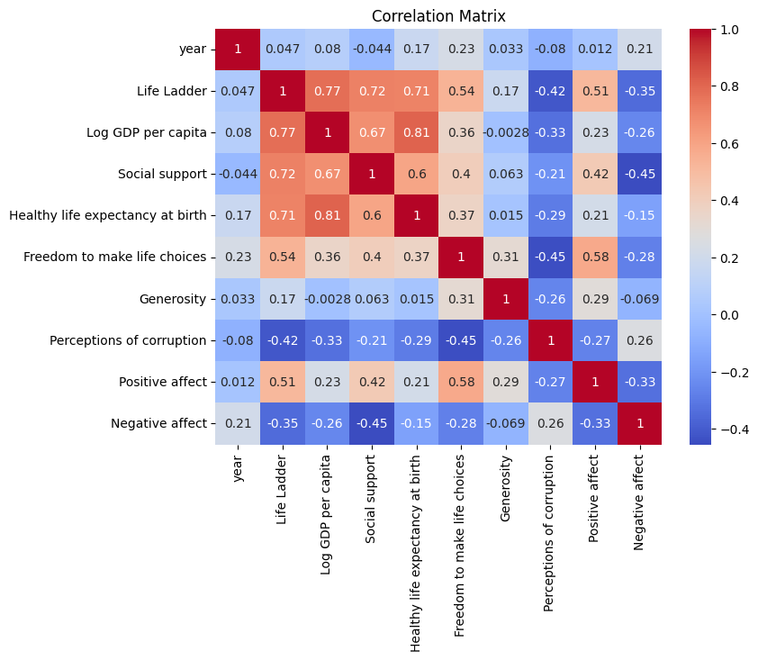
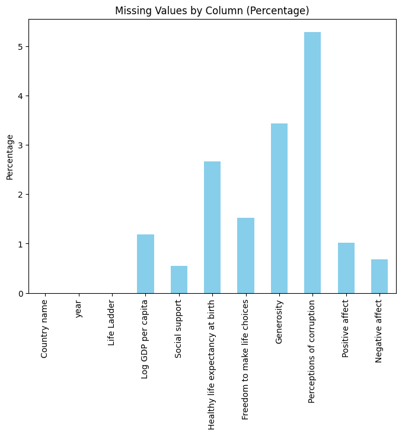
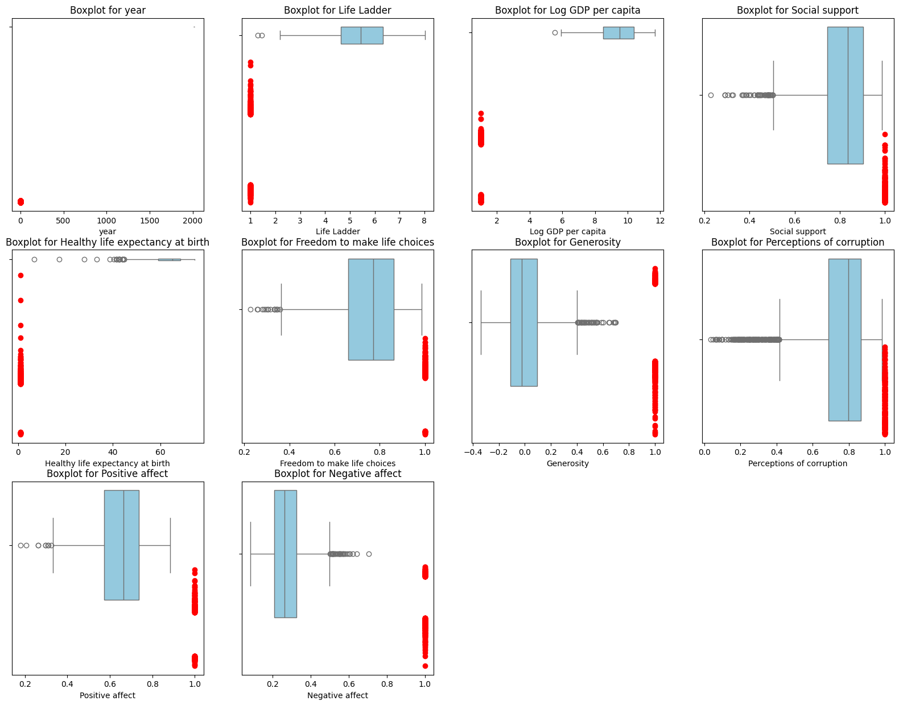
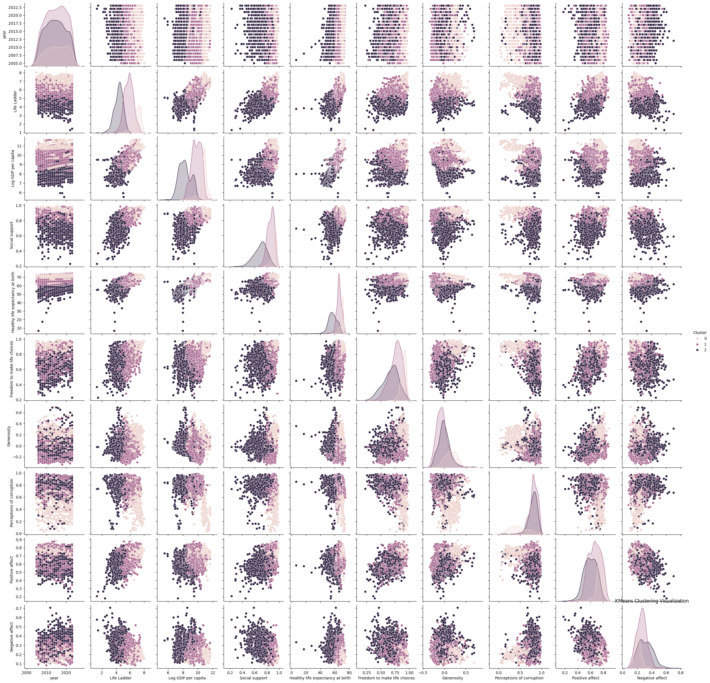
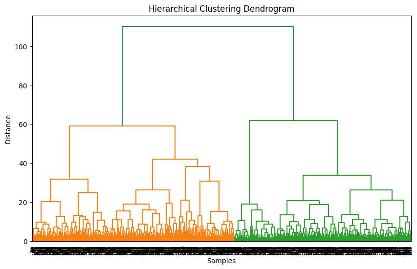
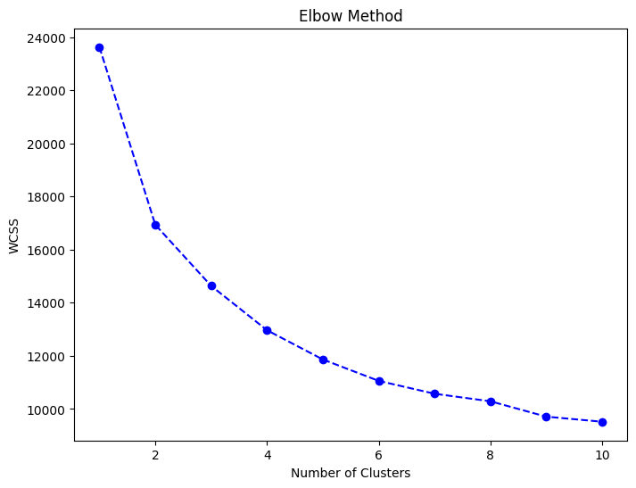

# Data Analysis Report

## Summary Statistics
                                   count unique        top freq        mean       std     min     25%     50%     75%     max
Country name                        2363    165  Argentina   18         NaN       NaN     NaN     NaN     NaN     NaN     NaN
year                              2363.0    NaN        NaN  NaN  2014.76386  5.059436  2005.0  2011.0  2015.0  2019.0  2023.0
Life Ladder                       2363.0    NaN        NaN  NaN    5.483566  1.125522   1.281   4.647   5.449  6.3235   8.019
Log GDP per capita                2363.0    NaN        NaN  NaN    9.400895  1.145275   5.527    8.52   9.503  10.382  11.676
Social support                    2363.0    NaN        NaN  NaN    0.809508  0.120892   0.228   0.744  0.8345   0.904   0.987
Healthy life expectancy at birth  2363.0    NaN        NaN  NaN   63.447103  6.756316    6.72  59.545    65.1    68.4    74.6
Freedom to make life choices      2363.0    NaN        NaN  NaN    0.750598  0.138314   0.228   0.662   0.771   0.861   0.985
Generosity                        2363.0    NaN        NaN  NaN    -0.00066  0.158647   -0.34  -0.108  -0.022   0.088     0.7
Perceptions of corruption         2363.0    NaN        NaN  NaN    0.746855  0.180321   0.035   0.696  0.7985   0.864   0.983
Positive affect                   2363.0    NaN        NaN  NaN    0.651995  0.105704   0.179   0.573   0.663  0.7365   0.884
Negative affect                   2363.0    NaN        NaN  NaN    0.273075   0.08684   0.083   0.209   0.262   0.326   0.705

## Missing Values
Country name                          0
year                                  0
Life Ladder                           0
Log GDP per capita                   28
Social support                       13
Healthy life expectancy at birth     63
Freedom to make life choices         36
Generosity                           81
Perceptions of corruption           125
Positive affect                      24
Negative affect                      16

## Outliers
                                Column  Index     Value   Z-Score
0                                 year     14  2023.000  1.628222
1                                 year     15  2007.000 -1.534855
2                                 year     30  2023.000  1.628222
3                                 year     46  2006.000 -1.732548
4                                 year     47  2007.000 -1.534855
5                                 year     63  2023.000  1.628222
6                                 year     64  2006.000 -1.732548
7                                 year     65  2007.000 -1.534855
8                                 year     80  2023.000  1.628222
9                                 year     81  2005.000 -1.930240
10                                year     82  2007.000 -1.534855
11                                year     97  2023.000  1.628222
12                                year     98  2006.000 -1.732548
13                                year    113  2023.000  1.628222
14                                year    114  2006.000 -1.732548
15                                year    115  2007.000 -1.534855
16                                year    129  2023.000  1.628222
17                                year    141  2023.000  1.628222
18                                year    142  2006.000 -1.732548
19                                year    143  2007.000 -1.534855
20                                year    159  2023.000  1.628222
21                                year    160  2006.000 -1.732548
22                                year    161  2007.000 -1.534855
23                                year    174  2005.000 -1.930240
24                                year    175  2007.000 -1.534855
25                                year    190  2023.000  1.628222
26                                year    191  2007.000 -1.534855
27                                year    193  2006.000 -1.732548
28                                year    207  2023.000  1.628222
29                                year    211  2006.000 -1.732548
30                                year    212  2007.000 -1.534855
31                                year    228  2023.000  1.628222
32                                year    229  2007.000 -1.534855
33                                year    244  2023.000  1.628222
34                                year    245  2006.000 -1.732548
35                                year    258  2023.000  1.628222
36                                year    259  2005.000 -1.930240
37                                year    260  2007.000 -1.534855
38                                year    276  2023.000  1.628222
39                                year    277  2007.000 -1.534855
40                                year    291  2023.000  1.628222
41                                year    292  2006.000 -1.732548
42                                year    293  2007.000 -1.534855
43                                year    307  2023.000  1.628222
44                                year    313  2006.000 -1.732548
45                                year    314  2007.000 -1.534855
46                                year    330  2023.000  1.628222
47                                year    331  2006.000 -1.732548
48                                year    332  2007.000 -1.534855
49                                year    348  2023.000  1.628222
50                                year    349  2005.000 -1.930240
51                                year    350  2007.000 -1.534855
52                                year    366  2023.000  1.628222
53                                year    367  2007.000 -1.534855
54                                year    372  2006.000 -1.732548
55                                year    373  2007.000 -1.534855
56                                year    387  2023.000  1.628222
57                                year    388  2006.000 -1.732548
58                                year    389  2007.000 -1.534855
59                                year    405  2023.000  1.628222
60                                year    406  2006.000 -1.732548
61                                year    407  2007.000 -1.534855
62                                year    422  2023.000  1.628222
63                                year    423  2006.000 -1.732548
64                                year    424  2007.000 -1.534855
65                                year    440  2023.000  1.628222
66                                year    448  2023.000  1.628222
67                                year    462  2023.000  1.628222
68                                year    472  2023.000  1.628222
69                                year    473  2006.000 -1.732548
70                                year    474  2007.000 -1.534855
71                                year    490  2023.000  1.628222
72                                year    491  2007.000 -1.534855
73                                year    506  2023.000  1.628222
74                                year    507  2006.000 -1.732548
75                                year    508  2006.000 -1.732548
76                                year    523  2023.000  1.628222
77                                year    524  2005.000 -1.930240
78                                year    525  2007.000 -1.534855
79                                year    538  2023.000  1.628222
80                                year    539  2005.000 -1.930240
81                                year    540  2007.000 -1.534855
82                                year    556  2023.000  1.628222
83                                year    561  2006.000 -1.732548
84                                year    562  2007.000 -1.534855
85                                year    578  2023.000  1.628222
86                                year    579  2006.000 -1.732548
87                                year    580  2007.000 -1.534855
88                                year    596  2023.000  1.628222
89                                year    597  2005.000 -1.930240
90                                year    598  2007.000 -1.534855
91                                year    614  2023.000  1.628222
92                                year    615  2006.000 -1.732548
93                                year    616  2007.000 -1.534855
94                                year    632  2023.000  1.628222
95                                year    633  2006.000 -1.732548
96                                year    634  2007.000 -1.534855
97                                year    649  2023.000  1.628222
98                                year    664  2023.000  1.628222
99                                year    665  2006.000 -1.732548
100                               year    680  2023.000  1.628222
101                               year    681  2005.000 -1.930240
102                               year    682  2006.000 -1.732548
103                               year    698  2023.000  1.628222
104                               year    711  2023.000  1.628222
105                               year    716  2023.000  1.628222
106                               year    717  2006.000 -1.732548
107                               year    718  2007.000 -1.534855
108                               year    734  2023.000  1.628222
109                               year    735  2005.000 -1.930240
110                               year    736  2007.000 -1.534855
111                               year    752  2023.000  1.628222
112                               year    753  2006.000 -1.732548
113                               year    754  2007.000 -1.534855
114                               year    770  2023.000  1.628222
115                               year    771  2005.000 -1.930240
116                               year    772  2007.000 -1.534855
117                               year    787  2023.000  1.628222
118                               year    788  2006.000 -1.732548
119                               year    789  2007.000 -1.534855
120                               year    803  2023.000  1.628222
121                               year    816  2023.000  1.628222
122                               year    817  2007.000 -1.534855
123                               year    818  2006.000 -1.732548
124                               year    829  2006.000 -1.732548
125                               year    830  2007.000 -1.534855
126                               year    845  2023.000  1.628222
127                               year    846  2006.000 -1.732548
128                               year    859  2005.000 -1.930240
129                               year    860  2007.000 -1.534855
130                               year    875  2023.000  1.628222
131                               year    886  2023.000  1.628222
132                               year    887  2006.000 -1.732548
133                               year    888  2007.000 -1.534855
134                               year    904  2023.000  1.628222
135                               year    905  2006.000 -1.732548
136                               year    906  2007.000 -1.534855
137                               year    922  2023.000  1.628222
138                               year    923  2005.000 -1.930240
139                               year    924  2007.000 -1.534855
140                               year    938  2023.000  1.628222
141                               year    953  2023.000  1.628222
142                               year    954  2006.000 -1.732548
143                               year    970  2023.000  1.628222
144                               year    971  2006.000 -1.732548
145                               year    972  2007.000 -1.534855
146                               year    988  2023.000  1.628222
147                               year    989  2005.000 -1.930240
148                               year    990  2007.000 -1.534855
149                               year   1006  2023.000  1.628222
150                               year   1018  2023.000  1.628222
151                               year   1019  2006.000 -1.732548
152                               year   1028  2005.000 -1.930240
153                               year   1029  2007.000 -1.534855
154                               year   1045  2023.000  1.628222
155                               year   1046  2005.000 -1.930240
156                               year   1047  2007.000 -1.534855
157                               year   1063  2023.000  1.628222
158                               year   1064  2006.000 -1.732548
159                               year   1065  2007.000 -1.534855
160                               year   1081  2023.000  1.628222
161                               year   1082  2006.000 -1.732548
162                               year   1083  2007.000 -1.534855
163                               year   1099  2023.000  1.628222
164                               year   1100  2007.000 -1.534855
165                               year   1116  2023.000  1.628222
166                               year   1117  2006.000 -1.732548
167                               year   1129  2023.000  1.628222
168                               year   1130  2006.000 -1.732548
169                               year   1131  2007.000 -1.534855
170                               year   1147  2023.000  1.628222
171                               year   1148  2006.000 -1.732548
172                               year   1149  2007.000 -1.534855
173                               year   1159  2023.000  1.628222
174                               year   1160  2006.000 -1.732548
175                               year   1161  2007.000 -1.534855
176                               year   1176  2023.000  1.628222
177                               year   1177  2005.000 -1.930240
178                               year   1178  2006.000 -1.732548
179                               year   1194  2023.000  1.628222
180                               year   1200  2007.000 -1.534855
181                               year   1210  2023.000  1.628222
182                               year   1218  2023.000  1.628222
183                               year   1219  2006.000 -1.732548
184                               year   1220  2007.000 -1.534855
185                               year   1236  2023.000  1.628222
186                               year   1249  2023.000  1.628222
187                               year   1250  2006.000 -1.732548
188                               year   1262  2023.000  1.628222
189                               year   1263  2006.000 -1.732548
190                               year   1264  2007.000 -1.534855
191                               year   1277  2023.000  1.628222
192                               year   1278  2006.000 -1.732548
193                               year   1279  2007.000 -1.534855
194                               year   1293  2023.000  1.628222
195                               year   1295  2006.000 -1.732548
196                               year   1311  2023.000  1.628222
197                               year   1326  2023.000  1.628222
198                               year   1327  2007.000 -1.534855
199                               year   1341  2023.000  1.628222
200                               year   1351  2023.000  1.628222
201                               year   1352  2005.000 -1.930240
202                               year   1353  2007.000 -1.534855
203                               year   1369  2023.000  1.628222
204                               year   1370  2006.000 -1.732548
205                               year   1371  2007.000 -1.534855
206                               year   1387  2023.000  1.628222
207                               year   1388  2007.000 -1.534855
208                               year   1403  2023.000  1.628222
209                               year   1404  2007.000 -1.534855
210                               year   1418  2023.000  1.628222
211                               year   1431  2023.000  1.628222
212                               year   1432  2006.000 -1.732548
213                               year   1433  2007.000 -1.534855
214                               year   1442  2023.000  1.628222
215                               year   1454  2023.000  1.628222
216                               year   1455  2007.000 -1.534855
217                               year   1463  2023.000  1.628222
218                               year   1464  2006.000 -1.732548
219                               year   1465  2007.000 -1.534855
220                               year   1481  2023.000  1.628222
221                               year   1482  2005.000 -1.930240
222                               year   1483  2007.000 -1.534855
223                               year   1498  2023.000  1.628222
224                               year   1499  2006.000 -1.732548
225                               year   1500  2007.000 -1.534855
226                               year   1515  2023.000  1.628222
227                               year   1516  2006.000 -1.732548
228                               year   1517  2007.000 -1.534855
229                               year   1533  2023.000  1.628222
230                               year   1534  2006.000 -1.732548
231                               year   1535  2007.000 -1.534855
232                               year   1549  2023.000  1.628222
233                               year   1550  2006.000 -1.732548
234                               year   1551  2007.000 -1.534855
235                               year   1565  2023.000  1.628222
236                               year   1566  2007.000 -1.534855
237                               year   1581  2023.000  1.628222
238                               year   1582  2006.000 -1.732548
239                               year   1594  2023.000  1.628222
240                               year   1596  2005.000 -1.930240
241                               year   1597  2007.000 -1.534855
242                               year   1613  2023.000  1.628222
243                               year   1614  2006.000 -1.732548
244                               year   1615  2007.000 -1.534855
245                               year   1630  2023.000  1.628222
246                               year   1631  2006.000 -1.732548
247                               year   1632  2007.000 -1.534855
248                               year   1647  2023.000  1.628222
249                               year   1648  2006.000 -1.732548
250                               year   1649  2007.000 -1.534855
251                               year   1665  2023.000  1.628222
252                               year   1666  2006.000 -1.732548
253                               year   1667  2007.000 -1.534855
254                               year   1683  2023.000  1.628222
255                               year   1684  2005.000 -1.930240
256                               year   1685  2007.000 -1.534855
257                               year   1700  2023.000  1.628222
258                               year   1701  2006.000 -1.732548
259                               year   1716  2023.000  1.628222
260                               year   1722  2005.000 -1.930240
261                               year   1723  2007.000 -1.534855
262                               year   1738  2023.000  1.628222
263                               year   1739  2006.000 -1.732548
264                               year   1740  2007.000 -1.534855
265                               year   1756  2023.000  1.628222
266                               year   1757  2006.000 -1.732548
267                               year   1769  2005.000 -1.930240
268                               year   1770  2007.000 -1.534855
269                               year   1786  2023.000  1.628222
270                               year   1787  2006.000 -1.732548
271                               year   1788  2007.000 -1.534855
272                               year   1804  2023.000  1.628222
273                               year   1805  2007.000 -1.534855
274                               year   1820  2023.000  1.628222
275                               year   1821  2006.000 -1.732548
276                               year   1822  2007.000 -1.534855
277                               year   1835  2023.000  1.628222
278                               year   1836  2006.000 -1.732548
279                               year   1837  2007.000 -1.534855
280                               year   1851  2023.000  1.628222
281                               year   1852  2006.000 -1.732548
282                               year   1866  2023.000  1.628222
283                               year   1867  2006.000 -1.732548
284                               year   1882  2023.000  1.628222
285                               year   1890  2006.000 -1.732548
286                               year   1891  2007.000 -1.534855
287                               year   1907  2023.000  1.628222
288                               year   1908  2006.000 -1.732548
289                               year   1909  2007.000 -1.534855
290                               year   1925  2023.000  1.628222
291                               year   1930  2005.000 -1.930240
292                               year   1931  2007.000 -1.534855
293                               year   1947  2023.000  1.628222
294                               year   1948  2006.000 -1.732548
295                               year   1949  2007.000 -1.534855
296                               year   1964  2023.000  1.628222
297                               year   1965  2006.000 -1.732548
298                               year   1966  2007.000 -1.534855
299                               year   1980  2023.000  1.628222
300                               year   1987  2005.000 -1.930240
301                               year   1988  2007.000 -1.534855
302                               year   2004  2023.000  1.628222
303                               year   2005  2006.000 -1.732548
304                               year   2017  2023.000  1.628222
305                               year   2025  2006.000 -1.732548
306                               year   2040  2023.000  1.628222
307                               year   2041  2006.000 -1.732548
308                               year   2042  2007.000 -1.534855
309                               year   2058  2023.000  1.628222
310                               year   2059  2006.000 -1.732548
311                               year   2060  2007.000 -1.534855
312                               year   2076  2023.000  1.628222
313                               year   2077  2006.000 -1.732548
314                               year   2078  2007.000 -1.534855
315                               year   2094  2023.000  1.628222
316                               year   2095  2006.000 -1.732548
317                               year   2106  2023.000  1.628222
318                               year   2107  2006.000 -1.732548
319                               year   2126  2023.000  1.628222
320                               year   2137  2005.000 -1.930240
321                               year   2138  2007.000 -1.534855
322                               year   2154  2023.000  1.628222
323                               year   2155  2006.000 -1.732548
324                               year   2156  2007.000 -1.534855
325                               year   2172  2023.000  1.628222
326                               year   2173  2006.000 -1.732548
327                               year   2174  2007.000 -1.534855
328                               year   2190  2023.000  1.628222
329                               year   2191  2006.000 -1.732548
330                               year   2206  2023.000  1.628222
331                               year   2207  2005.000 -1.930240
332                               year   2208  2007.000 -1.534855
333                               year   2224  2023.000  1.628222
334                               year   2225  2006.000 -1.732548
335                               year   2226  2007.000 -1.534855
336                               year   2242  2023.000  1.628222
337                               year   2243  2006.000 -1.732548
338                               year   2244  2007.000 -1.534855
339                               year   2260  2023.000  1.628222
340                               year   2261  2006.000 -1.732548
341                               year   2277  2023.000  1.628222
342                               year   2278  2005.000 -1.930240
343                               year   2279  2006.000 -1.732548
344                               year   2295  2023.000  1.628222
345                               year   2296  2006.000 -1.732548
346                               year   2297  2007.000 -1.534855
347                               year   2313  2023.000  1.628222
348                               year   2314  2007.000 -1.534855
349                               year   2327  2023.000  1.628222
350                               year   2328  2006.000 -1.732548
351                               year   2329  2007.000 -1.534855
352                               year   2344  2023.000  1.628222
353                               year   2345  2006.000 -1.732548
354                               year   2346  2007.000 -1.534855
355                               year   2362  2023.000  1.628222
356                        Life Ladder      0     3.724 -1.563665
357                        Life Ladder      4     3.783 -1.511233
358                        Life Ladder      5     3.572 -1.698742
359                        Life Ladder      6     3.131 -2.090643
360                        Life Ladder      9     2.662 -2.507427
361                        Life Ladder     10     2.694 -2.478990
362                        Life Ladder     11     2.375 -2.762474
363                        Life Ladder     12     2.436 -2.708265
364                        Life Ladder     13     1.281 -3.734673
365                        Life Ladder     14     1.446 -3.588044
366                        Life Ladder     45     3.795 -1.500569
367                        Life Ladder     81     7.341  1.650637
368                        Life Ladder     82     7.285  1.600872
369                        Life Ladder     83     7.254  1.573323
370                        Life Ladder     84     7.450  1.747501
371                        Life Ladder     85     7.406  1.708400
372                        Life Ladder     86     7.196  1.521780
373                        Life Ladder     87     7.364  1.671076
374                        Life Ladder     88     7.289  1.604426
375                        Life Ladder     89     7.309  1.622200
376                        Life Ladder     90     7.250  1.569768
377                        Life Ladder     91     7.257  1.575989
378                        Life Ladder     92     7.177  1.504896
379                        Life Ladder     93     7.234  1.555550
380                        Life Ladder     99     7.181  1.508450
381                        Life Ladder    100     7.303  1.616868
382                        Life Ladder    101     7.471  1.766163
383                        Life Ladder    102     7.401  1.703957
384                        Life Ladder    103     7.499  1.791046
385                        Life Ladder    107     7.294  1.608870
386                        Life Ladder    108     7.396  1.699513
387                        Life Ladder    109     7.195  1.520892
388                        Life Ladder    110     7.213  1.536888
389                        Life Ladder    158     3.408 -1.844483
390                        Life Ladder    174     7.262  1.580432
391                        Life Ladder    175     7.219  1.542220
392                        Life Ladder    193     3.330 -1.913799
393                        Life Ladder    194     3.667 -1.614319
394                        Life Ladder    196     3.193 -2.035546
395                        Life Ladder    197     3.479 -1.781388
396                        Life Ladder    198     3.347 -1.898691
397                        Life Ladder    199     3.625 -1.651643
398                        Life Ladder    247     3.553 -1.715626
399                        Life Ladder    248     3.520 -1.744952
400                        Life Ladder    252     3.762 -1.529895
401                        Life Ladder    253     3.499 -1.763614
402                        Life Ladder    254     3.505 -1.758282
403                        Life Ladder    255     3.461 -1.797384
404                        Life Ladder    256     3.471 -1.788497
405                        Life Ladder    257     3.435 -1.820489
406                        Life Ladder    258     3.332 -1.912021
407                        Life Ladder    298     3.326 -1.917353
408                        Life Ladder    299     3.481 -1.779610
409                        Life Ladder    308     3.563 -1.706740
410                        Life Ladder    309     3.792 -1.503235
411                        Life Ladder    310     3.706 -1.579661
412                        Life Ladder    311     2.905 -2.291481
413                        Life Ladder    312     3.775 -1.518343
414                        Life Ladder    313     3.569 -1.701408
415                        Life Ladder    320     3.674 -1.608098
416                        Life Ladder    349     7.418  1.719064
417                        Life Ladder    350     7.482  1.775939
418                        Life Ladder    351     7.486  1.779493
419                        Life Ladder    352     7.488  1.781271
420                        Life Ladder    353     7.650  1.925234
421                        Life Ladder    354     7.426  1.726173
422                        Life Ladder    355     7.415  1.716398
423                        Life Ladder    356     7.594  1.875469
424                        Life Ladder    357     7.304  1.617756
425                        Life Ladder    358     7.413  1.714621
426                        Life Ladder    359     7.245  1.565325
427                        Life Ladder    360     7.415  1.716398
428                        Life Ladder    361     7.175  1.503118
429                        Life Ladder    368     3.568 -1.702296
430                        Life Ladder    369     3.678 -1.604543
431                        Life Ladder    370     2.693 -2.479878
432                        Life Ladder    371     3.476 -1.784054
433                        Life Ladder    372     3.435 -1.820489
434                        Life Ladder    375     3.639 -1.639201
435                        Life Ladder    376     3.743 -1.546780
436                        Life Ladder    379     3.508 -1.755616
437                        Life Ladder    380     3.460 -1.798272
438                        Life Ladder    441     3.476 -1.784054
439                        Life Ladder    447     3.545 -1.722736
440                        Life Ladder    448     3.588 -1.684523
441                        Life Ladder    471     3.207 -2.023105
442                        Life Ladder    472     3.383 -1.866699
443                        Life Ladder    474     7.432  1.731505
444                        Life Ladder    476     7.615  1.894131
445                        Life Ladder    477     7.271  1.588430
446                        Life Ladder    478     7.229  1.551106
447                        Life Ladder    479     7.272  1.589319
448                        Life Ladder    481     7.247  1.567102
449                        Life Ladder    484     7.225  1.547552
450                        Life Ladder    490     7.384  1.688849
451                        Life Ladder    539     8.019  2.253152
452                        Life Ladder    540     7.834  2.088749
453                        Life Ladder    541     7.971  2.210496
454                        Life Ladder    542     7.683  1.954560
455                        Life Ladder    543     7.771  2.032763
456                        Life Ladder    544     7.788  2.047870
457                        Life Ladder    545     7.520  1.809708
458                        Life Ladder    546     7.589  1.871026
459                        Life Ladder    547     7.508  1.799044
460                        Life Ladder    548     7.514  1.804376
461                        Life Ladder    549     7.558  1.843477
462                        Life Ladder    550     7.594  1.875469
463                        Life Ladder    551     7.649  1.924346
464                        Life Ladder    552     7.693  1.963447
465                        Life Ladder    553     7.515  1.805265
466                        Life Ladder    554     7.699  1.968779
467                        Life Ladder    555     7.545  1.831925
468                        Life Ladder    556     7.504  1.795489
469                        Life Ladder    604     3.559 -1.710294
470                        Life Ladder    653     3.502 -1.760948
471                        Life Ladder    663     3.628 -1.648977
472                        Life Ladder    665     7.672  1.944785
473                        Life Ladder    666     7.671  1.943896
474                        Life Ladder    667     7.393  1.696847
475                        Life Ladder    668     7.354  1.662190
476                        Life Ladder    669     7.420  1.720841
477                        Life Ladder    670     7.445  1.743058
478                        Life Ladder    671     7.385  1.689738
479                        Life Ladder    672     7.448  1.745724
480                        Life Ladder    673     7.660  1.934121
481                        Life Ladder    674     7.788  2.047870
482                        Life Ladder    675     7.858  2.110077
483                        Life Ladder    676     7.780  2.040761
484                        Life Ladder    677     7.889  2.137625
485                        Life Ladder    678     7.794  2.053202
486                        Life Ladder    679     7.729  1.995439
487                        Life Ladder    680     7.699  1.968779
488                        Life Ladder    717     3.675 -1.607209
489                        Life Ladder    718     3.707 -1.578772
490                        Life Ladder    749     7.312  1.624866
491                        Life Ladder    805     3.652 -1.627649
492                        Life Ladder    807     3.412 -1.840928
493                        Life Ladder    808     3.505 -1.758282
494                        Life Ladder    809     3.603 -1.671193
495                        Life Ladder    818     3.754 -1.537005
496                        Life Ladder    820     3.766 -1.526341
497                        Life Ladder    825     3.570 -1.700519
498                        Life Ladder    826     3.352 -1.894248
499                        Life Ladder    828     3.615 -1.660529
500                        Life Ladder    877     7.591  1.872803
501                        Life Ladder    878     7.501  1.792823
502                        Life Ladder    879     7.498  1.790157
503                        Life Ladder    880     7.510  1.800821
504                        Life Ladder    881     7.476  1.770607
505                        Life Ladder    882     7.533  1.821261
506                        Life Ladder    883     7.575  1.858585
507                        Life Ladder    884     7.565  1.849698
508                        Life Ladder    885     7.449  1.746613
509                        Life Ladder    886     7.562  1.847032
510                        Life Ladder    900     3.249 -1.985781
511                        Life Ladder    902     3.558 -1.711183
512                        Life Ladder    955     7.568  1.852364
513                        Life Ladder    957     7.257  1.575989
514                        Life Ladder    966     7.255  1.574212
515                        Life Ladder    971     7.173  1.501341
516                        Life Ladder    973     7.261  1.579544
517                        Life Ladder    974     7.353  1.661301
518                        Life Ladder    975     7.359  1.666633
519                        Life Ladder    976     7.433  1.732394
520                        Life Ladder    978     7.321  1.632864
521                        Life Ladder    979     7.401  1.703957
522                        Life Ladder    982     7.331  1.641750
523                        Life Ladder    984     7.332  1.642639
524                        Life Ladder    985     7.195  1.520892
525                        Life Ladder    986     7.578  1.861251
526                        Life Ladder    987     7.662  1.935898
527                        Life Ladder   1008     3.739 -1.550335
528                        Life Ladder   1009     3.570 -1.700519
529                        Life Ladder   1089     3.795 -1.500569
530                        Life Ladder   1191     2.634 -2.532310
531                        Life Ladder   1192     2.179 -2.936652
532                        Life Ladder   1193     2.352 -2.782913
533                        Life Ladder   1194     3.588 -1.684523
534                        Life Ladder   1197     3.795 -1.500569
535                        Life Ladder   1198     3.512 -1.752062
536                        Life Ladder   1199     3.186 -2.041766
537                        Life Ladder   1200     3.701 -1.584104
538                        Life Ladder   1204     2.702 -2.471880
539                        Life Ladder   1205     3.355 -1.891582
540                        Life Ladder   1246     7.243  1.563548
541                        Life Ladder   1247     7.404  1.706623
542                        Life Ladder   1248     7.228  1.550218
543                        Life Ladder   1253     3.551 -1.717404
544                        Life Ladder   1255     3.676 -1.606321
545                        Life Ladder   1256     3.593 -1.680080
546                        Life Ladder   1257     3.663 -1.617873
547                        Life Ladder   1271     3.476 -1.784054
548                        Life Ladder   1272     3.417 -1.836485
549                        Life Ladder   1273     3.335 -1.909355
550                        Life Ladder   1275     3.635 -1.642756
551                        Life Ladder   1276     3.356 -1.890693
552                        Life Ladder   1277     3.272 -1.965341
553                        Life Ladder   1298     3.762 -1.529895
554                        Life Ladder   1301     3.676 -1.606321
555                        Life Ladder   1358     7.320  1.631975
556                        Life Ladder   1359     7.443  1.741281
557                        Life Ladder   1482     7.464  1.759943
558                        Life Ladder   1483     7.452  1.749279
559                        Life Ladder   1484     7.631  1.908350
560                        Life Ladder   1485     7.502  1.793712
561                        Life Ladder   1486     7.564  1.848809
562                        Life Ladder   1487     7.471  1.766163
563                        Life Ladder   1488     7.407  1.709289
564                        Life Ladder   1489     7.321  1.632864
565                        Life Ladder   1490     7.324  1.635530
566                        Life Ladder   1491     7.541  1.828370
567                        Life Ladder   1492     7.459  1.755499
568                        Life Ladder   1493     7.463  1.759054
569                        Life Ladder   1494     7.425  1.725285
570                        Life Ladder   1495     7.504  1.795489
571                        Life Ladder   1496     7.314  1.626643
572                        Life Ladder   1497     7.390  1.694181
573                        Life Ladder   1498     7.255  1.574212
574                        Life Ladder   1499     7.305  1.618645
575                        Life Ladder   1500     7.604  1.884356
576                        Life Ladder   1501     7.381  1.686184
577                        Life Ladder   1502     7.224  1.546663
578                        Life Ladder   1503     7.191  1.517337
579                        Life Ladder   1504     7.250  1.569768
580                        Life Ladder   1505     7.280  1.596428
581                        Life Ladder   1506     7.306  1.619534
582                        Life Ladder   1507     7.418  1.719064
583                        Life Ladder   1508     7.226  1.548440
584                        Life Ladder   1509     7.327  1.638196
585                        Life Ladder   1510     7.370  1.676408
586                        Life Ladder   1511     7.205  1.529778
587                        Life Ladder   1512     7.257  1.575989
588                        Life Ladder   1534     3.737 -1.552112
589                        Life Ladder   1541     3.716 -1.570774
590                        Life Ladder   1543     3.671 -1.610764
591                        Life Ladder   1582     7.416  1.717287
592                        Life Ladder   1583     7.632  1.909238
593                        Life Ladder   1584     7.678  1.950117
594                        Life Ladder   1585     7.444  1.742169
595                        Life Ladder   1586     7.603  1.883467
596                        Life Ladder   1587     7.596  1.877246
597                        Life Ladder   1588     7.579  1.862139
598                        Life Ladder   1589     7.444  1.742169
599                        Life Ladder   1590     7.442  1.740392
600                        Life Ladder   1591     7.290  1.605315
601                        Life Ladder   1592     7.362  1.669299
602                        Life Ladder   1593     7.295  1.609758
603                        Life Ladder   1594     7.249  1.568880
604                        Life Ladder   1618     7.321  1.632864
605                        Life Ladder   1619     7.248  1.567991
606                        Life Ladder   1761     3.333 -1.911133
607                        Life Ladder   1762     3.466 -1.792940
608                        Life Ladder   1763     3.596 -1.677414
609                        Life Ladder   1764     3.483 -1.777833
610                        Life Ladder   1765     3.333 -1.911133
611                        Life Ladder   1766     3.108 -2.111082
612                        Life Ladder   1767     3.561 -1.708517
613                        Life Ladder   1768     3.268 -1.968896
614                        Life Ladder   1770     7.267  1.584876
615                        Life Ladder   1793     3.669 -1.612541
616                        Life Ladder   1794     3.647 -1.632092
617                        Life Ladder   1821     3.628 -1.648977
618                        Life Ladder   1822     3.585 -1.687189
619                        Life Ladder   1823     2.997 -2.209724
620                        Life Ladder   1832     3.447 -1.809825
621                        Life Ladder   1833     3.714 -1.572551
622                        Life Ladder   1834     2.560 -2.598071
623                        Life Ladder   1835     3.467 -1.792052
624                        Life Ladder   1897     3.661 -1.619651
625                        Life Ladder   1928     2.888 -2.306589
626                        Life Ladder   1929     2.817 -2.369684
627                        Life Ladder   1932     7.294  1.608870
628                        Life Ladder   1964     3.602 -1.672082
629                        Life Ladder   1987     7.376  1.681740
630                        Life Ladder   1988     7.241  1.561770
631                        Life Ladder   1989     7.516  1.806153
632                        Life Ladder   1990     7.266  1.583987
633                        Life Ladder   1991     7.496  1.788380
634                        Life Ladder   1992     7.382  1.687072
635                        Life Ladder   1993     7.560  1.845255
636                        Life Ladder   1994     7.434  1.733283
637                        Life Ladder   1995     7.239  1.559993
638                        Life Ladder   1996     7.289  1.604426
639                        Life Ladder   1997     7.369  1.675520
640                        Life Ladder   1998     7.287  1.602649
641                        Life Ladder   1999     7.375  1.680852
642                        Life Ladder   2000     7.398  1.701291
643                        Life Ladder   2001     7.314  1.626643
644                        Life Ladder   2002     7.439  1.737726
645                        Life Ladder   2003     7.431  1.730617
646                        Life Ladder   2005     7.473  1.767941
647                        Life Ladder   2006     7.525  1.814151
648                        Life Ladder   2007     7.776  2.037206
649                        Life Ladder   2008     7.493  1.785714
650                        Life Ladder   2009     7.572  1.855919
651                        Life Ladder   2010     7.459  1.755499
652                        Life Ladder   2011     7.474  1.768829
653                        Life Ladder   2012     7.509  1.799933
654                        Life Ladder   2013     7.694  1.964336
655                        Life Ladder   2014     7.508  1.799044
656                        Life Ladder   2015     7.328  1.639084
657                        Life Ladder   2022     3.164 -2.061317
658                        Life Ladder   2023     2.688 -2.484322
659                        Life Ladder   2024     3.462 -1.796495
660                        Life Ladder   2062     3.408 -1.844483
661                        Life Ladder   2063     3.229 -2.003554
662                        Life Ladder   2067     3.483 -1.777833
663                        Life Ladder   2068     3.661 -1.619651
664                        Life Ladder   2069     2.903 -2.293259
665                        Life Ladder   2070     3.347 -1.898691
666                        Life Ladder   2071     3.445 -1.811602
667                        Life Ladder   2072     3.640 -1.638313
668                        Life Ladder   2073     3.786 -1.508567
669                        Life Ladder   2074     3.681 -1.601877
670                        Life Ladder   2075     3.616 -1.659641
671                        Life Ladder   2095     3.202 -2.027548
672                        Life Ladder   2096     2.808 -2.377682
673                        Life Ladder   2097     2.936 -2.263933
674                        Life Ladder   2098     2.839 -2.350133
675                        Life Ladder   2099     3.768 -1.524563
676                        Life Ladder   2155     3.734 -1.554778
677                        Life Ladder   2162     3.710 -1.576106
678                        Life Ladder   2163     3.770 -1.522786
679                        Life Ladder   2195     7.218  1.541331
680                        Life Ladder   2219     7.233  1.554661
681                        Life Ladder   2225     7.182  1.509339
682                        Life Ladder   2226     7.513  1.803487
683                        Life Ladder   2227     7.280  1.596428
684                        Life Ladder   2232     7.249  1.568880
685                        Life Ladder   2281     7.189  1.515560
686                        Life Ladder   2282     7.478  1.772384
687                        Life Ladder   2317     3.746 -1.544114
688                        Life Ladder   2321     2.983 -2.222166
689                        Life Ladder   2323     3.254 -1.981337
690                        Life Ladder   2324     3.058 -2.155516
691                        Life Ladder   2326     3.590 -1.682746
692                        Life Ladder   2327     3.532 -1.734288
693                        Life Ladder   2340     3.307 -1.934238
694                        Life Ladder   2342     3.082 -2.134188
695                        Life Ladder   2343     3.728 -1.560110
696                        Life Ladder   2344     3.686 -1.597434
697                        Life Ladder   2346     3.280 -1.958232
698                        Life Ladder   2347     3.174 -2.052430
699                        Life Ladder   2354     3.703 -1.582327
700                        Life Ladder   2355     3.735 -1.553889
701                        Life Ladder   2356     3.638 -1.640090
702                        Life Ladder   2357     3.616 -1.659641
703                        Life Ladder   2358     2.694 -2.478990
704                        Life Ladder   2359     3.160 -2.064872
705                        Life Ladder   2360     3.155 -2.069315
706                        Life Ladder   2361     3.296 -1.944013
707                        Life Ladder   2362     3.572 -1.698742
708                 Log GDP per capita      0     7.350 -1.779502
709                 Log GDP per capita      1     7.509 -1.641460
710                 Log GDP per capita      2     7.614 -1.550300
711                 Log GDP per capita      3     7.581 -1.578951
712                 Log GDP per capita      4     7.661 -1.509495
713                 Log GDP per capita      6     7.671 -1.500814
714                 Log GDP per capita      7     7.654 -1.515573
715                 Log GDP per capita      8     7.650 -1.519045
716                 Log GDP per capita      9     7.648 -1.520782
717                 Log GDP per capita     10     7.631 -1.535541
718                 Log GDP per capita     11     7.640 -1.527727
719                 Log GDP per capita     12     7.325 -1.801207
720                 Log GDP per capita    292     7.327 -1.799471
721                 Log GDP per capita    293     7.337 -1.790789
722                 Log GDP per capita    294     7.364 -1.767348
723                 Log GDP per capita    295     7.416 -1.722202
724                 Log GDP per capita    296     7.450 -1.692683
725                 Log GDP per capita    297     7.482 -1.664901
726                 Log GDP per capita    298     7.509 -1.641460
727                 Log GDP per capita    299     7.521 -1.631042
728                 Log GDP per capita    300     7.530 -1.623228
729                 Log GDP per capita    301     7.558 -1.598919
730                 Log GDP per capita    302     7.590 -1.571137
731                 Log GDP per capita    303     7.626 -1.539882
732                 Log GDP per capita    304     7.654 -1.515573
733                 Log GDP per capita    305     7.647 -1.521650
734                 Log GDP per capita    308     6.700 -2.343825
735                 Log GDP per capita    309     6.687 -2.355112
736                 Log GDP per capita    310     6.694 -2.349034
737                 Log GDP per capita    311     6.723 -2.323857
738                 Log GDP per capita    312     6.607 -2.424567
739                 Log GDP per capita    367     6.946 -2.130251
740                 Log GDP per capita    368     7.031 -2.056455
741                 Log GDP per capita    369     7.057 -2.033882
742                 Log GDP per capita    370     6.707 -2.337748
743                 Log GDP per capita    371     6.733 -2.315175
744                 Log GDP per capita    372     7.369 -1.763007
745                 Log GDP per capita    373     7.368 -1.763875
746                 Log GDP per capita    374     7.363 -1.768216
747                 Log GDP per capita    375     7.369 -1.763007
748                 Log GDP per capita    376     7.462 -1.682265
749                 Log GDP per capita    377     7.428 -1.711783
750                 Log GDP per capita    378     7.478 -1.668374
751                 Log GDP per capita    379     7.498 -1.651010
752                 Log GDP per capita    380     7.529 -1.624096
753                 Log GDP per capita    381     7.525 -1.627569
754                 Log GDP per capita    382     7.429 -1.710915
755                 Log GDP per capita    383     7.365 -1.766479
756                 Log GDP per capita    384     7.355 -1.775161
757                 Log GDP per capita    385     7.354 -1.776029
758                 Log GDP per capita    386     7.253 -1.863717
759                 Log GDP per capita    387     7.254 -1.862848
760                 Log GDP per capita    463     6.699 -2.344693
761                 Log GDP per capita    464     6.769 -2.283920
762                 Log GDP per capita    465     6.803 -2.254402
763                 Log GDP per capita    466     6.851 -2.212729
764                 Log GDP per capita    467     6.907 -2.164110
765                 Log GDP per capita    468     6.940 -2.135460
766                 Log GDP per capita    469     6.929 -2.145010
767                 Log GDP per capita    470     6.931 -2.143273
768                 Log GDP per capita    471     7.032 -2.055586
769                 Log GDP per capita    472     7.076 -2.017386
770                 Log GDP per capita    654     7.252 -1.864585
771                 Log GDP per capita    655     7.325 -1.801207
772                 Log GDP per capita    656     7.396 -1.739566
773                 Log GDP per capita    657     7.468 -1.677056
774                 Log GDP per capita    658     7.531 -1.622360
775                 Log GDP per capita    659     7.595 -1.566796
776                 Log GDP per capita    660     7.634 -1.532936
777                 Log GDP per capita    712     7.564 -1.593710
778                 Log GDP per capita    713     7.607 -1.556378
779                 Log GDP per capita    714     7.642 -1.525991
780                 Log GDP per capita    715     7.662 -1.508627
781                 Log GDP per capita    804     7.556 -1.600655
782                 Log GDP per capita    805     7.589 -1.572005
783                 Log GDP per capita    806     7.604 -1.558982
784                 Log GDP per capita    807     7.615 -1.549432
785                 Log GDP per capita    808     7.627 -1.539014
786                 Log GDP per capita    962    11.180  1.545662
787                 Log GDP per capita    963    11.189  1.553476
788                 Log GDP per capita    964    11.264  1.618590
789                 Log GDP per capita    965    11.334  1.679363
790                 Log GDP per capita    966    11.373  1.713223
791                 Log GDP per capita    967    11.423  1.756632
792                 Log GDP per capita    968    11.540  1.858210
793                 Log GDP per capita    969    11.643  1.947634
794                 Log GDP per capita    970    11.676  1.976284
795                 Log GDP per capita   1117    11.233  1.591676
796                 Log GDP per capita   1200     7.179 -1.927963
797                 Log GDP per capita   1201     7.207 -1.903653
798                 Log GDP per capita   1202     7.257 -1.860244
799                 Log GDP per capita   1203     7.386 -1.748247
800                 Log GDP per capita   1204     7.366 -1.765611
801                 Log GDP per capita   1205     7.330 -1.796866
802                 Log GDP per capita   1206     7.335 -1.792525
803                 Log GDP per capita   1207     7.328 -1.798602
804                 Log GDP per capita   1208     7.283 -1.837671
805                 Log GDP per capita   1209     7.287 -1.834198
806                 Log GDP per capita   1210     7.309 -1.815098
807                 Log GDP per capita   1237    11.628  1.934611
808                 Log GDP per capita   1238    11.647  1.951107
809                 Log GDP per capita   1239    11.635  1.940688
810                 Log GDP per capita   1240    11.627  1.933743
811                 Log GDP per capita   1241    11.636  1.941557
812                 Log GDP per capita   1242    11.638  1.943293
813                 Log GDP per capita   1243    11.637  1.942425
814                 Log GDP per capita   1244    11.664  1.965866
815                 Log GDP per capita   1245    11.653  1.956316
816                 Log GDP per capita   1246    11.645  1.949370
817                 Log GDP per capita   1247    11.649  1.952843
818                 Log GDP per capita   1248    11.657  1.959788
819                 Log GDP per capita   1249    11.649  1.952843
820                 Log GDP per capita   1250     7.351 -1.778634
821                 Log GDP per capita   1251     7.413 -1.724806
822                 Log GDP per capita   1252     7.309 -1.815098
823                 Log GDP per capita   1253     7.311 -1.813362
824                 Log GDP per capita   1254     7.307 -1.816834
825                 Log GDP per capita   1255     7.314 -1.810757
826                 Log GDP per capita   1256     7.319 -1.806416
827                 Log GDP per capita   1257     7.332 -1.795130
828                 Log GDP per capita   1258     7.345 -1.783843
829                 Log GDP per capita   1259     7.351 -1.778634
830                 Log GDP per capita   1260     7.369 -1.763007
831                 Log GDP per capita   1261     7.315 -1.809889
832                 Log GDP per capita   1262     7.333 -1.794261
833                 Log GDP per capita   1263     7.015 -2.070346
834                 Log GDP per capita   1264     7.078 -2.015650
835                 Log GDP per capita   1265     7.174 -1.932304
836                 Log GDP per capita   1266     7.231 -1.882817
837                 Log GDP per capita   1267     7.221 -1.891499
838                 Log GDP per capita   1268     7.246 -1.869794
839                 Log GDP per capita   1269     7.273 -1.846353
840                 Log GDP per capita   1270     7.273 -1.846353
841                 Log GDP per capita   1271     7.270 -1.848957
842                 Log GDP per capita   1272     7.283 -1.837671
843                 Log GDP per capita   1273     7.299 -1.823780
844                 Log GDP per capita   1274     7.325 -1.801207
845                 Log GDP per capita   1275     7.307 -1.816834
846                 Log GDP per capita   1276     7.291 -1.830725
847                 Log GDP per capita   1277     7.279 -1.841144
848                 Log GDP per capita   1295     7.561 -1.596314
849                 Log GDP per capita   1296     7.576 -1.583291
850                 Log GDP per capita   1297     7.591 -1.570269
851                 Log GDP per capita   1298     7.610 -1.553773
852                 Log GDP per capita   1299     7.609 -1.554641
853                 Log GDP per capita   1300     7.572 -1.586764
854                 Log GDP per capita   1301     7.565 -1.592842
855                 Log GDP per capita   1302     7.602 -1.560719
856                 Log GDP per capita   1303     7.631 -1.535541
857                 Log GDP per capita   1304     7.655 -1.514705
858                 Log GDP per capita   1308     7.661 -1.509495
859                 Log GDP per capita   1309     7.659 -1.511232
860                 Log GDP per capita   1310     7.665 -1.506023
861                 Log GDP per capita   1432     6.792 -2.263952
862                 Log GDP per capita   1433     6.840 -2.222279
863                 Log GDP per capita   1434     6.885 -2.183210
864                 Log GDP per capita   1435     6.996 -2.086841
865                 Log GDP per capita   1436     7.148 -1.954876
866                 Log GDP per capita   1437     7.160 -1.944458
867                 Log GDP per capita   1438     7.165 -1.940117
868                 Log GDP per capita   1439     7.159 -1.945326
869                 Log GDP per capita   1440     7.112 -1.986131
870                 Log GDP per capita   1441     7.125 -1.974845
871                 Log GDP per capita   1442     7.147 -1.955745
872                 Log GDP per capita   1534     6.872 -2.194497
873                 Log GDP per capita   1535     6.867 -2.198838
874                 Log GDP per capita   1536     6.905 -2.165846
875                 Log GDP per capita   1537     6.887 -2.181474
876                 Log GDP per capita   1538     6.932 -2.142405
877                 Log GDP per capita   1539     6.918 -2.154560
878                 Log GDP per capita   1540     6.980 -2.100732
879                 Log GDP per capita   1541     6.994 -2.088578
880                 Log GDP per capita   1542     7.020 -2.066005
881                 Log GDP per capita   1543     7.025 -2.061664
882                 Log GDP per capita   1544     7.042 -2.046904
883                 Log GDP per capita   1545     7.053 -2.037354
884                 Log GDP per capita   1546     7.084 -2.010441
885                 Log GDP per capita   1547     7.105 -1.992209
886                 Log GDP per capita   1548     7.151 -1.952272
887                 Log GDP per capita   1549     7.181 -1.926226
888                 Log GDP per capita   1717    11.434  1.766182
889                 Log GDP per capita   1718    11.551  1.867760
890                 Log GDP per capita   1719    11.625  1.932006
891                 Log GDP per capita   1720    11.617  1.925061
892                 Log GDP per capita   1721    11.532  1.851265
893                 Log GDP per capita   1757     7.087 -2.007836
894                 Log GDP per capita   1758     7.213 -1.898444
895                 Log GDP per capita   1759     7.247 -1.868926
896                 Log GDP per capita   1760     7.343 -1.785580
897                 Log GDP per capita   1761     7.401 -1.735225
898                 Log GDP per capita   1762     7.423 -1.716124
899                 Log GDP per capita   1763     7.459 -1.684870
900                 Log GDP per capita   1764     7.520 -1.631910
901                 Log GDP per capita   1765     7.554 -1.602392
902                 Log GDP per capita   1766     7.568 -1.590237
903                 Log GDP per capita   1767     7.625 -1.540750
904                 Log GDP per capita   1821     7.122 -1.977449
905                 Log GDP per capita   1822     7.177 -1.929699
906                 Log GDP per capita   1823     7.205 -1.905390
907                 Log GDP per capita   1824     7.245 -1.870662
908                 Log GDP per capita   1825     7.277 -1.842880
909                 Log GDP per capita   1826     7.557 -1.599787
910                 Log GDP per capita   1827     7.577 -1.582423
911                 Log GDP per capita   1828     7.324 -1.802075
912                 Log GDP per capita   1829     7.361 -1.769952
913                 Log GDP per capita   1830     7.374 -1.758666
914                 Log GDP per capita   1831     7.384 -1.749984
915                 Log GDP per capita   1832     7.412 -1.725674
916                 Log GDP per capita   1833     7.387 -1.747379
917                 Log GDP per capita   1834     7.400 -1.736093
918                 Log GDP per capita   1835     7.412 -1.725674
919                 Log GDP per capita   1836    11.168  1.535244
920                 Log GDP per capita   1837    11.213  1.574312
921                 Log GDP per capita   1838    11.178  1.543926
922                 Log GDP per capita   1839    11.149  1.518748
923                 Log GDP per capita   1840    11.267  1.621195
924                 Log GDP per capita   1841    11.306  1.655054
925                 Log GDP per capita   1842    11.356  1.698464
926                 Log GDP per capita   1843    11.382  1.721036
927                 Log GDP per capita   1844    11.399  1.735796
928                 Log GDP per capita   1845    11.422  1.755764
929                 Log GDP per capita   1846    11.465  1.793096
930                 Log GDP per capita   1847    11.496  1.820010
931                 Log GDP per capita   1848    11.497  1.820878
932                 Log GDP per capita   1849    11.587  1.899015
933                 Log GDP per capita   1850    11.590  1.901620
934                 Log GDP per capita   1883     6.830 -2.230961
935                 Log GDP per capita   1884     6.937 -2.138064
936                 Log GDP per capita   1885     6.981 -2.099864
937                 Log GDP per capita   2011    11.130  1.502253
938                 Log GDP per capita   2012    11.151  1.520485
939                 Log GDP per capita   2013    11.155  1.523958
940                 Log GDP per capita   2015    11.158  1.526562
941                 Log GDP per capita   2016    11.170  1.536980
942                 Log GDP per capita   2017    11.169  1.536112
943                 Log GDP per capita   2041     7.591 -1.570269
944                 Log GDP per capita   2042     7.648 -1.520782
945                 Log GDP per capita   2059     7.459 -1.684870
946                 Log GDP per capita   2060     7.497 -1.651878
947                 Log GDP per capita   2061     7.525 -1.627569
948                 Log GDP per capita   2062     7.551 -1.604996
949                 Log GDP per capita   2063     7.587 -1.573741
950                 Log GDP per capita   2064     7.632 -1.534673
951                 Log GDP per capita   2065     7.647 -1.521650
952                 Log GDP per capita   2095     7.342 -1.786448
953                 Log GDP per capita   2096     7.312 -1.812493
954                 Log GDP per capita   2097     7.406 -1.730884
955                 Log GDP per capita   2098     7.509 -1.641460
956                 Log GDP per capita   2099     7.540 -1.614546
957                 Log GDP per capita   2100     7.569 -1.589369
958                 Log GDP per capita   2101     7.587 -1.573741
959                 Log GDP per capita   2102     7.613 -1.551168
960                 Log GDP per capita   2103     7.637 -1.530332
961                 Log GDP per capita   2104     7.667 -1.504286
962                 Log GDP per capita   2155     7.370 -1.762138
963                 Log GDP per capita   2156     7.422 -1.716993
964                 Log GDP per capita   2157     7.476 -1.670110
965                 Log GDP per capita   2158     7.513 -1.637987
966                 Log GDP per capita   2159     7.538 -1.616283
967                 Log GDP per capita   2160     7.599 -1.563323
968                 Log GDP per capita   2161     7.608 -1.555509
969                 Log GDP per capita   2162     7.614 -1.550300
970                 Log GDP per capita   2163     7.634 -1.532936
971                 Log GDP per capita   2164     7.654 -1.515573
972                 Log GDP per capita   2165     7.667 -1.504286
973                 Log GDP per capita   2166     7.663 -1.507759
974                 Log GDP per capita   2191    11.433  1.765314
975                 Log GDP per capita   2198    11.128  1.500516
976                 Log GDP per capita   2199    11.174  1.540453
977                 Log GDP per capita   2200    11.173  1.539585
978                 Log GDP per capita   2201    11.178  1.543926
979                 Log GDP per capita   2202    11.181  1.546530
980                 Log GDP per capita   2204    11.152  1.521353
981                 Log GDP per capita   2205    11.216  1.576917
982                 Log GDP per capita   2206    11.236  1.594281
983                 Log GDP per capita   2288     7.602 -1.560719
984                 Log GDP per capita   2289     5.943 -3.001044
985                 Log GDP per capita   2290     5.935 -3.007990
986                 Log GDP per capita   2291     5.527 -3.362211
987                 Log GDP per capita   2322     7.552 -1.604128
988                 Log GDP per capita   2323     7.243 -1.872398
989                 Log GDP per capita   2324     7.444 -1.697892
990                 Log GDP per capita   2325     7.448 -1.694420
991                 Log GDP per capita   2345     7.460 -1.684001
992                 Log GDP per capita   2346     7.413 -1.724806
993                 Log GDP per capita   2347     7.210 -1.901049
994                 Log GDP per capita   2348     7.313 -1.811625
995                 Log GDP per capita   2349     7.495 -1.653615
996                 Log GDP per capita   2350     7.617 -1.547696
997                 Log GDP per capita   2359     7.596 -1.565928
998                 Log GDP per capita   2360     7.657 -1.512968
999                 Log GDP per capita   2361     7.670 -1.501682
1000                    Social support      0     0.451 -2.957185
1001                    Social support      1     0.552 -2.123755
1002                    Social support      2     0.539 -2.231029
1003                    Social support      3     0.521 -2.379561
1004                    Social support      4     0.521 -2.379561
1005                    Social support      5     0.484 -2.684876
1006                    Social support      6     0.526 -2.338302
1007                    Social support      7     0.529 -2.313546
1008                    Social support      8     0.559 -2.065993
1009                    Social support      9     0.491 -2.627114
1010                    Social support     10     0.508 -2.486834
1011                    Social support     11     0.420 -3.212990
1012                    Social support     12     0.454 -2.932430
1013                    Social support     13     0.228 -4.797332
1014                    Social support     14     0.368 -3.642083
1015                    Social support     21     0.626 -1.513124
1016                    Social support    143     0.514 -2.437323
1017                    Social support    144     0.467 -2.825157
1018                    Social support    145     0.528 -2.321798
1019                    Social support    146     0.549 -2.148511
1020                    Social support    147     0.606 -1.678159
1021                    Social support    148     0.582 -1.876202
1022                    Social support    149     0.530 -2.305295
1023                    Social support    150     0.577 -1.917461
1024                    Social support    151     0.601 -1.719418
1025                    Social support    157     0.485 -2.676625
1026                    Social support    158     0.404 -3.345019
1027                    Social support    159     0.450 -2.965437
1028                    Social support    193     0.445 -3.006696
1029                    Social support    194     0.382 -3.526558
1030                    Social support    195     0.477 -2.742639
1031                    Social support    196     0.523 -2.363057
1032                    Social support    197     0.577 -1.917461
1033                    Social support    198     0.506 -2.503337
1034                    Social support    199     0.434 -3.097465
1035                    Social support    200     0.493 -2.610610
1036                    Social support    201     0.436 -3.080962
1037                    Social support    202     0.504 -2.519841
1038                    Social support    203     0.442 -3.031451
1039                    Social support    204     0.507 -2.495086
1040                    Social support    205     0.436 -3.080962
1041                    Social support    206     0.366 -3.658587
1042                    Social support    207     0.398 -3.394530
1043                    Social support    307     0.580 -1.892706
1044                    Social support    308     0.291 -4.277470
1045                    Social support    309     0.326 -3.988658
1046                    Social support    310     0.422 -3.196487
1047                    Social support    311     0.565 -2.016482
1048                    Social support    312     0.485 -2.676625
1049                    Social support    315     0.619 -1.570886
1050                    Social support    319     0.606 -1.678159
1051                    Social support    367     0.532 -2.288791
1052                    Social support    368     0.483 -2.693128
1053                    Social support    369     0.387 -3.485299
1054                    Social support    370     0.290 -4.285722
1055                    Social support    371     0.320 -4.038168
1056                    Social support    373     0.479 -2.726135
1057                    Social support    374     0.571 -1.966972
1058                    Social support    382     0.616 -1.595641
1059                    Social support    384     0.577 -1.917461
1060                    Social support    387     0.609 -1.653404
1061                    Social support    445     0.621 -1.554383
1062                    Social support    447     0.472 -2.783898
1063                    Social support    448     0.483 -2.693128
1064                    Social support    449     0.555 -2.099000
1065                    Social support    451     0.622 -1.546131
1066                    Social support    455     0.615 -1.603893
1067                    Social support    457     0.621 -1.554383
1068                    Social support    458     0.625 -1.521375
1069                    Social support    459     0.597 -1.752425
1070                    Social support    460     0.568 -1.991727
1071                    Social support    462     0.561 -2.049489
1072                    Social support    472     0.572 -1.958720
1073                    Social support    605     0.619 -1.570886
1074                    Social support    655     0.602 -1.711166
1075                    Social support    657     0.626 -1.513124
1076                    Social support    715     0.588 -1.826691
1077                    Social support    718     0.548 -2.156763
1078                    Social support    719     0.608 -1.661656
1079                    Social support    720     0.544 -2.189770
1080                    Social support    721     0.540 -2.222777
1081                    Social support    722     0.503 -2.528093
1082                    Social support    723     0.533 -2.280539
1083                    Social support    724     0.559 -2.065993
1084                    Social support    725     0.558 -2.074245
1085                    Social support    726     0.517 -2.412568
1086                    Social support    727     0.533 -2.280539
1087                    Social support    728     0.590 -1.810188
1088                    Social support    729     0.617 -1.587390
1089                    Social support    755     0.622 -1.546131
1090                    Social support    804     0.598 -1.744174
1091                    Social support    805     0.542 -2.206273
1092                    Social support    806     0.567 -1.999979
1093                    Social support    808     0.579 -1.900957
1094                    Social support    814     0.627 -1.504872
1095                    Social support    815     0.582 -1.876202
1096                    Social support    816     0.577 -1.917461
1097                    Social support    820     0.554 -2.107252
1098                    Social support    821     0.567 -1.999979
1099                    Social support    824     0.554 -2.107252
1100                    Social support    825     0.564 -2.024734
1101                    Social support    826     0.584 -1.859698
1102                    Social support    828     0.538 -2.239280
1103                    Social support    888     0.569 -1.983475
1104                    Social support    891     0.605 -1.686411
1105                    Social support    892     0.553 -2.115504
1106                    Social support    893     0.511 -2.462078
1107                    Social support    894     0.553 -2.115504
1108                    Social support    895     0.621 -1.554383
1109                    Social support    896     0.610 -1.645152
1110                    Social support    897     0.614 -1.612145
1111                    Social support    898     0.607 -1.669907
1112                    Social support    900     0.561 -2.049489
1113                    Social support    901     0.616 -1.595641
1114                    Social support    902     0.570 -1.975223
1115                    Social support    903     0.608 -1.661656
1116                    Social support    926     0.582 -1.876202
1117                    Social support    927     0.600 -1.727670
1118                    Social support    930     0.572 -1.958720
1119                    Social support    931     0.566 -2.008230
1120                    Social support   1011     0.617 -1.587390
1121                    Social support   1013     0.621 -1.554383
1122                    Social support   1015     0.613 -1.620397
1123                    Social support   1016     0.554 -2.107252
1124                    Social support   1017     0.536 -2.255784
1125                    Social support   1018     0.623 -1.537879
1126                    Social support   1191     0.547 -2.165014
1127                    Social support   1192     0.507 -2.495086
1128                    Social support   1193     0.535 -2.264036
1129                    Social support   1200     0.594 -1.777181
1130                    Social support   1201     0.619 -1.570886
1131                    Social support   1209     0.597 -1.752425
1132                    Social support   1258     0.626 -1.513124
1133                    Social support   1263     0.554 -2.107252
1134                    Social support   1264     0.600 -1.727670
1135                    Social support   1266     0.613 -1.620397
1136                    Social support   1267     0.604 -1.694663
1137                    Social support   1268     0.563 -2.032986
1138                    Social support   1269     0.512 -2.453827
1139                    Social support   1270     0.494 -2.602359
1140                    Social support   1271     0.524 -2.354805
1141                    Social support   1272     0.555 -2.099000
1142                    Social support   1273     0.528 -2.321798
1143                    Social support   1274     0.549 -2.148511
1144                    Social support   1275     0.558 -2.074245
1145                    Social support   1276     0.503 -2.528093
1146                    Social support   1277     0.470 -2.800401
1147                    Social support   1308     0.568 -1.991727
1148                    Social support   1309     0.573 -1.950468
1149                    Social support   1341     0.606 -1.678159
1150                    Social support   1422     0.597 -1.752425
1151                    Social support   1423     0.606 -1.678159
1152                    Social support   1426     0.554 -2.107252
1153                    Social support   1427     0.535 -2.264036
1154                    Social support   1428     0.553 -2.115504
1155                    Social support   1429     0.505 -2.511589
1156                    Social support   1430     0.564 -2.024734
1157                    Social support   1431     0.500 -2.552848
1158                    Social support   1443     0.612 -1.628649
1159                    Social support   1536     0.607 -1.669907
1160                    Social support   1545     0.582 -1.876202
1161                    Social support   1546     0.612 -1.628649
1162                    Social support   1548     0.587 -1.834943
1163                    Social support   1596     0.591 -1.801936
1164                    Social support   1597     0.479 -2.726135
1165                    Social support   1598     0.373 -3.600824
1166                    Social support   1599     0.522 -2.371309
1167                    Social support   1600     0.571 -1.966972
1168                    Social support   1601     0.510 -2.470330
1169                    Social support   1602     0.542 -2.206273
1170                    Social support   1603     0.607 -1.669907
1171                    Social support   1604     0.552 -2.123755
1172                    Social support   1605     0.562 -2.041238
1173                    Social support   1606     0.627 -1.504872
1174                    Social support   1609     0.617 -1.587390
1175                    Social support   1610     0.594 -1.777181
1176                    Social support   1611     0.608 -1.661656
1177                    Social support   1612     0.590 -1.810188
1178                    Social support   1613     0.553 -2.115504
1179                    Social support   1758     0.486 -2.668373
1180                    Social support   1759     0.559 -2.065993
1181                    Social support   1760     0.570 -1.975223
1182                    Social support   1766     0.517 -2.412568
1183                    Social support   1767     0.616 -1.595641
1184                    Social support   1768     0.489 -2.643618
1185                    Social support   1792     0.602 -1.711166
1186                    Social support   1801     0.621 -1.554383
1187                    Social support   1803     0.609 -1.653404
1188                    Social support   1821     0.561 -2.049489
1189                    Social support   1823     0.591 -1.801936
1190                    Social support   1828     0.611 -1.636900
1191                    Social support   1832     0.611 -1.636900
1192                    Social support   1833     0.609 -1.653404
1193                    Social support   1834     0.502 -2.536344
1194                    Social support   1835     0.601 -1.719418
1195                    Social support   1883     0.611 -1.636900
1196                    Social support   1884     0.599 -1.735922
1197                    Social support   1885     0.594 -1.777181
1198                    Social support   1926     0.545 -2.181518
1199                    Social support   1927     0.585 -1.851447
1200                    Social support   1928     0.532 -2.288791
1201                    Social support   1929     0.557 -2.082496
1202                    Social support   2021     0.576 -1.925713
1203                    Social support   2022     0.588 -1.826691
1204                    Social support   2023     0.585 -1.851447
1205                    Social support   2024     0.464 -2.849912
1206                    Social support   2074     0.619 -1.570886
1207                    Social support   2075     0.600 -1.727670
1208                    Social support   2095     0.435 -3.089214
1209                    Social support   2096     0.291 -4.277470
1210                    Social support   2097     0.303 -4.178449
1211                    Social support   2098     0.444 -3.014948
1212                    Social support   2099     0.479 -2.726135
1213                    Social support   2100     0.509 -2.478582
1214                    Social support   2101     0.508 -2.486834
1215                    Social support   2102     0.596 -1.760677
1216                    Social support   2103     0.539 -2.231029
1217                    Social support   2104     0.603 -1.702915
1218                    Social support   2105     0.579 -1.900957
1219                    Social support   2106     0.547 -2.165014
1220                    Social support   2115     0.614 -1.612145
1221                    Social support   2118     0.609 -1.653404
1222                    Social support   2122     0.610 -1.645152
1223                    Social support   2330     0.624 -1.529627
1224                    Social support   2342     0.619 -1.570886
1225  Healthy life expectancy at birth      0    50.500 -1.885913
1226  Healthy life expectancy at birth      1    50.800 -1.842061
1227  Healthy life expectancy at birth      2    51.100 -1.798209
1228  Healthy life expectancy at birth      3    51.400 -1.754357
1229  Healthy life expectancy at birth      4    51.700 -1.710504
1230  Healthy life expectancy at birth      5    52.000 -1.666652
1231  Healthy life expectancy at birth      6    52.300 -1.622800
1232  Healthy life expectancy at birth      7    52.600 -1.578948
1233  Healthy life expectancy at birth      8    52.925 -1.531441
1234  Healthy life expectancy at birth     42    51.220 -1.780668
1235  Healthy life expectancy at birth     43    51.840 -1.690040
1236  Healthy life expectancy at birth     44    52.460 -1.599412
1237  Healthy life expectancy at birth     45    53.080 -1.508784
1238  Healthy life expectancy at birth    193    51.960 -1.672499
1239  Healthy life expectancy at birth    194    52.480 -1.596489
1240  Healthy life expectancy at birth    245    48.840 -2.128562
1241  Healthy life expectancy at birth    246    49.720 -1.999929
1242  Healthy life expectancy at birth    247    50.600 -1.871296
1243  Healthy life expectancy at birth    248    51.040 -1.806979
1244  Healthy life expectancy at birth    249    51.480 -1.742663
1245  Healthy life expectancy at birth    250    51.920 -1.678346
1246  Healthy life expectancy at birth    251    52.360 -1.614029
1247  Healthy life expectancy at birth    252    52.800 -1.549713
1248  Healthy life expectancy at birth    253    53.075 -1.509515
1249  Healthy life expectancy at birth    292    49.440 -2.040858
1250  Healthy life expectancy at birth    293    49.880 -1.976541
1251  Healthy life expectancy at birth    294    50.320 -1.912225
1252  Healthy life expectancy at birth    295    51.200 -1.783591
1253  Healthy life expectancy at birth    296    51.640 -1.719275
1254  Healthy life expectancy at birth    297    52.080 -1.654958
1255  Healthy life expectancy at birth    298    52.520 -1.590642
1256  Healthy life expectancy at birth    299    52.960 -1.526325
1257  Healthy life expectancy at birth    308    49.660 -2.008700
1258  Healthy life expectancy at birth    309    50.280 -1.918072
1259  Healthy life expectancy at birth    310    51.520 -1.736816
1260  Healthy life expectancy at birth    331    47.840 -2.274736
1261  Healthy life expectancy at birth    332    48.280 -2.210420
1262  Healthy life expectancy at birth    333    48.720 -2.146103
1263  Healthy life expectancy at birth    334    49.160 -2.081787
1264  Healthy life expectancy at birth    335    49.600 -2.017470
1265  Healthy life expectancy at birth    336    50.040 -1.953153
1266  Healthy life expectancy at birth    337    50.480 -1.888837
1267  Healthy life expectancy at birth    338    50.920 -1.824520
1268  Healthy life expectancy at birth    339    51.360 -1.760204
1269  Healthy life expectancy at birth    340    51.800 -1.695887
1270  Healthy life expectancy at birth    341    52.475 -1.597219
1271  Healthy life expectancy at birth    367    41.480 -3.204404
1272  Healthy life expectancy at birth    368    42.500 -3.055306
1273  Healthy life expectancy at birth    369    42.840 -3.005607
1274  Healthy life expectancy at birth    370    44.750 -2.726414
1275  Healthy life expectancy at birth    371    45.300 -2.646019
1276  Healthy life expectancy at birth    372    47.080 -2.385829
1277  Healthy life expectancy at birth    373    47.460 -2.330283
1278  Healthy life expectancy at birth    374    47.840 -2.274736
1279  Healthy life expectancy at birth    375    48.220 -2.219190
1280  Healthy life expectancy at birth    376    48.600 -2.163644
1281  Healthy life expectancy at birth    377    48.980 -2.108098
1282  Healthy life expectancy at birth    378    49.360 -2.052552
1283  Healthy life expectancy at birth    379    49.740 -1.997006
1284  Healthy life expectancy at birth    380    50.120 -1.941459
1285  Healthy life expectancy at birth    381    50.500 -1.885913
1286  Healthy life expectancy at birth    382    50.875 -1.831098
1287  Healthy life expectancy at birth    383    51.250 -1.776283
1288  Healthy life expectancy at birth    384    51.625 -1.721467
1289  Healthy life expectancy at birth    385    52.000 -1.666652
1290  Healthy life expectancy at birth    386    53.125 -1.502206
1291  Healthy life expectancy at birth    449    52.240 -1.631570
1292  Healthy life expectancy at birth    463    49.400 -2.046705
1293  Healthy life expectancy at birth    464    50.400 -1.900531
1294  Healthy life expectancy at birth    465    50.900 -1.827444
1295  Healthy life expectancy at birth    466    51.400 -1.754357
1296  Healthy life expectancy at birth    467    51.900 -1.681270
1297  Healthy life expectancy at birth    468    52.400 -1.608182
1298  Healthy life expectancy at birth    469    52.825 -1.546058
1299  Healthy life expectancy at birth    650    42.500 -3.055306
1300  Healthy life expectancy at birth    651    49.300 -2.061322
1301  Healthy life expectancy at birth    652    50.100 -1.944383
1302  Healthy life expectancy at birth    653    52.500 -1.593565
1303  Healthy life expectancy at birth    753    52.540 -1.587718
1304  Healthy life expectancy at birth    754    52.980 -1.523401
1305  Healthy life expectancy at birth    804    51.020 -1.809903
1306  Healthy life expectancy at birth    805    51.140 -1.792362
1307  Healthy life expectancy at birth    806    51.260 -1.774821
1308  Healthy life expectancy at birth    807    51.380 -1.757280
1309  Healthy life expectancy at birth    808    51.500 -1.739739
1310  Healthy life expectancy at birth    809    51.950 -1.673961
1311  Healthy life expectancy at birth    810    52.400 -1.608182
1312  Healthy life expectancy at birth    811    52.850 -1.542404
1313  Healthy life expectancy at birth    818     6.720 -8.285416
1314  Healthy life expectancy at birth    819    17.360 -6.730123
1315  Healthy life expectancy at birth    820    28.000 -5.174831
1316  Healthy life expectancy at birth    821    33.320 -4.397185
1317  Healthy life expectancy at birth    822    38.640 -3.619538
1318  Healthy life expectancy at birth    823    43.960 -2.841892
1319  Healthy life expectancy at birth    824    49.280 -2.064246
1320  Healthy life expectancy at birth   1007    48.900 -2.119792
1321  Healthy life expectancy at birth   1008    51.300 -1.768974
1322  Healthy life expectancy at birth   1009    51.900 -1.681270
1323  Healthy life expectancy at birth   1010    52.500 -1.593565
1324  Healthy life expectancy at birth   1011    53.075 -1.509515
1325  Healthy life expectancy at birth   1038    73.725  1.508980
1326  Healthy life expectancy at birth   1039    73.850  1.527252
1327  Healthy life expectancy at birth   1040    73.975  1.545524
1328  Healthy life expectancy at birth   1041    74.100  1.563796
1329  Healthy life expectancy at birth   1042    74.225  1.582068
1330  Healthy life expectancy at birth   1043    74.350  1.600339
1331  Healthy life expectancy at birth   1044    74.475  1.618611
1332  Healthy life expectancy at birth   1045    74.600  1.636883
1333  Healthy life expectancy at birth   1082    51.420 -1.751433
1334  Healthy life expectancy at birth   1083    51.940 -1.675423
1335  Healthy life expectancy at birth   1084    52.460 -1.599412
1336  Healthy life expectancy at birth   1085    52.980 -1.523401
1337  Healthy life expectancy at birth   1195    41.520 -3.198557
1338  Healthy life expectancy at birth   1196    42.250 -3.091850
1339  Healthy life expectancy at birth   1197    42.900 -2.996837
1340  Healthy life expectancy at birth   1198    44.200 -2.806810
1341  Healthy life expectancy at birth   1199    46.150 -2.521771
1342  Healthy life expectancy at birth   1200    51.860 -1.687116
1343  Healthy life expectancy at birth   1201    51.940 -1.675423
1344  Healthy life expectancy at birth   1202    52.100 -1.652035
1345  Healthy life expectancy at birth   1203    52.420 -1.605259
1346  Healthy life expectancy at birth   1204    52.500 -1.593565
1347  Healthy life expectancy at birth   1205    53.100 -1.505861
1348  Healthy life expectancy at birth   1263    45.360 -2.637248
1349  Healthy life expectancy at birth   1264    46.420 -2.482304
1350  Healthy life expectancy at birth   1265    48.540 -2.172415
1351  Healthy life expectancy at birth   1266    50.660 -1.862525
1352  Healthy life expectancy at birth   1267    51.720 -1.707581
1353  Healthy life expectancy at birth   1268    52.780 -1.552636
1354  Healthy life expectancy at birth   1295    49.940 -1.967771
1355  Healthy life expectancy at birth   1296    50.620 -1.868372
1356  Healthy life expectancy at birth   1297    50.960 -1.818673
1357  Healthy life expectancy at birth   1298    51.300 -1.768974
1358  Healthy life expectancy at birth   1299    51.640 -1.719275
1359  Healthy life expectancy at birth   1300    51.980 -1.669576
1360  Healthy life expectancy at birth   1301    52.320 -1.619876
1361  Healthy life expectancy at birth   1302    52.660 -1.570177
1362  Healthy life expectancy at birth   1303    53.000 -1.520478
1363  Healthy life expectancy at birth   1432    44.820 -2.716182
1364  Healthy life expectancy at birth   1433    45.240 -2.654789
1365  Healthy life expectancy at birth   1434    45.660 -2.593396
1366  Healthy life expectancy at birth   1435    46.920 -2.409217
1367  Healthy life expectancy at birth   1436    48.600 -2.163644
1368  Healthy life expectancy at birth   1437    49.500 -2.032087
1369  Healthy life expectancy at birth   1438    49.950 -1.966309
1370  Healthy life expectancy at birth   1439    50.400 -1.900531
1371  Healthy life expectancy at birth   1440    51.300 -1.768974
1372  Healthy life expectancy at birth   1441    51.750 -1.703196
1373  Healthy life expectancy at birth   1442    52.200 -1.637417
1374  Healthy life expectancy at birth   1455    51.880 -1.684193
1375  Healthy life expectancy at birth   1534    50.140 -1.938536
1376  Healthy life expectancy at birth   1535    50.580 -1.874219
1377  Healthy life expectancy at birth   1536    51.020 -1.809903
1378  Healthy life expectancy at birth   1537    51.460 -1.745586
1379  Healthy life expectancy at birth   1538    51.900 -1.681270
1380  Healthy life expectancy at birth   1539    52.340 -1.616953
1381  Healthy life expectancy at birth   1540    52.780 -1.552636
1382  Healthy life expectancy at birth   1550    50.220 -1.926842
1383  Healthy life expectancy at birth   1551    50.540 -1.880066
1384  Healthy life expectancy at birth   1552    50.860 -1.833291
1385  Healthy life expectancy at birth   1553    51.180 -1.786515
1386  Healthy life expectancy at birth   1554    51.500 -1.739739
1387  Healthy life expectancy at birth   1555    52.140 -1.646188
1388  Healthy life expectancy at birth   1556    52.460 -1.599412
1389  Healthy life expectancy at birth   1557    53.100 -1.505861
1390  Healthy life expectancy at birth   1821    46.280 -2.502768
1391  Healthy life expectancy at birth   1822    46.660 -2.447222
1392  Healthy life expectancy at birth   1823    47.040 -2.391676
1393  Healthy life expectancy at birth   1824    47.800 -2.280583
1394  Healthy life expectancy at birth   1825    48.180 -2.225037
1395  Healthy life expectancy at birth   1826    48.940 -2.113945
1396  Healthy life expectancy at birth   1827    49.320 -2.058399
1397  Healthy life expectancy at birth   1828    49.700 -2.002853
1398  Healthy life expectancy at birth   1829    50.500 -1.885913
1399  Healthy life expectancy at birth   1830    51.300 -1.768974
1400  Healthy life expectancy at birth   1831    52.100 -1.652035
1401  Healthy life expectancy at birth   1832    52.900 -1.535095
1402  Healthy life expectancy at birth   1849    73.800  1.519944
1403  Healthy life expectancy at birth   1850    73.900  1.534561
1404  Healthy life expectancy at birth   1851    74.000  1.549178
1405  Healthy life expectancy at birth   1883    47.660 -2.301048
1406  Healthy life expectancy at birth   1884    48.100 -2.236731
1407  Healthy life expectancy at birth   1885    48.500 -2.178262
1408  Healthy life expectancy at birth   1890    46.000 -2.543697
1409  Healthy life expectancy at birth   1891    46.900 -2.412140
1410  Healthy life expectancy at birth   1892    47.800 -2.280583
1411  Healthy life expectancy at birth   1893    48.700 -2.149027
1412  Healthy life expectancy at birth   1894    49.600 -2.017470
1413  Healthy life expectancy at birth   1895    50.500 -1.885913
1414  Healthy life expectancy at birth   1896    51.400 -1.754357
1415  Healthy life expectancy at birth   1897    52.300 -1.622800
1416  Healthy life expectancy at birth   1924    73.925  1.538215
1417  Healthy life expectancy at birth   1925    74.200  1.578413
1418  Healthy life expectancy at birth   1926    52.880 -1.538019
1419  Healthy life expectancy at birth   1927    53.000 -1.520478
1420  Healthy life expectancy at birth   2059    50.760 -1.847908
1421  Healthy life expectancy at birth   2060    51.420 -1.751433
1422  Healthy life expectancy at birth   2061    52.080 -1.654958
1423  Healthy life expectancy at birth   2062    52.740 -1.558483
1424  Healthy life expectancy at birth   2095    50.240 -1.923919
1425  Healthy life expectancy at birth   2096    51.120 -1.795285
1426  Healthy life expectancy at birth   2097    52.440 -1.602336
1427  Healthy life expectancy at birth   2155    48.740 -2.143180
1428  Healthy life expectancy at birth   2156    49.580 -2.020393
1429  Healthy life expectancy at birth   2157    50.420 -1.897607
1430  Healthy life expectancy at birth   2158    51.260 -1.774821
1431  Healthy life expectancy at birth   2159    52.100 -1.652035
1432  Healthy life expectancy at birth   2160    52.940 -1.529248
1433  Healthy life expectancy at birth   2328    46.760 -2.432604
1434  Healthy life expectancy at birth   2329    47.420 -2.336130
1435  Healthy life expectancy at birth   2330    48.080 -2.239655
1436  Healthy life expectancy at birth   2331    48.740 -2.143180
1437  Healthy life expectancy at birth   2332    50.060 -1.950230
1438  Healthy life expectancy at birth   2333    50.720 -1.853755
1439  Healthy life expectancy at birth   2334    51.380 -1.757280
1440  Healthy life expectancy at birth   2335    52.040 -1.660805
1441  Healthy life expectancy at birth   2336    52.700 -1.564330
1442  Healthy life expectancy at birth   2337    53.125 -1.502206
1443  Healthy life expectancy at birth   2345    40.400 -3.362272
1444  Healthy life expectancy at birth   2346    41.600 -3.186863
1445  Healthy life expectancy at birth   2347    42.800 -3.011454
1446  Healthy life expectancy at birth   2348    44.000 -2.836045
1447  Healthy life expectancy at birth   2349    45.200 -2.660636
1448  Healthy life expectancy at birth   2350    46.400 -2.485227
1449  Healthy life expectancy at birth   2351    47.600 -2.309818
1450  Healthy life expectancy at birth   2352    48.800 -2.134409
1451  Healthy life expectancy at birth   2353    50.000 -1.959000
1452  Healthy life expectancy at birth   2354    51.200 -1.783591
1453  Healthy life expectancy at birth   2355    51.675 -1.714159
1454  Healthy life expectancy at birth   2356    52.150 -1.644726
1455  Healthy life expectancy at birth   2357    52.625 -1.575293
1456  Healthy life expectancy at birth   2358    53.100 -1.505861
1457      Freedom to make life choices      3     0.496 -1.825072
1458      Freedom to make life choices      4     0.531 -1.573864
1459      Freedom to make life choices      6     0.509 -1.731766
1460      Freedom to make life choices      7     0.389 -2.593049
1461      Freedom to make life choices      8     0.523 -1.631283
1462      Freedom to make life choices      9     0.427 -2.320309
1463      Freedom to make life choices     10     0.374 -2.700709
1464      Freedom to make life choices     11     0.394 -2.557162
1465      Freedom to make life choices     12     0.394 -2.557162
1466      Freedom to make life choices     13     0.368 -2.743773
1467      Freedom to make life choices     14     0.228 -3.748603
1468      Freedom to make life choices     15     0.529 -1.588219
1469      Freedom to make life choices     16     0.525 -1.616928
1470      Freedom to make life choices     18     0.487 -1.889668
1471      Freedom to make life choices     32     0.530 -1.581042
1472      Freedom to make life choices     36     0.437 -2.248536
1473      Freedom to make life choices     38     0.385 -2.621758
1474      Freedom to make life choices     41     0.440 -2.227003
1475      Freedom to make life choices     43     0.456 -2.112166
1476      Freedom to make life choices     44     0.410 -2.442324
1477      Freedom to make life choices     45     0.375 -2.693532
1478      Freedom to make life choices     64     0.520 -1.652815
1479      Freedom to make life choices     66     0.462 -2.069102
1480      Freedom to make life choices     67     0.441 -2.219826
1481      Freedom to make life choices     68     0.459 -2.090634
1482      Freedom to make life choices     69     0.465 -2.047570
1483      Freedom to make life choices     70     0.502 -1.782007
1484      Freedom to make life choices     71     0.504 -1.767653
1485      Freedom to make life choices     72     0.506 -1.753298
1486      Freedom to make life choices    115     0.522 -1.638460
1487      Freedom to make life choices    117     0.498 -1.810717
1488      Freedom to make life choices    118     0.501 -1.789185
1489      Freedom to make life choices    119     0.537 -1.530800
1490      Freedom to make life choices    229     0.342 -2.930384
1491      Freedom to make life choices    230     0.258 -3.533282
1492      Freedom to make life choices    231     0.365 -2.765305
1493      Freedom to make life choices    232     0.333 -2.994980
1494      Freedom to make life choices    233     0.420 -2.370551
1495      Freedom to make life choices    234     0.390 -2.585871
1496      Freedom to make life choices    235     0.412 -2.427969
1497      Freedom to make life choices    308     0.260 -3.518927
1498      Freedom to make life choices    309     0.427 -2.320309
1499      Freedom to make life choices    310     0.490 -1.868136
1500      Freedom to make life choices    311     0.431 -2.291600
1501      Freedom to make life choices    324     0.964  1.533931
1502      Freedom to make life choices    327     0.963  1.526753
1503      Freedom to make life choices    328     0.965  1.541108
1504      Freedom to make life choices    330     0.961  1.512399
1505      Freedom to make life choices    372     0.306 -3.188769
1506      Freedom to make life choices    373     0.295 -3.267720
1507      Freedom to make life choices    374     0.527 -1.602574
1508      Freedom to make life choices    375     0.401 -2.506920
1509      Freedom to make life choices    376     0.505 -1.760475
1510      Freedom to make life choices    377     0.540 -1.509268
1511      Freedom to make life choices    379     0.488 -1.882490
1512      Freedom to make life choices    381     0.474 -1.982973
1513      Freedom to make life choices    382     0.525 -1.616928
1514      Freedom to make life choices    385     0.537 -1.530800
1515      Freedom to make life choices    441     0.508 -1.738943
1516      Freedom to make life choices    442     0.529 -1.588219
1517      Freedom to make life choices    443     0.500 -1.796362
1518      Freedom to make life choices    444     0.534 -1.552332
1519      Freedom to make life choices    446     0.538 -1.523623
1520      Freedom to make life choices    447     0.481 -1.932732
1521      Freedom to make life choices    448     0.452 -2.140875
1522      Freedom to make life choices    449     0.526 -1.609751
1523      Freedom to make life choices    466     0.480 -1.939909
1524      Freedom to make life choices    494     0.517 -1.674347
1525      Freedom to make life choices    497     0.519 -1.659992
1526      Freedom to make life choices    507     0.281 -3.368203
1527      Freedom to make life choices    539     0.971  1.584172
1528      Freedom to make life choices    541     0.970  1.576995
1529      Freedom to make life choices    552     0.963  1.526753
1530      Freedom to make life choices    601     0.486 -1.896845
1531      Freedom to make life choices    603     0.452 -2.140875
1532      Freedom to make life choices    604     0.474 -1.982973
1533      Freedom to make life choices    653     0.539 -1.516445
1534      Freedom to make life choices    665     0.969  1.569817
1535      Freedom to make life choices    674     0.962  1.519576
1536      Freedom to make life choices    677     0.962  1.519576
1537      Freedom to make life choices    678     0.963  1.526753
1538      Freedom to make life choices    708     0.528 -1.595396
1539      Freedom to make life choices    718     0.464 -2.054747
1540      Freedom to make life choices    720     0.495 -1.832249
1541      Freedom to make life choices    773     0.443 -2.205471
1542      Freedom to make life choices    774     0.484 -1.911200
1543      Freedom to make life choices    775     0.528 -1.595396
1544      Freedom to make life choices    776     0.373 -2.707886
1545      Freedom to make life choices    777     0.426 -2.327486
1546      Freedom to make life choices    778     0.369 -2.736596
1547      Freedom to make life choices    779     0.532 -1.566687
1548      Freedom to make life choices    780     0.482 -1.925555
1549      Freedom to make life choices    781     0.438 -2.241358
1550      Freedom to make life choices    818     0.449 -2.162407
1551      Freedom to make life choices    819     0.465 -2.047570
1552      Freedom to make life choices    820     0.373 -2.707886
1553      Freedom to make life choices    821     0.413 -2.420792
1554      Freedom to make life choices    822     0.482 -1.925555
1555      Freedom to make life choices    824     0.509 -1.731766
1556      Freedom to make life choices    825     0.398 -2.528452
1557      Freedom to make life choices    826     0.304 -3.203124
1558      Freedom to make life choices    827     0.484 -1.911200
1559      Freedom to make life choices    838     0.534 -1.552332
1560      Freedom to make life choices    860     0.538 -1.523623
1561      Freedom to make life choices    861     0.464 -2.054747
1562      Freedom to make life choices    862     0.514 -1.695879
1563      Freedom to make life choices    866     0.494 -1.839426
1564      Freedom to make life choices    924     0.533 -1.559509
1565      Freedom to make life choices    939     0.386 -2.614581
1566      Freedom to make life choices    940     0.431 -2.291600
1567      Freedom to make life choices    941     0.419 -2.377728
1568      Freedom to make life choices    942     0.347 -2.894498
1569      Freedom to make life choices    943     0.315 -3.124173
1570      Freedom to make life choices    996     0.499 -1.803540
1571      Freedom to make life choices   1100     0.381 -2.650467
1572      Freedom to make life choices   1102     0.506 -1.753298
1573      Freedom to make life choices   1103     0.451 -2.148053
1574      Freedom to make life choices   1107     0.441 -2.219826
1575      Freedom to make life choices   1128     0.969  1.569817
1576      Freedom to make life choices   1163     0.437 -2.248536
1577      Freedom to make life choices   1179     0.524 -1.624106
1578      Freedom to make life choices   1190     0.447 -2.176762
1579      Freedom to make life choices   1192     0.423 -2.349019
1580      Freedom to make life choices   1193     0.450 -2.155230
1581      Freedom to make life choices   1194     0.499 -1.803540
1582      Freedom to make life choices   1222     0.496 -1.825072
1583      Freedom to make life choices   1223     0.519 -1.659992
1584      Freedom to make life choices   1225     0.503 -1.774830
1585      Freedom to make life choices   1227     0.508 -1.738943
1586      Freedom to make life choices   1239     0.962  1.519576
1587      Freedom to make life choices   1251     0.332 -3.002158
1588      Freedom to make life choices   1253     0.487 -1.889668
1589      Freedom to make life choices   1254     0.480 -1.939909
1590      Freedom to make life choices   1255     0.529 -1.588219
1591      Freedom to make life choices   1261     0.523 -1.631283
1592      Freedom to make life choices   1262     0.504 -1.767653
1593      Freedom to make life choices   1293     0.965  1.541108
1594      Freedom to make life choices   1296     0.495 -1.832249
1595      Freedom to make life choices   1332     0.487 -1.889668
1596      Freedom to make life choices   1334     0.468 -2.026038
1597      Freedom to make life choices   1335     0.447 -2.176762
1598      Freedom to make life choices   1336     0.467 -2.033215
1599      Freedom to make life choices   1337     0.527 -1.602574
1600      Freedom to make life choices   1338     0.467 -2.033215
1601      Freedom to make life choices   1341     0.540 -1.509268
1602      Freedom to make life choices   1389     0.484 -1.911200
1603      Freedom to make life choices   1404     0.512 -1.710234
1604      Freedom to make life choices   1408     0.462 -2.069102
1605      Freedom to make life choices   1409     0.502 -1.782007
1606      Freedom to make life choices   1410     0.503 -1.774830
1607      Freedom to make life choices   1434     0.514 -1.695879
1608      Freedom to make life choices   1465     0.413 -2.420792
1609      Freedom to make life choices   1468     0.519 -1.659992
1610      Freedom to make life choices   1469     0.525 -1.616928
1611      Freedom to make life choices   1553     0.537 -1.530800
1612      Freedom to make life choices   1566     0.439 -2.234181
1613      Freedom to make life choices   1568     0.513 -1.703057
1614      Freedom to make life choices   1582     0.960  1.505221
1615      Freedom to make life choices   1589     0.960  1.505221
1616      Freedom to make life choices   1591     0.965  1.541108
1617      Freedom to make life choices   1597     0.396 -2.542807
1618      Freedom to make life choices   1598     0.335 -2.980626
1619      Freedom to make life choices   1599     0.388 -2.600226
1620      Freedom to make life choices   1600     0.364 -2.772482
1621      Freedom to make life choices   1601     0.376 -2.686354
1622      Freedom to make life choices   1602     0.367 -2.750950
1623      Freedom to make life choices   1603     0.448 -2.169585
1624      Freedom to make life choices   1771     0.532 -1.566687
1625      Freedom to make life choices   1805     0.453 -2.133698
1626      Freedom to make life choices   1806     0.373 -2.707886
1627      Freedom to make life choices   1807     0.463 -2.061924
1628      Freedom to make life choices   1808     0.440 -2.227003
1629      Freedom to make life choices   1809     0.461 -2.076279
1630      Freedom to make life choices   1810     0.533 -1.559509
1631      Freedom to make life choices   1811     0.532 -1.566687
1632      Freedom to make life choices   1884     0.968  1.562640
1633      Freedom to make life choices   1910     0.524 -1.624106
1634      Freedom to make life choices   1919     0.538 -1.523623
1635      Freedom to make life choices   1927     0.512 -1.710234
1636      Freedom to make life choices   1928     0.440 -2.227003
1637      Freedom to make life choices   1929     0.456 -2.112166
1638      Freedom to make life choices   1966     0.365 -2.765305
1639      Freedom to make life choices   1967     0.358 -2.815547
1640      Freedom to make life choices   1968     0.468 -2.026038
1641      Freedom to make life choices   1969     0.504 -1.767653
1642      Freedom to make life choices   1970     0.522 -1.638460
1643      Freedom to make life choices   1972     0.454 -2.126520
1644      Freedom to make life choices   1984     0.412 -2.427969
1645      Freedom to make life choices   1985     0.390 -2.585871
1646      Freedom to make life choices   1987     0.964  1.533931
1647      Freedom to make life choices   2021     0.530 -1.581042
1648      Freedom to make life choices   2022     0.467 -2.033215
1649      Freedom to make life choices   2023     0.455 -2.119343
1650      Freedom to make life choices   2024     0.448 -2.169585
1651      Freedom to make life choices   2096     0.287 -3.325139
1652      Freedom to make life choices   2116     0.536 -1.537977
1653      Freedom to make life choices   2120     0.478 -1.954264
1654      Freedom to make life choices   2125     0.474 -1.982973
1655      Freedom to make life choices   2126     0.482 -1.925555
1656      Freedom to make life choices   2138     0.459 -2.090634
1657      Freedom to make life choices   2139     0.415 -2.406437
1658      Freedom to make life choices   2140     0.456 -2.112166
1659      Freedom to make life choices   2141     0.515 -1.688702
1660      Freedom to make life choices   2142     0.446 -2.183939
1661      Freedom to make life choices   2143     0.471 -2.004505
1662      Freedom to make life choices   2144     0.541 -1.502091
1663      Freedom to make life choices   2149     0.529 -1.588219
1664      Freedom to make life choices   2151     0.510 -1.724589
1665      Freedom to make life choices   2152     0.447 -2.176762
1666      Freedom to make life choices   2153     0.470 -2.011683
1667      Freedom to make life choices   2154     0.523 -1.631283
1668      Freedom to make life choices   2174     0.494 -1.839426
1669      Freedom to make life choices   2175     0.487 -1.889668
1670      Freedom to make life choices   2176     0.460 -2.083456
1671      Freedom to make life choices   2177     0.484 -1.911200
1672      Freedom to make life choices   2181     0.533 -1.559509
1673      Freedom to make life choices   2182     0.431 -2.291600
1674      Freedom to make life choices   2183     0.503 -1.774830
1675      Freedom to make life choices   2200     0.962  1.519576
1676      Freedom to make life choices   2269     0.980  1.648768
1677      Freedom to make life choices   2270     0.984  1.677478
1678      Freedom to make life choices   2271     0.985  1.684655
1679      Freedom to make life choices   2272     0.970  1.576995
1680      Freedom to make life choices   2273     0.970  1.576995
1681      Freedom to make life choices   2287     0.512 -1.710234
1682      Freedom to make life choices   2288     0.458 -2.097811
1683      Freedom to make life choices   2312     0.975  1.612882
1684      Freedom to make life choices   2322     0.533 -1.559509
1685      Freedom to make life choices   2345     0.431 -2.291600
1686      Freedom to make life choices   2346     0.456 -2.112166
1687      Freedom to make life choices   2347     0.344 -2.916030
1688      Freedom to make life choices   2348     0.411 -2.435147
1689      Freedom to make life choices   2351     0.470 -2.011683
1690                        Generosity     65    -0.255 -1.580999
1691                        Generosity     82     0.342  2.118981
1692                        Generosity     83     0.300  1.858681
1693                        Generosity     84     0.311  1.926854
1694                        Generosity     85     0.364  2.255328
1695                        Generosity     86     0.268  1.660357
1696                        Generosity     87     0.263  1.629369
1697                        Generosity     88     0.313  1.939250
1698                        Generosity     89     0.327  2.026016
1699                        Generosity     91     0.312  1.933052
1700                        Generosity     98     0.297  1.840088
1701                        Generosity     99     0.286  1.771914
1702                        Generosity    160    -0.252 -1.562406
1703                        Generosity    208     0.349  2.162364
1704                        Generosity    209     0.264  1.635566
1705                        Generosity    210     0.273  1.691345
1706                        Generosity    242     0.274  1.697542
1707                        Generosity    248    -0.248 -1.537616
1708                        Generosity    253    -0.246 -1.525220
1709                        Generosity    254    -0.242 -1.500430
1710                        Generosity    255    -0.248 -1.537616
1711                        Generosity    258    -0.264 -1.636778
1712                        Generosity    313     0.250  1.548800
1713                        Generosity    317     0.345  2.137574
1714                        Generosity    318     0.413  2.559012
1715                        Generosity    349     0.246  1.524009
1716                        Generosity    350     0.244  1.511614
1717                        Generosity    351     0.256  1.585985
1718                        Generosity    354     0.247  1.530207
1719                        Generosity    355     0.284  1.759519
1720                        Generosity    356     0.310  1.920657
1721                        Generosity    357     0.264  1.635566
1722                        Generosity    358     0.247  1.530207
1723                        Generosity    415    -0.250 -1.550011
1724                        Generosity    492    -0.278 -1.723544
1725                        Generosity    493    -0.244 -1.512825
1726                        Generosity    495    -0.250 -1.550011
1727                        Generosity    534    -0.299 -1.853694
1728                        Generosity    541     0.266  1.647962
1729                        Generosity    542     0.258  1.598381
1730                        Generosity    544     0.292  1.809100
1731                        Generosity    633    -0.270 -1.673963
1732                        Generosity    634    -0.252 -1.562406
1733                        Generosity    663     0.357  2.211945
1734                        Generosity    713     0.440  2.726348
1735                        Generosity    714     0.409  2.534221
1736                        Generosity    715     0.360  2.230538
1737                        Generosity    716     0.430  2.664371
1738                        Generosity    717    -0.273 -1.692556
1739                        Generosity    718    -0.272 -1.686359
1740                        Generosity    721    -0.253 -1.568604
1741                        Generosity    722    -0.260 -1.611987
1742                        Generosity    723    -0.275 -1.704951
1743                        Generosity    724    -0.260 -1.611987
1744                        Generosity    727    -0.255 -1.580999
1745                        Generosity    728    -0.250 -1.550011
1746                        Generosity    730    -0.265 -1.642975
1747                        Generosity    732    -0.290 -1.797916
1748                        Generosity    733    -0.255 -1.580999
1749                        Generosity    734    -0.268 -1.661568
1750                        Generosity    773    -0.298 -1.847497
1751                        Generosity    774    -0.308 -1.909473
1752                        Generosity    775    -0.321 -1.990042
1753                        Generosity    776    -0.310 -1.921868
1754                        Generosity    777    -0.277 -1.717347
1755                        Generosity    778    -0.293 -1.816509
1756                        Generosity    779    -0.277 -1.717347
1757                        Generosity    780    -0.265 -1.642975
1758                        Generosity    781    -0.295 -1.828904
1759                        Generosity    782    -0.340 -2.107797
1760                        Generosity    783    -0.293 -1.816509
1761                        Generosity    784    -0.246 -1.525220
1762                        Generosity    786    -0.318 -1.971449
1763                        Generosity    818     0.355  2.199550
1764                        Generosity    822     0.243  1.505416
1765                        Generosity    823     0.243  1.505416
1766                        Generosity    825     0.259  1.604578
1767                        Generosity    826     0.244  1.511614
1768                        Generosity    827     0.333  2.063202
1769                        Generosity    828     0.374  2.317305
1770                        Generosity    847     0.290  1.796704
1771                        Generosity    848     0.302  1.871076
1772                        Generosity    849     0.326  2.019819
1773                        Generosity    870    -0.249 -1.543813
1774                        Generosity    876     0.265  1.641764
1775                        Generosity    878     0.299  1.852483
1776                        Generosity    879     0.294  1.821495
1777                        Generosity    880     0.274  1.697542
1778                        Generosity    884     0.257  1.592183
1779                        Generosity    886     0.299  1.852483
1780                        Generosity    905     0.343  2.125178
1781                        Generosity    906     0.307  1.902064
1782                        Generosity    909     0.443  2.744940
1783                        Generosity    910     0.433  2.682964
1784                        Generosity    911     0.349  2.162364
1785                        Generosity    912     0.371  2.298712
1786                        Generosity    913     0.403  2.497036
1787                        Generosity    914     0.466  2.887486
1788                        Generosity    915     0.494  3.061019
1789                        Generosity    916     0.482  2.986648
1790                        Generosity    917     0.506  3.135391
1791                        Generosity    918     0.549  3.401888
1792                        Generosity    919     0.529  3.277936
1793                        Generosity    920     0.540  3.346110
1794                        Generosity    921     0.516  3.197367
1795                        Generosity    922     0.590  3.655991
1796                        Generosity    938     0.254  1.573590
1797                        Generosity    955     0.315  1.951645
1798                        Generosity    956     0.308  1.908262
1799                        Generosity    957     0.341  2.112783
1800                        Generosity    958     0.376  2.329700
1801                        Generosity    959     0.295  1.827693
1802                        Generosity    960     0.325  2.013621
1803                        Generosity    961     0.257  1.592183
1804                        Generosity   1040    -0.268 -1.661568
1805                        Generosity   1041    -0.261 -1.618185
1806                        Generosity   1042    -0.266 -1.649173
1807                        Generosity   1064    -0.280 -1.735939
1808                        Generosity   1065    -0.251 -1.556208
1809                        Generosity   1067    -0.255 -1.580999
1810                        Generosity   1092     0.288  1.784309
1811                        Generosity   1094     0.282  1.747123
1812                        Generosity   1095     0.300  1.858681
1813                        Generosity   1096     0.251  1.554997
1814                        Generosity   1097     0.313  1.939250
1815                        Generosity   1098     0.292  1.809100
1816                        Generosity   1099     0.316  1.957843
1817                        Generosity   1111     0.264  1.635566
1818                        Generosity   1113     0.302  1.871076
1819                        Generosity   1114     0.258  1.598381
1820                        Generosity   1116     0.285  1.765716
1821                        Generosity   1117    -0.242 -1.500430
1822                        Generosity   1138     0.350  2.168562
1823                        Generosity   1142     0.262  1.623171
1824                        Generosity   1148     0.435  2.695359
1825                        Generosity   1149     0.474  2.937067
1826                        Generosity   1150     0.412  2.552814
1827                        Generosity   1151     0.454  2.813114
1828                        Generosity   1219    -0.301 -1.866090
1829                        Generosity   1220    -0.287 -1.779323
1830                        Generosity   1221    -0.265 -1.642975
1831                        Generosity   1222    -0.309 -1.915670
1832                        Generosity   1223    -0.281 -1.742137
1833                        Generosity   1225    -0.279 -1.729742
1834                        Generosity   1226    -0.242 -1.500430
1835                        Generosity   1227    -0.269 -1.667766
1836                        Generosity   1228    -0.259 -1.605789
1837                        Generosity   1229    -0.272 -1.686359
1838                        Generosity   1231    -0.243 -1.506628
1839                        Generosity   1232    -0.258 -1.599592
1840                        Generosity   1285     0.260  1.610776
1841                        Generosity   1312     0.456  2.825509
1842                        Generosity   1313     0.278  1.722333
1843                        Generosity   1314     0.288  1.784309
1844                        Generosity   1315     0.343  2.125178
1845                        Generosity   1316     0.400  2.478443
1846                        Generosity   1317     0.395  2.447455
1847                        Generosity   1318     0.339  2.100388
1848                        Generosity   1319     0.339  2.100388
1849                        Generosity   1320     0.244  1.511614
1850                        Generosity   1325     0.246  1.524009
1851                        Generosity   1424    -0.248 -1.537616
1852                        Generosity   1426    -0.246 -1.525220
1853                        Generosity   1427    -0.256 -1.587197
1854                        Generosity   1430    -0.257 -1.593394
1855                        Generosity   1443     0.646  4.003057
1856                        Generosity   1444     0.691  4.281950
1857                        Generosity   1445     0.700  4.337729
1858                        Generosity   1446     0.692  4.288148
1859                        Generosity   1447     0.680  4.213777
1860                        Generosity   1448     0.651  4.034046
1861                        Generosity   1449     0.492  3.048624
1862                        Generosity   1450     0.560  3.470062
1863                        Generosity   1451     0.468  2.899881
1864                        Generosity   1452     0.508  3.147786
1865                        Generosity   1453     0.600  3.717967
1866                        Generosity   1454     0.548  3.395691
1867                        Generosity   1465     0.303  1.877273
1868                        Generosity   1466     0.276  1.709938
1869                        Generosity   1483     0.339  2.100388
1870                        Generosity   1484     0.359  2.224340
1871                        Generosity   1485     0.344  2.131376
1872                        Generosity   1486     0.330  2.044609
1873                        Generosity   1487     0.282  1.747123
1874                        Generosity   1488     0.299  1.852483
1875                        Generosity   1489     0.326  2.019819
1876                        Generosity   1490     0.256  1.585985
1877                        Generosity   1492     0.245  1.517811
1878                        Generosity   1496     0.266  1.647962
1879                        Generosity   1499     0.304  1.883471
1880                        Generosity   1500     0.272  1.685147
1881                        Generosity   1501     0.291  1.802902
1882                        Generosity   1502     0.247  1.530207
1883                        Generosity   1503     0.278  1.722333
1884                        Generosity   1504     0.280  1.734728
1885                        Generosity   1506     0.341  2.112783
1886                        Generosity   1507     0.322  1.995028
1887                        Generosity   1508     0.259  1.604578
1888                        Generosity   1509     0.287  1.778112
1889                        Generosity   1586     0.249  1.542602
1890                        Generosity   1600     0.292  1.809100
1891                        Generosity   1695    -0.260 -1.611987
1892                        Generosity   1711    -0.267 -1.655370
1893                        Generosity   1713    -0.244 -1.512825
1894                        Generosity   1739    -0.312 -1.934263
1895                        Generosity   1740    -0.289 -1.791718
1896                        Generosity   1741    -0.311 -1.928066
1897                        Generosity   1742    -0.289 -1.791718
1898                        Generosity   1743    -0.302 -1.872287
1899                        Generosity   1744    -0.284 -1.760730
1900                        Generosity   1745    -0.298 -1.847497
1901                        Generosity   1746    -0.295 -1.828904
1902                        Generosity   1747    -0.270 -1.673963
1903                        Generosity   1818     0.261  1.616973
1904                        Generosity   1822     0.243  1.505416
1905                        Generosity   1837     0.287  1.778112
1906                        Generosity   1951     0.299  1.852483
1907                        Generosity   1952     0.252  1.561195
1908                        Generosity   1955     0.262  1.623171
1909                        Generosity   1956     0.291  1.802902
1910                        Generosity   1957     0.312  1.933052
1911                        Generosity   2005     0.284  1.759519
1912                        Generosity   2022     0.310  1.920657
1913                        Generosity   2061     0.253  1.567392
1914                        Generosity   2062     0.305  1.889669
1915                        Generosity   2073     0.293  1.815297
1916                        Generosity   2077     0.326  2.019819
1917                        Generosity   2078     0.386  2.391676
1918                        Generosity   2079     0.421  2.608593
1919                        Generosity   2080     0.520  3.222157
1920                        Generosity   2081     0.532  3.296529
1921                        Generosity   2082     0.396  2.453652
1922                        Generosity   2083     0.376  2.329700
1923                        Generosity   2084     0.452  2.800719
1924                        Generosity   2085     0.548  3.395691
1925                        Generosity   2086     0.312  1.933052
1926                        Generosity   2087     0.352  2.180957
1927                        Generosity   2089     0.255  1.579788
1928                        Generosity   2090     0.305  1.889669
1929                        Generosity   2091     0.270  1.672752
1930                        Generosity   2092     0.290  1.796704
1931                        Generosity   2093     0.299  1.852483
1932                        Generosity   2094     0.338  2.094190
1933                        Generosity   2135     0.257  1.592183
1934                        Generosity   2136     0.282  1.747123
1935                        Generosity   2142    -0.247 -1.531418
1936                        Generosity   2148    -0.242 -1.500430
1937                        Generosity   2173    -0.265 -1.642975
1938                        Generosity   2174    -0.249 -1.543813
1939                        Generosity   2175    -0.273 -1.692556
1940                        Generosity   2176    -0.249 -1.543813
1941                        Generosity   2189     0.408  2.528024
1942                        Generosity   2190     0.370  2.292514
1943                        Generosity   2208     0.331  2.050807
1944                        Generosity   2209     0.325  2.013621
1945                        Generosity   2210     0.336  2.081795
1946                        Generosity   2211     0.397  2.459850
1947                        Generosity   2212     0.331  2.050807
1948                        Generosity   2213     0.366  2.267724
1949                        Generosity   2214     0.341  2.112783
1950                        Generosity   2215     0.349  2.162364
1951                        Generosity   2216     0.294  1.821495
1952                        Generosity   2217     0.244  1.511614
1953                        Generosity   2218     0.285  1.765716
1954                        Generosity   2220     0.264  1.635566
1955                        Generosity   2222     0.252  1.561195
1956                        Generosity   2223     0.308  1.908262
1957                        Generosity   2224     0.270  1.672752
1958                        Generosity   2227     0.249  1.542602
1959                        Generosity   2232     0.268  1.660357
1960                        Generosity   2269     0.366  2.267724
1961                        Generosity   2272     0.308  1.908262
1962                        Generosity   2273     0.295  1.827693
1963                        Generosity   2276     0.306  1.895866
1964                        Generosity   2277     0.247  1.530207
1965         Perceptions of corruption     81     0.390 -1.915177
1966         Perceptions of corruption     83     0.431 -1.693344
1967         Perceptions of corruption     84     0.366 -2.045030
1968         Perceptions of corruption     85     0.382 -1.958461
1969         Perceptions of corruption     86     0.368 -2.034209
1970         Perceptions of corruption     87     0.432 -1.687934
1971         Perceptions of corruption     88     0.442 -1.633828
1972         Perceptions of corruption     89     0.357 -2.093725
1973         Perceptions of corruption     90     0.399 -1.866482
1974         Perceptions of corruption     91     0.411 -1.801555
1975         Perceptions of corruption     92     0.405 -1.834019
1976         Perceptions of corruption     93     0.430 -1.698755
1977         Perceptions of corruption     95     0.454 -1.568902
1978         Perceptions of corruption    109     0.457 -1.552670
1979         Perceptions of corruption    110     0.464 -1.514796
1980         Perceptions of corruption    127     0.457 -1.552670
1981         Perceptions of corruption    133     0.438 -1.655470
1982         Perceptions of corruption    350     0.406 -1.828608
1983         Perceptions of corruption    351     0.370 -2.023388
1984         Perceptions of corruption    352     0.413 -1.790734
1985         Perceptions of corruption    353     0.413 -1.790734
1986         Perceptions of corruption    354     0.433 -1.682523
1987         Perceptions of corruption    355     0.466 -1.503975
1988         Perceptions of corruption    356     0.406 -1.828608
1989         Perceptions of corruption    357     0.442 -1.633828
1990         Perceptions of corruption    358     0.427 -1.714986
1991         Perceptions of corruption    359     0.385 -1.942229
1992         Perceptions of corruption    360     0.362 -2.066672
1993         Perceptions of corruption    361     0.372 -2.012567
1994         Perceptions of corruption    362     0.436 -1.666292
1995         Perceptions of corruption    363     0.434 -1.677113
1996         Perceptions of corruption    364     0.384 -1.947640
1997         Perceptions of corruption    365     0.442 -1.633828
1998         Perceptions of corruption    539     0.237 -2.742991
1999         Perceptions of corruption    540     0.206 -2.910717
2000         Perceptions of corruption    541     0.248 -2.683474
2001         Perceptions of corruption    542     0.206 -2.910717
2002         Perceptions of corruption    543     0.175 -3.078444
2003         Perceptions of corruption    544     0.220 -2.834970
2004         Perceptions of corruption    545     0.187 -3.013518
2005         Perceptions of corruption    546     0.170 -3.105497
2006         Perceptions of corruption    547     0.237 -2.742991
2007         Perceptions of corruption    548     0.191 -2.991876
2008         Perceptions of corruption    549     0.210 -2.889075
2009         Perceptions of corruption    550     0.181 -3.045981
2010         Perceptions of corruption    551     0.151 -3.208298
2011         Perceptions of corruption    552     0.174 -3.083855
2012         Perceptions of corruption    553     0.214 -2.867433
2013         Perceptions of corruption    554     0.173 -3.089266
2014         Perceptions of corruption    555     0.203 -2.926949
2015         Perceptions of corruption    556     0.184 -3.029750
2016         Perceptions of corruption    646     0.398 -1.871892
2017         Perceptions of corruption    647     0.441 -1.639239
2018         Perceptions of corruption    648     0.390 -1.915177
2019         Perceptions of corruption    649     0.334 -2.218167
2020         Perceptions of corruption    665     0.132 -3.311098
2021         Perceptions of corruption    666     0.217 -2.851201
2022         Perceptions of corruption    667     0.413 -1.790734
2023         Perceptions of corruption    668     0.320 -2.293915
2024         Perceptions of corruption    669     0.361 -2.072083
2025         Perceptions of corruption    670     0.306 -2.369663
2026         Perceptions of corruption    671     0.265 -2.591495
2027         Perceptions of corruption    672     0.223 -2.818738
2028         Perceptions of corruption    673     0.250 -2.672653
2029         Perceptions of corruption    674     0.192 -2.986465
2030         Perceptions of corruption    675     0.199 -2.948591
2031         Perceptions of corruption    676     0.195 -2.970234
2032         Perceptions of corruption    677     0.164 -3.137960
2033         Perceptions of corruption    678     0.192 -2.986465
2034         Perceptions of corruption    679     0.190 -2.997286
2035         Perceptions of corruption    680     0.185 -3.024339
2036         Perceptions of corruption    721     0.460 -1.536438
2037         Perceptions of corruption    722     0.353 -2.115367
2038         Perceptions of corruption    723     0.321 -2.288505
2039         Perceptions of corruption    724     0.349 -2.137009
2040         Perceptions of corruption    725     0.416 -1.774502
2041         Perceptions of corruption    744     0.412 -1.796145
2042         Perceptions of corruption    745     0.446 -1.612186
2043         Perceptions of corruption    746     0.414 -1.785324
2044         Perceptions of corruption    748     0.462 -1.525617
2045         Perceptions of corruption    749     0.424 -1.731218
2046         Perceptions of corruption    750     0.418 -1.763681
2047         Perceptions of corruption    751     0.417 -1.769092
2048         Perceptions of corruption    752     0.460 -1.536438
2049         Perceptions of corruption    846     0.356 -2.099135
2050         Perceptions of corruption    847     0.274 -2.542800
2051         Perceptions of corruption    848     0.272 -2.553621
2052         Perceptions of corruption    849     0.256 -2.640190
2053         Perceptions of corruption    850     0.245 -2.699706
2054         Perceptions of corruption    851     0.380 -1.969282
2055         Perceptions of corruption    852     0.423 -1.736629
2056         Perceptions of corruption    853     0.403 -1.844840
2057         Perceptions of corruption    854     0.416 -1.774502
2058         Perceptions of corruption    855     0.432 -1.687934
2059         Perceptions of corruption    856     0.380 -1.969282
2060         Perceptions of corruption    857     0.390 -1.915177
2061         Perceptions of corruption    858     0.383 -1.953051
2062         Perceptions of corruption    961     0.406 -1.828608
2063         Perceptions of corruption    962     0.409 -1.812376
2064         Perceptions of corruption    963     0.399 -1.866482
2065         Perceptions of corruption    964     0.337 -2.201936
2066         Perceptions of corruption    965     0.362 -2.066672
2067         Perceptions of corruption    966     0.373 -2.007156
2068         Perceptions of corruption    967     0.356 -2.099135
2069         Perceptions of corruption    968     0.360 -2.077493
2070         Perceptions of corruption    969     0.358 -2.088314
2071         Perceptions of corruption    970     0.373 -2.007156
2072         Perceptions of corruption   1117     0.328 -2.250631
2073         Perceptions of corruption   1237     0.432 -1.687934
2074         Perceptions of corruption   1238     0.423 -1.736629
2075         Perceptions of corruption   1239     0.388 -1.925998
2076         Perceptions of corruption   1240     0.403 -1.844840
2077         Perceptions of corruption   1241     0.301 -2.396715
2078         Perceptions of corruption   1242     0.366 -2.045030
2079         Perceptions of corruption   1243     0.375 -1.996335
2080         Perceptions of corruption   1244     0.356 -2.099135
2081         Perceptions of corruption   1245     0.330 -2.239810
2082         Perceptions of corruption   1246     0.385 -1.942229
2083         Perceptions of corruption   1247     0.390 -1.915177
2084         Perceptions of corruption   1248     0.345 -2.158651
2085         Perceptions of corruption   1249     0.343 -2.169472
2086         Perceptions of corruption   1483     0.445 -1.617597
2087         Perceptions of corruption   1484     0.419 -1.758271
2088         Perceptions of corruption   1485     0.399 -1.866482
2089         Perceptions of corruption   1486     0.359 -2.082904
2090         Perceptions of corruption   1487     0.434 -1.677113
2091         Perceptions of corruption   1489     0.457 -1.552670
2092         Perceptions of corruption   1490     0.412 -1.796145
2093         Perceptions of corruption   1491     0.433 -1.682523
2094         Perceptions of corruption   1492     0.363 -2.061262
2095         Perceptions of corruption   1493     0.371 -2.017977
2096         Perceptions of corruption   1494     0.360 -2.077493
2097         Perceptions of corruption   1495     0.281 -2.504926
2098         Perceptions of corruption   1496     0.397 -1.877303
2099         Perceptions of corruption   1497     0.459 -1.541849
2100         Perceptions of corruption   1498     0.424 -1.731218
2101         Perceptions of corruption   1499     0.224 -2.813328
2102         Perceptions of corruption   1500     0.295 -2.429179
2103         Perceptions of corruption   1501     0.334 -2.218167
2104         Perceptions of corruption   1502     0.321 -2.288505
2105         Perceptions of corruption   1503     0.269 -2.569853
2106         Perceptions of corruption   1504     0.289 -2.461642
2107         Perceptions of corruption   1505     0.312 -2.337199
2108         Perceptions of corruption   1506     0.273 -2.548211
2109         Perceptions of corruption   1507     0.186 -3.018928
2110         Perceptions of corruption   1508     0.278 -2.521158
2111         Perceptions of corruption   1509     0.222 -2.824149
2112         Perceptions of corruption   1510     0.207 -2.905307
2113         Perceptions of corruption   1511     0.234 -2.759222
2114         Perceptions of corruption   1512     0.283 -2.494105
2115         Perceptions of corruption   1513     0.252 -2.661832
2116         Perceptions of corruption   1514     0.281 -2.504926
2117         Perceptions of corruption   1515     0.304 -2.380484
2118         Perceptions of corruption   1582     0.397 -1.877303
2119         Perceptions of corruption   1584     0.368 -2.034209
2120         Perceptions of corruption   1585     0.405 -1.834019
2121         Perceptions of corruption   1586     0.299 -2.407537
2122         Perceptions of corruption   1587     0.410 -1.806966
2123         Perceptions of corruption   1588     0.250 -2.672653
2124         Perceptions of corruption   1589     0.268 -2.575264
2125         Perceptions of corruption   1590     0.271 -2.559032
2126         Perceptions of corruption   1591     0.271 -2.559032
2127         Perceptions of corruption   1592     0.263 -2.602316
2128         Perceptions of corruption   1593     0.314 -2.326378
2129         Perceptions of corruption   1594     0.245 -2.699706
2130         Perceptions of corruption   1717     0.184 -3.029750
2131         Perceptions of corruption   1757     0.299 -2.407537
2132         Perceptions of corruption   1758     0.286 -2.477874
2133         Perceptions of corruption   1759     0.410 -1.806966
2134         Perceptions of corruption   1760     0.161 -3.154192
2135         Perceptions of corruption   1761     0.081 -3.587036
2136         Perceptions of corruption   1762     0.117 -3.392256
2137         Perceptions of corruption   1763     0.078 -3.603268
2138         Perceptions of corruption   1764     0.095 -3.511288
2139         Perceptions of corruption   1765     0.159 -3.165013
2140         Perceptions of corruption   1766     0.214 -2.867433
2141         Perceptions of corruption   1767     0.164 -3.137960
2142         Perceptions of corruption   1768     0.168 -3.116318
2143         Perceptions of corruption   1772     0.445 -1.617597
2144         Perceptions of corruption   1837     0.064 -3.679015
2145         Perceptions of corruption   1838     0.066 -3.668194
2146         Perceptions of corruption   1839     0.035 -3.835921
2147         Perceptions of corruption   1840     0.060 -3.700657
2148         Perceptions of corruption   1841     0.099 -3.489646
2149         Perceptions of corruption   1842     0.242 -2.715938
2150         Perceptions of corruption   1843     0.133 -3.305687
2151         Perceptions of corruption   1844     0.099 -3.489646
2152         Perceptions of corruption   1845     0.047 -3.770995
2153         Perceptions of corruption   1846     0.162 -3.148782
2154         Perceptions of corruption   1847     0.097 -3.500467
2155         Perceptions of corruption   1848     0.070 -3.646552
2156         Perceptions of corruption   1849     0.145 -3.240761
2157         Perceptions of corruption   1851     0.153 -3.197477
2158         Perceptions of corruption   1883     0.456 -1.558081
2159         Perceptions of corruption   1884     0.410 -1.806966
2160         Perceptions of corruption   1885     0.441 -1.639239
2161         Perceptions of corruption   1888     0.357 -2.093725
2162         Perceptions of corruption   1889     0.334 -2.218167
2163         Perceptions of corruption   1988     0.289 -2.461642
2164         Perceptions of corruption   1989     0.314 -2.326378
2165         Perceptions of corruption   1990     0.292 -2.445410
2166         Perceptions of corruption   1991     0.253 -2.656422
2167         Perceptions of corruption   1992     0.269 -2.569853
2168         Perceptions of corruption   1993     0.254 -2.651011
2169         Perceptions of corruption   1994     0.324 -2.272273
2170         Perceptions of corruption   1995     0.250 -2.672653
2171         Perceptions of corruption   1996     0.232 -2.770043
2172         Perceptions of corruption   1997     0.246 -2.694296
2173         Perceptions of corruption   1998     0.239 -2.732169
2174         Perceptions of corruption   1999     0.263 -2.602316
2175         Perceptions of corruption   2000     0.250 -2.672653
2176         Perceptions of corruption   2001     0.203 -2.926949
2177         Perceptions of corruption   2002     0.191 -2.991876
2178         Perceptions of corruption   2003     0.213 -2.872844
2179         Perceptions of corruption   2004     0.253 -2.656422
2180         Perceptions of corruption   2005     0.408 -1.817787
2181         Perceptions of corruption   2006     0.342 -2.174883
2182         Perceptions of corruption   2007     0.323 -2.277683
2183         Perceptions of corruption   2008     0.283 -2.494105
2184         Perceptions of corruption   2009     0.210 -2.889075
2185         Perceptions of corruption   2010     0.302 -2.391305
2186         Perceptions of corruption   2011     0.316 -2.315557
2187         Perceptions of corruption   2012     0.301 -2.396715
2188         Perceptions of corruption   2013     0.294 -2.434589
2189         Perceptions of corruption   2014     0.280 -2.510337
2190         Perceptions of corruption   2015     0.287 -2.472463
2191         Perceptions of corruption   2016     0.235 -2.753812
2192         Perceptions of corruption   2017     0.247 -2.688885
2193         Perceptions of corruption   2057     0.397 -1.877303
2194         Perceptions of corruption   2191     0.203 -2.926949
2195         Perceptions of corruption   2192     0.339 -2.191115
2196         Perceptions of corruption   2193     0.355 -2.104546
2197         Perceptions of corruption   2207     0.398 -1.871892
2198         Perceptions of corruption   2212     0.438 -1.655470
2199         Perceptions of corruption   2213     0.425 -1.725808
2200         Perceptions of corruption   2216     0.456 -1.558081
2201         Perceptions of corruption   2217     0.458 -1.547259
2202         Perceptions of corruption   2218     0.419 -1.758271
2203         Perceptions of corruption   2219     0.404 -1.839429
2204         Perceptions of corruption   2222     0.448 -1.601365
2205         Perceptions of corruption   2223     0.426 -1.720397
2206         Perceptions of corruption   2266     0.463 -1.520207
2207         Perceptions of corruption   2267     0.434 -1.677113
2208         Perceptions of corruption   2271     0.465 -1.509386
2209                   Positive affect      0     0.414 -2.239585
2210                   Positive affect      1     0.481 -1.608801
2211                   Positive affect      3     0.480 -1.618216
2212                   Positive affect      6     0.492 -1.505239
2213                   Positive affect      7     0.491 -1.514654
2214                   Positive affect      9     0.435 -2.041877
2215                   Positive affect     10     0.385 -2.512611
2216                   Positive affect     11     0.324 -3.086907
2217                   Positive affect     12     0.179 -4.452037
2218                   Positive affect     13     0.206 -4.197841
2219                   Positive affect     14     0.261 -3.680033
2220                   Positive affect     15     0.489 -1.533483
2221                   Positive affect     64     0.453 -1.872412
2222                   Positive affect     65     0.454 -1.862998
2223                   Positive affect     66     0.486 -1.561728
2224                   Positive affect     67     0.479 -1.627630
2225                   Positive affect     68     0.437 -2.023047
2226                   Positive affect     69     0.411 -2.267829
2227                   Positive affect     70     0.470 -1.712363
2228                   Positive affect    114     0.469 -1.721777
2229                   Positive affect    115     0.474 -1.674704
2230                   Positive affect    142     0.459 -1.815924
2231                   Positive affect    143     0.484 -1.580557
2232                   Positive affect    149     0.492 -1.505239
2233                   Positive affect    152     0.437 -2.023047
2234                   Positive affect    153     0.436 -2.032462
2235                   Positive affect    154     0.433 -2.060706
2236                   Positive affect    155     0.433 -2.060706
2237                   Positive affect    156     0.485 -1.571142
2238                   Positive affect    158     0.394 -2.427879
2239                   Positive affect    159     0.435 -2.041877
2240                   Positive affect    172     0.409 -2.286659
2241                   Positive affect    231     0.465 -1.759436
2242                   Positive affect    233     0.469 -1.721777
2243                   Positive affect    234     0.489 -1.533483
2244                   Positive affect    235     0.491 -1.514654
2245                   Positive affect    236     0.486 -1.561728
2246                   Positive affect    279     0.490 -1.524069
2247                   Positive affect    297     0.487 -1.552313
2248                   Positive affect    308     0.415 -2.230170
2249                   Positive affect    350     0.812  1.507461
2250                   Positive affect    368     0.478 -1.637045
2251                   Positive affect    379     0.437 -2.023047
2252                   Positive affect    429     0.829  1.667511
2253                   Positive affect    430     0.815  1.535705
2254                   Positive affect    431     0.825  1.629852
2255                   Positive affect    463     0.487 -1.552313
2256                   Positive affect    473     0.815  1.535705
2257                   Positive affect    474     0.826  1.639267
2258                   Positive affect    475     0.838  1.752243
2259                   Positive affect    476     0.840  1.771073
2260                   Positive affect    477     0.827  1.648682
2261                   Positive affect    479     0.837  1.742828
2262                   Positive affect    483     0.830  1.676926
2263                   Positive affect    546     0.826  1.639267
2264                   Positive affect    586     0.824  1.620438
2265                   Positive affect    587     0.841  1.780487
2266                   Positive affect    588     0.816  1.545120
2267                   Positive affect    591     0.817  1.554535
2268                   Positive affect    601     0.491 -1.514654
2269                   Positive affect    602     0.456 -1.844168
2270                   Positive affect    603     0.458 -1.825339
2271                   Positive affect    604     0.487 -1.552313
2272                   Positive affect    605     0.477 -1.646460
2273                   Positive affect    608     0.458 -1.825339
2274                   Positive affect    609     0.407 -2.305488
2275                   Positive affect    610     0.420 -2.183097
2276                   Positive affect    612     0.387 -2.493782
2277                   Positive affect    613     0.486 -1.561728
2278                   Positive affect    614     0.436 -2.032462
2279                   Positive affect    615     0.813  1.516876
2280                   Positive affect    616     0.833  1.705170
2281                   Positive affect    617     0.827  1.648682
2282                   Positive affect    618     0.841  1.780487
2283                   Positive affect    619     0.823  1.611023
2284                   Positive affect    620     0.830  1.676926
2285                   Positive affect    624     0.816  1.545120
2286                   Positive affect    627     0.817  1.554535
2287                   Positive affect    628     0.826  1.639267
2288                   Positive affect    630     0.826  1.639267
2289                   Positive affect    631     0.823  1.611023
2290                   Positive affect    632     0.812  1.507461
2291                   Positive affect    717     0.353 -2.813881
2292                   Positive affect    718     0.351 -2.832711
2293                   Positive affect    719     0.371 -2.644417
2294                   Positive affect    720     0.391 -2.456123
2295                   Positive affect    721     0.402 -2.352561
2296                   Positive affect    722     0.421 -2.173682
2297                   Positive affect    723     0.443 -1.966559
2298                   Positive affect    724     0.467 -1.740607
2299                   Positive affect    725     0.458 -1.825339
2300                   Positive affect    726     0.448 -1.919486
2301                   Positive affect    727     0.475 -1.665289
2302                   Positive affect    729     0.479 -1.627630
2303                   Positive affect    791     0.814  1.526291
2304                   Positive affect    795     0.822  1.601608
2305                   Positive affect    796     0.816  1.545120
2306                   Positive affect    797     0.826  1.639267
2307                   Positive affect    798     0.815  1.535705
2308                   Positive affect    799     0.819  1.573364
2309                   Positive affect    800     0.827  1.648682
2310                   Positive affect    801     0.820  1.582779
2311                   Positive affect    802     0.835  1.723999
2312                   Positive affect    803     0.843  1.799317
2313                   Positive affect    829     0.837  1.742828
2314                   Positive affect    838     0.829  1.667511
2315                   Positive affect    841     0.822  1.601608
2316                   Positive affect    876     0.851  1.874634
2317                   Positive affect    877     0.817  1.554535
2318                   Positive affect    881     0.823  1.611023
2319                   Positive affect    892     0.480 -1.618216
2320                   Positive affect    921     0.818  1.563949
2321                   Positive affect    922     0.814  1.526291
2322                   Positive affect    933     0.482 -1.599386
2323                   Positive affect    942     0.473 -1.684118
2324                   Positive affect    943     0.410 -2.277244
2325                   Positive affect    946     0.478 -1.637045
2326                   Positive affect    947     0.471 -1.702948
2327                   Positive affect    948     0.487 -1.552313
2328                   Positive affect    954     0.815  1.535705
2329                   Positive affect    988     0.484 -1.580557
2330                   Positive affect   1052     0.469 -1.721777
2331                   Positive affect   1061     0.480 -1.618216
2332                   Positive affect   1179     0.475 -1.665289
2333                   Positive affect   1180     0.472 -1.693533
2334                   Positive affect   1181     0.457 -1.834754
2335                   Positive affect   1183     0.442 -1.975974
2336                   Positive affect   1184     0.446 -1.938315
2337                   Positive affect   1188     0.469 -1.721777
2338                   Positive affect   1189     0.415 -2.230170
2339                   Positive affect   1190     0.308 -3.237542
2340                   Positive affect   1191     0.352 -2.823296
2341                   Positive affect   1192     0.263 -3.661203
2342                   Positive affect   1193     0.298 -3.331689
2343                   Positive affect   1194     0.373 -2.625587
2344                   Positive affect   1223     0.463 -1.778265
2345                   Positive affect   1235     0.471 -1.702948
2346                   Positive affect   1364     0.815  1.535705
2347                   Positive affect   1368     0.818  1.563949
2348                   Positive affect   1388     0.483 -1.589972
2349                   Positive affect   1408     0.468 -1.731192
2350                   Positive affect   1417     0.485 -1.571142
2351                   Positive affect   1418     0.481 -1.608801
2352                   Positive affect   1467     0.484 -1.580557
2353                   Positive affect   1472     0.492 -1.505239
2354                   Positive affect   1473     0.444 -1.957144
2355                   Positive affect   1475     0.463 -1.778265
2356                   Positive affect   1476     0.457 -1.834754
2357                   Positive affect   1477     0.444 -1.957144
2358                   Positive affect   1478     0.480 -1.618216
2359                   Positive affect   1479     0.414 -2.239585
2360                   Positive affect   1480     0.473 -1.684118
2361                   Positive affect   1481     0.461 -1.797095
2362                   Positive affect   1499     0.825  1.629852
2363                   Positive affect   1551     0.815  1.535705
2364                   Positive affect   1567     0.488 -1.542898
2365                   Positive affect   1568     0.473 -1.684118
2366                   Positive affect   1575     0.447 -1.928900
2367                   Positive affect   1601     0.473 -1.684118
2368                   Positive affect   1603     0.474 -1.674704
2369                   Positive affect   1604     0.475 -1.665289
2370                   Positive affect   1605     0.469 -1.721777
2371                   Positive affect   1607     0.489 -1.533483
2372                   Positive affect   1608     0.470 -1.712363
2373                   Positive affect   1609     0.489 -1.533483
2374                   Positive affect   1610     0.470 -1.712363
2375                   Positive affect   1612     0.469 -1.721777
2376                   Positive affect   1614     0.826  1.639267
2377                   Positive affect   1617     0.839  1.761658
2378                   Positive affect   1618     0.841  1.780487
2379                   Positive affect   1619     0.853  1.893464
2380                   Positive affect   1620     0.838  1.752243
2381                   Positive affect   1621     0.860  1.959366
2382                   Positive affect   1624     0.813  1.516876
2383                   Positive affect   1626     0.841  1.780487
2384                   Positive affect   1627     0.841  1.780487
2385                   Positive affect   1628     0.834  1.714584
2386                   Positive affect   1629     0.821  1.592193
2387                   Positive affect   1630     0.829  1.667511
2388                   Positive affect   1632     0.812  1.507461
2389                   Positive affect   1635     0.826  1.639267
2390                   Positive affect   1636     0.823  1.611023
2391                   Positive affect   1637     0.849  1.855805
2392                   Positive affect   1638     0.874  2.091172
2393                   Positive affect   1639     0.876  2.110001
2394                   Positive affect   1640     0.832  1.695755
2395                   Positive affect   1641     0.833  1.705170
2396                   Positive affect   1642     0.820  1.582779
2397                   Positive affect   1646     0.821  1.592193
2398                   Positive affect   1647     0.833  1.705170
2399                   Positive affect   1670     0.829  1.667511
2400                   Positive affect   1682     0.833  1.705170
2401                   Positive affect   1801     0.816  1.545120
2402                   Positive affect   1802     0.812  1.507461
2403                   Positive affect   1803     0.813  1.516876
2404                   Positive affect   1804     0.825  1.629852
2405                   Positive affect   1806     0.466 -1.750021
2406                   Positive affect   1807     0.446 -1.938315
2407                   Positive affect   1808     0.458 -1.825339
2408                   Positive affect   1809     0.447 -1.928900
2409                   Positive affect   1811     0.473 -1.684118
2410                   Positive affect   1812     0.472 -1.693533
2411                   Positive affect   1813     0.492 -1.505239
2412                   Positive affect   1814     0.485 -1.571142
2413                   Positive affect   1816     0.474 -1.674704
2414                   Positive affect   1839     0.450 -1.900656
2415                   Positive affect   1841     0.404 -2.333732
2416                   Positive affect   1965     0.492 -1.505239
2417                   Positive affect   1968     0.474 -1.674704
2418                   Positive affect   1985     0.461 -1.797095
2419                   Positive affect   2019     0.491 -1.514654
2420                   Positive affect   2020     0.489 -1.533483
2421                   Positive affect   2022     0.451 -1.891242
2422                   Positive affect   2023     0.354 -2.804467
2423                   Positive affect   2024     0.363 -2.719734
2424                   Positive affect   2043     0.488 -1.542898
2425                   Positive affect   2044     0.475 -1.665289
2426                   Positive affect   2045     0.483 -1.589972
2427                   Positive affect   2081     0.821  1.592193
2428                   Positive affect   2082     0.834  1.714584
2429                   Positive affect   2086     0.884  2.185319
2430                   Positive affect   2096     0.398 -2.390220
2431                   Positive affect   2097     0.479 -1.627630
2432                   Positive affect   2109     0.827  1.648682
2433                   Positive affect   2115     0.490 -1.524069
2434                   Positive affect   2116     0.435 -2.041877
2435                   Positive affect   2117     0.424 -2.145438
2436                   Positive affect   2120     0.367 -2.682076
2437                   Positive affect   2122     0.459 -1.815924
2438                   Positive affect   2124     0.451 -1.891242
2439                   Positive affect   2125     0.458 -1.825339
2440                   Positive affect   2126     0.461 -1.797095
2441                   Positive affect   2134     0.488 -1.542898
2442                   Positive affect   2137     0.479 -1.627630
2443                   Positive affect   2140     0.454 -1.862998
2444                   Positive affect   2145     0.410 -2.277244
2445                   Positive affect   2146     0.391 -2.456123
2446                   Positive affect   2147     0.414 -2.239585
2447                   Positive affect   2148     0.393 -2.437294
2448                   Positive affect   2149     0.379 -2.569099
2449                   Positive affect   2150     0.347 -2.870369
2450                   Positive affect   2151     0.332 -3.011590
2451                   Positive affect   2152     0.297 -3.341104
2452                   Positive affect   2153     0.311 -3.209298
2453                   Positive affect   2154     0.344 -2.898613
2454                   Positive affect   2177     0.472 -1.693533
2455                   Positive affect   2190     0.490 -1.524069
2456                   Positive affect   2252     0.812  1.507461
2457                   Positive affect   2279     0.837  1.742828
2458                   Positive affect   2280     0.818  1.563949
2459                   Positive affect   2282     0.847  1.836975
2460                   Positive affect   2283     0.823  1.611023
2461                   Positive affect   2284     0.844  1.808731
2462                   Positive affect   2285     0.812  1.507461
2463                   Positive affect   2287     0.837  1.742828
2464                   Positive affect   2299     0.481 -1.608801
2465                   Positive affect   2306     0.487 -1.552313
2466                   Positive affect   2317     0.416 -2.220756
2467                   Positive affect   2318     0.413 -2.249000
2468                   Positive affect   2319     0.478 -1.637045
2469                   Positive affect   2321     0.458 -1.825339
2470                   Positive affect   2322     0.401 -2.361976
2471                   Positive affect   2323     0.368 -2.672661
2472                   Positive affect   2324     0.409 -2.286659
2473                   Positive affect   2325     0.481 -1.608801
2474                   Positive affect   2326     0.460 -1.806509
2475                   Positive affect   2327     0.447 -1.928900
2476                   Negative affect     10     0.405  1.513550
2477                   Negative affect     11     0.502  2.627053
2478                   Negative affect     12     0.607  3.832391
2479                   Negative affect     13     0.576  3.476529
2480                   Negative affect     14     0.460  2.144918
2481                   Negative affect     64     0.469  2.248232
2482                   Negative affect     65     0.412  1.593906
2483                   Negative affect     67     0.411  1.582427
2484                   Negative affect     68     0.426  1.754618
2485                   Negative affect     69     0.459  2.133438
2486                   Negative affect     70     0.464  2.190835
2487                   Negative affect     71     0.450  2.030124
2488                   Negative affect     72     0.404  1.502071
2489                   Negative affect     73     0.438  1.892371
2490                   Negative affect     74     0.437  1.880891
2491                   Negative affect     75     0.437  1.880891
2492                   Negative affect     76     0.455  2.087521
2493                   Negative affect     77     0.430  1.800536
2494                   Negative affect     78     0.478  2.351547
2495                   Negative affect     79     0.549  3.166585
2496                   Negative affect     80     0.423  1.720180
2497                   Negative affect    130     0.422  1.708700
2498                   Negative affect    131     0.423  1.720180
2499                   Negative affect    132     0.514  2.764806
2500                   Negative affect    157     0.448  2.007165
2501                   Negative affect    158     0.448  2.007165
2502                   Negative affect    159     0.435  1.857933
2503                   Negative affect    200     0.456  2.099000
2504                   Negative affect    201     0.458  2.121959
2505                   Negative affect    202     0.468  2.236753
2506                   Negative affect    203     0.441  1.926809
2507                   Negative affect    205     0.435  1.857933
2508                   Negative affect    206     0.444  1.961247
2509                   Negative affect    207     0.428  1.777577
2510                   Negative affect    211     0.432  1.823494
2511                   Negative affect    217     0.409  1.559468
2512                   Negative affect    218     0.410  1.570947
2513                   Negative affect    222     0.434  1.846453
2514                   Negative affect    224     0.419  1.674262
2515                   Negative affect    227     0.426  1.754618
2516                   Negative affect    231     0.409  1.559468
2517                   Negative affect    274     0.407  1.536509
2518                   Negative affect    317     0.422  1.708700
2519                   Negative affect    320     0.440  1.915330
2520                   Negative affect    321     0.482  2.397465
2521                   Negative affect    324     0.408  1.547989
2522                   Negative affect    325     0.414  1.616865
2523                   Negative affect    370     0.494  2.535218
2524                   Negative affect    371     0.599  3.740555
2525                   Negative affect    382     0.468  2.236753
2526                   Negative affect    383     0.538  3.040312
2527                   Negative affect    384     0.544  3.109188
2528                   Negative affect    385     0.460  2.144918
2529                   Negative affect    386     0.499  2.592615
2530                   Negative affect    387     0.467  2.225274
2531                   Negative affect    411     0.134 -1.597369
2532                   Negative affect    413     0.142 -1.505534
2533                   Negative affect    414     0.112 -1.849916
2534                   Negative affect    448     0.405  1.513550
2535                   Negative affect    457     0.448  2.007165
2536                   Negative affect    458     0.405  1.513550
2537                   Negative affect    459     0.435  1.857933
2538                   Negative affect    460     0.420  1.685741
2539                   Negative affect    461     0.477  2.340068
2540                   Negative affect    462     0.409  1.559468
2541                   Negative affect    470     0.404  1.502071
2542                   Negative affect    471     0.461  2.156397
2543                   Negative affect    472     0.497  2.569656
2544                   Negative affect    513     0.420  1.685741
2545                   Negative affect    557     0.120 -1.758081
2546                   Negative affect    593     0.416  1.639824
2547                   Negative affect    604     0.483  2.408944
2548                   Negative affect    608     0.414  1.616865
2549                   Negative affect    611     0.442  1.938288
2550                   Negative affect    654     0.137 -1.562931
2551                   Negative affect    704     0.432  1.823494
2552                   Negative affect    705     0.446  1.984206
2553                   Negative affect    706     0.418  1.662783
2554                   Negative affect    707     0.413  1.605386
2555                   Negative affect    708     0.416  1.639824
2556                   Negative affect    710     0.414  1.616865
2557                   Negative affect    711     0.424  1.731659
2558                   Negative affect    715     0.438  1.892371
2559                   Negative affect    777     0.482  2.397465
2560                   Negative affect    810     0.422  1.708700
2561                   Negative affect    811     0.440  1.915330
2562                   Negative affect    812     0.473  2.294150
2563                   Negative affect    814     0.450  2.030124
2564                   Negative affect    815     0.492  2.512259
2565                   Negative affect    816     0.516  2.787765
2566                   Negative affect    900     0.466  2.213794
2567                   Negative affect    902     0.429  1.789056
2568                   Negative affect    903     0.432  1.823494
2569                   Negative affect    923     0.456  2.099000
2570                   Negative affect    927     0.525  2.891079
2571                   Negative affect    928     0.552  3.201023
2572                   Negative affect    929     0.512  2.741847
2573                   Negative affect    930     0.520  2.833682
2574                   Negative affect    931     0.526  2.902559
2575                   Negative affect    932     0.439  1.903850
2576                   Negative affect    933     0.493  2.523738
2577                   Negative affect    934     0.449  2.018644
2578                   Negative affect    935     0.470  2.259712
2579                   Negative affect    936     0.427  1.766097
2580                   Negative affect    937     0.466  2.213794
2581                   Negative affect    938     0.425  1.743139
2582                   Negative affect    939     0.448  2.007165
2583                   Negative affect    940     0.404  1.502071
2584                   Negative affect    941     0.431  1.812015
2585                   Negative affect    942     0.557  3.258420
2586                   Negative affect    943     0.449  2.018644
2587                   Negative affect    944     0.554  3.223982
2588                   Negative affect    945     0.564  3.338776
2589                   Negative affect    946     0.581  3.533926
2590                   Negative affect    947     0.570  3.407653
2591                   Negative affect    948     0.591  3.648720
2592                   Negative affect    949     0.482  2.397465
2593                   Negative affect    950     0.532  2.971435
2594                   Negative affect    951     0.474  2.305630
2595                   Negative affect    952     0.499  2.592615
2596                   Negative affect    953     0.469  2.248232
2597                   Negative affect    978     0.409  1.559468
2598                   Negative affect    988     0.516  2.787765
2599                   Negative affect   1014     0.425  1.743139
2600                   Negative affect   1061     0.429  1.789056
2601                   Negative affect   1062     0.435  1.857933
2602                   Negative affect   1063     0.442  1.938288
2603                   Negative affect   1067     0.129 -1.654766
2604                   Negative affect   1077     0.139 -1.539972
2605                   Negative affect   1079     0.122 -1.735122
2606                   Negative affect   1080     0.132 -1.620328
2607                   Negative affect   1081     0.114 -1.826957
2608                   Negative affect   1086     0.123 -1.723643
2609                   Negative affect   1103     0.118 -1.781040
2610                   Negative affect   1104     0.124 -1.712163
2611                   Negative affect   1105     0.100 -1.987669
2612                   Negative affect   1112     0.141 -1.517013
2613                   Negative affect   1114     0.116 -1.803998
2614                   Negative affect   1115     0.142 -1.505534
2615                   Negative affect   1116     0.140 -1.528493
2616                   Negative affect   1121     0.095 -2.045066
2617                   Negative affect   1131     0.130 -1.643287
2618                   Negative affect   1134     0.123 -1.723643
2619                   Negative affect   1137     0.135 -1.585890
2620                   Negative affect   1140     0.126 -1.689204
2621                   Negative affect   1149     0.136 -1.574410
2622                   Negative affect   1184     0.409  1.559468
2623                   Negative affect   1190     0.494  2.535218
2624                   Negative affect   1191     0.482  2.397465
2625                   Negative affect   1192     0.569  3.396173
2626                   Negative affect   1193     0.430  1.800536
2627                   Negative affect   1200     0.435  1.857933
2628                   Negative affect   1203     0.443  1.949768
2629                   Negative affect   1205     0.509  2.707409
2630                   Negative affect   1207     0.436  1.869412
2631                   Negative affect   1209     0.439  1.903850
2632                   Negative affect   1210     0.428  1.777577
2633                   Negative affect   1235     0.132 -1.620328
2634                   Negative affect   1265     0.130 -1.643287
2635                   Negative affect   1299     0.132 -1.620328
2636                   Negative affect   1300     0.109 -1.884354
2637                   Negative affect   1308     0.440  1.915330
2638                   Negative affect   1309     0.438  1.892371
2639                   Negative affect   1310     0.408  1.547989
2640                   Negative affect   1323     0.411  1.582427
2641                   Negative affect   1330     0.129 -1.654766
2642                   Negative affect   1348     0.138 -1.551451
2643                   Negative affect   1349     0.136 -1.574410
2644                   Negative affect   1405     0.423  1.720180
2645                   Negative affect   1406     0.410  1.570947
2646                   Negative affect   1416     0.411  1.582427
2647                   Negative affect   1426     0.416  1.639824
2648                   Negative affect   1427     0.410  1.570947
2649                   Negative affect   1430     0.414  1.616865
2650                   Negative affect   1431     0.415  1.628344
2651                   Negative affect   1445     0.112 -1.849916
2652                   Negative affect   1528     0.408  1.547989
2653                   Negative affect   1537     0.115 -1.815478
2654                   Negative affect   1538     0.126 -1.689204
2655                   Negative affect   1540     0.142 -1.505534
2656                   Negative affect   1545     0.427  1.766097
2657                   Negative affect   1546     0.503  2.638532
2658                   Negative affect   1549     0.417  1.651303
2659                   Negative affect   1551     0.141 -1.517013
2660                   Negative affect   1570     0.422  1.708700
2661                   Negative affect   1609     0.424  1.731659
2662                   Negative affect   1613     0.417  1.651303
2663                   Negative affect   1648     0.420  1.685741
2664                   Negative affect   1662     0.481  2.385985
2665                   Negative affect   1699     0.140 -1.528493
2666                   Negative affect   1748     0.130 -1.643287
2667                   Negative affect   1749     0.142 -1.505534
2668                   Negative affect   1759     0.112 -1.849916
2669                   Negative affect   1761     0.132 -1.620328
2670                   Negative affect   1763     0.134 -1.597369
2671                   Negative affect   1768     0.418  1.662783
2672                   Negative affect   1806     0.435  1.857933
2673                   Negative affect   1807     0.415  1.628344
2674                   Negative affect   1808     0.410  1.570947
2675                   Negative affect   1826     0.423  1.720180
2676                   Negative affect   1828     0.414  1.616865
2677                   Negative affect   1829     0.456  2.099000
2678                   Negative affect   1830     0.495  2.546697
2679                   Negative affect   1831     0.466  2.213794
2680                   Negative affect   1832     0.438  1.892371
2681                   Negative affect   1833     0.448  2.007165
2682                   Negative affect   1834     0.505  2.661491
2683                   Negative affect   1835     0.430  1.800536
2684                   Negative affect   1837     0.114 -1.826957
2685                   Negative affect   1840     0.131 -1.631807
2686                   Negative affect   1844     0.142 -1.505534
2687                   Negative affect   1845     0.111 -1.861395
2688                   Negative affect   1847     0.107 -1.907313
2689                   Negative affect   1848     0.138 -1.551451
2690                   Negative affect   1886     0.112 -1.849916
2691                   Negative affect   1887     0.083 -2.182819
2692                   Negative affect   1888     0.122 -1.735122
2693                   Negative affect   1894     0.124 -1.712163
2694                   Negative affect   1912     0.130 -1.643287
2695                   Negative affect   1926     0.428  1.777577
2696                   Negative affect   1927     0.450  2.030124
2697                   Negative affect   1928     0.549  3.166585
2698                   Negative affect   1929     0.517  2.799244
2699                   Negative affect   1965     0.431  1.812015
2700                   Negative affect   1966     0.412  1.593906
2701                   Negative affect   1968     0.466  2.213794
2702                   Negative affect   1976     0.416  1.639824
2703                   Negative affect   1977     0.419  1.674262
2704                   Negative affect   1989     0.134 -1.597369
2705                   Negative affect   2021     0.496  2.558176
2706                   Negative affect   2022     0.705  4.957373
2707                   Negative affect   2023     0.622  4.004582
2708                   Negative affect   2024     0.643  4.245649
2709                   Negative affect   2025     0.094 -2.056545
2710                   Negative affect   2027     0.136 -1.574410
2711                   Negative affect   2028     0.112 -1.849916
2712                   Negative affect   2029     0.140 -1.528493
2713                   Negative affect   2030     0.124 -1.712163
2714                   Negative affect   2031     0.108 -1.895834
2715                   Negative affect   2032     0.129 -1.654766
2716                   Negative affect   2033     0.108 -1.895834
2717                   Negative affect   2034     0.114 -1.826957
2718                   Negative affect   2035     0.093 -2.068025
2719                   Negative affect   2036     0.093 -2.068025
2720                   Negative affect   2037     0.083 -2.182819
2721                   Negative affect   2038     0.123 -1.723643
2722                   Negative affect   2039     0.095 -2.045066
2723                   Negative affect   2040     0.111 -1.861395
2724                   Negative affect   2042     0.133 -1.608849
2725                   Negative affect   2082     0.117 -1.792519
2726                   Negative affect   2083     0.138 -1.551451
2727                   Negative affect   2084     0.141 -1.517013
2728                   Negative affect   2098     0.443  1.949768
2729                   Negative affect   2099     0.416  1.639824
2730                   Negative affect   2100     0.483  2.408944
2731                   Negative affect   2101     0.426  1.754618
2732                   Negative affect   2102     0.446  1.984206
2733                   Negative affect   2103     0.444  1.961247
2734                   Negative affect   2104     0.417  1.651303
2735                   Negative affect   2105     0.414  1.616865
2736                   Negative affect   2109     0.134 -1.597369
2737                   Negative affect   2122     0.433  1.834974
2738                   Negative affect   2123     0.439  1.903850
2739                   Negative affect   2128     0.122 -1.735122
2740                   Negative affect   2129     0.117 -1.792519
2741                   Negative affect   2151     0.440  1.915330
2742                   Negative affect   2152     0.471  2.271191
2743                   Negative affect   2165     0.410  1.570947
2744                   Negative affect   2169     0.425  1.743139
2745                   Negative affect   2171     0.439  1.903850
2746                   Negative affect   2265     0.123 -1.723643
2747                   Negative affect   2266     0.118 -1.781040
2748                   Negative affect   2267     0.130 -1.643287
2749                   Negative affect   2268     0.106 -1.918793
2750                   Negative affect   2269     0.103 -1.953231
2751                   Negative affect   2282     0.130 -1.643287
2752                   Negative affect   2312     0.108 -1.895834
2753                   Negative affect   2313     0.120 -1.758081
2754                   Negative affect   2331     0.123 -1.723643
2755                   Negative affect   2349     0.122 -1.735122

## Correlation Matrix
                                      year  Life Ladder  Log GDP per capita  Social support  Healthy life expectancy at birth  Freedom to make life choices  Generosity  Perceptions of corruption  Positive affect  Negative affect
year                              1.000000     0.046846            0.080055       -0.043738                          0.165647                      0.230141    0.032537                  -0.080033         0.012410         0.207288
Life Ladder                       0.046846     1.000000            0.773566        0.721263                          0.710461                      0.536092    0.171959                  -0.418427         0.513359        -0.351579
Log GDP per capita                0.080055     0.773566            1.000000        0.674048                          0.808474                      0.356440   -0.002777                  -0.334343         0.227017        -0.255265
Social support                   -0.043738     0.721263            0.674048        1.000000                          0.595931                      0.403129    0.062682                  -0.214958         0.423297        -0.454762
Healthy life expectancy at birth  0.165647     0.710461            0.808474        0.595931                          1.000000                      0.365935    0.015287                  -0.290578         0.212372        -0.149989
Freedom to make life choices      0.230141     0.536092            0.356440        0.403129                          0.365935                      1.000000    0.313122                  -0.448681         0.576166        -0.277024
Generosity                        0.032537     0.171959           -0.002777        0.062682                          0.015287                      0.313122    1.000000                  -0.260455         0.294672        -0.069464
Perceptions of corruption        -0.080033    -0.418427           -0.334343       -0.214958                         -0.290578                     -0.448681   -0.260455                   1.000000        -0.269501         0.256937
Positive affect                   0.012410     0.513359            0.227017        0.423297                          0.212372                      0.576166    0.294672                  -0.269501         1.000000        -0.333181
Negative affect                   0.207288    -0.351579           -0.255265       -0.454762                         -0.149989                     -0.277024   -0.069464                   0.256937        -0.333181         1.000000

## Clustering Analysis
### KMeans Clustering
Unique clusters: {0, 1, 2}

## Visualizations

## AI Generated Code
import pandas as pd
import numpy as np
import matplotlib.pyplot as plt
import seaborn as sns

# Load dataset
df = pd.read_csv('path_to_your_dataset.csv')

# Data Cleaning
# Check for missing values
missing_values = df.isnull().sum()
df = df.dropna()  # Drop rows with missing values

# Convert 'year' to categorical type
df['year'] = df['year'].astype('category')

# Data Analysis
# Summary statistics
summary_stats = df.describe()

# Group data by country and year, calculating the mean of 'Life Ladder' and other metrics
grouped_data = df.groupby(['Country name', 'year']).mean().reset_index()

# Correlation matrix
correlation_matrix = df.corr()

# Visualizations
# 1. Life Ladder by Country
plt.figure(figsize=(12, 6))
sns.boxplot(x='Life Ladder', y='Country name', data=df)
plt.title('Distribution of Life Ladder by Country')
plt.xlabel('Life Ladder')
plt.ylabel('Country Name')
plt.xticks(rotation=90)
plt.show()

# 2. Life Ladder over Years
plt.figure(figsize=(10, 5))
sns.lineplot(data=grouped_data, x='year', y='Life Ladder', hue='Country name', marker='o')
plt.title('Life Ladder Trend Over Years by Country')
plt.xlabel('Year')
plt.ylabel('Life Ladder')
plt.legend(title='Country Name', bbox_to_anchor=(1.05, 1), loc='upper left')
plt.show()

# 3. Correlation heatmap
plt.figure(figsize=(10, 8))
sns.heatmap(correlation_matrix, annot=True, fmt=".2f", cmap='coolwarm', square=True)
plt.title('Correlation Matrix')
plt.show()

# 4. Distribution of 'Log GDP per capita' and 'Life Ladder'
plt.figure(figsize=(12, 6))
sns.scatterplot(x='Log GDP per capita', y='Life Ladder', data=df, hue='Cluster')
plt.title('Log GDP per capita vs Life Ladder by Cluster')
plt.xlabel('Log GDP per capita')
plt.ylabel('Life Ladder')
plt.legend(title='Cluster')
plt.show()

# Save cleaned data for further analysis
df.to_csv('cleaned_dataset.csv', index=False)

## AI Generated Code's Output
Error while executing generated code: [Errno 2] No such file or directory: 'path_to_your_dataset.csv'

## Narrative Summary
Our analysis journey began by exploring a dataset with rich insights.
One of the first challenges was handling missing values. We identified missing data in the following columns: Log GDP per capita, Social support, Healthy life expectancy at birth, Freedom to make life choices, Generosity, Perceptions of corruption, Positive affect, Negative affect.
The next challenge was handling outlier values. Outliers were identified in the following columns: year, Life Ladder, Log GDP per capita, Social support, Healthy life expectancy at birth, Freedom to make life choices, Generosity, Perceptions of corruption, Positive affect, Negative affect. In total, 2756 outliers were detected across these columns.
We examined correlations between numeric variables. A heatmap provided insights into how features are interrelated, revealing key associations.
KMeans clustering was performed, dividing the data into 3 clusters. These clusters were visualized to understand groupings within the dataset.
A hierarchical dendrogram further highlighted relationships between data points.

## Insights from AI Analysis

To analyze the provided dataset with the specified columns, we can extract insights and identify patterns based on various dimensions related to life satisfaction and well-being indicators across different countries and years. Below are key insights that can be derived from such analysis:

### 1. **Life Ladder and Economic Indicators:**
   - **Correlation Analysis:** 
     - Investigate the correlation between 'Life Ladder' and 'Log GDP per capita'. Typically, a positive correlation is expected as higher GDP per capita suggests better overall economic conditions leading to higher life satisfaction.
   - **Comparison Across Regions:**
     - Compare average Life Ladder scores across different regions or income groups (e.g. high-income vs. low-income countries). High-income countries often report higher life satisfaction levels.

### 2. **Social Support:**
   - **Impact on Life Satisfaction:**
     - Analyze how 'Social support' correlates with 'Life Ladder'. Strong social support networks may enhance community well-being, leading to higher life satisfaction scores.
   - **Trends Over Time:**
     - Examine changes in social support levels over time and how they affect life satisfaction in various countries. For example, nations that experience increased social support might report improvements in their Life Ladder scores.

### 3. **Healthy Life Expectancy:**
   - **Life Ladder vs. Health Metrics:**
     - Investigate the relation between 'Healthy life expectancy at birth' and 'Life Ladder.' Countries with longer healthy life expectancies may score higher on life satisfaction as well.
   - **Public Health Initiatives:**
     - Assess how investment in healthcare systems and public health initiatives corresponds to changes in life satisfaction ratings.

### 4. **Freedom and Generosity:**
   - **Freedom to Make Life Choices:**
     - Analyze the impact of 'Freedom to make life choices' on the ‘Life Ladder’. High perceptions of freedom are generally associated with greater life satisfaction.
   - **Generosity Trends:**
     - Look into how 'Generosity' influences Life Ladder ratings. Countries with higher scores in generosity may exhibit a positive relationship with life satisfaction.

### 5. **Perceptions of Corruption:**
   - **Negative Impact on Life Satisfaction:**
     - Investigate how 'Perceptions of corruption' correlate with the ‘Life Ladder’. High corruption levels can result in lower satisfaction due to distrust in government and institutions.

### 6. **Emotional Indicators:**
   - **Positive and Negative Affect:**
     - Explore the interplay between 'Positive affect' and 'Negative affect' with the 'Life Ladder'. Typically, higher positive affect and lower negative affect are expected to correlate with better life satisfaction.
   - **Cultural Differences in Affect:**
     - Different cultures may report varying levels of positive vs. negative affect, influencing their overall life ladder scores.

### 7. **Temporal Trends:**
   - **Longitudinal Analysis:**
     - Evaluate how the factors influencing life satisfaction evolve over time within specific countries. Are improvements in GDP, social support, or health translating into better Life Ladder scores?

### 8. **Geographical Patterns:**
   - **Global Comparisons:**
     - Use visualizations (like heatmaps) to illustrate geographical disparities in Life Ladder scores, GDP, social support, etc. Identifying clusters of satisfaction or dissatisfaction can highlight regions that require policy attention.

### General Recommendations for Further Analysis:
- **Statistical Modeling:** Employ regression analysis or machine learning techniques to predict life satisfaction based on the other parameters provided.
- **Data Visualization:** Create graphs (scatter plots, time series, box plots) to visually represent the relationships and trends identified.
- **Subgroup Analysis:** Further dissect the dataset to explore variations across age, gender, or urban versus rural settings if such data is available.

By following these analyses, we can draw meaningful conclusions that can inform policymakers, researchers, and communities about factors that influence well-being and life satisfaction across different global contexts.
This analysis provided actionable insights, paving the way for data-driven decisions.