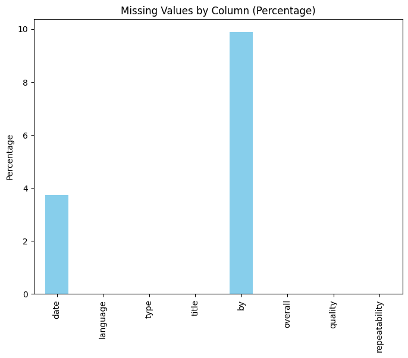

# Data Analysis Report

## Summary Statistics
                count unique                top  freq      mean       std  min  25%  50%  75%  max
date             2652   2055          21-May-06   107       NaN       NaN  NaN  NaN  NaN  NaN  NaN
language         2652     11            English  1306       NaN       NaN  NaN  NaN  NaN  NaN  NaN
type             2652      8              movie  2211       NaN       NaN  NaN  NaN  NaN  NaN  NaN
title            2652   2312  Kanda Naal Mudhal     9       NaN       NaN  NaN  NaN  NaN  NaN  NaN
by               2652   1528  Kiefer Sutherland   310       NaN       NaN  NaN  NaN  NaN  NaN  NaN
overall        2652.0    NaN                NaN   NaN  3.047511   0.76218  1.0  3.0  3.0  3.0  5.0
quality        2652.0    NaN                NaN   NaN  3.209276  0.796743  1.0  3.0  3.0  4.0  5.0
repeatability  2652.0    NaN                NaN   NaN  1.494721  0.598289  1.0  1.0  1.0  2.0  3.0

## Missing Values
date              99
language           0
type               0
title              0
by               262
overall            0
quality            0
repeatability      0

## Outliers
            Column  Index  Value   Z-Score
0          overall     14      5  2.562200
1          overall     76      1 -2.686896
2          overall     94      5  2.562200
3          overall    118      1 -2.686896
4          overall    238      5  2.562200
5          overall    239      5  2.562200
6          overall    267      5  2.562200
7          overall    338      5  2.562200
8          overall    354      5  2.562200
9          overall    359      5  2.562200
10         overall    525      1 -2.686896
11         overall    632      5  2.562200
12         overall    653      1 -2.686896
13         overall    685      5  2.562200
14         overall    688      1 -2.686896
15         overall    830      1 -2.686896
16         overall    852      5  2.562200
17         overall    904      1 -2.686896
18         overall    915      5  2.562200
19         overall    969      1 -2.686896
20         overall    997      1 -2.686896
21         overall   1041      5  2.562200
22         overall   1123      1 -2.686896
23         overall   1171      5  2.562200
24         overall   1190      1 -2.686896
25         overall   1273      1 -2.686896
26         overall   1306      5  2.562200
27         overall   1318      1 -2.686896
28         overall   1376      1 -2.686896
29         overall   1384      5  2.562200
30         overall   1457      5  2.562200
31         overall   1568      5  2.562200
32         overall   1583      5  2.562200
33         overall   1631      5  2.562200
34         overall   1686      5  2.562200
35         overall   1695      5  2.562200
36         overall   1696      5  2.562200
37         overall   1697      5  2.562200
38         overall   1699      5  2.562200
39         overall   1700      5  2.562200
40         overall   1717      5  2.562200
41         overall   1819      5  2.562200
42         overall   1829      5  2.562200
43         overall   1939      5  2.562200
44         overall   1942      5  2.562200
45         overall   1948      5  2.562200
46         overall   2006      5  2.562200
47         overall   2007      1 -2.686896
48         overall   2028      5  2.562200
49         overall   2029      5  2.562200
50         overall   2031      5  2.562200
51         overall   2051      1 -2.686896
52         overall   2057      1 -2.686896
53         overall   2077      5  2.562200
54         overall   2081      5  2.562200
55         overall   2082      5  2.562200
56         overall   2087      5  2.562200
57         overall   2104      5  2.562200
58         overall   2147      5  2.562200
59         overall   2149      5  2.562200
60         overall   2158      5  2.562200
61         overall   2184      5  2.562200
62         overall   2196      5  2.562200
63         overall   2267      5  2.562200
64         overall   2269      1 -2.686896
65         overall   2282      5  2.562200
66         overall   2287      1 -2.686896
67         overall   2304      5  2.562200
68         overall   2316      1 -2.686896
69         overall   2317      5  2.562200
70         overall   2331      5  2.562200
71         overall   2333      5  2.562200
72         overall   2380      1 -2.686896
73         overall   2414      5  2.562200
74         overall   2421      5  2.562200
75         overall   2426      1 -2.686896
76         overall   2434      5  2.562200
77         overall   2451      5  2.562200
78         overall   2463      5  2.562200
79         overall   2469      1 -2.686896
80         overall   2471      5  2.562200
81         overall   2475      1 -2.686896
82         overall   2477      1 -2.686896
83         overall   2478      5  2.562200
84         overall   2487      5  2.562200
85         overall   2492      5  2.562200
86         overall   2493      1 -2.686896
87         overall   2501      1 -2.686896
88         overall   2502      1 -2.686896
89         overall   2513      5  2.562200
90         overall   2521      1 -2.686896
91         overall   2534      1 -2.686896
92         overall   2537      5  2.562200
93         overall   2538      5  2.562200
94         overall   2544      1 -2.686896
95         overall   2545      1 -2.686896
96         overall   2547      5  2.562200
97         overall   2553      5  2.562200
98         overall   2560      5  2.562200
99         overall   2564      5  2.562200
100        overall   2565      5  2.562200
101        overall   2566      5  2.562200
102        overall   2576      5  2.562200
103        overall   2577      5  2.562200
104        overall   2587      5  2.562200
105        overall   2596      5  2.562200
106        overall   2609      5  2.562200
107        overall   2618      5  2.562200
108        overall   2619      5  2.562200
109        overall   2638      5  2.562200
110        quality      0      5  2.247980
111        quality      1      2 -1.518061
112        quality     14      5  2.247980
113        quality     15      5  2.247980
114        quality     21      2 -1.518061
115        quality     23      2 -1.518061
116        quality     40      2 -1.518061
117        quality     55      2 -1.518061
118        quality     63      2 -1.518061
119        quality     76      2 -1.518061
120        quality     82      2 -1.518061
121        quality     90      2 -1.518061
122        quality     95      2 -1.518061
123        quality    111      2 -1.518061
124        quality    117      2 -1.518061
125        quality    118      2 -1.518061
126        quality    120      2 -1.518061
127        quality    160      2 -1.518061
128        quality    169      2 -1.518061
129        quality    201      2 -1.518061
130        quality    222      2 -1.518061
131        quality    238      5  2.247980
132        quality    239      5  2.247980
133        quality    240      2 -1.518061
134        quality    250      2 -1.518061
135        quality    267      5  2.247980
136        quality    281      2 -1.518061
137        quality    287      2 -1.518061
138        quality    330      1 -2.773408
139        quality    344      2 -1.518061
140        quality    350      2 -1.518061
141        quality    364      2 -1.518061
142        quality    366      2 -1.518061
143        quality    374      2 -1.518061
144        quality    375      2 -1.518061
145        quality    377      2 -1.518061
146        quality    387      2 -1.518061
147        quality    400      2 -1.518061
148        quality    402      2 -1.518061
149        quality    404      5  2.247980
150        quality    407      2 -1.518061
151        quality    412      2 -1.518061
152        quality    426      2 -1.518061
153        quality    445      2 -1.518061
154        quality    451      2 -1.518061
155        quality    452      2 -1.518061
156        quality    455      2 -1.518061
157        quality    459      2 -1.518061
158        quality    474      2 -1.518061
159        quality    479      2 -1.518061
160        quality    485      2 -1.518061
161        quality    514      2 -1.518061
162        quality    515      2 -1.518061
163        quality    525      1 -2.773408
164        quality    537      5  2.247980
165        quality    542      2 -1.518061
166        quality    558      5  2.247980
167        quality    572      2 -1.518061
168        quality    573      1 -2.773408
169        quality    574      2 -1.518061
170        quality    593      5  2.247980
171        quality    608      2 -1.518061
172        quality    641      2 -1.518061
173        quality    643      2 -1.518061
174        quality    645      2 -1.518061
175        quality    653      2 -1.518061
176        quality    659      2 -1.518061
177        quality    666      2 -1.518061
178        quality    667      2 -1.518061
179        quality    668      2 -1.518061
180        quality    674      2 -1.518061
181        quality    681      2 -1.518061
182        quality    685      5  2.247980
183        quality    688      1 -2.773408
184        quality    690      2 -1.518061
185        quality    696      2 -1.518061
186        quality    705      2 -1.518061
187        quality    707      2 -1.518061
188        quality    708      2 -1.518061
189        quality    712      2 -1.518061
190        quality    723      2 -1.518061
191        quality    727      2 -1.518061
192        quality    733      2 -1.518061
193        quality    734      2 -1.518061
194        quality    737      2 -1.518061
195        quality    745      2 -1.518061
196        quality    747      2 -1.518061
197        quality    756      2 -1.518061
198        quality    761      2 -1.518061
199        quality    768      2 -1.518061
200        quality    770      2 -1.518061
201        quality    775      2 -1.518061
202        quality    777      2 -1.518061
203        quality    780      2 -1.518061
204        quality    781      2 -1.518061
205        quality    787      2 -1.518061
206        quality    789      2 -1.518061
207        quality    790      2 -1.518061
208        quality    791      2 -1.518061
209        quality    792      2 -1.518061
210        quality    796      2 -1.518061
211        quality    797      2 -1.518061
212        quality    803      2 -1.518061
213        quality    806      2 -1.518061
214        quality    809      2 -1.518061
215        quality    810      2 -1.518061
216        quality    811      2 -1.518061
217        quality    812      5  2.247980
218        quality    813      2 -1.518061
219        quality    817      2 -1.518061
220        quality    818      2 -1.518061
221        quality    821      2 -1.518061
222        quality    826      2 -1.518061
223        quality    830      1 -2.773408
224        quality    831      2 -1.518061
225        quality    836      2 -1.518061
226        quality    837      2 -1.518061
227        quality    838      2 -1.518061
228        quality    843      2 -1.518061
229        quality    844      2 -1.518061
230        quality    846      2 -1.518061
231        quality    852      5  2.247980
232        quality    853      2 -1.518061
233        quality    855      2 -1.518061
234        quality    863      2 -1.518061
235        quality    865      2 -1.518061
236        quality    867      2 -1.518061
237        quality    868      2 -1.518061
238        quality    873      2 -1.518061
239        quality    876      2 -1.518061
240        quality    877      2 -1.518061
241        quality    888      2 -1.518061
242        quality    896      2 -1.518061
243        quality    897      2 -1.518061
244        quality    898      2 -1.518061
245        quality    901      2 -1.518061
246        quality    904      1 -2.773408
247        quality    906      2 -1.518061
248        quality    907      2 -1.518061
249        quality    908      2 -1.518061
250        quality    915      5  2.247980
251        quality    918      2 -1.518061
252        quality    919      2 -1.518061
253        quality    922      2 -1.518061
254        quality    924      2 -1.518061
255        quality    927      2 -1.518061
256        quality    930      2 -1.518061
257        quality    933      2 -1.518061
258        quality    935      2 -1.518061
259        quality    936      2 -1.518061
260        quality    939      2 -1.518061
261        quality    940      2 -1.518061
262        quality    942      2 -1.518061
263        quality    948      5  2.247980
264        quality    951      2 -1.518061
265        quality    956      2 -1.518061
266        quality    957      2 -1.518061
267        quality    961      2 -1.518061
268        quality    962      2 -1.518061
269        quality    968      2 -1.518061
270        quality    969      1 -2.773408
271        quality    977      2 -1.518061
272        quality    978      2 -1.518061
273        quality    983      5  2.247980
274        quality    986      2 -1.518061
275        quality    996      2 -1.518061
276        quality    997      1 -2.773408
277        quality   1010      2 -1.518061
278        quality   1011      2 -1.518061
279        quality   1018      2 -1.518061
280        quality   1040      2 -1.518061
281        quality   1041      5  2.247980
282        quality   1042      5  2.247980
283        quality   1044      2 -1.518061
284        quality   1051      2 -1.518061
285        quality   1052      2 -1.518061
286        quality   1053      2 -1.518061
287        quality   1057      2 -1.518061
288        quality   1062      2 -1.518061
289        quality   1064      2 -1.518061
290        quality   1068      2 -1.518061
291        quality   1071      2 -1.518061
292        quality   1072      2 -1.518061
293        quality   1076      2 -1.518061
294        quality   1081      2 -1.518061
295        quality   1082      2 -1.518061
296        quality   1083      2 -1.518061
297        quality   1084      2 -1.518061
298        quality   1085      2 -1.518061
299        quality   1092      2 -1.518061
300        quality   1098      2 -1.518061
301        quality   1099      2 -1.518061
302        quality   1102      2 -1.518061
303        quality   1109      2 -1.518061
304        quality   1110      2 -1.518061
305        quality   1113      2 -1.518061
306        quality   1115      2 -1.518061
307        quality   1123      2 -1.518061
308        quality   1127      2 -1.518061
309        quality   1131      2 -1.518061
310        quality   1137      2 -1.518061
311        quality   1143      2 -1.518061
312        quality   1144      2 -1.518061
313        quality   1147      2 -1.518061
314        quality   1148      2 -1.518061
315        quality   1152      2 -1.518061
316        quality   1155      2 -1.518061
317        quality   1157      2 -1.518061
318        quality   1158      2 -1.518061
319        quality   1165      2 -1.518061
320        quality   1172      2 -1.518061
321        quality   1173      2 -1.518061
322        quality   1174      2 -1.518061
323        quality   1176      2 -1.518061
324        quality   1177      2 -1.518061
325        quality   1178      2 -1.518061
326        quality   1179      2 -1.518061
327        quality   1181      2 -1.518061
328        quality   1182      2 -1.518061
329        quality   1188      2 -1.518061
330        quality   1190      1 -2.773408
331        quality   1195      2 -1.518061
332        quality   1197      2 -1.518061
333        quality   1198      2 -1.518061
334        quality   1200      2 -1.518061
335        quality   1202      2 -1.518061
336        quality   1204      2 -1.518061
337        quality   1208      2 -1.518061
338        quality   1209      2 -1.518061
339        quality   1213      2 -1.518061
340        quality   1214      2 -1.518061
341        quality   1215      2 -1.518061
342        quality   1220      2 -1.518061
343        quality   1221      2 -1.518061
344        quality   1223      2 -1.518061
345        quality   1226      2 -1.518061
346        quality   1227      2 -1.518061
347        quality   1228      2 -1.518061
348        quality   1229      2 -1.518061
349        quality   1233      2 -1.518061
350        quality   1237      2 -1.518061
351        quality   1241      2 -1.518061
352        quality   1242      2 -1.518061
353        quality   1243      2 -1.518061
354        quality   1244      2 -1.518061
355        quality   1247      2 -1.518061
356        quality   1252      5  2.247980
357        quality   1254      2 -1.518061
358        quality   1256      2 -1.518061
359        quality   1257      2 -1.518061
360        quality   1258      2 -1.518061
361        quality   1259      2 -1.518061
362        quality   1260      2 -1.518061
363        quality   1262      2 -1.518061
364        quality   1265      2 -1.518061
365        quality   1268      2 -1.518061
366        quality   1272      2 -1.518061
367        quality   1273      1 -2.773408
368        quality   1275      2 -1.518061
369        quality   1277      2 -1.518061
370        quality   1284      2 -1.518061
371        quality   1285      2 -1.518061
372        quality   1286      2 -1.518061
373        quality   1289      2 -1.518061
374        quality   1290      2 -1.518061
375        quality   1293      2 -1.518061
376        quality   1297      2 -1.518061
377        quality   1306      5  2.247980
378        quality   1308      2 -1.518061
379        quality   1312      2 -1.518061
380        quality   1318      1 -2.773408
381        quality   1320      2 -1.518061
382        quality   1321      2 -1.518061
383        quality   1322      2 -1.518061
384        quality   1323      2 -1.518061
385        quality   1327      2 -1.518061
386        quality   1328      2 -1.518061
387        quality   1333      2 -1.518061
388        quality   1341      2 -1.518061
389        quality   1344      2 -1.518061
390        quality   1345      2 -1.518061
391        quality   1358      2 -1.518061
392        quality   1363      2 -1.518061
393        quality   1364      2 -1.518061
394        quality   1366      2 -1.518061
395        quality   1367      5  2.247980
396        quality   1368      2 -1.518061
397        quality   1371      2 -1.518061
398        quality   1372      2 -1.518061
399        quality   1375      2 -1.518061
400        quality   1376      1 -2.773408
401        quality   1384      5  2.247980
402        quality   1390      2 -1.518061
403        quality   1397      2 -1.518061
404        quality   1405      2 -1.518061
405        quality   1407      2 -1.518061
406        quality   1408      2 -1.518061
407        quality   1409      2 -1.518061
408        quality   1413      1 -2.773408
409        quality   1414      2 -1.518061
410        quality   1419      2 -1.518061
411        quality   1420      2 -1.518061
412        quality   1426      2 -1.518061
413        quality   1427      2 -1.518061
414        quality   1435      2 -1.518061
415        quality   1440      2 -1.518061
416        quality   1446      2 -1.518061
417        quality   1453      2 -1.518061
418        quality   1456      2 -1.518061
419        quality   1462      2 -1.518061
420        quality   1472      2 -1.518061
421        quality   1473      2 -1.518061
422        quality   1474      2 -1.518061
423        quality   1480      5  2.247980
424        quality   1487      5  2.247980
425        quality   1489      2 -1.518061
426        quality   1496      2 -1.518061
427        quality   1502      2 -1.518061
428        quality   1507      2 -1.518061
429        quality   1516      2 -1.518061
430        quality   1528      2 -1.518061
431        quality   1533      2 -1.518061
432        quality   1536      2 -1.518061
433        quality   1537      5  2.247980
434        quality   1538      2 -1.518061
435        quality   1539      2 -1.518061
436        quality   1543      2 -1.518061
437        quality   1553      2 -1.518061
438        quality   1554      2 -1.518061
439        quality   1571      2 -1.518061
440        quality   1572      2 -1.518061
441        quality   1576      5  2.247980
442        quality   1583      5  2.247980
443        quality   1592      2 -1.518061
444        quality   1594      5  2.247980
445        quality   1595      2 -1.518061
446        quality   1597      2 -1.518061
447        quality   1603      5  2.247980
448        quality   1617      2 -1.518061
449        quality   1619      2 -1.518061
450        quality   1620      2 -1.518061
451        quality   1624      2 -1.518061
452        quality   1625      2 -1.518061
453        quality   1626      2 -1.518061
454        quality   1627      2 -1.518061
455        quality   1629      2 -1.518061
456        quality   1631      5  2.247980
457        quality   1635      5  2.247980
458        quality   1638      2 -1.518061
459        quality   1647      2 -1.518061
460        quality   1651      2 -1.518061
461        quality   1652      2 -1.518061
462        quality   1655      2 -1.518061
463        quality   1660      2 -1.518061
464        quality   1685      2 -1.518061
465        quality   1686      5  2.247980
466        quality   1694      2 -1.518061
467        quality   1695      5  2.247980
468        quality   1696      5  2.247980
469        quality   1697      5  2.247980
470        quality   1699      5  2.247980
471        quality   1700      5  2.247980
472        quality   1712      2 -1.518061
473        quality   1721      2 -1.518061
474        quality   1722      2 -1.518061
475        quality   1729      2 -1.518061
476        quality   1730      2 -1.518061
477        quality   1731      2 -1.518061
478        quality   1732      2 -1.518061
479        quality   1733      2 -1.518061
480        quality   1736      2 -1.518061
481        quality   1738      2 -1.518061
482        quality   1755      2 -1.518061
483        quality   1757      5  2.247980
484        quality   1761      5  2.247980
485        quality   1765      2 -1.518061
486        quality   1767      5  2.247980
487        quality   1774      2 -1.518061
488        quality   1775      5  2.247980
489        quality   1776      5  2.247980
490        quality   1783      5  2.247980
491        quality   1787      2 -1.518061
492        quality   1799      5  2.247980
493        quality   1808      2 -1.518061
494        quality   1809      2 -1.518061
495        quality   1810      2 -1.518061
496        quality   1814      2 -1.518061
497        quality   1820      2 -1.518061
498        quality   1822      2 -1.518061
499        quality   1823      2 -1.518061
500        quality   1829      5  2.247980
501        quality   1835      2 -1.518061
502        quality   1841      5  2.247980
503        quality   1843      2 -1.518061
504        quality   1846      2 -1.518061
505        quality   1855      2 -1.518061
506        quality   1859      2 -1.518061
507        quality   1863      2 -1.518061
508        quality   1866      2 -1.518061
509        quality   1872      2 -1.518061
510        quality   1877      2 -1.518061
511        quality   1878      5  2.247980
512        quality   1879      2 -1.518061
513        quality   1881      2 -1.518061
514        quality   1895      2 -1.518061
515        quality   1898      2 -1.518061
516        quality   1900      2 -1.518061
517        quality   1902      2 -1.518061
518        quality   1905      2 -1.518061
519        quality   1909      2 -1.518061
520        quality   1911      2 -1.518061
521        quality   1912      2 -1.518061
522        quality   1921      2 -1.518061
523        quality   1922      2 -1.518061
524        quality   1925      2 -1.518061
525        quality   1926      2 -1.518061
526        quality   1927      2 -1.518061
527        quality   1931      2 -1.518061
528        quality   1937      5  2.247980
529        quality   1939      5  2.247980
530        quality   1941      5  2.247980
531        quality   1942      5  2.247980
532        quality   1946      5  2.247980
533        quality   1949      2 -1.518061
534        quality   1951      2 -1.518061
535        quality   1953      2 -1.518061
536        quality   1957      2 -1.518061
537        quality   1958      5  2.247980
538        quality   1960      2 -1.518061
539        quality   1970      2 -1.518061
540        quality   1971      2 -1.518061
541        quality   1978      2 -1.518061
542        quality   1991      5  2.247980
543        quality   1997      2 -1.518061
544        quality   1999      5  2.247980
545        quality   2000      1 -2.773408
546        quality   2003      2 -1.518061
547        quality   2004      2 -1.518061
548        quality   2006      5  2.247980
549        quality   2007      1 -2.773408
550        quality   2027      2 -1.518061
551        quality   2029      5  2.247980
552        quality   2031      5  2.247980
553        quality   2034      5  2.247980
554        quality   2036      5  2.247980
555        quality   2050      2 -1.518061
556        quality   2051      2 -1.518061
557        quality   2052      2 -1.518061
558        quality   2056      2 -1.518061
559        quality   2057      2 -1.518061
560        quality   2058      2 -1.518061
561        quality   2059      2 -1.518061
562        quality   2062      2 -1.518061
563        quality   2065      2 -1.518061
564        quality   2066      2 -1.518061
565        quality   2067      5  2.247980
566        quality   2069      2 -1.518061
567        quality   2071      5  2.247980
568        quality   2072      5  2.247980
569        quality   2077      5  2.247980
570        quality   2080      5  2.247980
571        quality   2081      5  2.247980
572        quality   2082      5  2.247980
573        quality   2087      5  2.247980
574        quality   2088      5  2.247980
575        quality   2104      5  2.247980
576        quality   2109      2 -1.518061
577        quality   2114      2 -1.518061
578        quality   2117      2 -1.518061
579        quality   2118      2 -1.518061
580        quality   2119      5  2.247980
581        quality   2120      2 -1.518061
582        quality   2128      2 -1.518061
583        quality   2131      2 -1.518061
584        quality   2137      5  2.247980
585        quality   2140      5  2.247980
586        quality   2146      2 -1.518061
587        quality   2147      5  2.247980
588        quality   2149      5  2.247980
589        quality   2154      2 -1.518061
590        quality   2155      2 -1.518061
591        quality   2158      5  2.247980
592        quality   2165      2 -1.518061
593        quality   2168      2 -1.518061
594        quality   2184      5  2.247980
595        quality   2189      2 -1.518061
596        quality   2198      2 -1.518061
597        quality   2216      2 -1.518061
598        quality   2217      2 -1.518061
599        quality   2219      2 -1.518061
600        quality   2234      2 -1.518061
601        quality   2256      5  2.247980
602        quality   2267      5  2.247980
603        quality   2269      1 -2.773408
604        quality   2282      5  2.247980
605        quality   2285      5  2.247980
606        quality   2287      2 -1.518061
607        quality   2301      2 -1.518061
608        quality   2304      5  2.247980
609        quality   2309      5  2.247980
610        quality   2313      2 -1.518061
611        quality   2316      2 -1.518061
612        quality   2317      5  2.247980
613        quality   2320      5  2.247980
614        quality   2328      2 -1.518061
615        quality   2345      2 -1.518061
616        quality   2357      5  2.247980
617        quality   2376      2 -1.518061
618        quality   2380      1 -2.773408
619        quality   2387      2 -1.518061
620        quality   2393      2 -1.518061
621        quality   2395      5  2.247980
622        quality   2407      5  2.247980
623        quality   2409      2 -1.518061
624        quality   2411      2 -1.518061
625        quality   2414      5  2.247980
626        quality   2426      2 -1.518061
627        quality   2437      5  2.247980
628        quality   2441      2 -1.518061
629        quality   2447      2 -1.518061
630        quality   2453      5  2.247980
631        quality   2455      5  2.247980
632        quality   2456      2 -1.518061
633        quality   2457      2 -1.518061
634        quality   2458      2 -1.518061
635        quality   2460      2 -1.518061
636        quality   2462      2 -1.518061
637        quality   2463      5  2.247980
638        quality   2465      2 -1.518061
639        quality   2469      1 -2.773408
640        quality   2472      5  2.247980
641        quality   2474      2 -1.518061
642        quality   2475      1 -2.773408
643        quality   2477      1 -2.773408
644        quality   2485      2 -1.518061
645        quality   2490      5  2.247980
646        quality   2493      1 -2.773408
647        quality   2496      2 -1.518061
648        quality   2498      5  2.247980
649        quality   2501      1 -2.773408
650        quality   2502      1 -2.773408
651        quality   2503      5  2.247980
652        quality   2505      2 -1.518061
653        quality   2518      2 -1.518061
654        quality   2520      2 -1.518061
655        quality   2521      1 -2.773408
656        quality   2522      2 -1.518061
657        quality   2530      2 -1.518061
658        quality   2534      2 -1.518061
659        quality   2535      5  2.247980
660        quality   2543      2 -1.518061
661        quality   2544      2 -1.518061
662        quality   2545      2 -1.518061
663        quality   2550      2 -1.518061
664        quality   2553      5  2.247980
665        quality   2560      5  2.247980
666        quality   2564      5  2.247980
667        quality   2565      5  2.247980
668        quality   2566      5  2.247980
669        quality   2576      5  2.247980
670        quality   2577      5  2.247980
671        quality   2580      5  2.247980
672        quality   2581      5  2.247980
673        quality   2583      5  2.247980
674        quality   2584      5  2.247980
675        quality   2586      5  2.247980
676        quality   2587      5  2.247980
677        quality   2589      5  2.247980
678        quality   2596      5  2.247980
679        quality   2602      2 -1.518061
680        quality   2609      5  2.247980
681        quality   2618      5  2.247980
682        quality   2619      5  2.247980
683        quality   2638      5  2.247980
684  repeatability     30      3  2.516446
685  repeatability     54      3  2.516446
686  repeatability     94      3  2.516446
687  repeatability    125      3  2.516446
688  repeatability    225      3  2.516446
689  repeatability    267      3  2.516446
690  repeatability    338      3  2.516446
691  repeatability    354      3  2.516446
692  repeatability    359      3  2.516446
693  repeatability    416      3  2.516446
694  repeatability    632      3  2.516446
695  repeatability    665      3  2.516446
696  repeatability    679      3  2.516446
697  repeatability    793      3  2.516446
698  repeatability   1029      3  2.516446
699  repeatability   1030      3  2.516446
700  repeatability   1128      3  2.516446
701  repeatability   1171      3  2.516446
702  repeatability   1246      3  2.516446
703  repeatability   1252      3  2.516446
704  repeatability   1306      3  2.516446
705  repeatability   1355      3  2.516446
706  repeatability   1384      3  2.516446
707  repeatability   1406      3  2.516446
708  repeatability   1457      3  2.516446
709  repeatability   1464      3  2.516446
710  repeatability   1493      3  2.516446
711  repeatability   1541      3  2.516446
712  repeatability   1552      3  2.516446
713  repeatability   1564      3  2.516446
714  repeatability   1566      3  2.516446
715  repeatability   1568      3  2.516446
716  repeatability   1589      3  2.516446
717  repeatability   1601      3  2.516446
718  repeatability   1616      3  2.516446
719  repeatability   1623      3  2.516446
720  repeatability   1636      3  2.516446
721  repeatability   1637      3  2.516446
722  repeatability   1649      3  2.516446
723  repeatability   1662      3  2.516446
724  repeatability   1668      3  2.516446
725  repeatability   1678      3  2.516446
726  repeatability   1717      3  2.516446
727  repeatability   1723      3  2.516446
728  repeatability   1724      3  2.516446
729  repeatability   1742      3  2.516446
730  repeatability   1782      3  2.516446
731  repeatability   1801      3  2.516446
732  repeatability   1804      3  2.516446
733  repeatability   1819      3  2.516446
734  repeatability   1830      3  2.516446
735  repeatability   1862      3  2.516446
736  repeatability   1864      3  2.516446
737  repeatability   1894      3  2.516446
738  repeatability   1910      3  2.516446
739  repeatability   1915      3  2.516446
740  repeatability   1941      3  2.516446
741  repeatability   1948      3  2.516446
742  repeatability   1967      3  2.516446
743  repeatability   1981      3  2.516446
744  repeatability   2006      3  2.516446
745  repeatability   2013      3  2.516446
746  repeatability   2028      3  2.516446
747  repeatability   2040      3  2.516446
748  repeatability   2068      3  2.516446
749  repeatability   2071      3  2.516446
750  repeatability   2081      3  2.516446
751  repeatability   2082      3  2.516446
752  repeatability   2087      3  2.516446
753  repeatability   2089      3  2.516446
754  repeatability   2091      3  2.516446
755  repeatability   2102      3  2.516446
756  repeatability   2105      3  2.516446
757  repeatability   2112      3  2.516446
758  repeatability   2116      3  2.516446
759  repeatability   2117      3  2.516446
760  repeatability   2153      3  2.516446
761  repeatability   2187      3  2.516446
762  repeatability   2191      3  2.516446
763  repeatability   2196      3  2.516446
764  repeatability   2258      3  2.516446
765  repeatability   2264      3  2.516446
766  repeatability   2284      3  2.516446
767  repeatability   2290      3  2.516446
768  repeatability   2313      3  2.516446
769  repeatability   2326      3  2.516446
770  repeatability   2331      3  2.516446
771  repeatability   2332      3  2.516446
772  repeatability   2333      3  2.516446
773  repeatability   2334      3  2.516446
774  repeatability   2340      3  2.516446
775  repeatability   2343      3  2.516446
776  repeatability   2347      3  2.516446
777  repeatability   2354      3  2.516446
778  repeatability   2355      3  2.516446
779  repeatability   2358      3  2.516446
780  repeatability   2362      3  2.516446
781  repeatability   2365      3  2.516446
782  repeatability   2366      3  2.516446
783  repeatability   2369      3  2.516446
784  repeatability   2371      3  2.516446
785  repeatability   2383      3  2.516446
786  repeatability   2386      3  2.516446
787  repeatability   2388      3  2.516446
788  repeatability   2389      3  2.516446
789  repeatability   2397      3  2.516446
790  repeatability   2398      3  2.516446
791  repeatability   2399      3  2.516446
792  repeatability   2400      3  2.516446
793  repeatability   2403      3  2.516446
794  repeatability   2412      3  2.516446
795  repeatability   2413      3  2.516446
796  repeatability   2421      3  2.516446
797  repeatability   2423      3  2.516446
798  repeatability   2427      3  2.516446
799  repeatability   2434      3  2.516446
800  repeatability   2444      3  2.516446
801  repeatability   2451      3  2.516446
802  repeatability   2452      3  2.516446
803  repeatability   2463      3  2.516446
804  repeatability   2466      3  2.516446
805  repeatability   2471      3  2.516446
806  repeatability   2478      3  2.516446
807  repeatability   2481      3  2.516446
808  repeatability   2484      3  2.516446
809  repeatability   2486      3  2.516446
810  repeatability   2487      3  2.516446
811  repeatability   2488      3  2.516446
812  repeatability   2492      3  2.516446
813  repeatability   2500      3  2.516446
814  repeatability   2507      3  2.516446
815  repeatability   2510      3  2.516446
816  repeatability   2513      3  2.516446
817  repeatability   2527      3  2.516446
818  repeatability   2528      3  2.516446
819  repeatability   2537      3  2.516446
820  repeatability   2538      3  2.516446
821  repeatability   2542      3  2.516446
822  repeatability   2547      3  2.516446
823  repeatability   2554      3  2.516446
824  repeatability   2579      3  2.516446
825  repeatability   2596      3  2.516446
826  repeatability   2609      3  2.516446

## Correlation Matrix
                overall   quality  repeatability
overall        1.000000  0.825935       0.512600
quality        0.825935  1.000000       0.312127
repeatability  0.512600  0.312127       1.000000

## Clustering Analysis
### KMeans Clustering
Unique clusters: {0, 1, 2}

## Visualizations

## AI Generated Code
import pandas as pd
import numpy as np
import matplotlib.pyplot as plt
import seaborn as sns

# Load dataset
df = pd.read_csv('your_dataset.csv')

# Data Cleaning
# Convert 'date' to datetime
df['date'] = pd.to_datetime(df['date'], errors='coerce')

# Check for missing values
print(df.isnull().sum())

# Fill or drop missing values
df['overall'] = df['overall'].fillna(df['overall'].mean())  # Example: fill NA with mean
df.dropna(subset=['language', 'type'], inplace=True)  # Drop rows where 'language' or 'type' are NaN

# Remove duplicates
df.drop_duplicates(inplace=True)

# Analysis
# Descriptive statistics
print(df.describe())

# Group by 'language' and 'type' for aggregated analysis
agg_analysis = df.groupby(['language', 'type']).agg({
    'overall': ['mean', 'count'],
    'quality': 'mean',
    'repeatability': 'mean'
}).reset_index()

print(agg_analysis)

# Visualization 1: Overall rating distribution
plt.figure(figsize=(10, 6))
sns.histplot(df['overall'], bins=20, kde=True)
plt.title('Distribution of Overall Ratings')
plt.xlabel('Overall Rating')
plt.ylabel('Frequency')
plt.show()

# Visualization 2: Average quality by language
plt.figure(figsize=(12, 8))
sns.barplot(data=agg_analysis, x='language', y=('quality', 'mean'), hue='type')
plt.title('Average Quality by Language and Type')
plt.xlabel('Language')
plt.ylabel('Average Quality')
plt.xticks(rotation=45)
plt.legend(title='Type')
plt.show()

# Visualization 3: Repeatability by Cluster
plt.figure(figsize=(12, 8))
sns.boxplot(data=df, x='Cluster', y='repeatability')
plt.title('Repeatability Score by Cluster')
plt.xlabel('Cluster')
plt.ylabel('Repeatability')
plt.xticks(rotation=45)
plt.show()

# Save the cleaned dataset
df.to_csv('cleaned_dataset.csv', index=False)

## AI Generated Code's Output
Error while executing generated code: [Errno 2] No such file or directory: 'your_dataset.csv'

## Narrative Summary
Our analysis journey began by exploring a dataset with rich insights.
One of the first challenges was handling missing values. We identified missing data in the following columns: date, by.
The next challenge was handling outlier values. Outliers were identified in the following columns: overall, quality, repeatability. In total, 827 outliers were detected across these columns.
We examined correlations between numeric variables. A heatmap provided insights into how features are interrelated, revealing key associations.
KMeans clustering was performed, dividing the data into 3 clusters. These clusters were visualized to understand groupings within the dataset.
A hierarchical dendrogram further highlighted relationships between data points.

## Insights from AI Analysis

To analyze the given data columns effectively, let's break down the analysis into relevant sections based on the data attributes you've provided. Each column contributes unique aspects that we can explore for insights and patterns.

### 1. Understanding the Columns:
   - **date**: This likely indicates when the data entry was made, which allows for time-based analysis.
   - **language**: The language of the content; this helps in understanding diversity and trends across different languages.
   - **type**: The category or type of content (e.g., article, video, tutorial), which could indicate the content's purpose or format.
   - **title**: The title of the content; this may be used for keyword analysis.
   - **by**: The author or creator of the content; this can reveal contributor patterns and impacts on content quality.
   - **overall**: A metric that likely summarizes the general quality or reception of the content.
   - **quality**: Potentially a detailed assessment of the content’s quality, which could be informative for content creators.
   - **repeatability**: This might indicate how often the content can be reused or referenced, reflecting its relevance and timelessness.

### 2. Potential Insights and Patterns:
#### a. Temporal Analysis:
   - **Trends Over Time**: By analyzing the 'date' column, you can identify trends over time, such as:
     - Seasonality in content creation (e.g., more articles published during specific months).
     - A surge in specific content types or languages during certain periods.

#### b. Language Distribution:
   - **Language Popularity**: The 'language' column can help identify which languages are most frequently used. This can indicate target audiences and translation needs.
   - **Quality by Language**: Examine the 'overall' and 'quality' metrics to assess if certain languages tend to receive higher or lower ratings.

#### c. Content Type Insights:
   - **Performance by Type**: Analyze how different content types perform in terms of overall quality and repeatability. For instance:
     - Do videos have higher engagement and quality scores than articles?
   - **Diversity of Content**: Check if there's a balance between different types, which could indicate a well-rounded content strategy.

#### d. Author Contributions:
   - **Top Contributors**: Identify who are the most prolific authors by counting 'by' entries. Assess how their contributions correlate with content quality.
   - **Quality by Author**: Analyze if certain authors consistently produce higher quality content, which could inform hiring or collaboration decisions.

#### e. Quality Assessment:
   - **Quality Metrics**: Examine the distribution of the 'quality' and 'overall' scores. Look for any correlations:
     - Are higher quality scores associated with specific content types or authors?
     - Consider whether quality ratings change over time for specific authors or content types.

#### f. Repeatability Analysis:
   - **Reusability of Content**: Investigate what types or topics tend to have higher repeatability. This can lead to insights on creating enduring or timeless content.
   - **Audience Engagement**: Check if higher repeatability correlates with higher overall satisfaction, which may suggest that audiences favor content they can refer back to.

### 3. Recommendations Based on Insights:
- **Content Strategy**: Based on the trends identified, adjust the content strategy to focus on high-performing types and languages.
- **Targeted Training**: If certain authors consistently miss quality targets, consider offering targeted training or support.
- **Promotion of High-Quality Content**: Collaborate with authors or topics that yield repeatable, high-quality content to maximize visibility and engagement.

### Conclusion:
This initial exploration of the dataset reveals multiple avenues for deeper analysis and potential strategies for content improvement. By focusing on the interrelationships among these columns, you can uncover more specific trends and actionable insights that can bolster content effectiveness and audience engagement. For more precise insights, further statistical analysis and data visualization techniques can be applied.
This analysis provided actionable insights, paving the way for data-driven decisions.